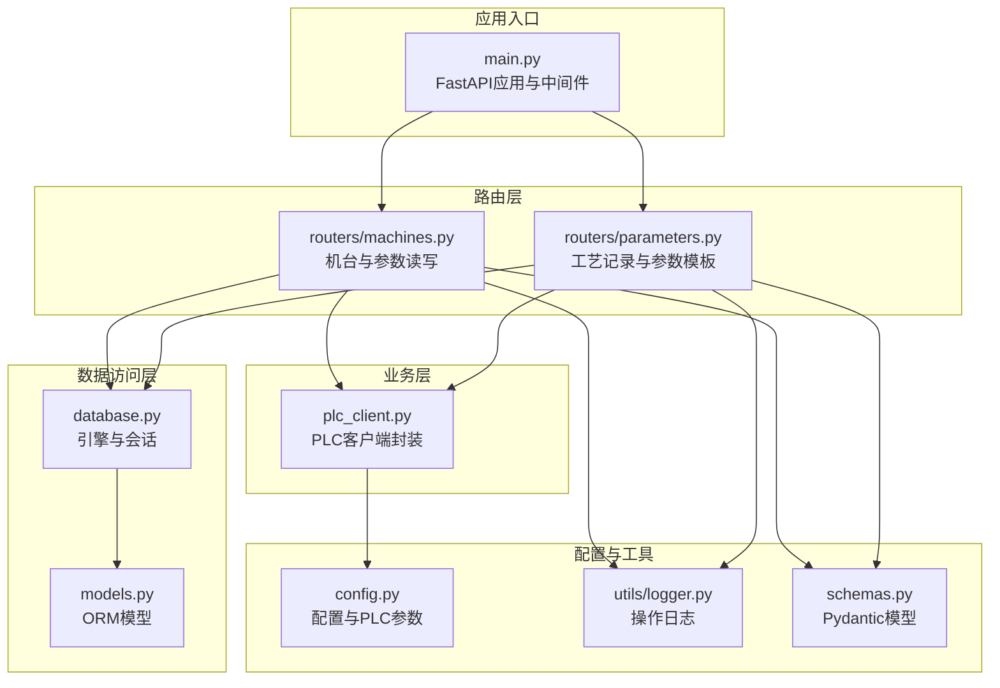
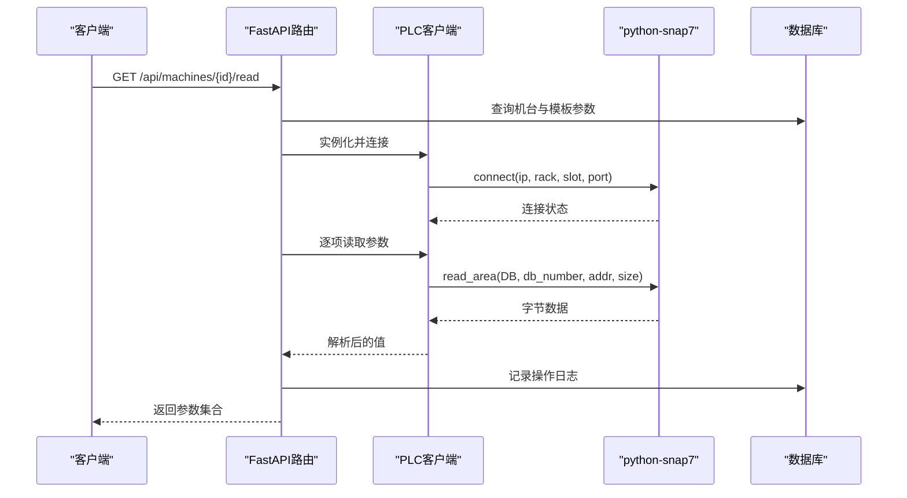
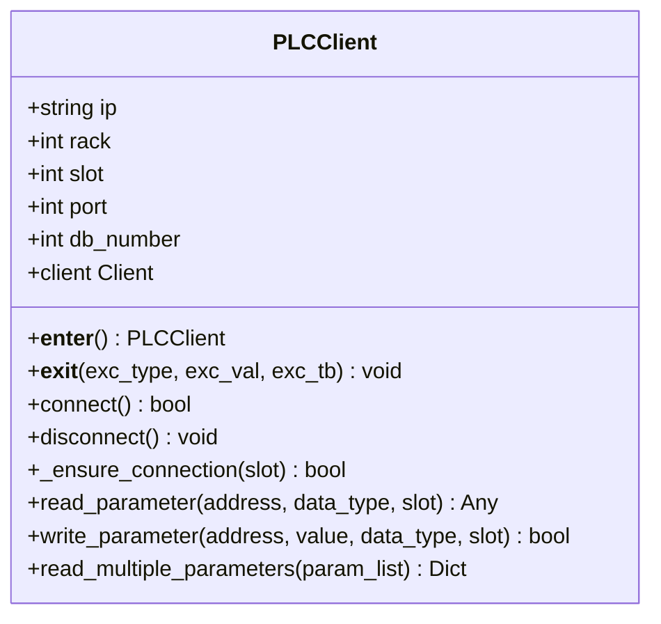
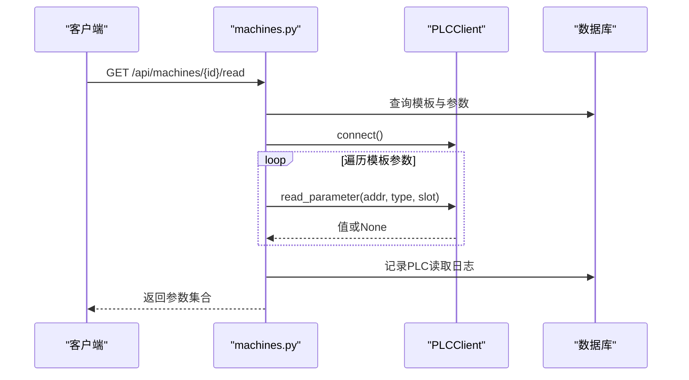
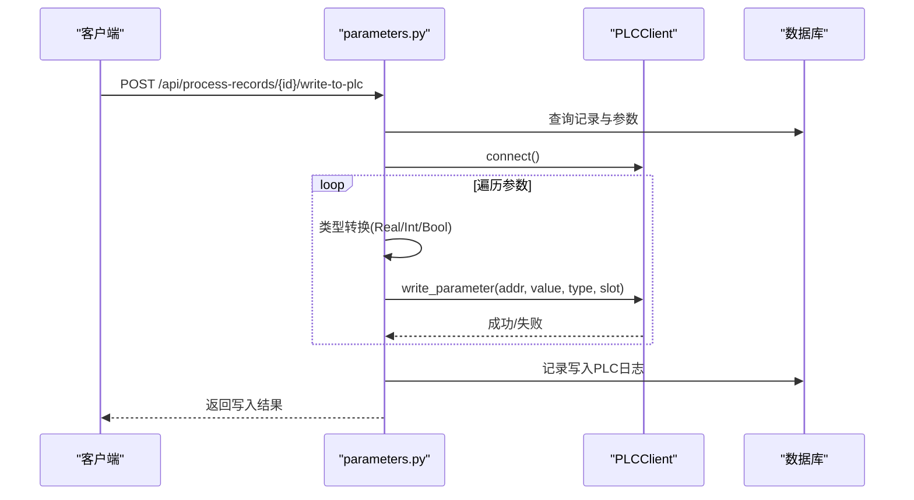
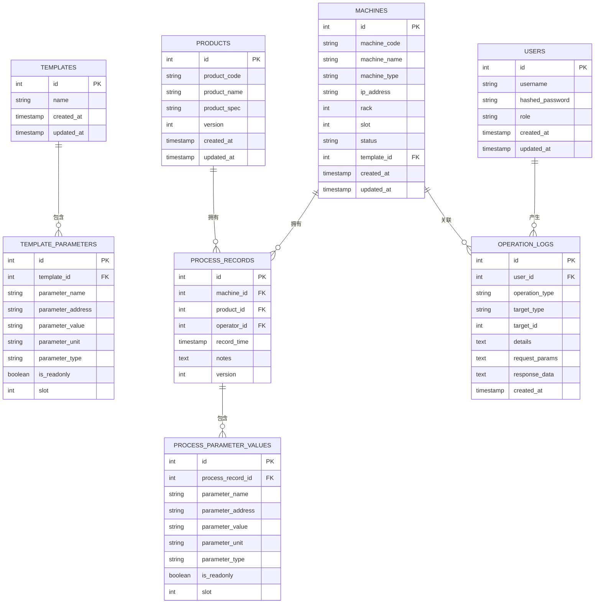
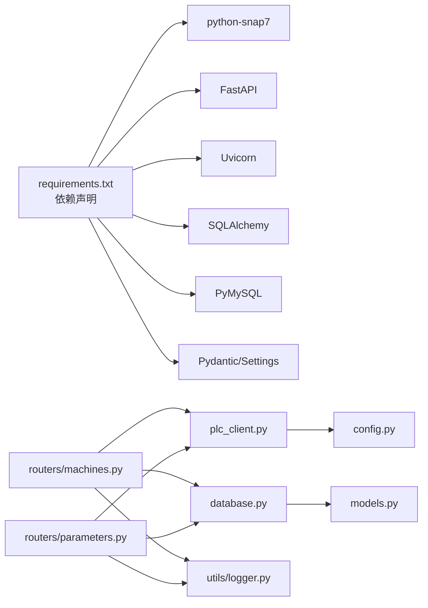
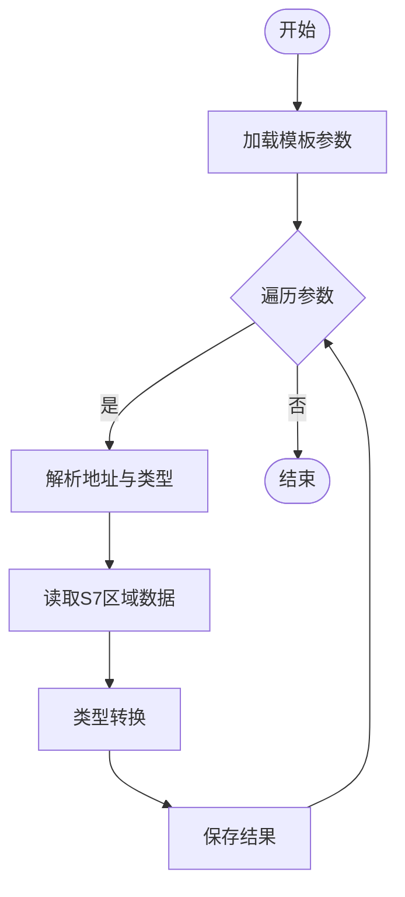
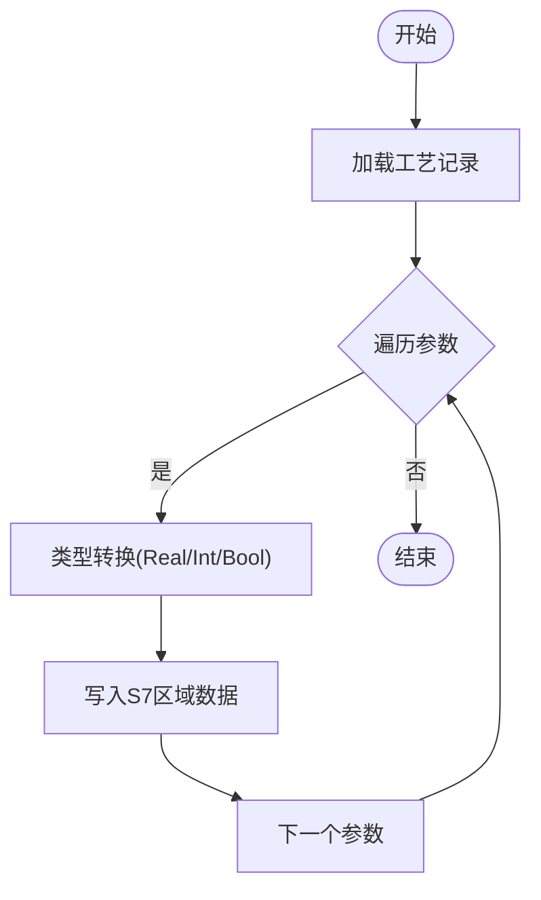

# PLC通信系统

<cite>
**本文引用的文件**
- [plc_client.py](file://backend/plc_client.py)
- [main.py](file://backend/main.py)
- [models.py](file://backend/models.py)
- [config.py](file://backend/config.py)
- [requirements.txt](file://requirements.txt)
- [routers/machines.py](file://backend/routers/machines.py)
- [routers/parameters.py](file://backend/routers/parameters.py)
- [database.py](file://backend/database.py)
- [schemas.py](file://backend/schemas.py)
- [utils/logger.py](file://backend/utils/logger.py)
- [run.sh](file://run.sh)
- [start_backend.sh](file://start_backend.sh)
</cite>

## 目录
1. [简介](#简介)
2. [项目结构](#项目结构)
3. [核心组件](#核心组件)
4. [架构总览](#架构总览)
5. [详细组件分析](#详细组件分析)
6. [依赖关系分析](#依赖关系分析)
7. [性能考虑](#性能考虑)
8. [故障排查指南](#故障排查指南)
9. [结论](#结论)
10. [附录](#附录)

## 简介
本项目是一个基于FastAPI的挤出机工艺参数管理系统，核心功能之一是通过S7协议与PLC进行通信，实现参数读取与写入。系统采用python-snap7库封装S7通信细节，支持多种数据类型（整型、实数、布尔）与地址格式（V区、计数器C、定时器T等），并通过REST接口对外提供机台状态检测、参数读取、批量写入等功能。同时，系统具备完善的日志记录与数据库持久化能力，便于运维与审计。

## 项目结构
后端采用分层架构：
- 路由层：定义REST接口，负责业务编排与参数校验
- 业务层：调用PLC客户端执行读写操作
- 数据访问层：SQLAlchemy ORM模型与数据库会话管理
- 配置层：统一管理数据库与PLC通信参数
- 工具层：日志记录与操作审计

图表来源
- [main.py:12-31](file://backend/main.py#L12-L31)
- [routers/machines.py:12-12](file://backend/routers/machines.py#L12-L12)
- [routers/parameters.py:12-12](file://backend/routers/parameters.py#L12-L12)
- [plc_client.py:6-13](file://backend/plc_client.py#L6-L13)
- [database.py:6-17](file://backend/database.py#L6-L17)
- [models.py:6-133](file://backend/models.py#L6-L133)
- [config.py:31-34](file://backend/config.py#L31-L34)
- [utils/logger.py:65-87](file://backend/utils/logger.py#L65-L87)
- [schemas.py:5-190](file://backend/schemas.py#L5-L190)

章节来源
- [main.py:1-77](file://backend/main.py#L1-L77)
- [requirements.txt:1-11](file://requirements.txt#L1-L11)

## 核心组件
- PLC客户端：封装S7连接、区域读写、地址解析与数据类型转换
- 路由器：提供机台状态检测、参数读取、批量写入、模板绑定等接口
- 数据模型：定义机台、产品、工艺记录、模板参数等实体
- 配置模块：集中管理数据库与PLC通信参数
- 日志工具：统一记录操作日志与PLC读写事件

章节来源
- [plc_client.py:6-187](file://backend/plc_client.py#L6-L187)
- [routers/machines.py:83-183](file://backend/routers/machines.py#L83-L183)
- [routers/parameters.py:201-246](file://backend/routers/parameters.py#L201-L246)
- [models.py:19-133](file://backend/models.py#L19-L133)
- [config.py:31-34](file://backend/config.py#L31-L34)
- [utils/logger.py:89-120](file://backend/utils/logger.py#L89-L120)

## 架构总览
系统通过FastAPI提供REST接口，路由层在运行时根据机台配置实例化PLC客户端，执行S7通信。数据库用于存储机台、产品、模板与工艺记录等业务数据；日志模块记录关键操作与PLC交互结果。

图表来源
- [routers/machines.py:107-183](file://backend/routers/machines.py#L107-L183)
- [plc_client.py:24-31](file://backend/plc_client.py#L24-L31)
- [plc_client.py:51-113](file://backend/plc_client.py#L51-L113)
- [utils/logger.py:89-104](file://backend/utils/logger.py#L89-L104)

## 详细组件分析

### PLC客户端设计与实现
PLC客户端封装了S7通信的细节，包括连接生命周期管理、地址解析与数据类型转换、区域读写与位操作、以及多槽位切换逻辑。

图表来源
- [plc_client.py:6-187](file://backend/plc_client.py#L6-L187)

- 连接建立与断开
  - 使用snap7.client.Client进行连接，参数来自配置模块
  - 支持上下文管理器自动断开
  - 提供确保连接的方法以支持动态槽位切换

- 地址格式与数据类型处理
  - 支持V区字节(VB)、字(VW)、双字(VD)、字节位(Vx.y)、计数器(C)、定时器(T)
  - 通过snap7.util中的get_*与set_*函数完成数据类型转换
  - 位操作通过字节掩码实现

- 错误处理与重连机制
  - 读写过程中捕获异常并返回None或False
  - 当槽位变化或连接断开时尝试重新连接
  - 断开连接时捕获异常并清空client引用

- 批量读取
  - 提供read_multiple_parameters方法，按参数列表顺序读取并返回字典

章节来源
- [plc_client.py:6-187](file://backend/plc_client.py#L6-L187)
- [config.py:31-34](file://backend/config.py#L31-L34)

### 路由器：机台参数读取与写入
- 机台状态检测
  - 遍历机台，对每个机台尝试连接并返回在线/离线/错误状态
- 参数读取
  - 从模板参数表加载目标机台绑定的模板参数
  - 逐项调用PLC客户端读取，记录成功/失败统计
  - 写入操作日志
- 参数写入
  - 接收参数字典，逐项调用PLC客户端写入
  - 支持按模板参数slot覆盖机台默认slot
  - 写入操作日志

图表来源
- [routers/machines.py:107-183](file://backend/routers/machines.py#L107-L183)
- [utils/logger.py:89-104](file://backend/utils/logger.py#L89-L104)

章节来源
- [routers/machines.py:83-183](file://backend/routers/machines.py#L83-L183)

### 路由器：工艺记录写入PLC
- 从数据库查询指定版本的工艺记录
- 对每条参数（跳过只读）进行类型转换后写入PLC
- 记录写入日志

图表来源
- [routers/parameters.py:201-246](file://backend/routers/parameters.py#L201-L246)
- [utils/logger.py:169-184](file://backend/utils/logger.py#L169-L184)

章节来源
- [routers/parameters.py:201-246](file://backend/routers/parameters.py#L201-L246)

### 数据模型与数据库
- 机台：包含IP、rack、slot、模板绑定等信息
- 模板与模板参数：定义可复用的参数集合及默认slot
- 工艺记录与参数快照：记录每次写入PLC的参数集合
- 操作日志：统一记录用户操作与PLC交互

图表来源
- [models.py:6-133](file://backend/models.py#L6-L133)

章节来源
- [models.py:19-133](file://backend/models.py#L19-L133)

### 配置与部署
- 配置模块
  - 通过pydantic-settings加载.env环境变量
  - 定义数据库连接参数与PLC通信参数（端口、DB号）
- 启动脚本
  - run.sh：安装依赖、创建数据库、启动后端服务
  - start_backend.sh：激活虚拟环境并运行后端主程序

章节来源
- [config.py:4-20](file://backend/config.py#L4-L20)
- [config.py:22-34](file://backend/config.py#L22-L34)
- [run.sh:1-24](file://run.sh#L1-L24)
- [start_backend.sh:1-7](file://start_backend.sh#L1-L7)

## 依赖关系分析
- 外部依赖
  - python-snap7：S7通信核心库
  - FastAPI与Uvicorn：Web框架与ASGI服务器
  - SQLAlchemy与PyMySQL：数据库访问与驱动
  - Pydantic与Pydantic-settings：配置与数据验证
- 内部依赖
  - 路由器依赖PLC客户端与数据库会话
  - PLC客户端依赖配置模块
  - 日志工具依赖数据库会话与模型

图表来源
- [requirements.txt:1-11](file://requirements.txt#L1-L11)
- [routers/machines.py:8-10](file://backend/routers/machines.py#L8-L10)
- [routers/parameters.py:8-10](file://backend/routers/parameters.py#L8-L10)
- [plc_client.py:3-3](file://backend/plc_client.py#L3-L3)
- [database.py:4-10](file://backend/database.py#L4-L10)
- [models.py:1-4](file://backend/models.py#L1-L4)
- [utils/logger.py:5-5](file://backend/utils/logger.py#L5-L5)

章节来源
- [requirements.txt:1-11](file://requirements.txt#L1-L11)

## 性能考虑
- 连接复用与延迟连接
  - 路由器在需要时才创建PLC客户端并连接，避免常驻连接占用资源
  - PLC客户端内部维护连接状态，必要时自动重连
- 批量读取
  - 提供read_multiple_parameters以减少多次往返
- 数据类型转换
  - 利用snap7.util的get_*与set_*函数，避免手动解析带来的性能损耗
- 日志与数据库
  - 日志文件按天切分并定期清理，避免磁盘膨胀影响I/O性能

[本节为通用建议，不直接分析具体文件]

## 故障排查指南
- 连接失败
  - 检查机台IP、Rack、Slot配置是否正确
  - 确认PLC端口与DB号配置一致
  - 查看路由层返回的HTTP 500错误提示
- 参数读取为空
  - 确认模板参数已绑定且地址格式正确
  - 检查PLC区域与DB号是否匹配
- 写入失败
  - 确认参数类型与地址格式匹配
  - 检查只读参数是否被跳过
- 日志定位
  - 查看操作日志与PLC读写日志，定位失败原因
  - 清理过期日志文件，避免磁盘空间不足

章节来源
- [routers/machines.py:116-121](file://backend/routers/machines.py#L116-L121)
- [routers/machines.py:178-179](file://backend/routers/machines.py#L178-L179)
- [routers/parameters.py:214-215](file://backend/routers/parameters.py#L214-L215)
- [utils/logger.py:89-120](file://backend/utils/logger.py#L89-L120)

## 结论
该PLC通信系统通过python-snap7实现了对S7协议的稳定封装，结合FastAPI路由层提供了清晰的业务接口。系统支持多种数据类型与地址格式，具备完善的错误处理与日志记录能力。通过模板化参数管理与工艺记录写入流程，满足了挤出机工艺参数管理的实际需求。建议在生产环境中进一步增强连接池、超时控制与并发安全策略，以提升稳定性与性能。

[本节为总结性内容，不直接分析具体文件]

## 附录

### S7地址与数据类型映射
- V区字节/字/双字：VB/VW/VD
- 位访问：Vx.y（字节地址+位号）
- 计数器：Cn（n为计数器号）
- 定时器：Tn（n为定时器号）

章节来源
- [plc_client.py:62-96](file://backend/plc_client.py#L62-L96)

### 典型读取流程（流程图）

图表来源
- [routers/machines.py:125-176](file://backend/routers/machines.py#L125-L176)
- [plc_client.py:51-113](file://backend/plc_client.py#L51-L113)

### 典型写入流程（流程图）

图表来源
- [routers/parameters.py:222-241](file://backend/routers/parameters.py#L222-L241)
- [plc_client.py:115-180](file://backend/plc_client.py#L115-L180)