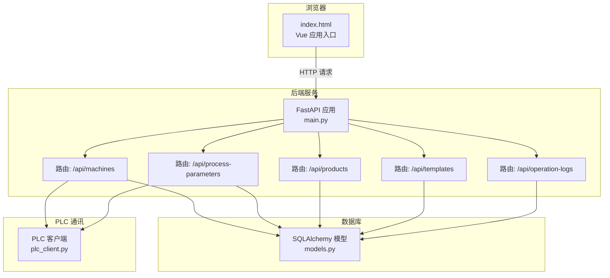
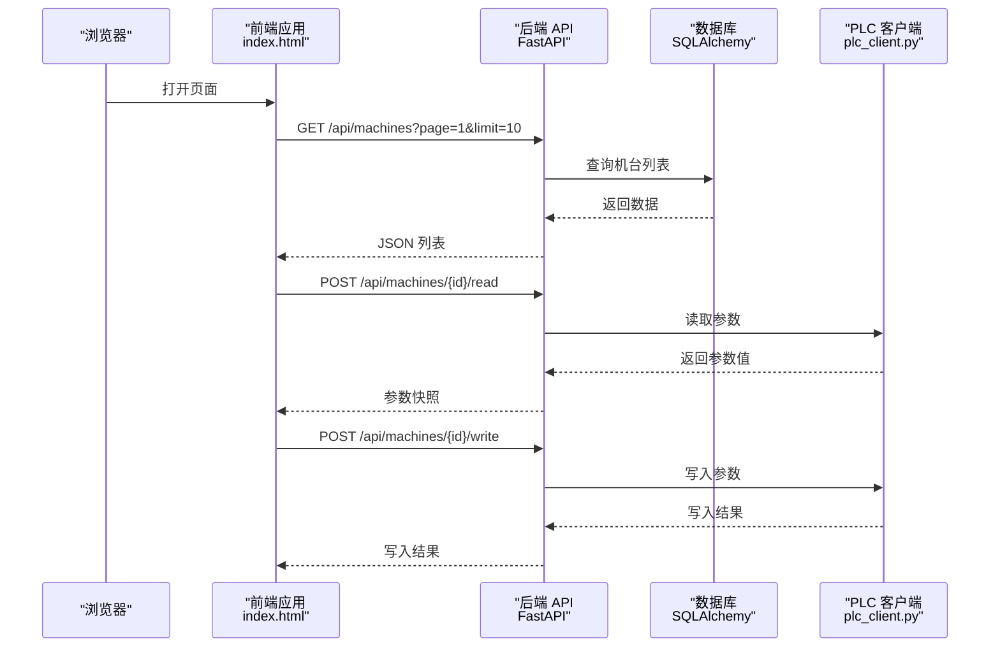
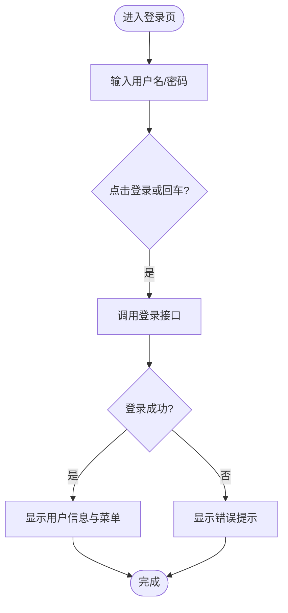
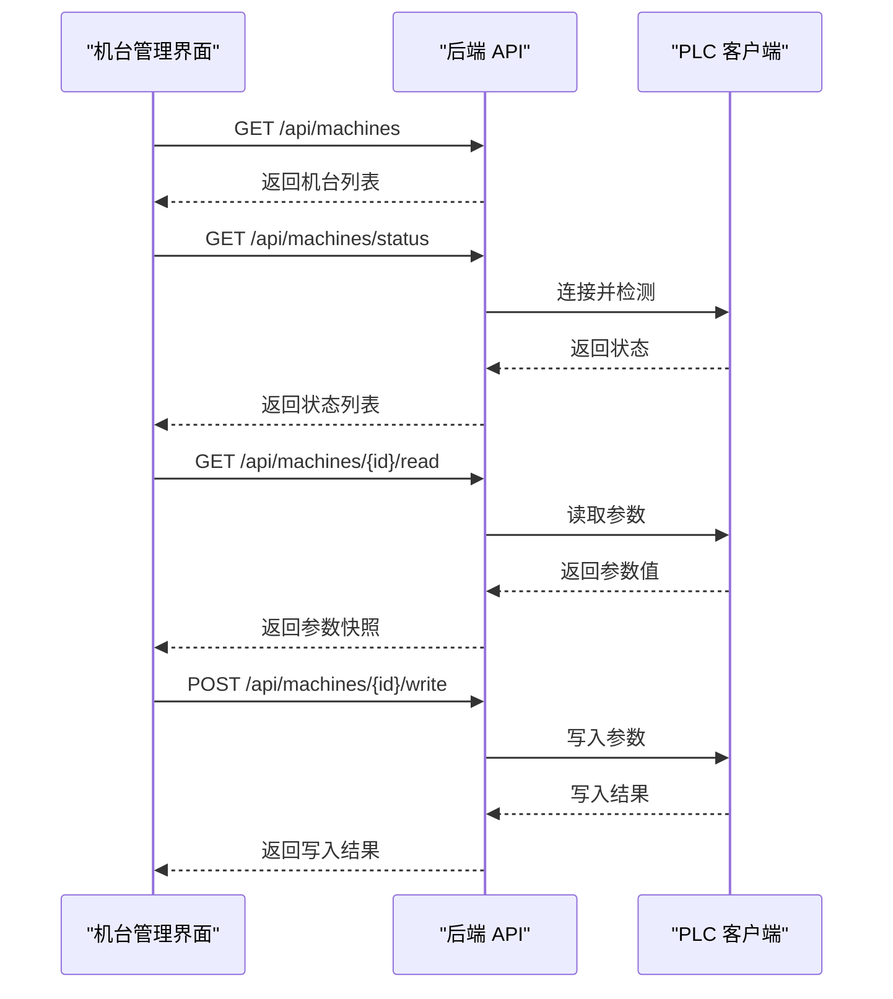
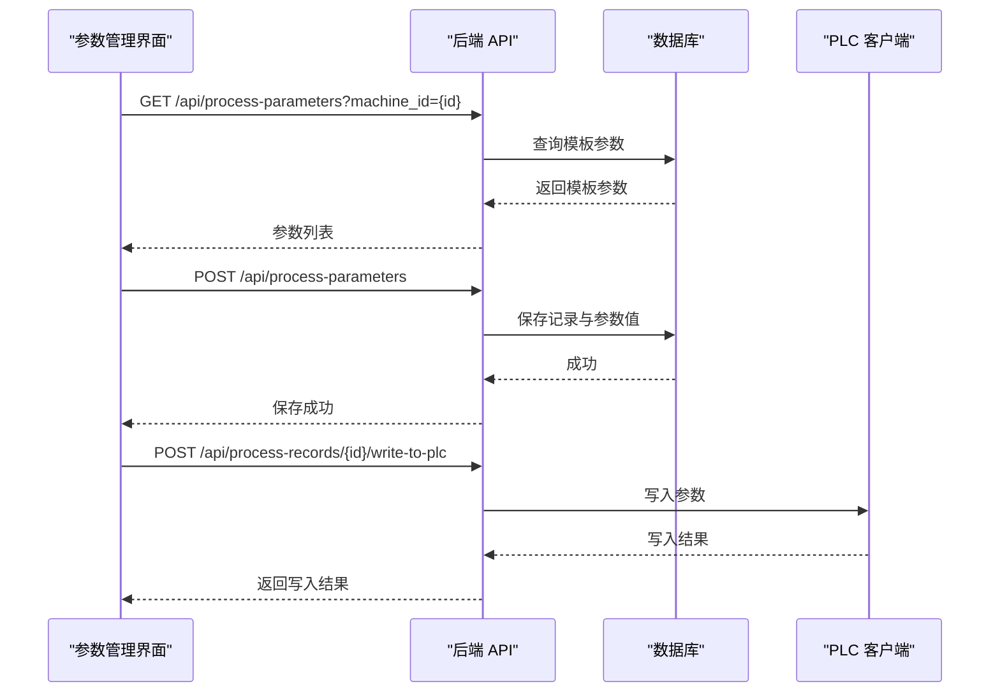
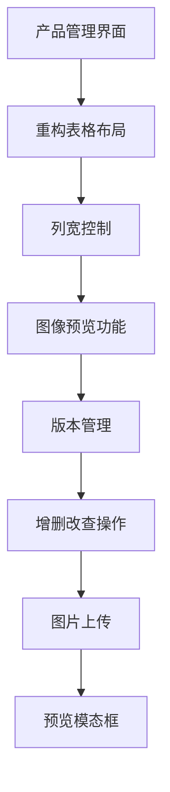
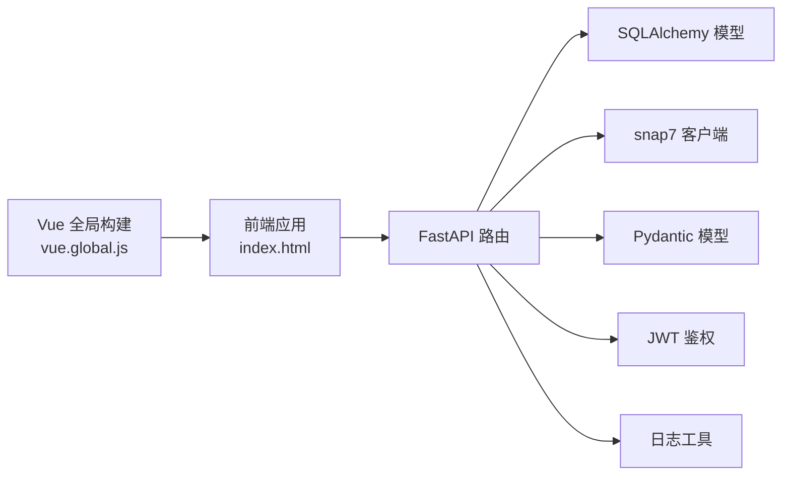

# 前端开发

<cite>
**本文引用的文件**
- [frontend/index.html](file://frontend/index.html)
- [frontend/js/vue.global.js](file://frontend/js/vue.global.js)
- [frontend/test.js](file://frontend/test.js)
- [backend/main.py](file://backend/main.py)
- [backend/routers/machines.py](file://backend/routers/machines.py)
- [backend/routers/parameters.py](file://backend/routers/parameters.py)
- [backend/routers/products.py](file://backend/routers/products.py)
- [backend/routers/templates.py](file://backend/routers/templates.py)
- [backend/routers/logs.py](file://backend/routers/logs.py)
- [backend/models.py](file://backend/models.py)
- [backend/schemas.py](file://backend/schemas.py)
- [backend/plc_client.py](file://backend/plc_client.py)
- [backend/dependencies.py](file://backend/dependencies.py)
- [backend/config.py](file://backend/config.py)
- [backend/utils/logger.py](file://backend/utils/logger.py)
</cite>

## 更新摘要
**所做更改**
- 更新了产品管理界面重构的相关内容，包括新的表格布局和列宽控制功能
- 新增了参数卡片优化的详细说明，包括合并卡片和单个参数卡片的设计
- 添加了图像预览模态框的功能说明和实现细节
- 更新了列宽控制和自定义下拉框组件的技术实现
- 增强了前端组件间的通信和状态管理描述

## 目录
1. [简介](#简介)
2. [项目结构](#项目结构)
3. [核心组件](#核心组件)
4. [架构总览](#架构总览)
5. [详细组件分析](#详细组件分析)
6. [依赖关系分析](#依赖关系分析)
7. [性能考虑](#性能考虑)
8. [故障排查指南](#故障排查指南)
9. [结论](#结论)
10. [附录](#附录)

## 简介
本指南面向前端开发者，围绕基于 Vue.js 的单页应用（SPA）进行系统化讲解，涵盖应用结构、组件设计、组件通信与状态管理、前后端 API 交互、数据绑定与用户界面设计，并结合实际业务场景（用户管理、机台监控、参数编辑等）给出可落地的实现思路与最佳实践。同时提供样式系统、响应式设计与用户体验优化建议。

**更新** 本次更新重点反映了前端界面的重大改进，包括产品管理界面重构、参数卡片优化、图像预览模态框、列宽控制等功能的实现。

## 项目结构
前端采用静态 HTML + Vue 全局构建版本的方式，后端使用 FastAPI 提供 REST API 并挂载前端静态资源。整体结构如下：

**图表来源**
- [backend/main.py:33-35](file://backend/main.py#L33-L35)
- [backend/main.py:22-25](file://backend/main.py#L22-L25)
- [backend/routers/machines.py:12](file://backend/routers/machines.py#L12)
- [backend/routers/parameters.py:12](file://backend/routers/parameters.py#L12)
- [backend/routers/products.py:10](file://backend/routers/products.py#L10)
- [backend/routers/templates.py:10](file://backend/routers/templates.py#L10)
- [backend/routers/logs.py:11](file://backend/routers/logs.py#L11)
- [backend/models.py:6](file://backend/models.py#L6)
- [backend/plc_client.py:6](file://backend/plc_client.py#L6)

**章节来源**
- [backend/main.py:12-35](file://backend/main.py#L12-L35)
- [frontend/index.html:688-722](file://frontend/index.html#L688-L722)

## 核心组件
- 单页应用入口与视图切换：通过路由导航控制当前视图（机台管理、产品管理、参数管理、模板管理、存档参数、操作日志、用户管理）。
- 登录与鉴权：登录表单、用户信息展示、登出按钮；后端通过 JWT 验证接口访问权限。
- 机台管理：机台列表、状态检测、读取参数、绑定/解绑模板、删除机台。
- 参数管理：模板参数列表、参数编辑、保存为工艺记录、批量写入 PLC。
- 产品与模板：产品与模板的增删改查。
- 操作日志：按类型、目标、时间范围筛选，查看日志详情。
- 样式系统：自定义赛博朋克风格主题，强调绿基调与网格背景，提供丰富的交互反馈。

**更新** 新增了产品管理界面重构、参数卡片优化、图像预览模态框等核心组件的详细说明。

**章节来源**
- [frontend/index.html:724-800](file://frontend/index.html#L724-L800)
- [backend/dependencies.py:38-50](file://backend/dependencies.py#L38-L50)

## 架构总览
前端通过 HTTP 请求与后端交互，后端提供统一的 /api 前缀路由，支持分页查询、CRUD 操作、PLC 读写、模板绑定等。PLC 通讯通过 snap7 客户端封装，支持多种地址格式与数据类型。

**图表来源**
- [backend/routers/machines.py:14-30](file://backend/routers/machines.py#L14-L30)
- [backend/routers/machines.py:107-183](file://backend/routers/machines.py#L107-L183)
- [backend/routers/machines.py:185-222](file://backend/routers/machines.py#L185-L222)
- [backend/plc_client.py:51-114](file://backend/plc_client.py#L51-L114)
- [backend/plc_client.py:115-180](file://backend/plc_client.py#L115-L180)

## 详细组件分析

### 组件一：登录与用户信息展示
- 功能要点
  - 输入用户名与密码，回车触发登录。
  - 登录成功后显示当前用户角色与退出按钮。
  - 登录态通过 v-if/v-else 控制显示。
- 数据流
  - 表单数据双向绑定至 loginForm。
  - 登录成功后设置 isLoggedIn、currentUser。
  - 退出时清除登录态。
- 样式与交互
  - 赛博朋克风格输入框、发光边框、扫描线动画、粒子背景等。

**图表来源**
- [frontend/index.html:708-721](file://frontend/index.html#L708-L721)
- [frontend/index.html:731-735](file://frontend/index.html#L731-L735)

**章节来源**
- [frontend/index.html:690-722](file://frontend/index.html#L690-L722)
- [frontend/index.html:724-735](file://frontend/index.html#L724-L735)

### 组件二：侧边栏导航与视图切换
- 功能要点
  - 侧边栏菜单项根据当前用户角色显示"用户管理"、"操作日志"。
  - 点击菜单项切换 currentView，并触发对应数据加载。
- 数据流
  - currentView 控制内容区域渲染。
  - 不同视图调用不同的加载函数（如 loadMachines、loadProducts 等）。

**章节来源**
- [frontend/index.html:737-748](file://frontend/index.html#L737-L748)

### 组件三：机台管理（列表、状态检测、读取/写入）
- 功能要点
  - 分页加载机台列表，显示机台编号、名称、类型、IP、状态、绑定模板。
  - 支持"检测机台状态"进度条，逐台检测并汇总结果。
  - "读取所有机台数据"一次性读取各机台参数。
  - 单台读取、绑定/解绑模板、删除（仅管理员）。
- API 交互
  - 获取机台列表：GET /api/machines
  - 检测状态：GET /api/machines/status
  - 读取参数：GET /api/machines/{id}/read
  - 写入参数：POST /api/machines/{id}/write
  - 绑定模板：POST /api/machines/{id}/bind-template
  - 解绑模板：POST /api/machines/{id}/unbind-template
  - 删除机台：DELETE /api/machines/{id}
- 错误处理
  - IP 地址缺失、PLC 连接失败、模板未绑定等情况抛出错误。

**图表来源**
- [backend/routers/machines.py:14-30](file://backend/routers/machines.py#L14-L30)
- [backend/routers/machines.py:83-105](file://backend/routers/machines.py#L83-L105)
- [backend/routers/machines.py:107-183](file://backend/routers/machines.py#L107-L183)
- [backend/routers/machines.py:185-222](file://backend/routers/machines.py#L185-L222)
- [backend/plc_client.py:51-114](file://backend/plc_client.py#L51-L114)
- [backend/plc_client.py:115-180](file://backend/plc_client.py#L115-L180)

**章节来源**
- [frontend/index.html:750-800](file://frontend/index.html#L750-L800)
- [backend/routers/machines.py:12-260](file://backend/routers/machines.py#L12-L260)

### 组件四：参数管理（模板参数、编辑、保存、写入）
- 功能要点
  - 根据机台模板生成参数列表，支持编辑参数值、单位、类型、是否只读、槽位等。
  - 保存为工艺记录（含版本号），并可将记录批量写入 PLC。
  - 参数卡片优化：支持合并卡片显示设定值和实际值，以及单个参数卡片。
- API 交互
  - 获取模板参数：GET /api/process-parameters?machine_id={id}
  - 保存参数：POST /api/process-parameters
  - 获取记录：GET /api/process-records
  - 写入记录到 PLC：POST /api/process-records/{id}/write-to-plc
  - 获取模板参数：GET /api/process-parameters/template/{machine_id}
- 数据模型
  - ProcessRecord 与 ProcessParameterValue 关联，支持参数快照与版本控制。

**图表来源**
- [backend/routers/parameters.py:14-48](file://backend/routers/parameters.py#L14-L48)
- [backend/routers/parameters.py:50-102](file://backend/routers/parameters.py#L50-L102)
- [backend/routers/parameters.py:104-149](file://backend/routers/parameters.py#L104-L149)
- [backend/routers/parameters.py:201-246](file://backend/routers/parameters.py#L201-L246)
- [backend/models.py:50-80](file://backend/models.py#L50-L80)
- [backend/plc_client.py:115-180](file://backend/plc_client.py#L115-L180)

**更新** 新增了参数卡片优化功能，包括合并卡片和单个参数卡片的设计，以及参数值的实时编辑和显示。

**章节来源**
- [frontend/index.html:750-800](file://frontend/index.html#L750-L800)
- [backend/routers/parameters.py:12-278](file://backend/routers/parameters.py#L12-L278)

### 组件五：产品管理（界面重构、列宽控制、图像预览）
- 功能要点
  - 产品管理界面重构：采用新的表格布局，支持列宽控制和自适应显示。
  - 图像预览功能：支持产品截面图的预览和查看。
  - 版本管理：支持产品版本号的管理和显示。
  - 增删改查：完整的 CRUD 操作，支持产品关联记录的检查。
- 界面特性
  - 响应式表格设计，支持横向滚动。
  - 自定义下拉框组件，支持每页显示数量的选择。
  - 图片上传和预览功能，支持本地预览和服务器存储。
- API 交互
  - 产品：GET/POST/PUT/DELETE /api/products
  - 图片上传：POST /api/upload

**更新** 产品管理界面进行了重大重构，包括新的表格布局、列宽控制、图像预览模态框等功能。

**图表来源**
- [frontend/index.html:823-891](file://frontend/index.html#L823-L891)
- [frontend/index.html:1338-1408](file://frontend/index.html#L1338-L1408)
- [frontend/index.html:1410-1416](file://frontend/index.html#L1410-L1416)

**章节来源**
- [backend/routers/products.py:12-75](file://backend/routers/products.py#L12-L75)
- [backend/routers/templates.py:12-300](file://backend/routers/templates.py#L12-L300)

### 组件六：操作日志
- 功能要点
  - 支持按操作类型、目标类型、用户、时间范围筛选。
  - 查看日志详情，包含请求参数与响应数据。
  - 自定义下拉框组件，支持日志数量的分页显示。
- API 交互
  - GET /api/operation-logs
  - GET /api/operation-logs/{id}
  - GET /api/operation-log-types
  - GET /api/operation-target-types

**章节来源**
- [backend/routers/logs.py:34-98](file://backend/routers/logs.py#L34-L98)
- [backend/routers/logs.py:100-137](file://backend/routers/logs.py#L100-L137)

### 组件七：用户管理（仅管理员）
- 功能要点
  - 显示用户列表，支持删除用户（需管理员权限）。
  - 密码修改功能，支持新密码确认。
- API 交互
  - GET /api/users
  - DELETE /api/users/{id}
  - POST /api/users/{id}/change-password

**章节来源**
- [backend/dependencies.py:33-36](file://backend/dependencies.py#L33-L36)
- [backend/dependencies.py:38-50](file://backend/dependencies.py#L38-L50)

### 组件八：模板管理与参数编辑
- 功能要点
  - 模板 CRUD 操作，支持模板参数的增删改查。
  - 模板参数编辑：支持参数名称、地址、默认值、单位、类型、只读、Slot 等属性。
  - 模板绑定：支持机台与模板的绑定和解绑。
- API 交互
  - 模板：GET/POST/PUT/DELETE /api/templates
  - 模板参数：GET/POST/PUT/DELETE /api/templates/{id}/parameters

**章节来源**
- [backend/routers/templates.py:12-300](file://backend/routers/templates.py#L12-L300)

## 依赖关系分析
- 前端依赖
  - Vue 全局构建版本（vue.global.js）用于直接在浏览器中运行。
  - 测试脚本验证 Vue 是否正确加载。
- 后端依赖
  - FastAPI 提供路由与中间件（CORS、静态文件挂载）。
  - SQLAlchemy ORM 映射数据库模型。
  - snap7 客户端用于与西门子 PLC 通讯。
  - Pydantic 模型用于请求/响应校验。
  - JWT 鉴权与日志工具模块。

**图表来源**
- [frontend/js/vue.global.js:6](file://frontend/js/vue.global.js#L6)
- [frontend/test.js:1](file://frontend/test.js#L1)
- [backend/main.py:12-31](file://backend/main.py#L12-L31)
- [backend/models.py:6](file://backend/models.py#L6)
- [backend/plc_client.py:1](file://backend/plc_client.py#L1)
- [backend/schemas.py:1](file://backend/schemas.py#L1)
- [backend/dependencies.py:1](file://backend/dependencies.py#L1)
- [backend/utils/logger.py:1](file://backend/utils/logger.py#L1)

**章节来源**
- [frontend/js/vue.global.js:1-800](file://frontend/js/vue.global.js#L1-L800)
- [frontend/test.js:1-2](file://frontend/test.js#L1-L2)
- [backend/main.py:12-31](file://backend/main.py#L12-L31)

## 性能考虑
- 前端
  - 使用虚拟滚动或分页加载大量数据，避免一次性渲染过多 DOM。
  - 对高频交互（如参数编辑）使用防抖/节流，减少不必要的 API 调用。
  - 将样式与脚本内联或缓存，减少请求数量。
  - 图像预览采用模态框形式，避免页面布局频繁变动。
- 后端
  - 对 PLC 读写操作进行批处理，降低连接/断开频率。
  - 使用连接池与超时控制，避免阻塞。
  - 对日志写入进行异步化，避免影响主流程。
- 数据库
  - 为常用查询字段建立索引（如机器编号、产品编号、模板 ID）。
  - 分页查询时限制每页大小，避免大结果集。

**更新** 新增了图像预览性能优化和参数卡片渲染优化的考虑。

## 故障排查指南
- 登录失败
  - 检查 Authorization 头是否携带 Bearer Token。
  - 确认 SECRET_KEY 与算法配置一致。
- PLC 连接失败
  - 校验 IP、Rack、Slot 配置是否正确。
  - 确认 snap7 客户端可用且网络连通。
- 机台未绑定模板
  - 在绑定模板前，确保模板参数已配置。
- 参数读取/写入失败
  - 检查参数地址格式与数据类型是否匹配。
  - 确认只读参数不可写入。
- 日志未记录
  - 检查日志目录权限与磁盘空间。
  - 确认日志清理策略未提前删除当日文件。
- 图像上传失败
  - 检查文件类型和大小限制。
  - 确认服务器存储权限。

**更新** 新增了图像上传和参数卡片相关的故障排查指导。

**章节来源**
- [backend/dependencies.py:38-50](file://backend/dependencies.py#L38-L50)
- [backend/plc_client.py:24-49](file://backend/plc_client.py#L24-L49)
- [backend/routers/machines.py:116-152](file://backend/routers/machines.py#L116-L152)
- [backend/routers/parameters.py:222-241](file://backend/routers/parameters.py#L222-L241)
- [backend/utils/logger.py:17-31](file://backend/utils/logger.py#L17-L31)

## 结论
本项目以 Vue.js 作为前端框架，结合 FastAPI 提供的 REST API，实现了从机台监控到参数编辑再到日志审计的完整业务闭环。通过清晰的路由划分、完善的鉴权与日志体系、以及对 PLC 通讯的抽象封装，前端可以稳定地与后端协作，满足工业控制场景下的高可靠性需求。

**更新** 本次界面重大改进显著提升了用户体验，包括产品管理界面的重构、参数卡片的优化、图像预览功能的完善，以及列宽控制等交互优化。建议在后续迭代中继续完善状态管理、组件化重构与自动化测试，以进一步提升可维护性与扩展性。

## 附录
- 样式系统与主题
  - 采用赛博朋克风格，强调绿光、网格背景与发光效果，适合工业控制界面。
  - 提供自定义下拉框、进度条、告警闪烁等组件样式。
- 响应式设计
  - 使用相对布局与媒体查询适配不同屏幕尺寸。
  - 表格支持横向滚动，确保小屏幕设备的可用性。
- 用户体验优化
  - 提供加载状态、进度条、错误提示与动画反馈，增强交互感知。
  - 图像预览采用模态框设计，避免页面布局跳变。
- 代码示例路径参考
  - 登录与用户信息展示：[frontend/index.html:690-735](file://frontend/index.html#L690-L735)
  - 机台管理与 PLC 读写：[backend/routers/machines.py:107-222](file://backend/routers/machines.py#L107-L222)
  - 参数保存与写入记录：[backend/routers/parameters.py:50-246](file://backend/routers/parameters.py#L50-L246)
  - 产品与模板管理：[backend/routers/products.py:12-75](file://backend/routers/products.py#L12-L75), [backend/routers/templates.py:12-300](file://backend/routers/templates.py#L12-L300)
  - 操作日志：[backend/routers/logs.py:34-137](file://backend/routers/logs.py#L34-L137)
  - 鉴权与权限控制：[backend/dependencies.py:33-50](file://backend/dependencies.py#L33-L50)
  - 配置与常量：[backend/config.py:4-35](file://backend/config.py#L4-L35)
  - 日志工具：[backend/utils/logger.py:65-199](file://backend/utils/logger.py#L65-L199)