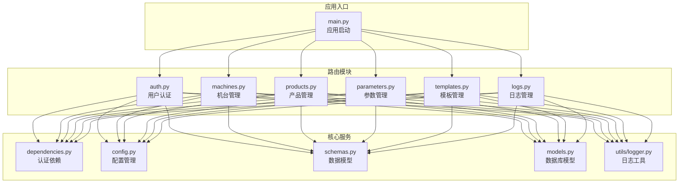
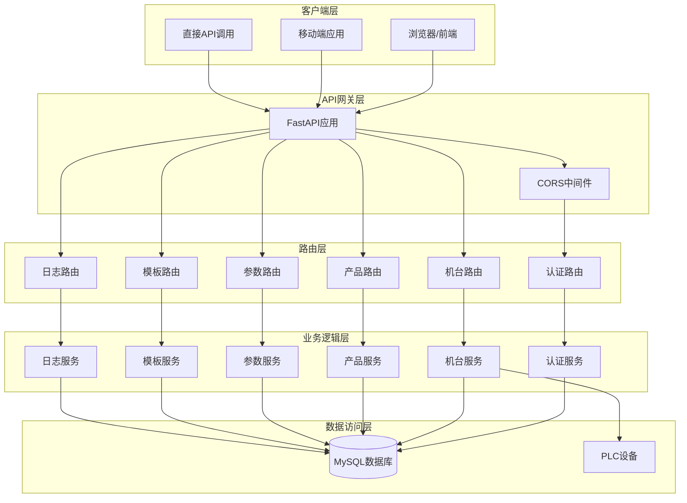
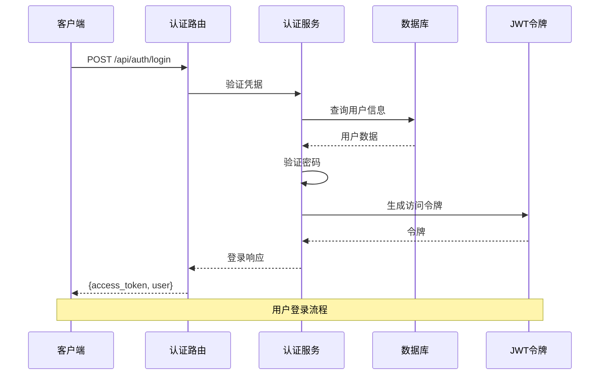
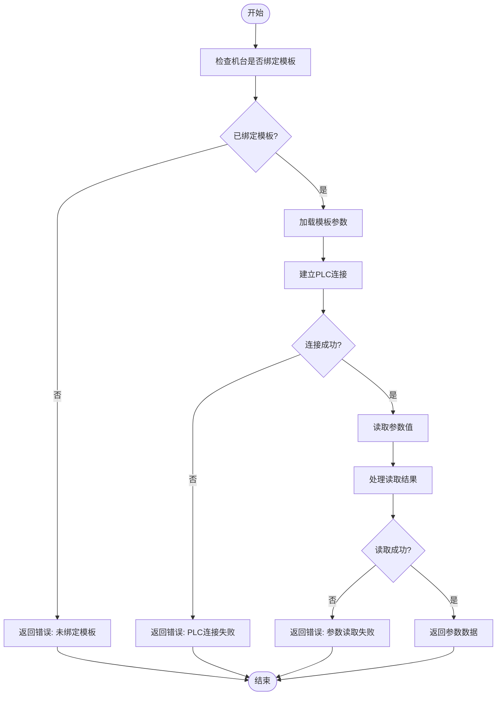
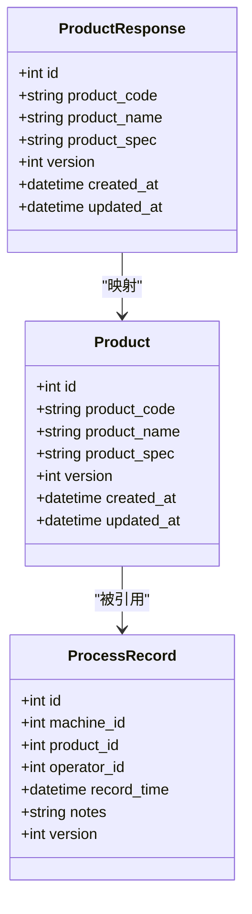
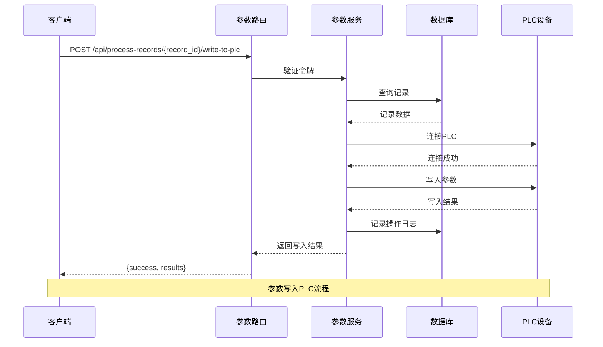
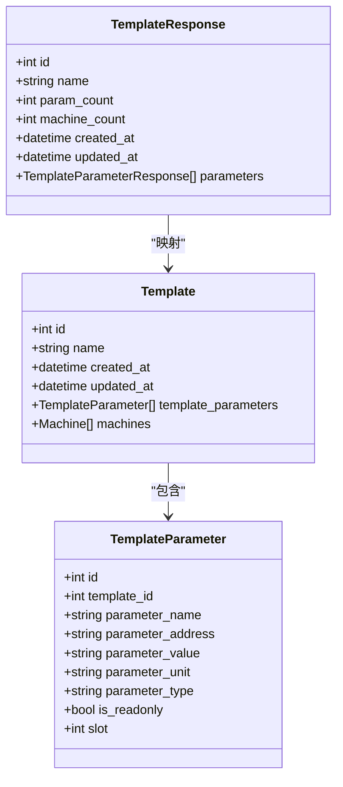
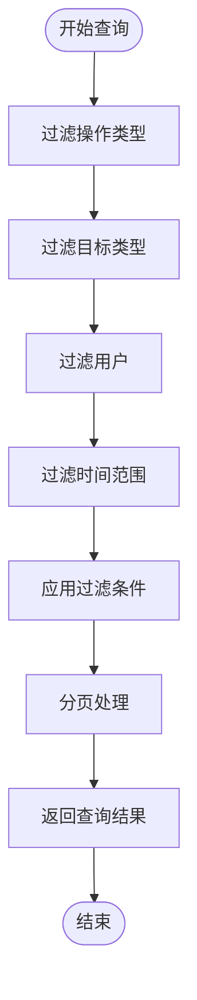
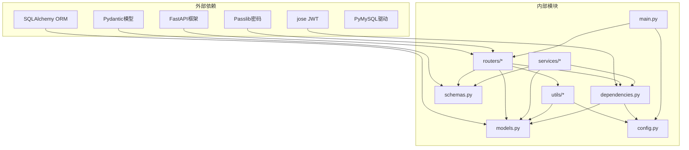

# API路由模块

<cite>
**本文档引用的文件**
- [backend/main.py](file://backend/main.py)
- [backend/routers/auth.py](file://backend/routers/auth.py)
- [backend/routers/machines.py](file://backend/routers/machines.py)
- [backend/routers/products.py](file://backend/routers/products.py)
- [backend/routers/parameters.py](file://backend/routers/parameters.py)
- [backend/routers/templates.py](file://backend/routers/templates.py)
- [backend/routers/logs.py](file://backend/routers/logs.py)
- [backend/dependencies.py](file://backend/dependencies.py)
- [backend/config.py](file://backend/config.py)
- [backend/schemas.py](file://backend/schemas.py)
- [backend/models.py](file://backend/models.py)
- [backend/utils/logger.py](file://backend/utils/logger.py)
</cite>

## 目录
1. [简介](#简介)
2. [项目结构](#项目结构)
3. [核心组件](#核心组件)
4. [架构总览](#架构总览)
5. [详细组件分析](#详细组件分析)
6. [依赖关系分析](#依赖关系分析)
7. [性能考虑](#性能考虑)
8. [故障排除指南](#故障排除指南)
9. [结论](#结论)

## 简介
本项目是一个基于FastAPI的PLC数据采集与管理系统，提供RESTful API用于用户认证、机台管理、产品管理、参数管理、模板管理和日志管理。系统采用JWT令牌进行身份验证，支持分页查询、模板绑定、PLC参数读写等功能，具备完善的操作日志记录能力。

## 项目结构
后端采用模块化路由设计，每个功能域独立成模块，通过主应用统一注册路由。

**图表来源**
- [backend/main.py:26-31](file://backend/main.py#L26-L31)
- [backend/routers/auth.py:15](file://backend/routers/auth.py#L15)
- [backend/routers/machines.py:12](file://backend/routers/machines.py#L12)
- [backend/routers/products.py:10](file://backend/routers/products.py#L10)
- [backend/routers/parameters.py:12](file://backend/routers/parameters.py#L12)
- [backend/routers/templates.py:10](file://backend/routers/templates.py#L10)
- [backend/routers/logs.py:11](file://backend/routers/logs.py#L11)

**章节来源**
- [backend/main.py:12-31](file://backend/main.py#L12-L31)

## 核心组件
系统采用模块化设计，每个路由模块负责特定业务领域的API接口，通过统一的前缀"/api"进行组织。

### 认证与安全
- **JWT令牌管理**：使用HS256算法生成访问令牌，支持自定义过期时间
- **密码加密**：采用bcrypt算法进行密码哈希，兼容旧版SHA256方案
- **权限控制**：区分普通操作员和管理员角色，提供基础的权限验证

### 数据模型与序列化
- **Pydantic模型**：定义请求响应的数据结构，确保类型安全
- **SQLAlchemy模型**：映射数据库表结构，支持复杂关联关系
- **分页机制**：统一的分页查询接口，支持自定义页面大小

### 日志系统
- **操作日志**：记录所有重要操作的详细信息
- **文件日志**：按日期分割的日志文件，支持自动清理
- **数据库日志**：持久化的操作日志存储

**章节来源**
- [backend/routers/auth.py:17-36](file://backend/routers/auth.py#L17-L36)
- [backend/dependencies.py:9-31](file://backend/dependencies.py#L9-L31)
- [backend/schemas.py:5-32](file://backend/schemas.py#L5-L32)
- [backend/utils/logger.py:65-87](file://backend/utils/logger.py#L65-L87)

## 架构总览
系统采用分层架构，清晰分离了路由层、业务逻辑层、数据访问层和基础设施层。

**图表来源**
- [backend/main.py:14-20](file://backend/main.py#L14-L20)
- [backend/main.py:26-31](file://backend/main.py#L26-L31)
- [backend/routers/machines.py:83-105](file://backend/routers/machines.py#L83-L105)

## 详细组件分析

### 用户认证路由模块
用户认证模块提供完整的身份验证和用户管理功能，支持JWT令牌的生成、验证和用户信息管理。

#### 核心功能
- **用户登录**：验证用户名密码，生成访问令牌
- **用户管理**：创建、删除、修改用户信息
- **密码管理**：密码哈希存储，安全的密码变更
- **权限验证**：基于JWT的请求头验证

#### API设计规范
- **HTTP方法**：POST用于登录，GET用于列表查询，POST/DELETE用于用户管理
- **URL模式**：/api/auth/login, /api/users, /api/users/{user_id}
- **响应格式**：标准化的JSON响应，包含状态码和消息

**图表来源**
- [backend/routers/auth.py:38-48](file://backend/routers/auth.py#L38-L48)
- [backend/dependencies.py:38-50](file://backend/dependencies.py#L38-L50)

#### 关键实现细节
- **密码验证**：支持新旧两种密码验证方式，确保向后兼容
- **令牌过期**：可配置的令牌过期时间，默认24小时
- **用户角色**：支持普通操作员和管理员角色
- **安全措施**：防止管理员账户被删除，用户名唯一性约束

**章节来源**
- [backend/routers/auth.py:19-48](file://backend/routers/auth.py#L19-L48)
- [backend/routers/auth.py:58-114](file://backend/routers/auth.py#L58-L114)

### 机台管理路由模块
机台管理模块负责PLC机台的全生命周期管理，包括基本属性管理、状态监控和PLC参数读写。

#### 核心功能
- **机台管理**：增删改查机台基本信息
- **状态监控**：实时检测PLC连接状态
- **参数读取**：从PLC读取工艺参数
- **参数写入**：向PLC写入参数值
- **模板绑定**：将模板与机台关联

#### API设计规范
- **HTTP方法**：GET/POST/PUT/DELETE用于资源管理
- **URL模式**：/api/machines, /api/machines/{machine_id}/read, /api/machines/{machine_id}/write
- **PLC交互**：封装PLC通信细节，提供统一的参数访问接口

**图表来源**
- [backend/routers/machines.py:107-183](file://backend/routers/machines.py#L107-L183)

#### 关键实现细节
- **PLC通信**：支持多种数据类型（Int、Real、Bool）的读写
- **模板集成**：通过模板参数定义标准的参数集合
- **状态管理**：实时监控PLC连接状态，提供在线/离线/错误状态
- **异常处理**：完善的错误处理机制，提供详细的错误信息

**章节来源**
- [backend/routers/machines.py:14-105](file://backend/routers/machines.py#L14-L105)
- [backend/routers/machines.py:185-260](file://backend/routers/machines.py#L185-L260)

### 产品管理路由模块
产品管理模块负责产品的全生命周期管理，支持版本控制和关联关系管理。

#### 核心功能
- **产品管理**：增删改查产品信息
- **版本控制**：自动递增版本号
- **关联保护**：防止有生产记录的产品被删除

#### API设计规范
- **HTTP方法**：GET/POST/PUT/DELETE用于资源管理
- **URL模式**：/api/products, /api/products/{product_id}
- **版本管理**：自动版本控制，确保数据一致性

**图表来源**
- [backend/models.py:37-48](file://backend/models.py#L37-L48)
- [backend/schemas.py:64-84](file://backend/schemas.py#L64-L84)

#### 关键实现细节
- **唯一性约束**：产品编号必须唯一
- **版本递增**：每次更新自动递增版本号
- **删除保护**：有相关生产记录的产品不允许删除
- **数据完整性**：通过外键约束保证数据一致性

**章节来源**
- [backend/routers/products.py:12-75](file://backend/routers/products.py#L12-L75)
- [backend/models.py:50-64](file://backend/models.py#L50-L64)

### 参数管理路由模块
参数管理模块负责工艺参数的保存、查询和PLC写入操作，提供完整的参数生命周期管理。

#### 核心功能
- **参数保存**：保存工艺参数到数据库
- **参数查询**：查询模板参数和历史参数
- **记录管理**：创建和管理工艺记录
- **PLC写入**：将参数写入PLC设备

#### API设计规范
- **HTTP方法**：GET/POST用于查询和保存，POST用于写入操作
- **URL模式**：/api/process-parameters, /api/process-records, /api/process-records/{record_id}/write-to-plc
- **数据结构**：复杂的嵌套数据结构，支持参数快照和版本控制

**图表来源**
- [backend/routers/parameters.py:201-246](file://backend/routers/parameters.py#L201-L246)

#### 关键实现细节
- **版本控制**：自动递增记录版本号
- **类型转换**：根据参数类型进行正确的数据转换
- **只读保护**：跳过只读参数的写入操作
- **批量处理**：支持批量参数写入操作

**章节来源**
- [backend/routers/parameters.py:14-278](file://backend/routers/parameters.py#L14-L278)

### 模板管理路由模块
模板管理模块负责工艺模板的创建、维护和参数管理，为机台提供标准化的参数配置。

#### 核心功能
- **模板管理**：创建、更新、删除模板
- **参数管理**：添加、修改、删除模板参数
- **查询接口**：获取模板及其参数信息
- **统计信息**：提供模板使用统计

#### API设计规范
- **HTTP方法**：GET/POST/PUT/DELETE用于资源管理
- **URL模式**：/api/templates, /api/templates/{template_id}, /api/templates/{template_id}/parameters
- **嵌套资源**：支持模板参数的CRUD操作

**图表来源**
- [backend/models.py:81-104](file://backend/models.py#L81-L104)
- [backend/schemas.py:135-145](file://backend/schemas.py#L135-L145)

#### 关键实现细节
- **参数类型**：支持多种参数类型（Int、Real、Bool）
- **只读标记**：标识参数是否允许修改
- **槽位配置**：支持多槽位的PLC参数配置
- **级联操作**：删除模板时自动删除关联参数

**章节来源**
- [backend/routers/templates.py:12-300](file://backend/routers/templates.py#L12-L300)

### 日志管理路由模块
日志管理模块提供操作日志的查询和管理功能，支持多维度的日志检索和统计。

#### 核心功能
- **日志查询**：按条件查询操作日志
- **日志详情**：查看单条日志的详细信息
- **类型统计**：获取可用的操作类型和目标类型
- **过滤搜索**：支持多种过滤条件组合

#### API设计规范
- **HTTP方法**：GET用于查询和详情
- **URL模式**：/api/operation-logs, /api/operation-logs/{log_id}, /api/operation-log-types
- **数据格式**：JSON格式的结构化日志数据

**图表来源**
- [backend/routers/logs.py:34-98](file://backend/routers/logs.py#L34-L98)

#### 关键实现细节
- **类型映射**：支持中文和英文类型的双向映射
- **动态过滤**：根据提供的参数动态构建查询条件
- **JSON解析**：自动解析存储的JSON格式数据
- **分页优化**：支持大数据量的高效分页查询

**章节来源**
- [backend/routers/logs.py:13-137](file://backend/routers/logs.py#L13-L137)

## 依赖关系分析

**图表来源**
- [backend/main.py:1-77](file://backend/main.py#L1-L77)
- [backend/routers/auth.py:1-114](file://backend/routers/auth.py#L1-L114)

### 核心依赖关系
- **路由依赖**：所有路由模块依赖于认证依赖和数据库会话
- **模型依赖**：路由模块依赖于数据模型定义
- **配置依赖**：路由模块依赖于全局配置设置
- **工具依赖**：路由模块依赖于日志工具函数

**章节来源**
- [backend/dependencies.py:1-50](file://backend/dependencies.py#L1-L50)
- [backend/config.py:1-35](file://backend/config.py#L1-L35)

## 性能考虑
系统在设计时充分考虑了性能优化，主要体现在以下几个方面：

### 数据库优化
- **索引设计**：关键字段建立数据库索引，提升查询性能
- **连接池**：使用SQLAlchemy连接池管理数据库连接
- **批量操作**：支持批量插入和更新操作

### 缓存策略
- **令牌缓存**：JWT令牌验证结果可以缓存
- **模板缓存**：常用模板数据可以缓存到内存
- **查询缓存**：静态数据查询结果可以缓存

### 网络优化
- **CORS配置**：合理配置跨域资源共享
- **压缩传输**：支持Gzip压缩减少传输数据量
- **超时控制**：PLC连接设置合理的超时时间

## 故障排除指南

### 常见问题及解决方案

#### 认证相关问题
- **令牌无效**：检查JWT密钥配置和令牌格式
- **用户不存在**：确认用户是否正确创建
- **权限不足**：验证用户角色和权限级别

#### 数据库连接问题
- **连接失败**：检查数据库配置和网络连通性
- **表结构不匹配**：运行数据库初始化脚本
- **事务冲突**：检查并发访问和锁机制

#### PLC通信问题
- **连接超时**：检查IP地址、端口和网络配置
- **参数读取失败**：验证参数地址和数据类型
- **写入权限**：确认参数是否为只读属性

#### 日志相关问题
- **日志文件无法写入**：检查日志目录权限和磁盘空间
- **日志清理失败**：检查文件锁定和权限设置
- **查询性能问题**：优化日志查询条件和索引

**章节来源**
- [backend/utils/logger.py:17-31](file://backend/utils/logger.py#L17-L31)
- [backend/routers/machines.py:93-101](file://backend/routers/machines.py#L93-L101)

## 结论
本API路由模块实现了完整的PLC数据采集系统的核心功能，具有以下特点：

### 设计优势
- **模块化设计**：清晰的功能划分，便于维护和扩展
- **RESTful规范**：符合RESTful API设计原则，易于理解和使用
- **安全性考虑**：完善的认证授权机制和数据保护
- **可扩展性**：良好的架构设计支持功能扩展

### 技术亮点
- **类型安全**：基于Pydantic的强类型验证
- **异步支持**：支持异步操作和高并发场景
- **日志完整**：全面的操作日志记录机制
- **错误处理**：完善的异常处理和错误信息反馈

### 改进建议
- **监控指标**：添加系统性能监控和告警机制
- **测试覆盖**：增加单元测试和集成测试覆盖率
- **文档完善**：补充详细的API文档和使用示例
- **安全加固**：实施更严格的安全审计和防护措施

该系统为工业自动化领域提供了可靠的API接口，能够满足现代工厂对数据采集和管理的需求。