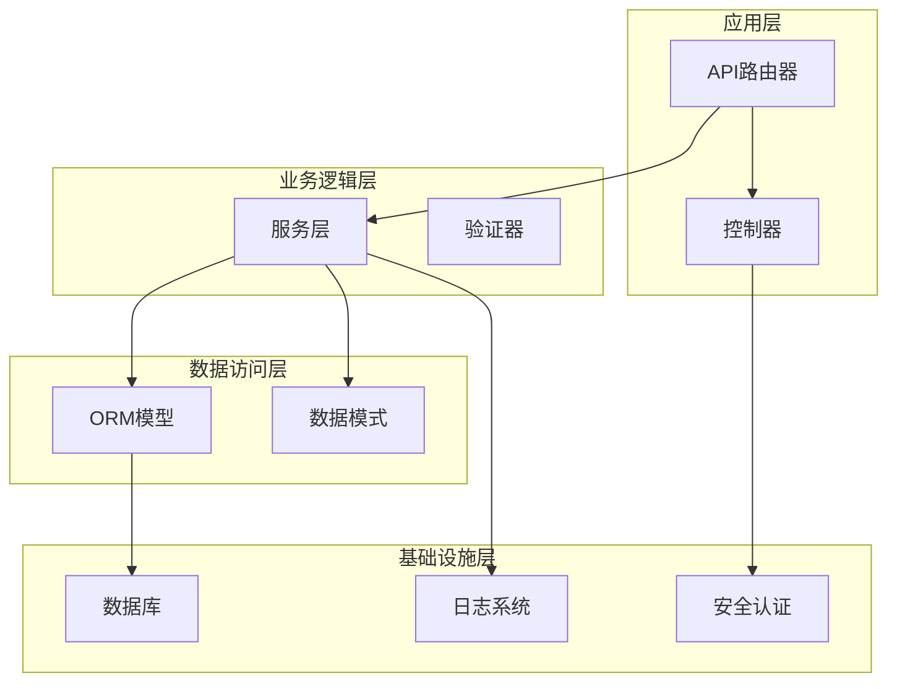
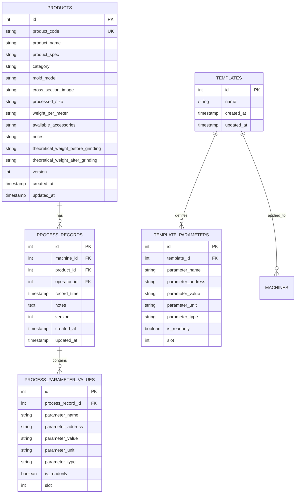
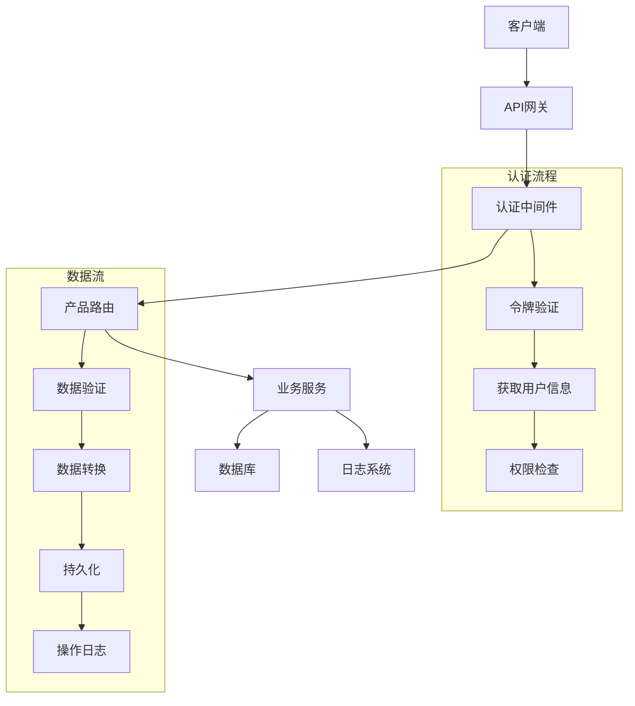
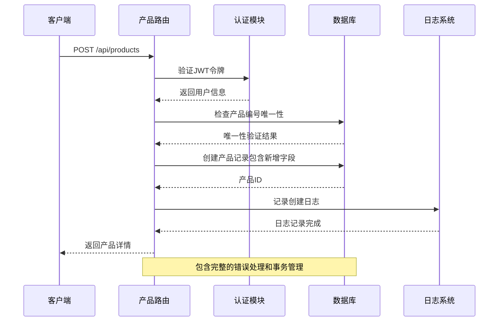
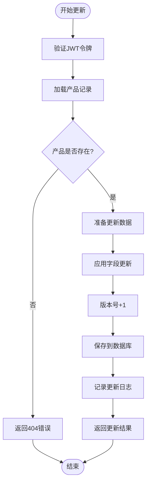
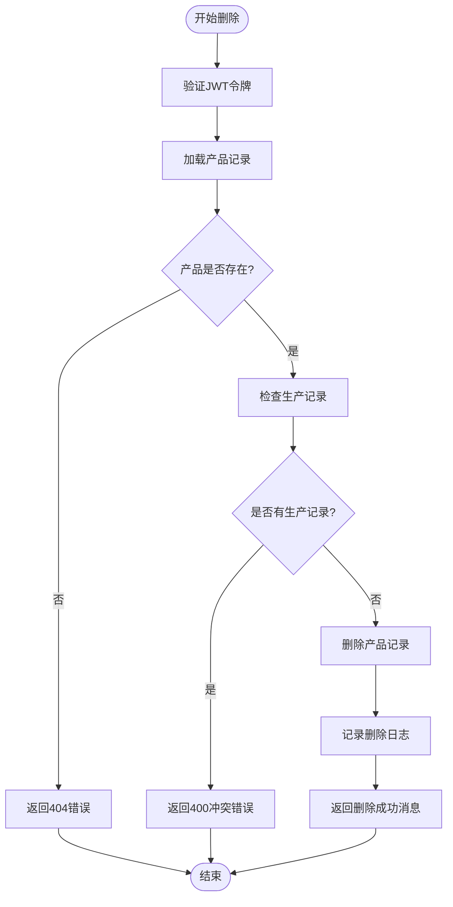
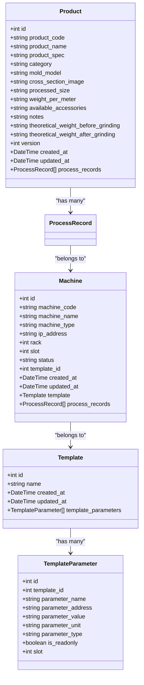
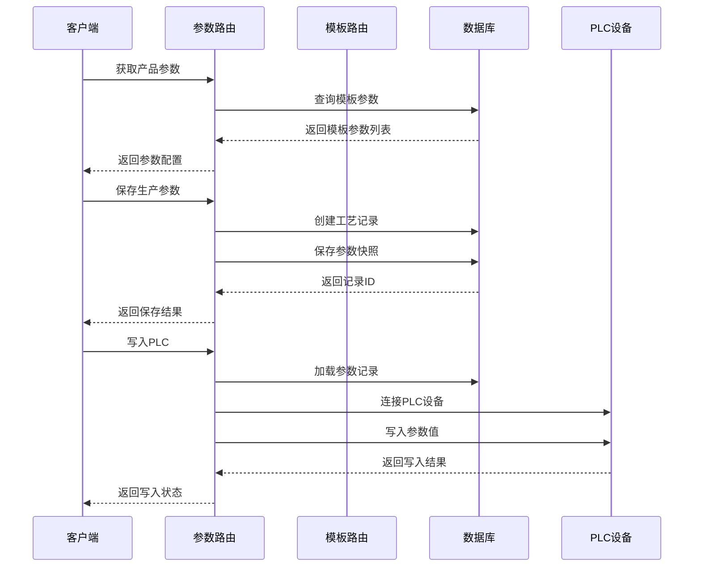
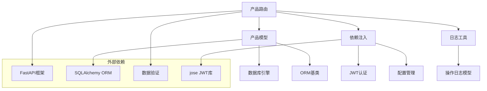

# 产品管理路由

<cite>
**本文档引用的文件**
- [backend/routers/products.py](file://backend/routers/products.py)
- [backend/models.py](file://backend/models.py)
- [backend/schemas.py](file://backend/schemas.py)
- [backend/routers/templates.py](file://backend/routers/templates.py)
- [backend/routers/parameters.py](file://backend/routers/parameters.py)
- [backend/utils/logger.py](file://backend/utils/logger.py)
- [backend/database.py](file://backend/database.py)
- [backend/dependencies.py](file://backend/dependencies.py)
- [backend/config.py](file://backend/config.py)
- [backend/database_schema.sql](file://backend/database_schema.sql)
- [backend/main.py](file://backend/main.py)
</cite>

## 更新摘要
**变更内容**
- 新增了多个产品信息字段，包括类别(category)、模具型号(mold_model)、截面图(cross_section_image)、加工尺寸(processed_size)、重量(weight_per_meter)等
- 增强了产品规格管理功能，支持更全面的产品数据描述
- 更新了产品数据模型和API接口，以支持新的字段结构
- 完善了前端界面，支持新字段的显示和编辑

## 目录
1. [简介](#简介)
2. [项目结构](#项目结构)
3. [核心组件](#核心组件)
4. [架构概览](#架构概览)
5. [详细组件分析](#详细组件分析)
6. [依赖关系分析](#依赖关系分析)
7. [性能考虑](#性能考虑)
8. [故障排除指南](#故障排除指南)
9. [结论](#结论)

## 简介

本文档详细介绍了挤出机工艺参数管理系统的**产品管理路由**实现。系统基于FastAPI构建，采用SQLAlchemy进行数据持久化，实现了完整的产品配方和规格管理功能。产品管理路由提供了产品创建、更新、删除和查询等核心操作，并与参数模板系统深度集成，支持产品生产时的参数应用机制。

**更新** 系统现已增强产品管理功能，新增了多个产品信息字段，包括类别、模具型号、截面图、加工尺寸、重量等，支持更全面的产品规格管理。

系统的核心特性包括：
- 完整的产品生命周期管理
- 基于模板的参数配置系统
- 版本管理和变更追踪
- 安全的访问控制和权限管理
- 工业级的日志记录和审计功能
- **新增** 全面的产品规格信息管理

## 项目结构

系统采用模块化的架构设计，主要由以下层次组成：

**图表来源**
- [backend/main.py:26-31](file://backend/main.py#L26-L31)
- [backend/routers/products.py:10](file://backend/routers/products.py#L10)
- [backend/models.py:37-48](file://backend/models.py#L37-L48)

**章节来源**
- [backend/main.py:12-31](file://backend/main.py#L12-L31)
- [backend/database.py:1-18](file://backend/database.py#L1-L18)

## 核心组件

### 产品管理路由

产品管理路由位于`backend/routers/products.py`，提供了完整的RESTful API接口：

- **GET /api/products** - 分页查询所有产品
- **POST /api/products** - 创建新产品
- **PUT /api/products/{product_id}** - 更新现有产品
- **DELETE /api/products/{product_id}** - 删除产品

每个端点都集成了JWT令牌验证和操作日志记录功能。

**更新** 路由接口现在支持新增的产品字段，包括类别、模具型号、截面图、加工尺寸、重量等字段的创建和更新。

### 数据模型设计

系统采用SQLAlchemy ORM映射，核心数据模型包括：

**图表来源**
- [backend/models.py:37-57](file://backend/models.py#L37-L57)
- [backend/models.py:59-73](file://backend/models.py#L59-L73)
- [backend/models.py:100-113](file://backend/models.py#L100-L113)

**章节来源**
- [backend/models.py:37-142](file://backend/models.py#L37-L142)

### 数据验证和序列化

使用Pydantic模型进行数据验证和序列化：

- **ProductBase**: 产品基础字段定义，包含新增的规格管理字段
- **ProductCreate**: 产品创建请求模型
- **ProductUpdate**: 产品更新请求模型
- **ProductResponse**: 产品响应模型

**更新** 数据验证模型现已包含所有新增的产品规格字段，支持完整的数据验证和序列化。

**章节来源**
- [backend/schemas.py:64-102](file://backend/schemas.py#L64-L102)

## 架构概览

系统采用分层架构，确保关注点分离和代码可维护性：

**图表来源**
- [backend/routers/products.py:21-54](file://backend/routers/products.py#L21-L54)
- [backend/dependencies.py:38-50](file://backend/dependencies.py#L38-L50)

**章节来源**
- [backend/routers/products.py:1-75](file://backend/routers/products.py#L1-L75)
- [backend/dependencies.py:1-50](file://backend/dependencies.py#L1-L50)

## 详细组件分析

### 产品创建流程

产品创建是系统中最复杂的操作之一，涉及多个验证步骤和事务处理：

**图表来源**
- [backend/routers/products.py:20-35](file://backend/routers/products.py#L20-L35)
- [backend/utils/logger.py:131-138](file://backend/utils/logger.py#L131-L138)

#### 关键实现细节

1. **唯一性约束**: 通过`product_code`确保产品编号的唯一性
2. **版本管理**: 初始化版本号为1
3. **权限控制**: 使用JWT令牌验证用户身份
4. **审计追踪**: 自动记录所有创建操作
5. **** 新增字段支持**: 完整支持所有新增的产品规格字段

**章节来源**
- [backend/routers/products.py:20-35](file://backend/routers/products.py#L20-L35)

### 产品更新流程

产品更新采用部分更新策略，仅更新指定的字段：

**图表来源**
- [backend/routers/products.py:37-54](file://backend/routers/products.py#L37-L54)
- [backend/utils/logger.py:134-135](file://backend/utils/logger.py#L134-L135)

#### 版本管理机制

系统实现了完整的版本控制机制：

- **版本号递增**: 每次更新都会增加版本号
- **历史追踪**: 通过`version`字段追踪产品变更历史
- **并发控制**: 避免多用户同时修改同一产品
- **** 新增字段更新**: 支持对所有新增规格字段的部分更新

**章节来源**
- [backend/routers/products.py:49](file://backend/routers/products.py#L49)

### 产品删除流程

删除操作包含严格的依赖检查，确保数据完整性：

**图表来源**
- [backend/routers/products.py:56-75](file://backend/routers/products.py#L56-L75)
- [backend/utils/logger.py:137-138](file://backend/utils/logger.py#L137-L138)

#### 数据完整性保护

删除操作通过以下机制保护数据完整性：
- **外键约束**: 级联删除防止孤立记录
- **依赖检查**: 确保产品没有相关的生产记录
- **事务回滚**: 发生错误时自动回滚

**章节来源**
- [backend/routers/products.py:65-68](file://backend/routers/products.py#L65-L68)

### 参数模板关联机制

产品与参数模板的关联通过机器作为中介实现：

**图表来源**
- [backend/models.py:37-57](file://backend/models.py#L37-L57)
- [backend/models.py:100-113](file://backend/models.py#L100-L113)
- [backend/models.py:19-35](file://backend/models.py#L19-L35)

**章节来源**
- [backend/models.py:37-113](file://backend/models.py#L37-L113)

### 产品生产参数应用

产品生产时的参数应用通过以下流程实现：

**图表来源**
- [backend/routers/parameters.py:50-102](file://backend/routers/parameters.py#L50-L102)
- [backend/routers/parameters.py:201-246](file://backend/routers/parameters.py#L201-L246)

**章节来源**
- [backend/routers/parameters.py:50-102](file://backend/routers/parameters.py#L50-L102)
- [backend/routers/parameters.py:201-246](file://backend/routers/parameters.py#L201-L246)

## 依赖关系分析

系统采用模块化设计，各组件之间的依赖关系清晰明确：

**图表来源**
- [backend/routers/products.py:1-8](file://backend/routers/products.py#L1-L8)
- [backend/models.py:1-4](file://backend/models.py#L1-L4)
- [backend/dependencies.py:1-7](file://backend/dependencies.py#L1-L7)

### 核心依赖组件

1. **FastAPI**: Web框架，提供异步API开发能力
2. **SQLAlchemy**: ORM框架，处理数据库操作
3. **Pydantic**: 数据验证和序列化
4. **JWT**: 用户认证和授权
5. **PyMySQL**: MySQL数据库驱动

**章节来源**
- [backend/routers/products.py:1-8](file://backend/routers/products.py#L1-L8)
- [backend/database.py:1-18](file://backend/database.py#L1-L18)

## 性能考虑

系统在设计时充分考虑了性能优化：

### 数据库优化

- **索引设计**: 关键字段建立适当索引
- **查询优化**: 使用JOIN减少查询次数
- **连接池**: 配置连接池提高连接复用率

### 缓存策略

- **会话缓存**: 使用SQLAlchemy会话缓存
- **令牌缓存**: JWT令牌验证结果缓存
- **模板缓存**: 经常访问的模板数据缓存

### 并发处理

- **线程安全**: 所有数据库操作都是线程安全的
- **事务管理**: 自动事务管理和回滚机制
- **锁机制**: 避免并发修改冲突

## 故障排除指南

### 常见问题及解决方案

#### 1. 产品创建失败

**问题**: 产品编号重复导致创建失败
**解决方案**: 
- 检查产品编号是否唯一
- 修改产品编号后重试

**章节来源**
- [backend/routers/products.py:25-27](file://backend/routers/products.py#L25-L27)

#### 2. 产品更新失败

**问题**: 产品不存在或权限不足
**解决方案**:
- 确认产品ID正确性
- 检查用户权限级别
- 验证JWT令牌有效性

**章节来源**
- [backend/routers/products.py:42-44](file://backend/routers/products.py#L42-L44)

#### 3. 产品删除失败

**问题**: 产品仍有生产记录无法删除
**解决方案**:
- 先删除相关的生产记录
- 或者修改产品记录以解除关联

**章节来源**
- [backend/routers/products.py:65-68](file://backend/routers/products.py#L65-L68)

#### 4. 参数写入PLC失败

**问题**: PLC连接失败或参数类型不匹配
**解决方案**:
- 检查PLC网络连接
- 验证参数地址和类型
- 确认PLC设备状态正常

**章节来源**
- [backend/routers/parameters.py:217-242](file://backend/routers/parameters.py#L217-L242)

### 日志分析

系统提供详细的日志记录功能，便于问题诊断：

- **操作日志**: 记录所有用户操作
- **错误日志**: 记录异常和错误信息
- **性能日志**: 记录关键操作耗时

**章节来源**
- [backend/utils/logger.py:65-87](file://backend/utils/logger.py#L65-L87)

## 结论

产品管理路由系统实现了完整的工业级产品配方和规格管理功能。通过模块化设计和清晰的架构分离，系统具备良好的可维护性和扩展性。

**更新** 系统现已显著增强，新增了多个产品信息字段，包括类别、模具型号、截面图、加工尺寸、重量等，支持更全面的产品规格管理。这些增强功能使得系统能够更好地满足现代工业生产的各种需求。

### 主要优势

1. **完整的功能覆盖**: 支持产品全生命周期管理
2. **严格的数据完整性**: 通过外键约束和业务规则保证数据一致性
3. **强大的审计功能**: 完整的操作日志和版本追踪
4. **灵活的参数管理**: 基于模板的参数配置系统
5. **安全的访问控制**: 基于JWT的认证和授权机制
6. **** 全面的规格管理**: 支持产品类别、模具、尺寸、重量等完整规格信息
7. **** 增强的用户体验**: 前端界面支持新增字段的显示和编辑

### 未来改进方向

1. **批量操作支持**: 添加批量导入导出功能
2. **数据验证增强**: 实现更复杂的数据验证规则
3. **性能监控**: 添加系统性能指标监控
4. **API文档**: 生成交互式API文档
5. **测试覆盖**: 增加单元测试和集成测试覆盖率
6. **** 扩展规格管理**: 支持更多自定义产品规格字段

该系统为挤出机工艺参数管理提供了坚实的技术基础，能够满足现代工业生产的各种需求。