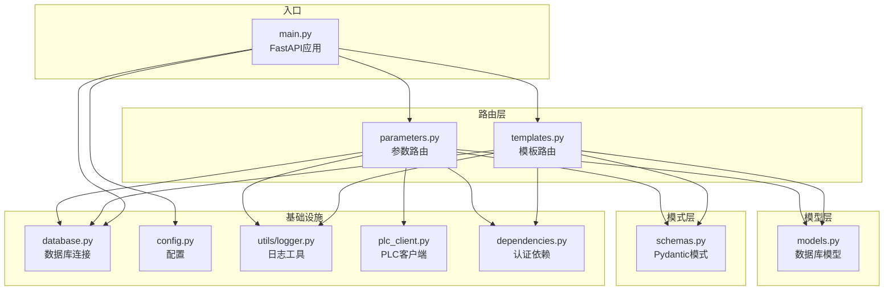
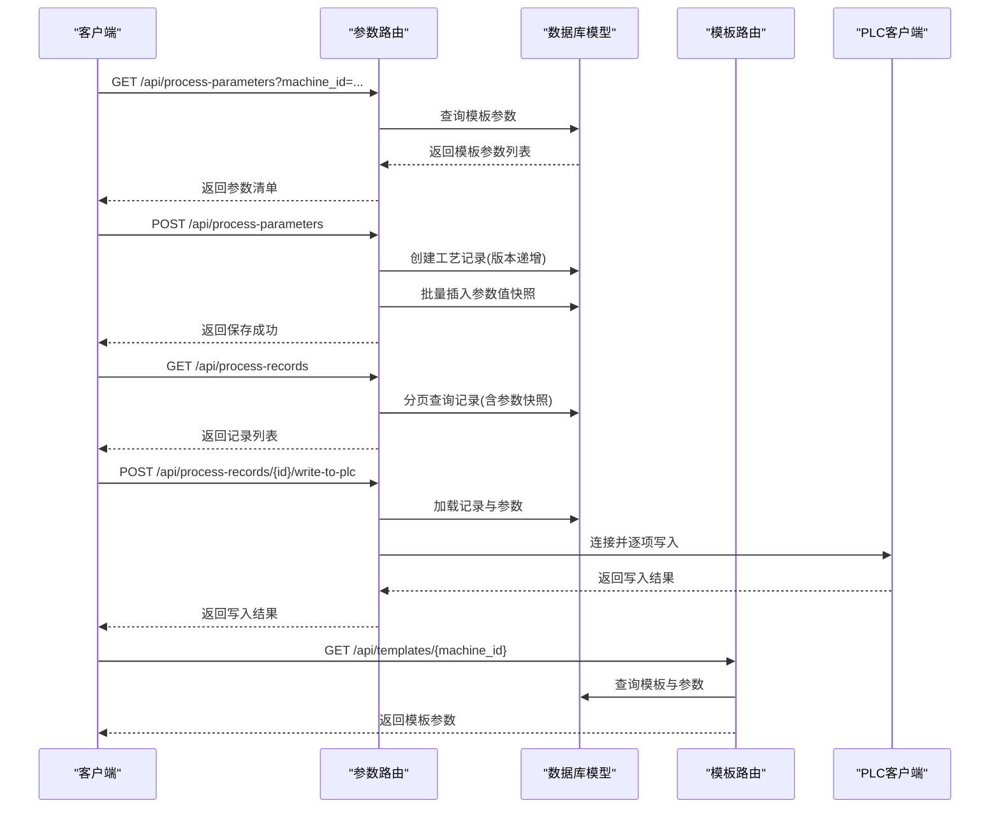
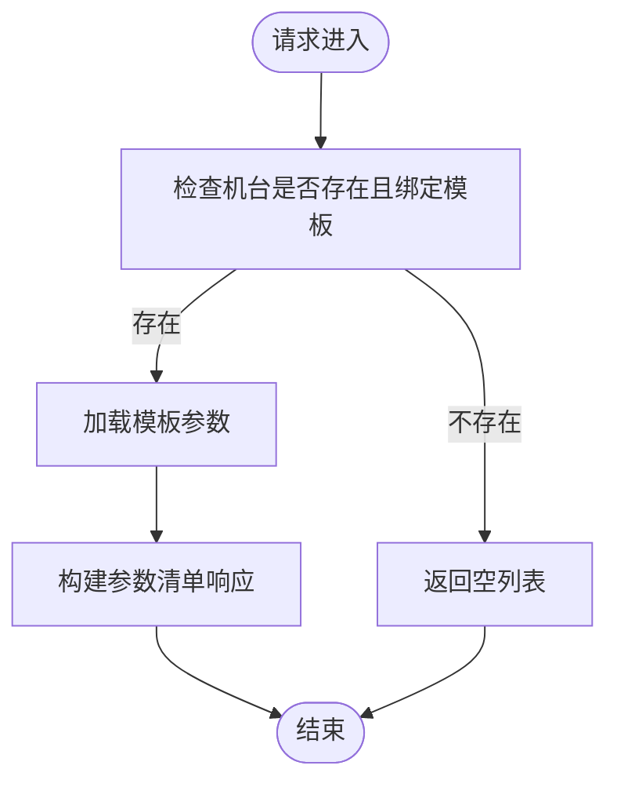
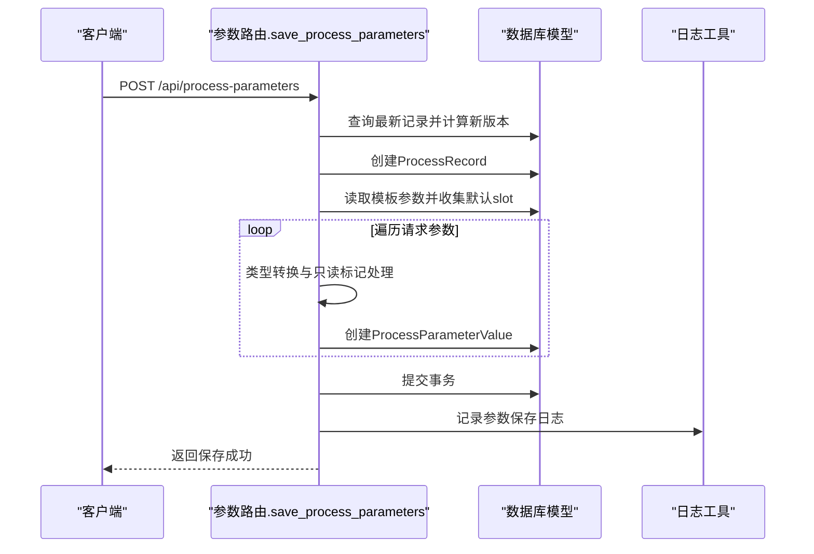
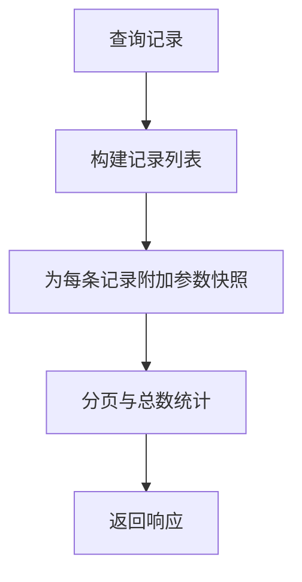
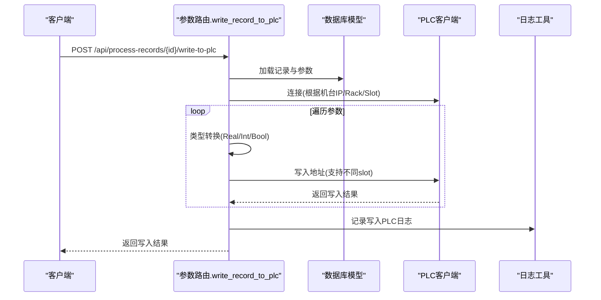
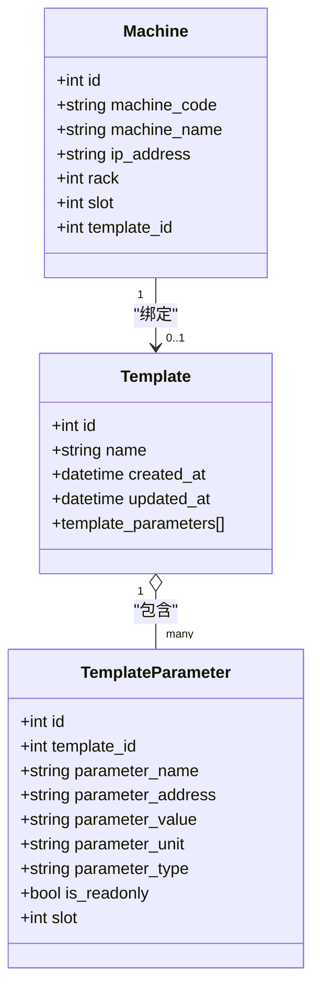
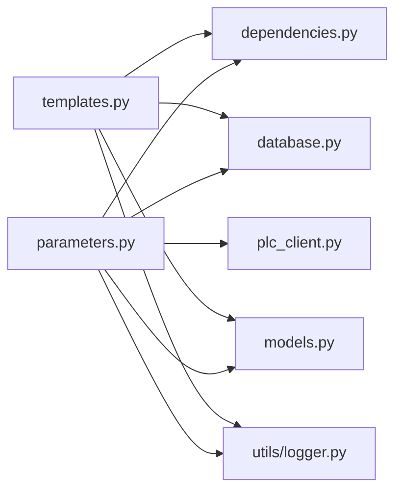
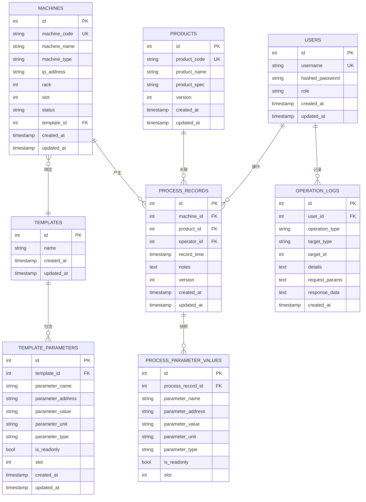

# 参数管理路由

<cite>
**本文档引用的文件**
- [backend/routers/parameters.py](file://backend/routers/parameters.py)
- [backend/models.py](file://backend/models.py)
- [backend/schemas.py](file://backend/schemas.py)
- [backend/database.py](file://backend/database.py)
- [backend/main.py](file://backend/main.py)
- [backend/plc_client.py](file://backend/plc_client.py)
- [backend/utils/logger.py](file://backend/utils/logger.py)
- [backend/dependencies.py](file://backend/dependencies.py)
- [backend/routers/templates.py](file://backend/routers/templates.py)
- [backend/config.py](file://backend/config.py)
- [backend/database_schema.sql](file://backend/database_schema.sql)
</cite>

## 目录
1. [简介](#简介)
2. [项目结构](#项目结构)
3. [核心组件](#核心组件)
4. [架构总览](#架构总览)
5. [详细组件分析](#详细组件分析)
6. [依赖关系分析](#依赖关系分析)
7. [性能考虑](#性能考虑)
8. [故障排除指南](#故障排除指南)
9. [结论](#结论)
10. [附录](#附录)

## 简介
本文件系统性地文档化了“参数管理路由”的实现，涵盖：
- 工艺参数的读取、写入与管理
- 单个参数操作与批量参数处理
- 参数值的数据类型转换、范围验证与单位换算机制
- 参数快照功能在生产记录中的应用与历史版本管理
- 参数模板的应用机制与参数继承关系
- 参数校验规则、异常处理与性能优化策略

该系统基于 FastAPI + SQLAlchemy + MySQL + S7-1200/1500 PLC 的技术栈，提供从参数模板到实际写入 PLC 的完整闭环。

## 项目结构
后端采用分层设计：路由层负责接口定义与业务编排；模型层定义数据库实体与关系；模式层定义请求/响应数据结构；工具层提供日志与PLC通信能力；依赖层提供认证与会话管理。

图表来源
- [backend/main.py:12-31](file://backend/main.py#L12-L31)
- [backend/routers/parameters.py:12-12](file://backend/routers/parameters.py#L12-L12)
- [backend/routers/templates.py:10-10](file://backend/routers/templates.py#L10-L10)

章节来源
- [backend/main.py:12-31](file://backend/main.py#L12-L31)
- [backend/database.py:6-17](file://backend/database.py#L6-L17)

## 核心组件
- 参数路由模块：提供参数查询、批量保存、记录查询、记录创建与写入PLC等接口。
- 模板路由模块：提供模板的增删改查与模板参数管理。
- 数据模型：定义用户、机台、产品、模板、模板参数、工艺记录、参数值、操作日志等实体及关系。
- Pydantic模式：定义请求/响应数据结构，包含参数保存请求、记录创建请求等。
- PLC客户端：封装与S7-1200/1500 PLC的连接、读写与地址解析。
- 日志工具：统一记录操作日志与PLC交互日志，并支持文件轮转与过期清理。
- 认证依赖：提供JWT令牌校验与用户上下文注入。

章节来源
- [backend/routers/parameters.py:14-278](file://backend/routers/parameters.py#L14-L278)
- [backend/routers/templates.py:12-300](file://backend/routers/templates.py#L12-L300)
- [backend/models.py:6-133](file://backend/models.py#L6-L133)
- [backend/schemas.py:86-190](file://backend/schemas.py#L86-L190)
- [backend/plc_client.py:6-188](file://backend/plc_client.py#L6-L188)
- [backend/utils/logger.py:65-199](file://backend/utils/logger.py#L65-L199)
- [backend/dependencies.py:38-50](file://backend/dependencies.py#L38-L50)

## 架构总览
参数管理路由围绕“模板-机台-产品-记录-参数值”链路工作，通过模板为机台提供参数基线，记录承载参数快照并可回写PLC。

图表来源
- [backend/routers/parameters.py:14-278](file://backend/routers/parameters.py#L14-L278)
- [backend/routers/templates.py:248-278](file://backend/routers/templates.py#L248-L278)
- [backend/plc_client.py:24-49](file://backend/plc_client.py#L24-L49)

## 详细组件分析

### 参数读取与模板继承
- 通过机台ID查询其绑定的模板参数，返回参数名称、地址、初始值、单位、类型、是否只读、插槽等信息。
- 若机台未绑定模板，则返回空数组；若模板为空或模板参数缺失，抛出相应错误。

图表来源
- [backend/routers/parameters.py:14-48](file://backend/routers/parameters.py#L14-L48)

章节来源
- [backend/routers/parameters.py:14-48](file://backend/routers/parameters.py#L14-L48)

### 批量参数保存与参数快照
- 接收参数保存请求，生成新的工艺记录并按版本号递增。
- 将请求中的每个参数转换为字符串存储，同时保留单位、类型、只读标记与插槽信息。
- 从机台模板中提取参数默认插槽，用于后续写入PLC时的槽位选择。
- 成功保存后记录操作日志。

图表来源
- [backend/routers/parameters.py:50-102](file://backend/routers/parameters.py#L50-L102)
- [backend/utils/logger.py:149-167](file://backend/utils/logger.py#L149-L167)

章节来源
- [backend/routers/parameters.py:50-102](file://backend/routers/parameters.py#L50-L102)
- [backend/utils/logger.py:149-167](file://backend/utils/logger.py#L149-L167)

### 参数快照与历史版本管理
- 记录查询接口返回每条记录的参数快照，包含参数名、地址、值、单位、类型等。
- 记录按时间倒序分页展示，并提供版本号字段，便于历史追溯与对比。
- 记录创建接口支持直接传入参数快照字典，按名称映射到参数值实体。

图表来源
- [backend/routers/parameters.py:104-149](file://backend/routers/parameters.py#L104-L149)
- [backend/routers/parameters.py:151-199](file://backend/routers/parameters.py#L151-L199)

章节来源
- [backend/routers/parameters.py:104-149](file://backend/routers/parameters.py#L104-L149)
- [backend/routers/parameters.py:151-199](file://backend/routers/parameters.py#L151-L199)

### 写入PLC与数据类型转换
- 通过记录ID触发写入PLC流程，先校验机台IP、记录存在性与参数集合。
- 建立PLC连接后，逐项将参数值转换为目标类型（Int/Real/Bool）并写入对应地址。
- 支持不同插槽的参数写入，优先使用参数自身的slot，否则回退到机台slot。
- 记录每次写入的结果与操作日志。

图表来源
- [backend/routers/parameters.py:201-246](file://backend/routers/parameters.py#L201-L246)
- [backend/plc_client.py:115-180](file://backend/plc_client.py#L115-L180)
- [backend/utils/logger.py:169-184](file://backend/utils/logger.py#L169-L184)

章节来源
- [backend/routers/parameters.py:201-246](file://backend/routers/parameters.py#L201-L246)
- [backend/plc_client.py:115-180](file://backend/plc_client.py#L115-L180)
- [backend/utils/logger.py:169-184](file://backend/utils/logger.py#L169-L184)

### 参数模板与继承机制
- 模板定义参数的基线值、地址、单位、类型与只读属性，机台可绑定模板以获得参数继承。
- 获取模板参数接口返回模板中所有参数的完整清单，供前端渲染与参数读取使用。
- 模板参数的slot默认为1，可在模板中覆盖；参数保存时优先使用模板slot，确保写入PLC时的槽位一致性。

图表来源
- [backend/models.py:81-104](file://backend/models.py#L81-L104)
- [backend/models.py:19-35](file://backend/models.py#L19-L35)

章节来源
- [backend/routers/templates.py:248-278](file://backend/routers/templates.py#L248-L278)
- [backend/routers/parameters.py:75-96](file://backend/routers/parameters.py#L75-L96)

### 数据类型转换、范围验证与单位换算
- 类型转换：在写入PLC前，根据参数类型进行转换（Real→float，Int→int，Bool→bool），确保PLC读写正确。
- 范围验证：当前实现未显式进行范围校验，建议在业务层增加参数值范围检查与阈值告警。
- 单位换算：当前未实现自动单位换算逻辑，建议在参数保存前增加单位换算与精度控制。

章节来源
- [backend/routers/parameters.py:227-235](file://backend/routers/parameters.py#L227-L235)
- [backend/plc_client.py:167-172](file://backend/plc_client.py#L167-L172)

### 参数校验规则与异常处理
- 认证：所有受保护接口均调用令牌校验函数，缺失或无效令牌将返回未授权错误。
- 资源存在性：查询记录、模板、机台时均进行存在性检查，不存在则返回相应错误。
- PLC连接：写入PLC前检查机台IP与连接状态，失败则返回服务器内部错误。
- 参数完整性：写入PLC前检查参数集合，空集合返回错误提示。

章节来源
- [backend/dependencies.py:38-50](file://backend/dependencies.py#L38-L50)
- [backend/routers/parameters.py:206-215](file://backend/routers/parameters.py#L206-L215)

## 依赖关系分析
- 路由依赖数据库会话与认证依赖，通过依赖注入获取。
- 参数路由依赖模板参数作为默认slot来源，实现参数继承。
- 写入PLC依赖PLC客户端，后者依赖配置与snap7库。
- 日志工具依赖数据库会话与文件系统，实现操作日志持久化与文件轮转。

图表来源
- [backend/routers/parameters.py:1-12](file://backend/routers/parameters.py#L1-L12)
- [backend/routers/templates.py:1-8](file://backend/routers/templates.py#L1-L8)

章节来源
- [backend/routers/parameters.py:1-12](file://backend/routers/parameters.py#L1-L12)
- [backend/routers/templates.py:1-8](file://backend/routers/templates.py#L1-L8)

## 性能考虑
- 数据库连接池：使用预热连接池，减少连接开销。
- 批量写入：参数保存采用flush后批量提交，降低事务成本。
- 分页查询：记录查询支持分页与索引，避免全表扫描。
- PLC写入：逐项写入，建议在上层聚合后再批量写入以减少PLC往返次数。
- 日志轮转：定期清理过期日志文件，避免磁盘占用过大。

章节来源
- [backend/database.py:8-17](file://backend/database.py#L8-L17)
- [backend/routers/parameters.py:72-99](file://backend/routers/parameters.py#L72-L99)
- [backend/utils/logger.py:17-30](file://backend/utils/logger.py#L17-L30)

## 故障排除指南
- 未授权访问：检查请求头中是否包含有效的Bearer令牌。
- 机台未配置IP：确认机台记录已填写IP地址、rack与slot。
- PLC连接失败：检查网络连通性、PLC端口与DB号配置。
- 参数写入失败：检查参数类型与地址格式，确认PLC侧地址有效。
- 模板未绑定：确认机台已绑定模板，模板中存在目标参数。

章节来源
- [backend/dependencies.py:38-50](file://backend/dependencies.py#L38-L50)
- [backend/routers/parameters.py:211-212](file://backend/routers/parameters.py#L211-L212)
- [backend/plc_client.py:24-49](file://backend/plc_client.py#L24-L49)

## 结论
参数管理路由实现了从模板到记录再到PLC写入的完整参数生命周期管理。通过参数快照与版本号，系统具备良好的历史追溯能力；通过模板继承，实现了参数的标准化与复用。建议后续增强范围验证、单位换算与批量写入优化，以进一步提升系统的健壮性与性能。

## 附录

### 数据模型关系图

图表来源
- [backend/models.py:6-133](file://backend/models.py#L6-L133)
- [backend/database_schema.sql:7-162](file://backend/database_schema.sql#L7-L162)