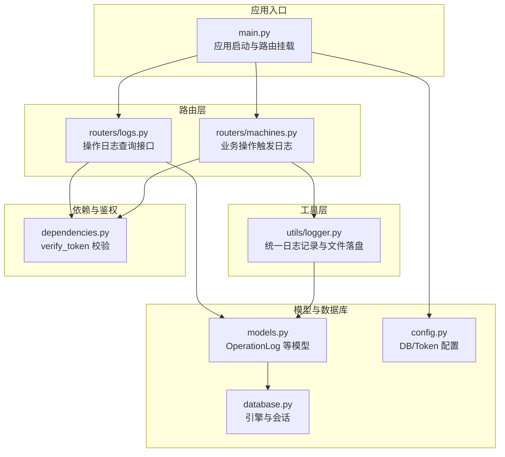
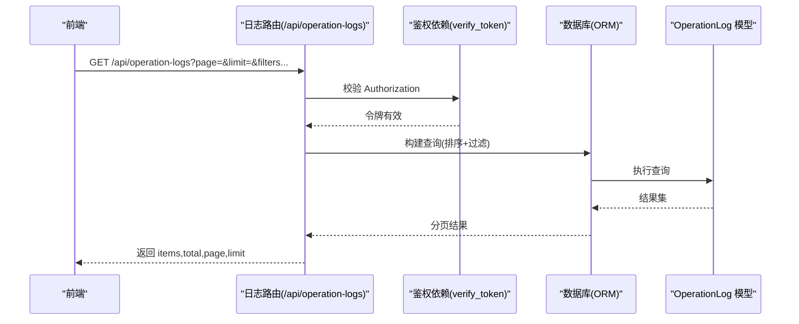
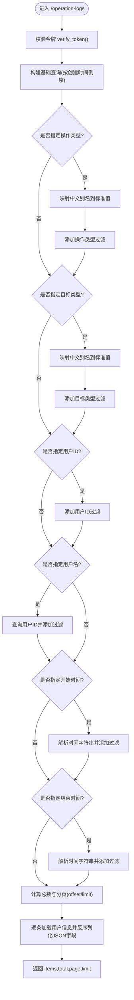
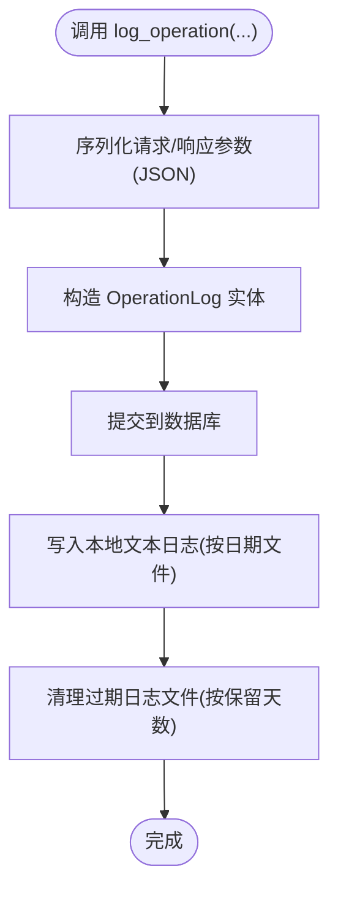
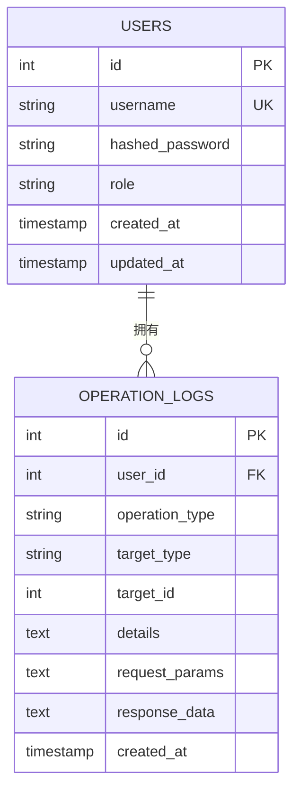
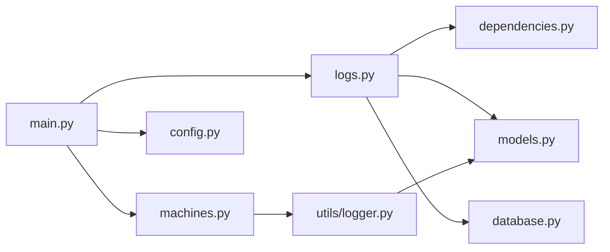

# 日志管理路由

<cite>
**本文引用的文件**
- [backend/routers/logs.py](file://backend/routers/logs.py)
- [backend/utils/logger.py](file://backend/utils/logger.py)
- [backend/models.py](file://backend/models.py)
- [backend/database.py](file://backend/database.py)
- [backend/dependencies.py](file://backend/dependencies.py)
- [backend/main.py](file://backend/main.py)
- [backend/config.py](file://backend/config.py)
- [backend/routers/machines.py](file://backend/routers/machines.py)
</cite>

## 目录
1. [简介](#简介)
2. [项目结构](#项目结构)
3. [核心组件](#核心组件)
4. [架构总览](#架构总览)
5. [详细组件分析](#详细组件分析)
6. [依赖关系分析](#依赖关系分析)
7. [性能考量](#性能考量)
8. [故障排查指南](#故障排查指南)
9. [结论](#结论)
10. [附录](#附录)

## 简介
本文件面向“日志管理路由”的综合文档，聚焦于操作日志、系统日志与审计日志的收集与管理实现。内容涵盖：
- 日志记录触发机制：用户操作、系统事件、错误情况
- 日志查询与过滤：按时间范围、用户、操作类型、目标类型等
- 存储结构、索引优化与查询性能
- 日志导出、统计分析与告警配置的实现思路
- 日志安全与隐私保护措施

## 项目结构
后端采用 FastAPI + SQLAlchemy 架构，日志相关能力由专用模块与路由共同实现：
- 路由层：提供日志查询接口（操作日志）
- 工具层：封装统一的日志记录方法与文件落盘逻辑
- 模型层：定义操作日志实体及数据库索引
- 依赖层：鉴权与令牌校验
- 配置层：数据库连接与密钥配置

图表来源
- [backend/main.py:26-31](file://backend/main.py#L26-L31)
- [backend/routers/logs.py:11-11](file://backend/routers/logs.py#L11-L11)
- [backend/routers/machines.py:10-10](file://backend/routers/machines.py#L10-L10)
- [backend/utils/logger.py:65-87](file://backend/utils/logger.py#L65-L87)
- [backend/models.py:106-119](file://backend/models.py#L106-L119)
- [backend/database.py:6-17](file://backend/database.py#L6-L17)
- [backend/dependencies.py:38-50](file://backend/dependencies.py#L38-L50)
- [backend/config.py:22-34](file://backend/config.py#L22-L34)

章节来源
- [backend/main.py:26-31](file://backend/main.py#L26-L31)
- [backend/routers/logs.py:11-11](file://backend/routers/logs.py#L11-L11)
- [backend/routers/machines.py:10-10](file://backend/routers/machines.py#L10-L10)
- [backend/utils/logger.py:65-87](file://backend/utils/logger.py#L65-L87)
- [backend/models.py:106-119](file://backend/models.py#L106-L119)
- [backend/database.py:6-17](file://backend/database.py#L6-L17)
- [backend/dependencies.py:38-50](file://backend/dependencies.py#L38-L50)
- [backend/config.py:22-34](file://backend/config.py#L22-L34)

## 核心组件
- 日志路由（操作日志）：提供分页查询、多维过滤、类型枚举等接口
- 统一日志工具：封装数据库落库与本地文件落盘，并进行过期清理
- 操作日志模型：定义字段、外键关系与索引策略
- 鉴权依赖：统一校验请求令牌，保障日志接口访问安全
- 数据库与配置：提供连接池、字符集与密钥配置

章节来源
- [backend/routers/logs.py:34-98](file://backend/routers/logs.py#L34-L98)
- [backend/utils/logger.py:65-87](file://backend/utils/logger.py#L65-L87)
- [backend/models.py:106-119](file://backend/models.py#L106-L119)
- [backend/dependencies.py:38-50](file://backend/dependencies.py#L38-L50)
- [backend/database.py:6-17](file://backend/database.py#L6-L17)
- [backend/config.py:22-34](file://backend/config.py#L22-L34)

## 架构总览
日志管理涉及“触发—记录—查询—展示”闭环：
- 触发：业务路由在关键操作后调用统一日志工具
- 记录：工具将结构化日志写入数据库，同时生成本地文本日志并定期清理
- 查询：日志路由提供多条件分页查询与类型枚举
- 展示：前端通过接口拉取并渲染

图表来源
- [backend/routers/logs.py:34-98](file://backend/routers/logs.py#L34-L98)
- [backend/dependencies.py:38-50](file://backend/dependencies.py#L38-L50)
- [backend/models.py:106-119](file://backend/models.py#L106-L119)

## 详细组件分析

### 日志路由（操作日志）
- 接口职责
  - 列表查询：支持分页、按操作类型、目标类型、用户ID/用户名、起止时间过滤
  - 单条查询：按日志ID获取详情
  - 类型枚举：列出可用的操作类型与目标类型
- 关键特性
  - 使用映射表将中文别名转换为标准值，提升兼容性
  - 对用户名进行关联查询，避免直接依赖外部输入
  - 时间解析异常时优雅忽略，保证接口稳定性
  - 返回字段包含请求参数与响应数据的JSON反序列化结果

图表来源
- [backend/routers/logs.py:34-98](file://backend/routers/logs.py#L34-L98)

章节来源
- [backend/routers/logs.py:34-98](file://backend/routers/logs.py#L34-L98)
- [backend/routers/logs.py:100-123](file://backend/routers/logs.py#L100-L123)
- [backend/routers/logs.py:125-137](file://backend/routers/logs.py#L125-L137)

### 统一日志工具
- 功能概述
  - 将结构化日志写入数据库（OperationLog）
  - 同步生成本地文本日志文件（按日期命名），便于离线审计
  - 定期清理超过保留期限的日志文件
- 关键流程
  - 结构化参数序列化为JSON存入数据库
  - 文本日志包含时间戳、操作类型、目标类型、用户ID、请求参数、详情、返回结果等
  - 过期清理基于保留天数阈值，自动删除早于阈值的文件

图表来源
- [backend/utils/logger.py:65-87](file://backend/utils/logger.py#L65-L87)
- [backend/utils/logger.py:32-63](file://backend/utils/logger.py#L32-L63)
- [backend/utils/logger.py:17-30](file://backend/utils/logger.py#L17-L30)

章节来源
- [backend/utils/logger.py:65-87](file://backend/utils/logger.py#L65-L87)
- [backend/utils/logger.py:32-63](file://backend/utils/logger.py#L32-L63)
- [backend/utils/logger.py:17-30](file://backend/utils/logger.py#L17-L30)

### 操作日志模型与索引
- 字段设计
  - user_id 外键关联用户表，支持按用户维度查询
  - operation_type/target_type 作为独立字段，配合过滤器使用
  - request_params/response_data 以文本存储JSON，便于审计回溯
  - created_at 带索引，支持按时间排序与范围过滤
- 关系与索引
  - 与 User 的一对多关系，用于显示用户名
  - 多字段建立索引，提升查询性能

图表来源
- [backend/models.py:6-17](file://backend/models.py#L6-L17)
- [backend/models.py:106-119](file://backend/models.py#L106-L119)

章节来源
- [backend/models.py:6-17](file://backend/models.py#L6-L17)
- [backend/models.py:106-119](file://backend/models.py#L106-L119)

### 鉴权与安全
- 令牌校验
  - 所有日志接口均调用 verify_token 校验 Authorization 头
  - 解析 JWT 成功后方可继续处理请求
- 密钥与算法
  - 使用配置中的 SECRET_KEY 与 ALGORITHM 进行签名验证
- 建议
  - 生产环境务必更换默认密钥
  - 控制日志接口访问范围，结合角色控制可进一步细化

章节来源
- [backend/dependencies.py:38-50](file://backend/dependencies.py#L38-L50)
- [backend/config.py:13-14](file://backend/config.py#L13-L14)

### 触发机制与业务集成
- 业务路由在关键操作后调用统一日志工具
  - 机台管理：创建/更新/删除
  - PLC 读写：读取/写入
  - 模板绑定/解绑
  - 参数保存与记录写入PLC
  - 用户管理：创建/删除/密码变更
- 典型调用路径
  - 机台读取参数成功后，记录“读取PLC”日志
  - 机台写入参数成功后，记录“写入PLC”日志
  - 机台创建/更新/删除后，记录对应操作日志

章节来源
- [backend/routers/machines.py:32-47](file://backend/routers/machines.py#L32-L47)
- [backend/routers/machines.py:49-65](file://backend/routers/machines.py#L49-L65)
- [backend/routers/machines.py:67-81](file://backend/routers/machines.py#L67-L81)
- [backend/routers/machines.py:107-183](file://backend/routers/machines.py#L107-L183)
- [backend/routers/machines.py:185-200](file://backend/routers/machines.py#L185-L200)
- [backend/utils/logger.py:89-121](file://backend/utils/logger.py#L89-L121)
- [backend/utils/logger.py:122-147](file://backend/utils/logger.py#L122-L147)
- [backend/utils/logger.py:149-184](file://backend/utils/logger.py#L149-L184)
- [backend/utils/logger.py:186-199](file://backend/utils/logger.py#L186-L199)

## 依赖关系分析
- 路由依赖
  - 日志路由依赖数据库会话与鉴权依赖
  - 业务路由依赖日志工具，形成“业务—日志”的弱耦合
- 模块间关系
  - 日志路由与模型层通过 SQLAlchemy ORM 交互
  - 日志工具与模型层通过 ORM 写入数据库
  - 日志工具与文件系统交互，负责本地文本日志落盘

图表来源
- [backend/routers/logs.py:7-9](file://backend/routers/logs.py#L7-L9)
- [backend/dependencies.py:38-50](file://backend/dependencies.py#L38-L50)
- [backend/models.py:106-119](file://backend/models.py#L106-L119)
- [backend/database.py:6-17](file://backend/database.py#L6-L17)
- [backend/routers/machines.py:10-10](file://backend/routers/machines.py#L10-L10)
- [backend/utils/logger.py:65-87](file://backend/utils/logger.py#L65-L87)
- [backend/main.py:26-31](file://backend/main.py#L26-L31)
- [backend/config.py:22-34](file://backend/config.py#L22-L34)

章节来源
- [backend/routers/logs.py:7-9](file://backend/routers/logs.py#L7-L9)
- [backend/dependencies.py:38-50](file://backend/dependencies.py#L38-L50)
- [backend/models.py:106-119](file://backend/models.py#L106-L119)
- [backend/database.py:6-17](file://backend/database.py#L6-L17)
- [backend/routers/machines.py:10-10](file://backend/routers/machines.py#L10-L10)
- [backend/utils/logger.py:65-87](file://backend/utils/logger.py#L65-L87)
- [backend/main.py:26-31](file://backend/main.py#L26-L31)
- [backend/config.py:22-34](file://backend/config.py#L22-L34)

## 性能考量
- 查询性能
  - created_at 建有索引，支持高效的时间范围过滤与倒序排序
  - operation_type/target_type 建有索引，适合多维过滤场景
  - 分页 offset/limit 限制结果集大小，避免一次性加载过多数据
- 写入性能
  - 数据库存储采用单条提交，事务简单可靠
  - 本地文本日志按天落盘，I/O 开销可控；定期清理降低磁盘占用
- 可扩展建议
  - 对高频过滤字段（如 user_id）可考虑复合索引
  - 大量历史数据建议分表或分区，结合归档策略
  - 异步写入队列可进一步降低主流程阻塞风险

章节来源
- [backend/models.py:106-119](file://backend/models.py#L106-L119)
- [backend/utils/logger.py:17-30](file://backend/utils/logger.py#L17-L30)

## 故障排查指南
- 常见问题
  - 令牌无效/未授权：确认 Authorization 头格式与密钥配置
  - 日志查询无结果：检查过滤条件是否匹配索引字段
  - 本地日志文件未生成：确认日志目录权限与路径配置
  - 过期日志未清理：检查保留天数设置与定时任务执行情况
- 排查步骤
  - 校验鉴权：确保请求头携带有效的 Bearer 令牌
  - 校验数据库：确认 OperationLog 表存在且索引生效
  - 校验文件系统：确认日志目录存在且具备写权限
  - 校验时间格式：确保传入的时间字符串符合解析格式

章节来源
- [backend/dependencies.py:38-50](file://backend/dependencies.py#L38-L50)
- [backend/utils/logger.py:17-30](file://backend/utils/logger.py#L17-L30)

## 结论
该日志管理路由以“统一工具 + 路由接口 + 模型索引”的方式实现了操作日志的采集、存储与查询。通过映射表与多维过滤，满足了审计与运营分析需求；通过本地文本日志与定期清理，兼顾了离线审计与存储成本控制。建议在生产环境中强化密钥管理、引入异步写入与归档策略，并持续评估索引与查询模式以应对增长的数据规模。

## 附录

### 日志查询与过滤接口定义
- 获取操作日志列表
  - 方法：GET
  - 路径：/api/operation-logs
  - 查询参数：
    - page：页码，默认 1
    - limit：每页条数，默认 10
    - operation_type：操作类型（支持中文别名）
    - target_type：目标类型（支持中文别名）
    - user_id：用户ID
    - username：用户名（将解析为用户ID）
    - start_time：开始时间（格式：YYYY-MM-DD HH:MM:SS）
    - end_time：结束时间（格式：YYYY-MM-DD HH:MM:SS）
  - 返回：items（日志项）、total（总数）、page、limit

- 获取单条操作日志
  - 方法：GET
  - 路径：/api/operation-logs/{log_id}
  - 返回：日志详情（含用户名、请求参数、响应数据）

- 获取操作类型枚举
  - 方法：GET
  - 路径：/api/operation-log-types
  - 返回：types（去重后的操作类型列表）

- 获取目标类型枚举
  - 方法：GET
  - 路径：/api/operation-target-types
  - 返回：target_types（去重后的目标类型列表）

章节来源
- [backend/routers/logs.py:34-98](file://backend/routers/logs.py#L34-L98)
- [backend/routers/logs.py:100-123](file://backend/routers/logs.py#L100-L123)
- [backend/routers/logs.py:125-137](file://backend/routers/logs.py#L125-L137)

### 日志记录触发点示例
- 机台管理：创建/更新/删除
- PLC 读写：读取/写入
- 模板绑定/解绑
- 参数保存与记录写入PLC
- 用户管理：创建/删除/密码变更

章节来源
- [backend/routers/machines.py:32-47](file://backend/routers/machines.py#L32-L47)
- [backend/routers/machines.py:49-65](file://backend/routers/machines.py#L49-L65)
- [backend/routers/machines.py:67-81](file://backend/routers/machines.py#L67-L81)
- [backend/routers/machines.py:107-183](file://backend/routers/machines.py#L107-L183)
- [backend/routers/machines.py:185-200](file://backend/routers/machines.py#L185-L200)
- [backend/utils/logger.py:89-121](file://backend/utils/logger.py#L89-L121)
- [backend/utils/logger.py:122-147](file://backend/utils/logger.py#L122-L147)
- [backend/utils/logger.py:149-184](file://backend/utils/logger.py#L149-L184)
- [backend/utils/logger.py:186-199](file://backend/utils/logger.py#L186-L199)

### 日志导出、统计分析与告警配置（实现思路）
- 日志导出
  - 在现有查询接口基础上增加导出参数（如导出全部、按筛选条件导出），服务端批量拉取并输出 CSV/JSON 文件
- 统计分析
  - 基于 operation_type/target_type/created_at 维度聚合统计，支持趋势图与报表
- 告警配置
  - 针对特定操作类型或异常响应状态设置阈值与规则，结合外部监控系统推送告警

说明：上述为通用实现建议，具体需根据业务需求扩展接口与后台任务。