# 机台管理路由

<cite>
**本文档引用的文件**
- [machines.py](file://backend/routers/machines.py)
- [plc_client.py](file://backend/plc_client.py)
- [models.py](file://backend/models.py)
- [schemas.py](file://backend/schemas.py)
- [main.py](file://backend/main.py)
- [config.py](file://backend/config.py)
- [database.py](file://backend/database.py)
- [dependencies.py](file://backend/dependencies.py)
- [logger.py](file://backend/utils/logger.py)
- [database_schema.sql](file://backend/database_schema.sql)
</cite>

## 目录
1. [简介](#简介)
2. [项目结构](#项目结构)
3. [核心组件](#核心组件)
4. [架构概览](#架构概览)
5. [详细组件分析](#详细组件分析)
6. [依赖关系分析](#依赖关系分析)
7. [性能考虑](#性能考虑)
8. [故障排除指南](#故障排除指南)
9. [结论](#结论)

## 简介

机台管理路由是挤出机工艺参数管理系统的核心模块，负责机台设备的全生命周期管理。该系统实现了完整的CRUD操作，包括机台的添加、编辑、删除和查询功能。同时，系统集成了PLC连接管理机制，支持实时数据读取和写入操作，为工业自动化提供了完整的解决方案。

系统采用FastAPI框架构建，使用SQLAlchemy进行数据库操作，通过Snap7库与西门子PLC设备通信。整个架构遵循RESTful API设计原则，提供了安全的认证授权机制和详细的日志记录功能。

## 项目结构

系统采用分层架构设计，主要包含以下核心目录和文件：

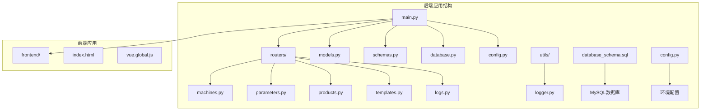

**图表来源**
- [main.py:1-77](file://backend/main.py#L1-L77)
- [machines.py:1-260](file://backend/routers/machines.py#L1-L260)

**章节来源**
- [main.py:1-77](file://backend/main.py#L1-L77)
- [database_schema.sql:1-162](file://backend/database_schema.sql#L1-L162)

## 核心组件

### 机台路由模块

机台路由模块位于`backend/routers/machines.py`，提供了完整的机台管理API接口。该模块包含以下核心功能：

- **CRUD操作**：机台的创建、读取、更新、删除
- **状态监控**：实时检查PLC连接状态
- **参数读取**：从PLC设备批量读取工艺参数
- **参数写入**：向PLC设备批量写入控制参数
- **模板绑定**：将工艺模板与机台进行关联

### PLC客户端类

PLC客户端类位于`backend/plc_client.py`，封装了与西门子PLC设备的所有通信逻辑：

- **连接管理**：建立、维护和断开PLC连接
- **数据读取**：支持多种数据类型的参数读取
- **数据写入**：支持多种数据类型的参数写入
- **地址解析**：解析和验证PLC地址格式
- **错误处理**：完善的异常处理和错误恢复机制

### 数据模型定义

系统使用SQLAlchemy ORM定义了完整的数据模型，包括：

- **机台模型**：存储机台基本信息和连接配置
- **模板模型**：定义可复用的工艺参数模板
- **参数模型**：管理模板参数和工艺记录参数
- **日志模型**：记录所有操作的详细信息

**章节来源**
- [machines.py:12-260](file://backend/routers/machines.py#L12-L260)
- [plc_client.py:6-188](file://backend/plc_client.py#L6-L188)
- [models.py:19-133](file://backend/models.py#L19-L133)

## 架构概览

系统采用分层架构设计，各层职责明确，耦合度低：

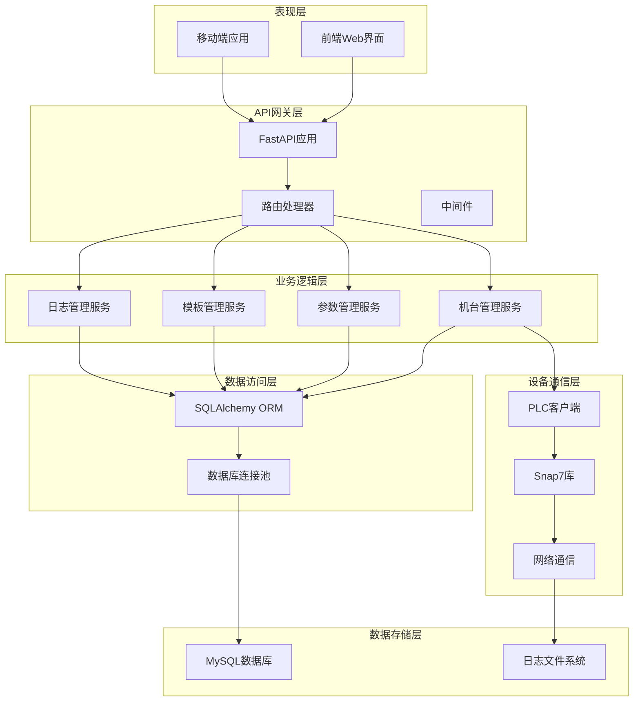

**图表来源**
- [main.py:12-31](file://backend/main.py#L12-L31)
- [machines.py:1-10](file://backend/routers/machines.py#L1-L10)

## 详细组件分析

### 机台CRUD操作实现

#### 机台创建功能

机台创建功能实现了完整的数据验证和持久化逻辑：

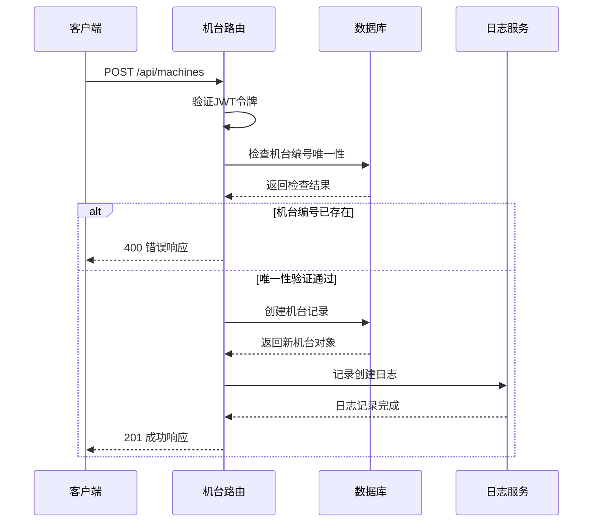

**图表来源**
- [machines.py:32-47](file://backend/routers/machines.py#L32-L47)
- [dependencies.py:38-50](file://backend/dependencies.py#L38-L50)

#### 机台查询功能

机台查询功能支持分页查询和模板信息关联：

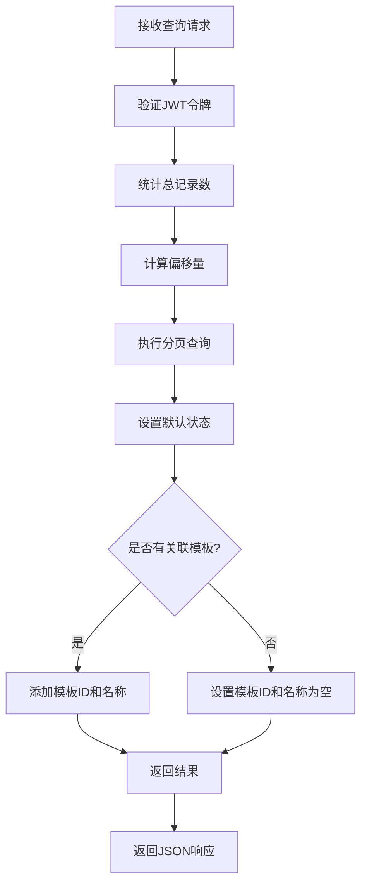

**图表来源**
- [machines.py:14-30](file://backend/routers/machines.py#L14-L30)

#### 机台更新功能

机台更新功能实现了选择性字段更新：

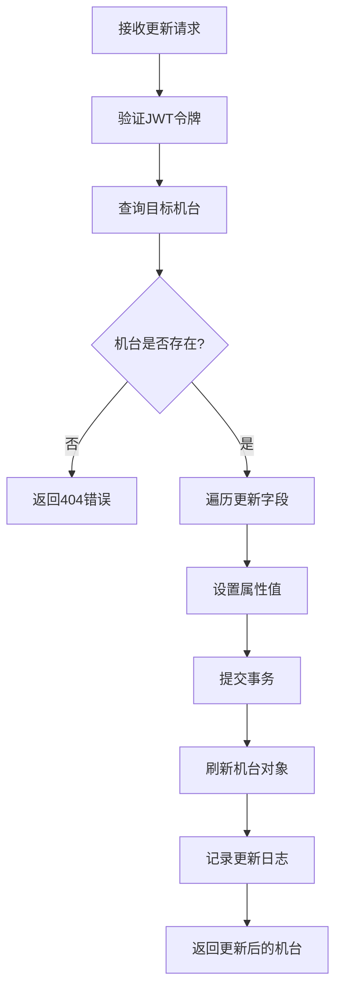

**图表来源**
- [machines.py:49-65](file://backend/routers/machines.py#L49-L65)

#### 机台删除功能

机台删除功能包含了级联删除和日志记录：

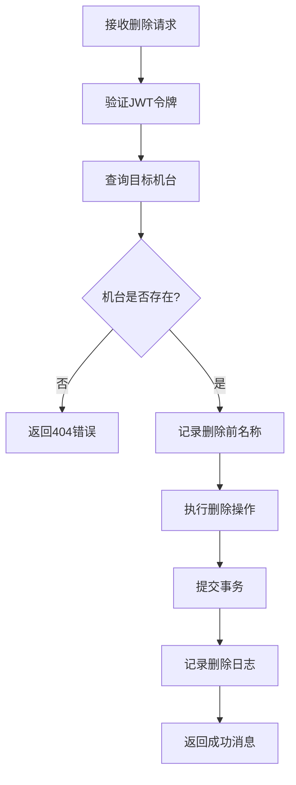

**图表来源**
- [machines.py:67-81](file://backend/routers/machines.py#L67-L81)

### PLC连接管理机制

#### 连接建立流程

PLC连接管理实现了自动化的连接建立和维护：

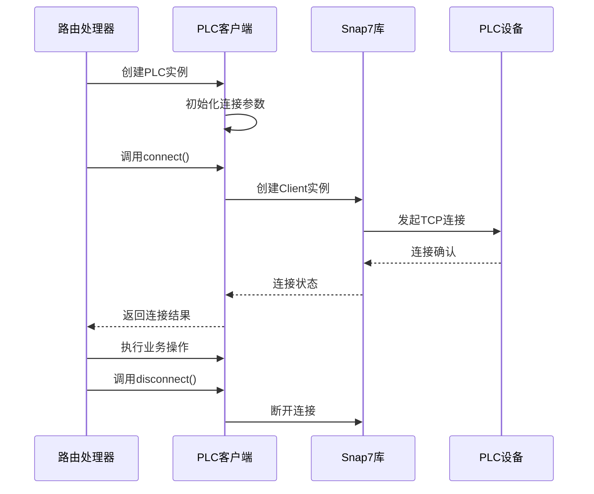

**图表来源**
- [plc_client.py:24-31](file://backend/plc_client.py#L24-L31)

#### 心跳检测机制

系统实现了基于连接状态的心跳检测：

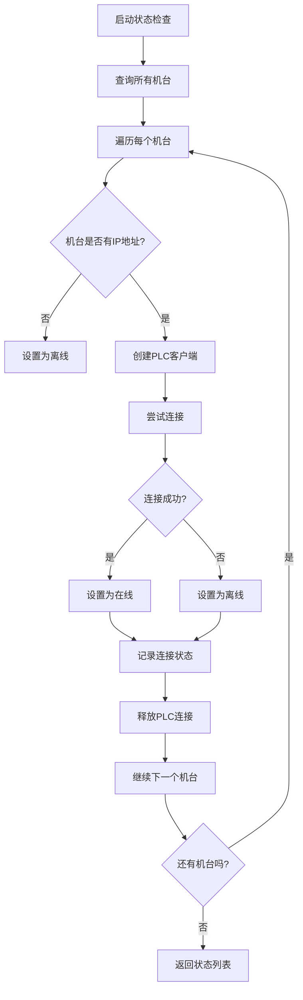

**图表来源**
- [machines.py:83-105](file://backend/routers/machines.py#L83-L105)

#### 断线重连处理

PLC客户端实现了智能的断线检测和重连机制：

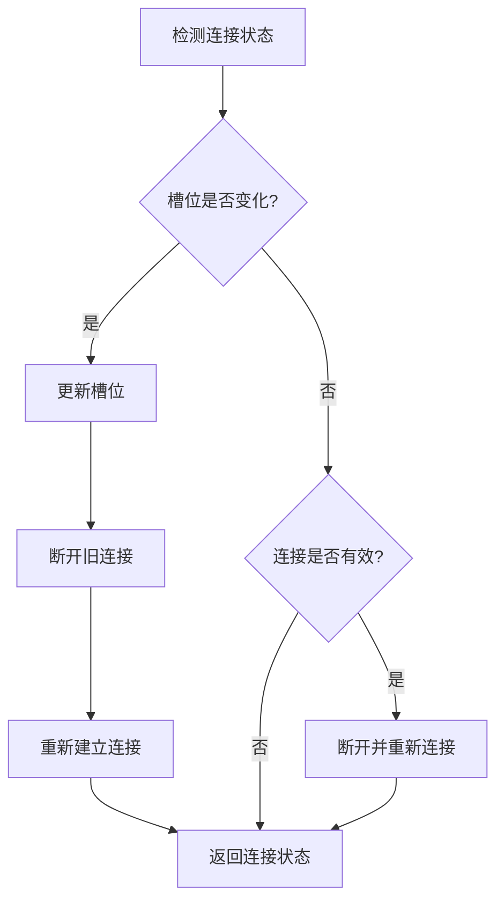

**图表来源**
- [plc_client.py:42-49](file://backend/plc_client.py#L42-L49)

### 参数读取和写入实现

#### 参数读取流程

参数读取功能支持批量操作和模板驱动：

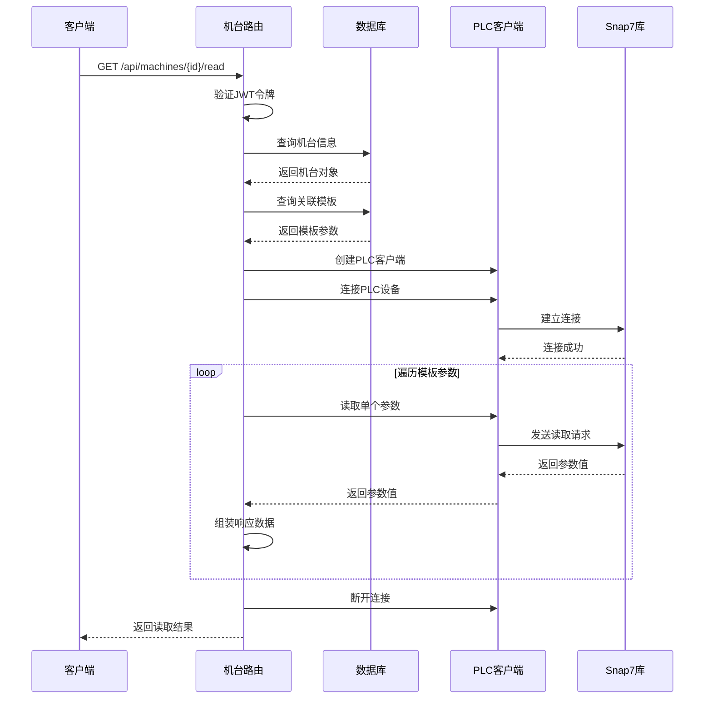

**图表来源**
- [machines.py:107-183](file://backend/routers/machines.py#L107-L183)

#### 参数写入流程

参数写入功能支持批量写入和类型转换：

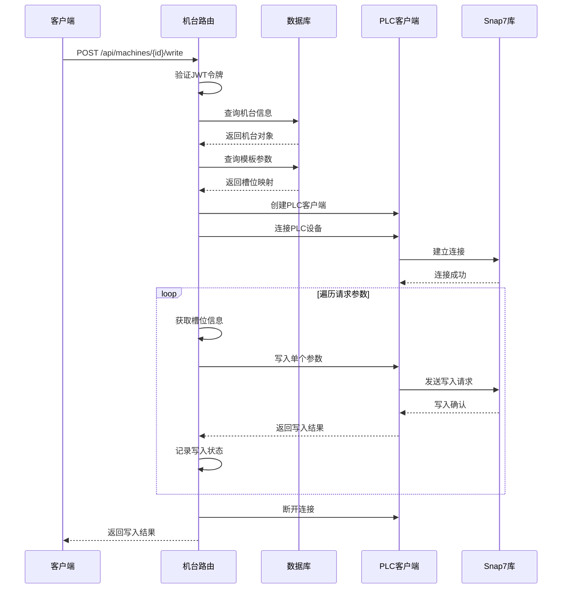

**图表来源**
- [machines.py:185-222](file://backend/routers/machines.py#L185-L222)

#### 数据类型转换机制

PLC参数读写支持多种数据类型：

| 数据类型 | 地址前缀 | 字节大小 | 用途 |
|---------|---------|---------|------|
| Int | VW | 2字节 | 整数值 |
| Real | VD | 4字节 | 浮点数值 |
| Bool | VB | 1字节 | 布尔值 |
| Bit | V.x | 1位 | 位操作 |
| Counter | C | 2字节 | 计数器 |
| Timer | T | 2字节 | 定时器 |

**章节来源**
- [plc_client.py:51-114](file://backend/plc_client.py#L51-L114)
- [plc_client.py:115-180](file://backend/plc_client.py#L115-L180)

### 机台状态监控和实时数据获取

#### 实时状态监控

系统提供了两种状态监控方式：

1. **批量状态检查**：一次性检查所有机台的连接状态
2. **单机台状态查询**：针对特定机台的状态检查

#### 实时数据获取

实时数据获取功能支持：

- **批量参数读取**：一次请求获取多个参数值
- **模板驱动读取**：根据机台绑定的模板自动获取参数
- **错误处理**：完善的异常捕获和错误报告机制

**章节来源**
- [machines.py:83-105](file://backend/routers/machines.py#L83-L105)
- [machines.py:107-183](file://backend/routers/machines.py#L107-L183)

### 机台配置管理和设备发现

#### 设备发现机制

系统通过以下方式实现设备发现：

1. **IP地址配置**：在机台配置中指定PLC IP地址
2. **连接状态检测**：通过连接尝试判断设备可用性
3. **参数模板绑定**：通过模板定义设备参数集合

#### 连接测试功能

连接测试功能提供了完整的连接验证：

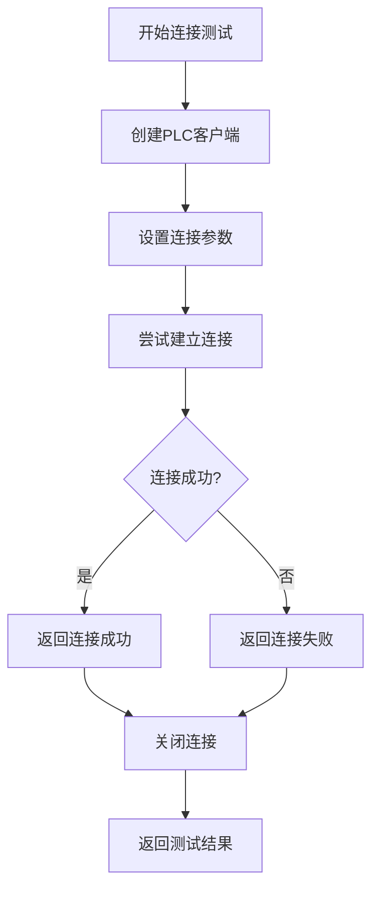

**图表来源**
- [machines.py:92-101](file://backend/routers/machines.py#L92-L101)

**章节来源**
- [machines.py:224-260](file://backend/routers/machines.py#L224-L260)

## 依赖关系分析

系统采用了清晰的依赖注入和模块化设计：

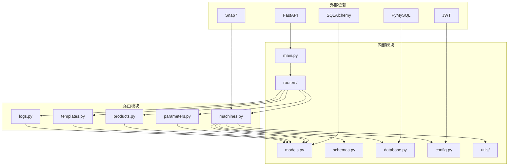

**图表来源**
- [main.py:10-31](file://backend/main.py#L10-L31)
- [machines.py:1-10](file://backend/routers/machines.py#L1-L10)

**章节来源**
- [main.py:1-77](file://backend/main.py#L1-L77)
- [dependencies.py:1-50](file://backend/dependencies.py#L1-L50)

## 性能考虑

### 数据库性能优化

系统采用了多项数据库性能优化策略：

- **连接池管理**：使用`pool_pre_ping=True`确保连接有效性
- **索引优化**：为常用查询字段建立索引
- **分页查询**：支持大数据量的分页浏览
- **延迟加载**：使用`joinedload`优化关联查询

### PLC通信优化

PLC通信层面的优化包括：

- **连接复用**：在同一请求中复用PLC连接
- **批量操作**：支持批量参数读写减少通信次数
- **错误缓存**：避免重复的连接尝试
- **超时控制**：合理的超时设置防止阻塞

### 缓存策略

系统实现了多层缓存策略：

- **内存缓存**：缓存常用的配置信息
- **数据库缓存**：使用连接池减少数据库连接开销
- **会话缓存**：缓存用户认证信息

## 故障排除指南

### 常见问题诊断

#### 机台连接失败

**症状**：PLC连接状态显示为"离线"

**可能原因**：
1. IP地址配置错误
2. 网络连接问题
3. PLC设备故障
4. 认证信息错误

**解决步骤**：
1. 验证机台IP地址配置
2. 检查网络连通性
3. 确认PLC设备电源状态
4. 验证Rack和Slot配置

#### 参数读取失败

**症状**：读取参数时返回空值或错误

**可能原因**：
1. 参数地址格式错误
2. 数据类型不匹配
3. PLC设备未就绪
4. 权限不足

**解决步骤**：
1. 验证参数地址格式
2. 检查数据类型设置
3. 确认PLC设备状态
4. 验证模板绑定情况

#### 模板绑定问题

**症状**：模板绑定后无法读取参数

**可能原因**：
1. 模板参数配置错误
2. 机台槽位设置不匹配
3. 参数地址冲突

**解决步骤**：
1. 检查模板参数配置
2. 验证机台槽位设置
3. 确认参数地址唯一性

### 日志分析

系统提供了详细的日志记录功能，便于问题诊断：

- **操作日志**：记录所有用户操作
- **PLC通信日志**：记录PLC读写操作
- **系统错误日志**：记录系统异常信息

**章节来源**
- [logger.py:89-120](file://backend/utils/logger.py#L89-L120)
- [logger.py:195-199](file://backend/utils/logger.py#L195-L199)

## 结论

机台管理路由模块为挤出机工艺参数管理系统提供了完整的核心功能。系统通过清晰的架构设计、完善的错误处理机制和丰富的监控功能，为企业级工业自动化应用提供了可靠的解决方案。

主要特点包括：

- **完整的CRUD操作**：支持机台的全生命周期管理
- **智能PLC集成**：提供稳定的设备通信能力
- **灵活的参数管理**：支持模板驱动的参数配置
- **完善的日志系统**：提供详细的操作审计功能
- **安全的认证机制**：确保系统的安全性

该系统为后续的功能扩展和性能优化奠定了良好的基础，能够满足现代工业自动化系统的需求。