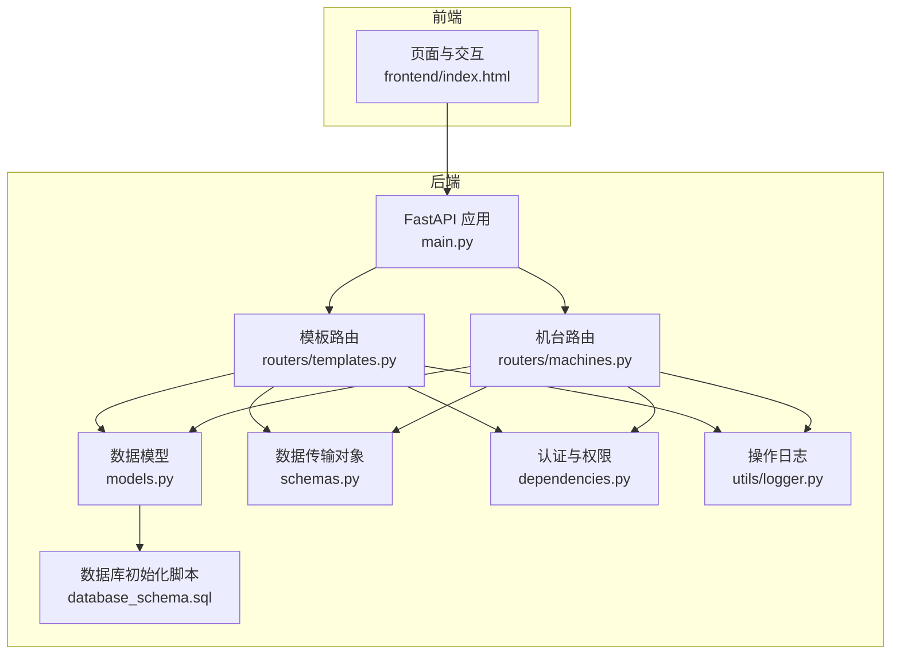
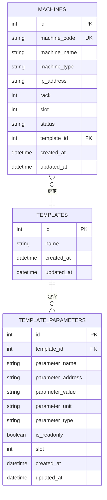
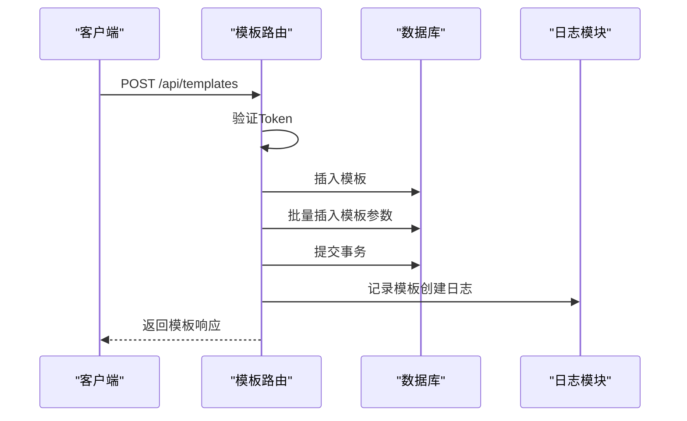
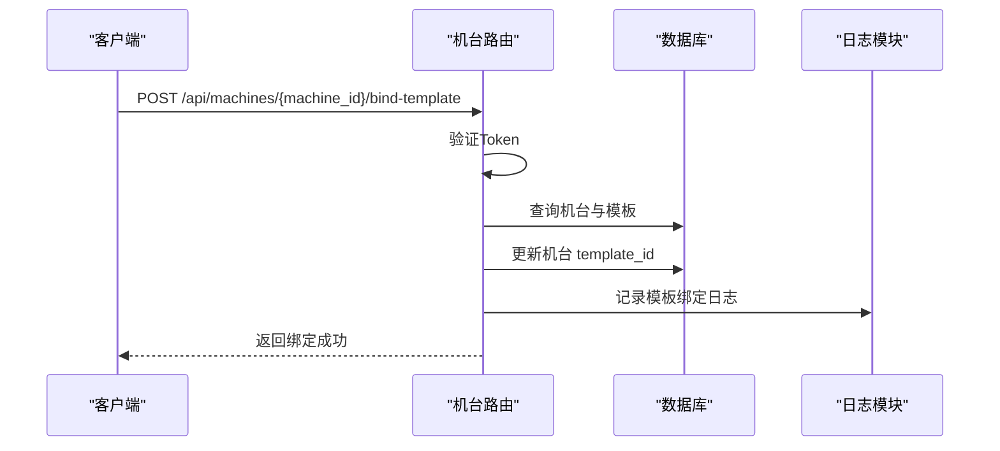
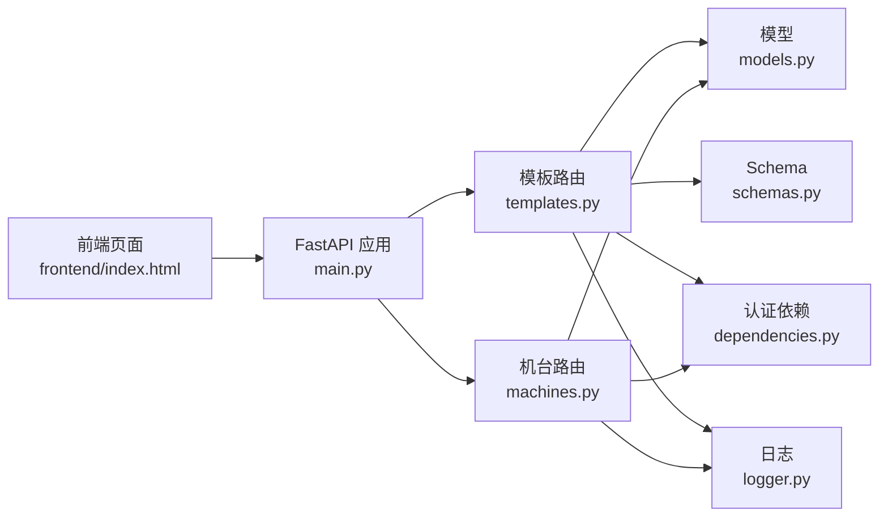

# 模板管理路由

<cite>
**本文引用的文件**
- [backend/routers/templates.py](file://backend/routers/templates.py)
- [backend/models.py](file://backend/models.py)
- [backend/schemas.py](file://backend/schemas.py)
- [backend/main.py](file://backend/main.py)
- [backend/dependencies.py](file://backend/dependencies.py)
- [backend/utils/logger.py](file://backend/utils/logger.py)
- [backend/routers/machines.py](file://backend/routers/machines.py)
- [backend/database_schema.sql](file://backend/database_schema.sql)
- [frontend/index.html](file://frontend/index.html)
</cite>

## 目录
1. [简介](#简介)
2. [项目结构](#项目结构)
3. [核心组件](#核心组件)
4. [架构总览](#架构总览)
5. [详细组件分析](#详细组件分析)
6. [依赖关系分析](#依赖关系分析)
7. [性能考量](#性能考量)
8. [故障排查指南](#故障排查指南)
9. [结论](#结论)
10. [附录](#附录)

## 简介
本文件系统性地文档化“模板管理路由”的设计与实现，覆盖模板的创建、编辑、删除、参数增删改查、模板与机台的绑定/解绑、模板参数的定义与管理（含默认值、类型、只读位、槽位等）、模板在不同机台间的复用策略，以及前端交互流程。同时，结合现有代码实现，给出模板导入导出、模板标准化与模板库管理的最佳实践建议，并提供模板创建向导、批量应用与模板验证的实现思路与示例路径。

## 项目结构
后端采用 FastAPI + SQLAlchemy 架构，模板路由位于 routers/templates.py，数据模型位于 models.py，数据传输对象位于 schemas.py，认证与权限校验位于 dependencies.py，操作日志位于 utils/logger.py，机台与模板绑定逻辑位于 routers/machines.py。数据库初始化脚本位于 database_schema.sql，前端页面位于 frontend/index.html。

图表来源
- [backend/main.py:12-31](file://backend/main.py#L12-L31)
- [backend/routers/templates.py:10](file://backend/routers/templates.py#L10)
- [backend/routers/machines.py:12](file://backend/routers/machines.py#L12)
- [backend/models.py:81-104](file://backend/models.py#L81-L104)
- [backend/schemas.py:116-145](file://backend/schemas.py#L116-L145)
- [backend/dependencies.py:38-50](file://backend/dependencies.py#L38-L50)
- [backend/utils/logger.py:140-147](file://backend/utils/logger.py#L140-L147)
- [backend/database_schema.sql:26-59](file://backend/database_schema.sql#L26-L59)

章节来源
- [backend/main.py:12-31](file://backend/main.py#L12-L31)
- [backend/routers/templates.py:10](file://backend/routers/templates.py#L10)
- [backend/routers/machines.py:12](file://backend/routers/machines.py#L12)
- [backend/models.py:81-104](file://backend/models.py#L81-L104)
- [backend/schemas.py:116-145](file://backend/schemas.py#L116-L145)
- [backend/dependencies.py:38-50](file://backend/dependencies.py#L38-L50)
- [backend/utils/logger.py:140-147](file://backend/utils/logger.py#L140-L147)
- [backend/database_schema.sql:26-59](file://backend/database_schema.sql#L26-L59)

## 核心组件
- 模板实体与参数实体：模板与模板参数通过外键关联，模板参数支持默认值、单位、类型、只读标志、槽位等字段。
- 模板路由：提供模板列表、创建、查询、更新、删除；以及模板参数的增删改查。
- 机台与模板绑定：机台表包含 template_id 外键，支持绑定/解绑模板。
- 认证与权限：基于 JWT 的 token 校验，模板操作均需有效 token。
- 日志记录：模板的创建、更新、删除均有操作日志落盘与数据库记录。

章节来源
- [backend/models.py:81-104](file://backend/models.py#L81-L104)
- [backend/routers/templates.py:12-32](file://backend/routers/templates.py#L12-L32)
- [backend/routers/templates.py:34-72](file://backend/routers/templates.py#L34-L72)
- [backend/routers/templates.py:74-91](file://backend/routers/templates.py#L74-L91)
- [backend/routers/templates.py:93-135](file://backend/routers/templates.py#L93-L135)
- [backend/routers/templates.py:137-151](file://backend/routers/templates.py#L137-L151)
- [backend/routers/machines.py:224-260](file://backend/routers/machines.py#L224-L260)
- [backend/dependencies.py:38-50](file://backend/dependencies.py#L38-L50)
- [backend/utils/logger.py:140-147](file://backend/utils/logger.py#L140-L147)

## 架构总览
模板管理路由围绕“模板”和“模板参数”两条主线展开，配合“机台”进行模板复用。模板与模板参数为一对多关系，机台与模板为多对一关系（可为空）。模板参数支持默认值、单位、类型、只读、槽位等属性，便于在不同产品/机台间复用。

图表来源
- [backend/models.py:81-104](file://backend/models.py#L81-L104)
- [backend/database_schema.sql:26-59](file://backend/database_schema.sql#L26-L59)

## 详细组件分析

### 模板实体与参数实体
- 模板实体包含名称与时间戳，模板参数实体包含参数名、地址、默认值、单位、类型、只读标志、槽位等字段，并与模板建立外键关联。
- 模板参数默认类型为整型，支持只读与槽位配置，便于在不同机台/产品间差异化使用。

章节来源
- [backend/models.py:81-104](file://backend/models.py#L81-L104)
- [backend/database_schema.sql:26-42](file://backend/database_schema.sql#L26-L42)

### 模板路由接口
- 列表分页查询：支持分页参数，返回模板基本信息与参数数量、绑定机台数量。
- 创建模板：接收模板名与参数数组，逐条创建模板参数。
- 查询模板：按 ID 返回模板详情与参数列表。
- 更新模板：支持重命名与替换全部参数（先删除旧参数再插入新参数）。
- 删除模板：删除模板及其参数。
- 参数管理：新增、更新、删除单个模板参数；列出模板下所有参数；按 ID 获取单个参数。

图表来源
- [backend/routers/templates.py:34-72](file://backend/routers/templates.py#L34-L72)
- [backend/utils/logger.py:140-141](file://backend/utils/logger.py#L140-L141)

章节来源
- [backend/routers/templates.py:12-32](file://backend/routers/templates.py#L12-L32)
- [backend/routers/templates.py:34-72](file://backend/routers/templates.py#L34-L72)
- [backend/routers/templates.py:74-91](file://backend/routers/templates.py#L74-L91)
- [backend/routers/templates.py:93-135](file://backend/routers/templates.py#L93-L135)
- [backend/routers/templates.py:137-151](file://backend/routers/templates.py#L137-L151)
- [backend/routers/templates.py:153-187](file://backend/routers/templates.py#L153-L187)
- [backend/routers/templates.py:189-227](file://backend/routers/templates.py#L189-L227)
- [backend/routers/templates.py:229-247](file://backend/routers/templates.py#L229-L247)
- [backend/routers/templates.py:249-300](file://backend/routers/templates.py#L249-L300)

### 模板与机台的绑定/解绑
- 绑定：机台表包含 template_id 外键，绑定时将机台的 template_id 设为模板 ID。
- 解绑：将机台的 template_id 置空。
- 读取参数：若机台已绑定模板，则从模板参数表读取参数集合，用于与 PLC 通信。

图表来源
- [backend/routers/machines.py:224-245](file://backend/routers/machines.py#L224-L245)
- [backend/utils/logger.py:195-196](file://backend/utils/logger.py#L195-L196)

章节来源
- [backend/routers/machines.py:224-260](file://backend/routers/machines.py#L224-L260)
- [backend/models.py:19-35](file://backend/models.py#L19-L35)
- [backend/database_schema.sql:44-59](file://backend/database_schema.sql#L44-L59)

### 模板参数的定义与管理
- 字段定义：参数名、地址、默认值、单位、类型、只读、槽位。
- 默认值设置：模板参数支持 parameter_value 字段存储默认值。
- 参数分类：通过 parameter_type 字段区分类型（如 Int），前端可据此渲染输入控件。
- 只读与槽位：is_readonly 控制是否允许写入，slot 控制槽位，便于多槽位设备场景。
- 版本控制：模板本身不直接带版本号，但可通过产品版本与记录版本进行间接管理（见产品与记录模型）。

章节来源
- [backend/models.py:91-104](file://backend/models.py#L91-L104)
- [backend/schemas.py:107-114](file://backend/schemas.py#L107-L114)
- [backend/schemas.py:116-145](file://backend/schemas.py#L116-L145)

### 模板在不同产品/机台间的复用策略
- 机台绑定模板：机台表的 template_id 外键实现模板在机台层面的复用。
- 产品维度：模板与产品无直接外键关系，但可通过“产品版本 + 记录版本”实现参数快照与回溯。
- 参数复用：模板参数默认值与类型在不同机台间保持一致，必要时可在机台或产品层做差异化覆盖（当前实现未提供该能力，建议通过记录参数值表进行差异化存储）。

章节来源
- [backend/models.py:19-35](file://backend/models.py#L19-L35)
- [backend/models.py:37-48](file://backend/models.py#L37-L48)

### 模板导入导出与标准化
- 当前后端未提供模板导入导出接口，建议扩展：
  - 导出：将模板与模板参数序列化为 JSON，包含参数名、地址、默认值、单位、类型、只读、槽位等字段。
  - 导入：解析 JSON，校验字段完整性与类型一致性，生成新的模板与参数记录。
- 标准化建议：
  - 统一参数命名规范与地址格式。
  - 引入参数分类与标签体系，便于检索与筛选。
  - 引入模板版本号与变更历史，便于审计与回滚。
- 模板库管理最佳实践：
  - 建立模板分类目录与标签体系。
  - 对关键模板进行审批与发布流程。
  - 定期清理未使用模板，保留活跃模板清单。

章节来源
- [backend/routers/templates.py:34-72](file://backend/routers/templates.py#L34-L72)
- [backend/routers/templates.py:93-135](file://backend/routers/templates.py#L93-L135)
- [backend/models.py:81-104](file://backend/models.py#L81-L104)

### 模板创建向导、批量应用与模板验证
- 创建向导（建议实现）：
  - 分步表单：填写模板基本信息与参数列表。
  - 参数校验：校验参数名唯一性、地址格式、默认值类型匹配、只读与槽位合法性。
  - 预览与确认：展示模板参数清单，允许修改与删除。
- 批量应用（建议实现）：
  - 支持选择多个机台，批量绑定同一模板。
  - 支持按产品批量生成记录参数快照，基于模板参数默认值填充。
- 模板验证（建议实现）：
  - 地址有效性：调用 PLC 读取测试，验证地址可访问。
  - 类型一致性：根据 parameter_type 校验默认值格式。
  - 冲突检测：参数名重复、地址冲突等。

章节来源
- [backend/routers/templates.py:34-72](file://backend/routers/templates.py#L34-L72)
- [backend/routers/machines.py:107-183](file://backend/routers/machines.py#L107-L183)

## 依赖关系分析
- 模板路由依赖：
  - 数据库会话：通过依赖注入获取 Session。
  - 认证：verify_token 校验 JWT，确保操作者身份。
  - 日志：模板创建/更新/删除均记录操作日志。
- 模型与路由耦合：
  - 模板与模板参数：一对多关系，更新模板时先删除旧参数再插入新参数，保证参数集一致性。
  - 机台与模板：多对一关系，支持绑定/解绑。
- 前端交互：
  - 前端通过 /api/templates 获取模板列表，通过 /api/machines/{id}/bind-template 绑定模板。
  - 前端模板选择器与绑定弹窗逻辑由前端页面实现。

图表来源
- [backend/routers/templates.py:1-10](file://backend/routers/templates.py#L1-L10)
- [backend/models.py:81-104](file://backend/models.py#L81-L104)
- [backend/schemas.py:116-145](file://backend/schemas.py#L116-L145)
- [backend/dependencies.py:38-50](file://backend/dependencies.py#L38-L50)
- [backend/utils/logger.py:140-147](file://backend/utils/logger.py#L140-L147)
- [backend/routers/machines.py:1-12](file://backend/routers/machines.py#L1-L12)
- [backend/main.py:12-31](file://backend/main.py#L12-L31)
- [frontend/index.html:1856-1863](file://frontend/index.html#L1856-L1863)

章节来源
- [backend/routers/templates.py:1-10](file://backend/routers/templates.py#L1-L10)
- [backend/routers/machines.py:1-12](file://backend/routers/machines.py#L1-L12)
- [backend/main.py:12-31](file://backend/main.py#L12-L31)
- [frontend/index.html:1856-1863](file://frontend/index.html#L1856-L1863)

## 性能考量
- 分页查询：模板列表与机台列表均支持分页，避免一次性加载大量数据。
- 关系查询：模板详情包含参数列表，注意在参数较多时的序列化开销。
- 批量参数更新：更新模板时先删除旧参数再插入新参数，适合参数集较小的场景；若参数量较大，建议优化为差异对比与增量更新。
- 日志写入：模板操作日志同时写入文件与数据库，注意磁盘空间与 I/O 压力，建议定期清理旧日志。

章节来源
- [backend/routers/templates.py:12-32](file://backend/routers/templates.py#L12-L32)
- [backend/routers/templates.py:93-135](file://backend/routers/templates.py#L93-L135)
- [backend/utils/logger.py:17-30](file://backend/utils/logger.py#L17-L30)

## 故障排查指南
- 404 错误：模板或模板参数不存在。检查模板 ID 与参数 ID 是否正确。
- 400 错误：缺少必要参数（如模板 ID），或机台未配置 IP 地址导致无法读取参数。
- 401/403 错误：未提供有效 Token 或权限不足。检查 Authorization 头与用户角色。
- PLC 连接失败：检查机台 IP 地址、Rack、Slot 配置，以及网络连通性。
- 日志定位：查看操作日志文件与数据库日志表，定位具体操作与异常信息。

章节来源
- [backend/routers/templates.py:78-80](file://backend/routers/templates.py#L78-L80)
- [backend/routers/templates.py:201-202](file://backend/routers/templates.py#L201-L202)
- [backend/routers/machines.py:116-121](file://backend/routers/machines.py#L116-L121)
- [backend/dependencies.py:38-50](file://backend/dependencies.py#L38-L50)
- [backend/utils/logger.py:140-147](file://backend/utils/logger.py#L140-L147)

## 结论
模板管理路由提供了完整的模板生命周期管理能力，包括模板与参数的 CRUD、模板与机台的绑定/解绑。当前实现以模板为中心，通过机台外键实现模板复用。建议后续增强导入导出、模板版本与标准化、批量应用与模板验证等能力，以满足更复杂的生产管理需求。

## 附录
- 前端模板选择与绑定交互：前端通过 /api/templates 获取模板列表，通过 /api/machines/{id}/bind-template 绑定模板。
- 数据库初始化：启动时自动创建数据库与表结构，包含模板与模板参数表。

章节来源
- [frontend/index.html:1856-1863](file://frontend/index.html#L1856-L1863)
- [frontend/index.html:2445-2467](file://frontend/index.html#L2445-L2467)
- [backend/main.py:37-56](file://backend/main.py#L37-L56)
- [backend/database_schema.sql:26-59](file://backend/database_schema.sql#L26-L59)