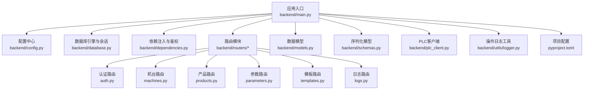
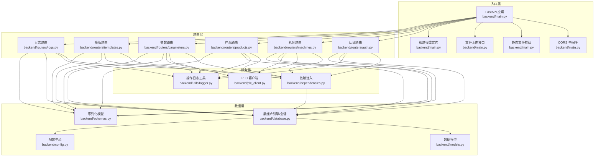
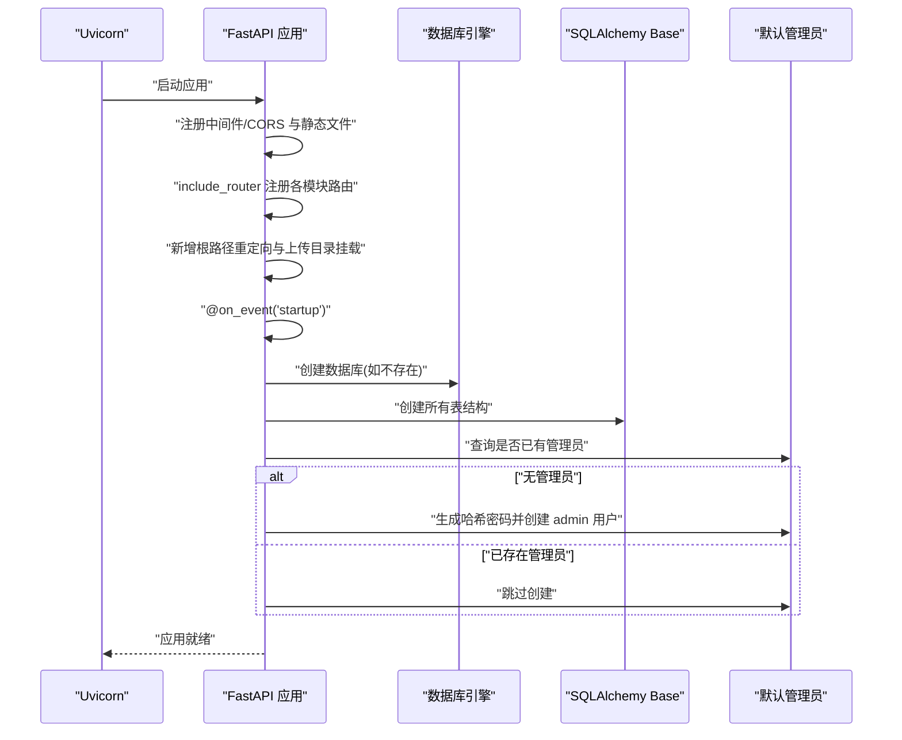
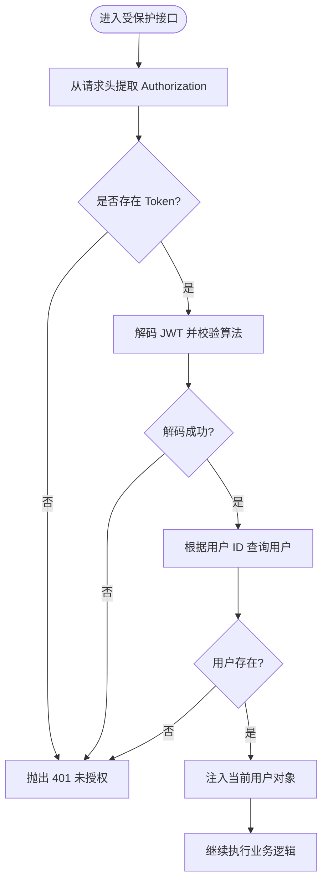
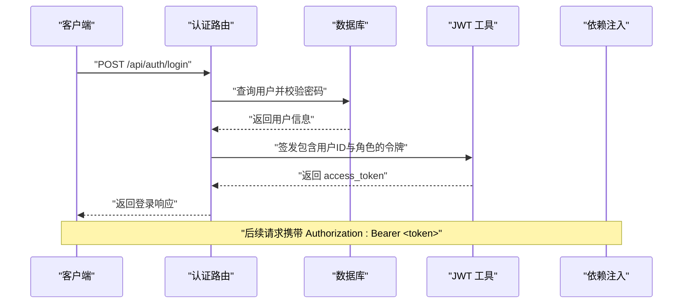
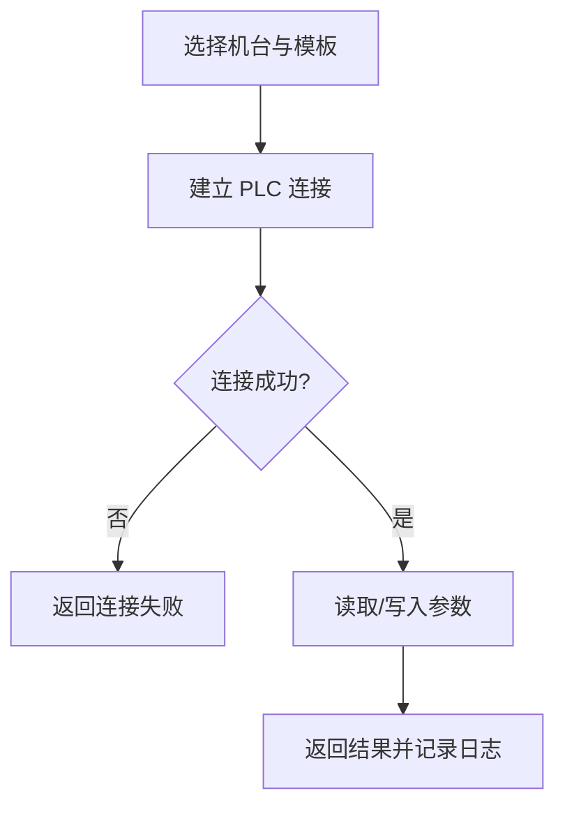
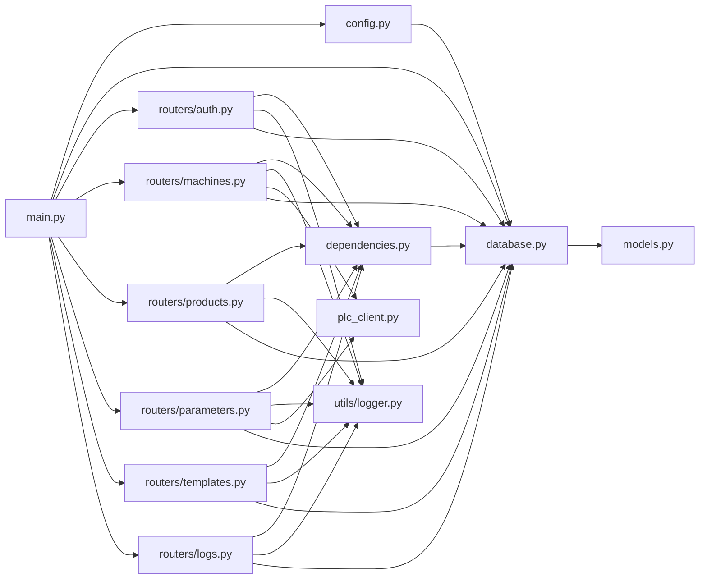

# FastAPI应用结构

<cite>
**本文档引用的文件**
- [backend/main.py](file://backend/main.py)
- [backend/config.py](file://backend/config.py)
- [backend/database.py](file://backend/database.py)
- [backend/dependencies.py](file://backend/dependencies.py)
- [backend/models.py](file://backend/models.py)
- [backend/schemas.py](file://backend/schemas.py)
- [backend/routers/auth.py](file://backend/routers/auth.py)
- [backend/routers/machines.py](file://backend/routers/machines.py)
- [backend/routers/products.py](file://backend/routers/products.py)
- [backend/routers/parameters.py](file://backend/routers/parameters.py)
- [backend/routers/templates.py](file://backend/routers/templates.py)
- [backend/routers/logs.py](file://backend/routers/logs.py)
- [backend/utils/logger.py](file://backend/utils/logger.py)
- [backend/plc_client.py](file://backend/plc_client.py)
- [pyproject.toml](file://pyproject.toml)
- [run.sh](file://run.sh)
</cite>

## 更新摘要
**所做更改**
- 更新版本信息：应用版本升级至1.1.0
- 增强FastAPI应用配置：添加版本号配置与根路径重定向
- 改进静态文件挂载：支持前端上传目录的静态文件服务
- 优化数据库初始化流程：增强错误处理与日志输出
- 更新依赖版本：FastAPI升级至0.115.0，Pydantic升级至2.10.0
- 新增文件上传功能：支持前端文件上传与访问

## 目录
1. [简介](#简介)
2. [项目结构](#项目结构)
3. [核心组件](#核心组件)
4. [架构总览](#架构总览)
5. [详细组件分析](#详细组件分析)
6. [依赖关系分析](#依赖关系分析)
7. [性能考虑](#性能考虑)
8. [故障排查指南](#故障排查指南)
9. [结论](#结论)
10. [附录](#附录)

## 简介
本文件系统性梳理了基于 FastAPI 的"挤出机工艺参数管理系统"的应用结构与实现细节，重点覆盖以下方面：
- 应用入口点设计与启动事件处理
- 中间件配置（CORS、静态文件）
- 路由注册机制与模块化组织
- 配置管理与环境变量加载
- 数据库初始化流程与依赖注入体系
- 应用生命周期管理与默认管理员用户创建逻辑
- 实际代码示例路径与最佳实践建议

**更新** 版本升级至1.1.0，增强了FastAPI应用配置与数据库初始化流程

## 项目结构
后端采用分层与功能模块化组织方式：
- 核心入口：backend/main.py
- 配置中心：backend/config.py
- 数据访问：backend/database.py、models.py
- 依赖注入与鉴权：backend/dependencies.py
- 路由模块：backend/routers 下各业务模块
- 数据模型与序列化：backend/models.py、backend/schemas.py
- 工具与日志：backend/utils/logger.py
- PLC 通信：backend/plc_client.py
- 启动脚本：run.sh
- 项目配置：pyproject.toml

**图表来源**
- [backend/main.py:12-36](file://backend/main.py#L12-L36)
- [backend/config.py:4-20](file://backend/config.py#L4-L20)
- [backend/database.py:1-18](file://backend/database.py#L1-L18)
- [backend/dependencies.py:1-50](file://backend/dependencies.py#L1-L50)
- [backend/routers/auth.py:15-14](file://backend/routers/auth.py#L15-L14)
- [backend/routers/machines.py:12-12](file://backend/routers/machines.py#L12-L12)
- [backend/routers/products.py:10-10](file://backend/routers/products.py#L10-L10)
- [backend/routers/parameters.py:12-12](file://backend/routers/parameters.py#L12-L12)
- [backend/routers/templates.py:10-10](file://backend/routers/templates.py#L10-L10)
- [backend/routers/logs.py:11-11](file://backend/routers/logs.py#L11-L11)
- [backend/models.py:1-133](file://backend/models.py#L1-L133)
- [backend/schemas.py:1-190](file://backend/schemas.py#L1-L190)
- [backend/plc_client.py:6-188](file://backend/plc_client.py#L6-L188)
- [backend/utils/logger.py:1-199](file://backend/utils/logger.py#L1-L199)
- [pyproject.toml:1-18](file://pyproject.toml#L1-L18)

**章节来源**
- [backend/main.py:12-36](file://backend/main.py#L12-L36)
- [backend/config.py:4-20](file://backend/config.py#L4-L20)

## 核心组件
- 应用实例与中间件
  - 使用 FastAPI 创建应用实例，配置标题与版本号为1.1.0；启用 CORS 允许跨域访问；挂载前端静态资源目录以支持 SPA 访问。
  - 新增根路径重定向到前端页面，以及上传目录的静态文件挂载。
  - 参考路径：[backend/main.py:14-31](file://backend/main.py#L14-L31)

- 路由注册
  - 在应用启动时统一注册认证、机台、产品、参数、模板、日志等路由模块。
  - 参考路径：[backend/main.py:32-37](file://backend/main.py#L32-L37)

- 应用启动事件
  - 在 startup 事件中完成数据库创建、表结构初始化、默认管理员用户创建等初始化工作。
  - 增强错误处理与日志输出，确保初始化过程的可靠性。
  - 参考路径：[backend/main.py:57-92](file://backend/main.py#L57-L92)

- 配置管理
  - 使用 Pydantic Settings 定义配置模型，从 .env 文件加载数据库、JWT、PLC 等配置。
  - 支持额外的配置项如PLC端口和数据库端口号。
  - 参考路径：[backend/config.py:4-35](file://backend/config.py#L4-L35)

- 数据库与依赖注入
  - SQLAlchemy 引擎、会话工厂与基础模型定义；通过 get_db 提供依赖注入；全局 Base 用于建表。
  - 数据库URL包含utf8mb4字符集设置。
  - 参考路径：[backend/database.py:1-18](file://backend/database.py#L1-L18)

- 鉴权与依赖
  - 通过依赖函数解析 Authorization 头部中的 JWT，校验并注入当前用户；提供管理员权限校验依赖。
  - 参考路径：[backend/dependencies.py:9-36](file://backend/dependencies.py#L9-L36)

**章节来源**
- [backend/main.py:14-92](file://backend/main.py#L14-L92)
- [backend/config.py:4-35](file://backend/config.py#L4-L35)
- [backend/database.py:1-18](file://backend/database.py#L1-L18)
- [backend/dependencies.py:9-36](file://backend/dependencies.py#L9-L36)

## 架构总览
应用采用"入口层-路由层-服务层-数据层"分层架构，配合依赖注入与中间件实现横切关注点（CORS、鉴权、日志）。

**图表来源**
- [backend/main.py:14-56](file://backend/main.py#L14-L56)
- [backend/routers/auth.py:15-114](file://backend/routers/auth.py#L15-L114)
- [backend/routers/machines.py:12-275](file://backend/routers/machines.py#L12-L275)
- [backend/routers/products.py:10-75](file://backend/routers/products.py#L10-L75)
- [backend/routers/parameters.py:12-278](file://backend/routers/parameters.py#L12-L278)
- [backend/routers/templates.py:10-300](file://backend/routers/templates.py#L10-L300)
- [backend/routers/logs.py:11-137](file://backend/routers/logs.py#L11-L137)
- [backend/dependencies.py:9-36](file://backend/dependencies.py#L9-L36)
- [backend/utils/logger.py:65-88](file://backend/utils/logger.py#L65-L88)
- [backend/plc_client.py:6-188](file://backend/plc_client.py#L6-L188)
- [backend/config.py:4-35](file://backend/config.py#L4-L35)
- [backend/database.py:1-18](file://backend/database.py#L1-L18)
- [backend/models.py:1-133](file://backend/models.py#L1-L133)
- [backend/schemas.py:1-190](file://backend/schemas.py#L1-L190)

## 详细组件分析

### 应用入口与启动事件
- 入口点创建 FastAPI 实例，配置标题与版本号为1.1.0，配置 CORS 与静态文件挂载，注册全部路由模块。
- 新增根路径重定向到前端页面，以及上传目录的静态文件挂载。
- 在 startup 事件中：
  - 通过原生 MySQL 连接创建数据库（若不存在），打印创建状态。
  - 初始化 SQLAlchemy 表结构（Base.metadata.create_all）。
  - 使用 passlib 对明文密码进行哈希，创建默认管理员用户（用户名 admin），并记录创建日志。
- 参考路径：
  - [backend/main.py:14-31](file://backend/main.py#L14-L31)
  - [backend/main.py:57-92](file://backend/main.py#L57-L92)

**图表来源**
- [backend/main.py:57-92](file://backend/main.py#L57-L92)

**章节来源**
- [backend/main.py:14-92](file://backend/main.py#L14-L92)

### 中间件配置（CORS 与静态文件）
- CORS 中间件允许任意源、凭证、常见方法与头部，满足前后端联调需求。
- 静态文件挂载将前端目录映射到 /frontend，便于直接访问 index.html。
- 新增上传目录的静态文件挂载，支持文件上传后的访问。
- 参考路径：
  - [backend/main.py:16-31](file://backend/main.py#L16-L31)

**章节来源**
- [backend/main.py:16-31](file://backend/main.py#L16-L31)

### 路由注册机制
- 所有业务路由均在入口文件中集中 include_router，形成清晰的模块化组织。
- 路由前缀统一为 /api，便于前端统一管理。
- 参考路径：
  - [backend/main.py:32-37](file://backend/main.py#L32-L37)
  - [backend/routers/auth.py:15](file://backend/routers/auth.py#L15)
  - [backend/routers/machines.py:12](file://backend/routers/machines.py#L12)
  - [backend/routers/products.py:10](file://backend/routers/products.py#L10)
  - [backend/routers/parameters.py:12](file://backend/routers/parameters.py#L12)
  - [backend/routers/templates.py:10](file://backend/routers/templates.py#L10)
  - [backend/routers/logs.py:11](file://backend/routers/logs.py#L11)

**章节来源**
- [backend/main.py:32-37](file://backend/main.py#L32-L37)
- [backend/routers/auth.py:15](file://backend/routers/auth.py#L15)
- [backend/routers/machines.py:12](file://backend/routers/machines.py#L12)
- [backend/routers/products.py:10](file://backend/routers/products.py#L10)
- [backend/routers/parameters.py:12](file://backend/routers/parameters.py#L12)
- [backend/routers/templates.py:10](file://backend/routers/templates.py#L10)
- [backend/routers/logs.py:11](file://backend/routers/logs.py#L11)

### 配置管理
- 使用 Pydantic Settings 定义配置模型，从 .env 文件加载数据库连接、JWT、PLC 等参数。
- DB_CONFIG 与 PLC_CONFIG 作为常量字典供数据库与 PLC 模块使用。
- 支持额外的配置项如PLC端口和数据库端口号。
- 参考路径：
  - [backend/config.py:4-35](file://backend/config.py#L4-L35)

**章节来源**
- [backend/config.py:4-35](file://backend/config.py#L4-L35)

### 依赖注入系统
- get_db 会话依赖：每次请求创建独立会话，使用完自动关闭。
- get_current_user 依赖：从 Authorization 头解析 JWT，校验并注入当前用户对象。
- get_current_admin_user 依赖：在 get_current_user 基础上进一步校验角色为 admin。
- verify_token 依赖：仅做令牌校验，不注入用户对象。
- 参考路径：
  - [backend/database.py:12-18](file://backend/database.py#L12-L18)
  - [backend/dependencies.py:9-36](file://backend/dependencies.py#L9-L36)

**图表来源**
- [backend/dependencies.py:9-36](file://backend/dependencies.py#L9-L36)

**章节来源**
- [backend/dependencies.py:9-36](file://backend/dependencies.py#L9-L36)
- [backend/database.py:12-18](file://backend/database.py#L12-L18)

### 应用生命周期管理
- startup 事件负责数据库初始化与默认管理员创建，确保应用启动即具备可用数据与初始账户。
- 增强错误处理与日志输出，提升初始化过程的可靠性。
- 参考路径：
  - [backend/main.py:57-92](file://backend/main.py#L57-L92)

**章节来源**
- [backend/main.py:57-92](file://backend/main.py#L57-L92)

### 数据库初始化流程
- 使用原生 MySQL 连接创建数据库（字符集与排序规则设置为 utf8mb4）。
- 通过 SQLAlchemy Base.metadata.create_all 创建所有表。
- 增强错误处理与日志输出，确保初始化过程的可靠性。
- 参考路径：
  - [backend/main.py:57-76](file://backend/main.py#L57-L76)
  - [backend/database.py:1-10](file://backend/database.py#L1-L10)

**章节来源**
- [backend/main.py:57-76](file://backend/main.py#L57-L76)
- [backend/database.py:1-10](file://backend/database.py#L1-L10)

### 默认管理员用户创建逻辑
- 若数据库中不存在任何用户，则创建用户名为 admin、角色为 admin 的默认管理员。
- 密码通过 passlib 进行哈希处理后存入数据库。
- 增强错误处理与日志输出，提升创建过程的可靠性。
- 参考路径：
  - [backend/main.py:78-92](file://backend/main.py#L78-L92)
  - [backend/dependencies.py:9-36](file://backend/dependencies.py#L9-L36)

**章节来源**
- [backend/main.py:78-92](file://backend/main.py#L78-L92)
- [backend/dependencies.py:9-36](file://backend/dependencies.py#L9-L36)

### 文件上传功能
- 新增文件上传接口，支持任意文件上传到上传目录。
- 自动生成唯一文件名，支持多种文件格式。
- 返回上传后的访问URL和文件名。
- 参考路径：
  - [backend/main.py:39-51](file://backend/main.py#L39-L51)

**章节来源**
- [backend/main.py:39-51](file://backend/main.py#L39-L51)

### 认证与用户管理
- 登录接口：验证用户名与密码，签发带用户信息与角色的 JWT。
- 用户列表、创建、删除、修改密码等接口均通过 verify_token 或 get_current_user 依赖进行鉴权。
- 支持密码哈希兼容旧版本的SHA256验证。
- 参考路径：
  - [backend/routers/auth.py:38-48](file://backend/routers/auth.py#L38-L48)
  - [backend/routers/auth.py:50-74](file://backend/routers/auth.py#L50-L74)
  - [backend/routers/auth.py:76-92](file://backend/routers/auth.py#L76-L92)
  - [backend/routers/auth.py:94-114](file://backend/routers/auth.py#L94-L114)

**图表来源**
- [backend/routers/auth.py:38-48](file://backend/routers/auth.py#L38-L48)
- [backend/dependencies.py:9-36](file://backend/dependencies.py#L9-L36)

**章节来源**
- [backend/routers/auth.py:38-114](file://backend/routers/auth.py#L38-L114)
- [backend/dependencies.py:9-36](file://backend/dependencies.py#L9-L36)

### 机台与 PLC 交互
- 机台状态检测：尝试连接 PLC 并判断在线/离线/错误。
- 读取参数：根据绑定模板读取多个参数值并返回。
- 写入参数：将参数值写入 PLC，支持不同数据类型与只读参数跳过。
- 支持动态slot切换，提升PLC连接的灵活性。
- 参考路径：
  - [backend/routers/machines.py:83-105](file://backend/routers/machines.py#L83-L105)
  - [backend/routers/machines.py:107-183](file://backend/routers/machines.py#L107-L183)
  - [backend/routers/machines.py:185-222](file://backend/routers/machines.py#L185-L222)
  - [backend/plc_client.py:42-49](file://backend/plc_client.py#L42-L49)

**图表来源**
- [backend/routers/machines.py:107-183](file://backend/routers/machines.py#L107-L183)
- [backend/routers/machines.py:185-222](file://backend/routers/machines.py#L185-L222)
- [backend/plc_client.py:42-49](file://backend/plc_client.py#L42-L49)

**章节来源**
- [backend/routers/machines.py:83-222](file://backend/routers/machines.py#L83-L222)
- [backend/plc_client.py:42-49](file://backend/plc_client.py#L42-L49)

### 参数与记录管理
- 工艺参数保存：根据模板参数生成快照并持久化，版本号递增。
- 工艺记录创建：支持从模板参数快照创建记录。
- 写入 PLC：将记录中的参数批量写入 PLC，跳过只读参数。
- 支持参数类型转换，提升数据处理的准确性。
- 参考路径：
  - [backend/routers/parameters.py:50-102](file://backend/routers/parameters.py#L50-L102)
  - [backend/routers/parameters.py:151-199](file://backend/routers/parameters.py#L151-L199)
  - [backend/routers/parameters.py:201-246](file://backend/routers/parameters.py#L201-L246)

**章节来源**
- [backend/routers/parameters.py:50-246](file://backend/routers/parameters.py#L50-L246)

### 模板管理
- 模板 CRUD：支持创建、查询、更新、删除模板及其参数。
- 绑定/解绑机台：将模板与机台关联，便于参数读取与写入。
- 支持模板参数的动态增删改查。
- 参考路径：
  - [backend/routers/templates.py:34-151](file://backend/routers/templates.py#L34-L151)
  - [backend/routers/templates.py:224-260](file://backend/routers/templates.py#L224-L260)

**章节来源**
- [backend/routers/templates.py:34-260](file://backend/routers/templates.py#L34-L260)

### 日志与审计
- 操作日志：统一记录操作类型、目标类型、用户、请求与响应摘要。
- 文件与数据库双写：当日志文件与数据库写入失败时均有容错处理。
- 支持多种操作类型的日志记录，包括PLC读写、模板绑定等。
- 参考路径：
  - [backend/utils/logger.py:65-88](file://backend/utils/logger.py#L65-L88)
  - [backend/routers/logs.py:34-98](file://backend/routers/logs.py#L34-L98)

**章节来源**
- [backend/utils/logger.py:65-88](file://backend/utils/logger.py#L65-L88)
- [backend/routers/logs.py:34-98](file://backend/routers/logs.py#L34-L98)

## 依赖关系分析
- 组件耦合与内聚
  - 路由模块高度内聚于各自业务领域，通过依赖注入与数据库会话解耦。
  - PLC 客户端与机台路由松耦合，通过接口抽象与异常处理保证健壮性。
- 直接与间接依赖
  - 入口文件依赖配置、数据库、路由模块；路由模块依赖依赖注入、数据库、PLC 客户端与日志工具。
- 外部依赖与集成点
  - FastAPI 0.115.0、Pydantic 2.10.0、SQLAlchemy、snap7（PLC）、passlib（密码哈希）、PyMySQL（原生连接）。
- 接口契约
  - get_db 提供会话依赖；verify_token/get_current_user 提供鉴权契约；PLC 客户端提供读写接口。

**图表来源**
- [backend/main.py:12-36](file://backend/main.py#L12-L36)
- [backend/config.py:4-35](file://backend/config.py#L4-L35)
- [backend/database.py:1-18](file://backend/database.py#L1-L18)
- [backend/dependencies.py:9-36](file://backend/dependencies.py#L9-L36)
- [backend/utils/logger.py:65-88](file://backend/utils/logger.py#L65-L88)
- [backend/plc_client.py:6-188](file://backend/plc_client.py#L6-L188)
- [backend/models.py:1-133](file://backend/models.py#L1-L133)

**章节来源**
- [backend/main.py:12-36](file://backend/main.py#L12-L36)
- [backend/database.py:1-18](file://backend/database.py#L1-L18)
- [backend/dependencies.py:9-36](file://backend/dependencies.py#L9-L36)
- [backend/utils/logger.py:65-88](file://backend/utils/logger.py#L65-L88)
- [backend/plc_client.py:6-188](file://backend/plc_client.py#L6-L188)
- [backend/models.py:1-133](file://backend/models.py#L1-L133)

## 性能考虑
- 数据库连接池与预检：数据库引擎启用 pool_pre_ping，提升连接稳定性。
- 会话生命周期：get_db 依赖在请求结束时自动关闭会话，避免连接泄漏。
- PLC 连接复用：PLC 客户端在 slot 变更时自动重连，减少重复握手成本。
- 日志落盘策略：文件日志按天拆分并定期清理，避免磁盘膨胀。
- 文件上传优化：支持大文件上传，自动生成唯一文件名避免冲突。
- 版本升级优化：FastAPI 0.115.0带来更好的性能与安全性改进。
- 最佳实践建议
  - 将敏感配置移至环境变量或密钥管理服务，不要硬编码在代码中。
  - 在生产环境开启 HTTPS 与严格的 CORS 策略。
  - 对高频接口增加缓存与限流策略。
  - 对 PLC 读写操作增加超时与重试机制。

**章节来源**
- [backend/database.py:8](file://backend/database.py#L8)
- [backend/database.py:12-18](file://backend/database.py#L12-L18)
- [backend/plc_client.py:42-49](file://backend/plc_client.py#L42-L49)
- [backend/utils/logger.py:17-30](file://backend/utils/logger.py#L17-L30)
- [pyproject.toml:7](file://pyproject.toml#L7)

## 故障排查指南
- 启动阶段
  - 数据库创建失败：检查 DB_HOST、DB_PORT、DB_USER、DB_PASSWORD 是否正确，确认 MySQL 服务可达。
  - 表结构创建失败：检查数据库连接字符串与权限，确认字符集设置一致。
  - 默认管理员创建失败：检查密码哈希与数据库事务回滚逻辑。
  - 参考路径：
    - [backend/main.py:57-92](file://backend/main.py#L57-L92)

- 鉴权相关
  - 401 未授权：确认请求头 Authorization 是否包含 Bearer 令牌。
  - 403 禁止访问：确认用户角色为 admin。
  - 参考路径：
    - [backend/dependencies.py:9-36](file://backend/dependencies.py#L9-L36)

- PLC 通信
  - 连接失败：检查机台 IP、Rack、Slot、DB Number 与 PLC 网络连通性。
  - 读写异常：确认参数地址格式与数据类型匹配，必要时指定 slot。
  - 参考路径：
    - [backend/routers/machines.py:107-183](file://backend/routers/machines.py#L107-L183)
    - [backend/routers/machines.py:185-222](file://backend/routers/machines.py#L185-L222)
    - [backend/plc_client.py:24-188](file://backend/plc_client.py#L24-L188)

- 日志问题
  - 文件写入失败：检查日志目录权限与磁盘空间。
  - 数据库存储失败：检查 OperationLog 字段 JSON 序列化与数据库连接。
  - 参考路径：
    - [backend/utils/logger.py:32-63](file://backend/utils/logger.py#L32-L63)
    - [backend/utils/logger.py:65-88](file://backend/utils/logger.py#L65-L88)

- 文件上传问题
  - 上传失败：检查上传目录权限与磁盘空间。
  - 访问失败：确认静态文件挂载配置与文件路径。
  - 参考路径：
    - [backend/main.py:39-51](file://backend/main.py#L39-L51)

**章节来源**
- [backend/main.py:57-92](file://backend/main.py#L57-L92)
- [backend/dependencies.py:9-36](file://backend/dependencies.py#L9-L36)
- [backend/routers/machines.py:107-222](file://backend/routers/machines.py#L107-L222)
- [backend/plc_client.py:24-188](file://backend/plc_client.py#L24-L188)
- [backend/utils/logger.py:32-88](file://backend/utils/logger.py#L32-L88)
- [backend/main.py:39-51](file://backend/main.py#L39-L51)

## 结论
本项目以 FastAPI 1.1.0为核心，结合 SQLAlchemy、Pydantic Settings、snap7 等技术栈，构建了模块化、可扩展且具备工业控制能力的应用。通过统一的入口点、中间件与依赖注入体系，实现了清晰的职责分离与良好的可维护性。版本升级带来了更好的性能与安全性，新增的文件上传功能提升了用户体验。建议在生产环境中进一步完善安全策略、监控与日志体系，并对高频接口进行性能优化。

## 附录
- 启动脚本
  - run.sh 提供一键安装依赖、创建数据库、启动后端服务并输出访问提示。
  - 参考路径：
    - [run.sh:1-24](file://run.sh#L1-L24)

- 项目配置
  - pyproject.toml 包含应用元数据、版本信息与依赖版本声明。
  - 参考路径：
    - [pyproject.toml:1-18](file://pyproject.toml#L1-L18)

**章节来源**
- [run.sh:1-24](file://run.sh#L1-L24)
- [pyproject.toml:1-18](file://pyproject.toml#L1-L18)