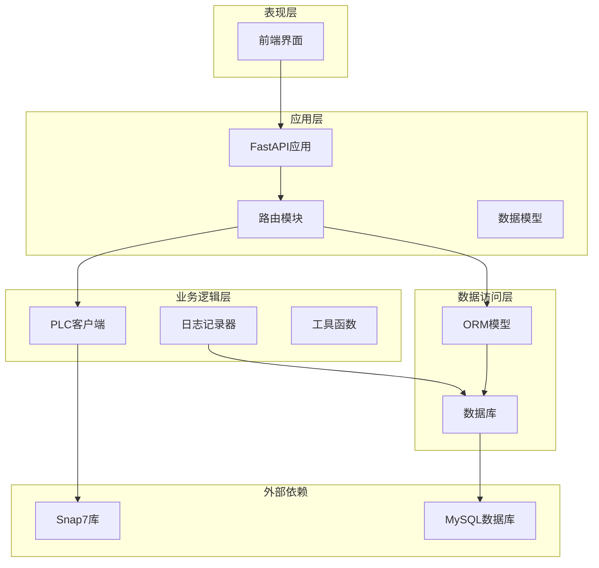
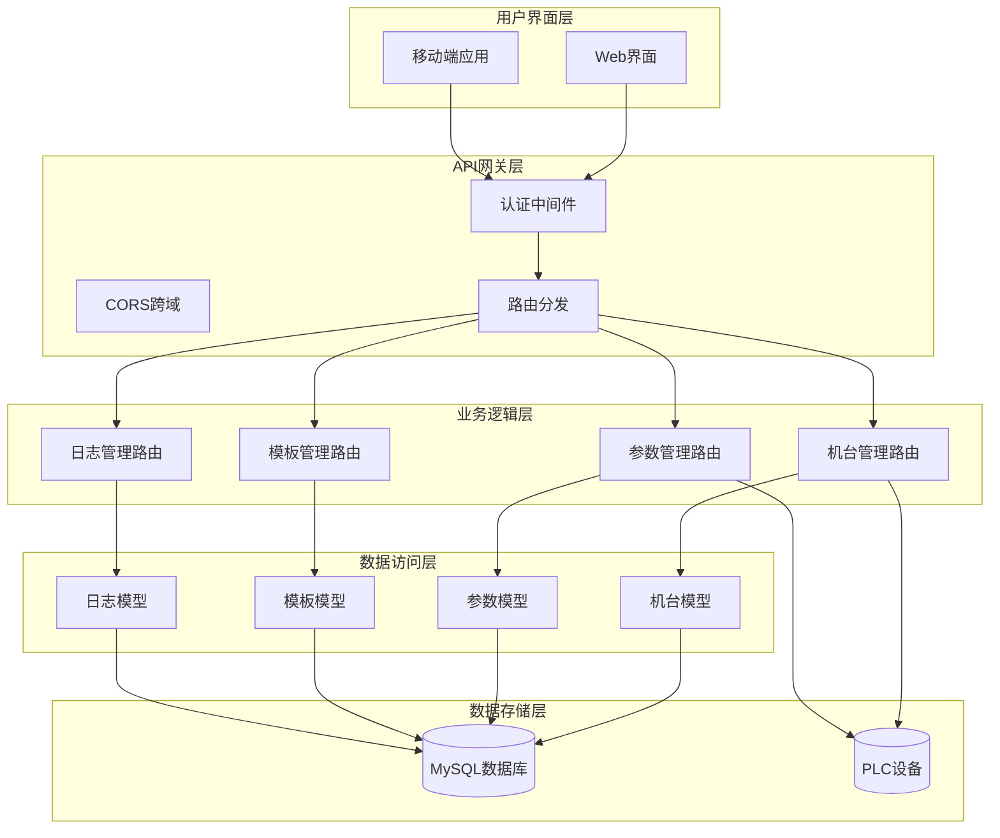
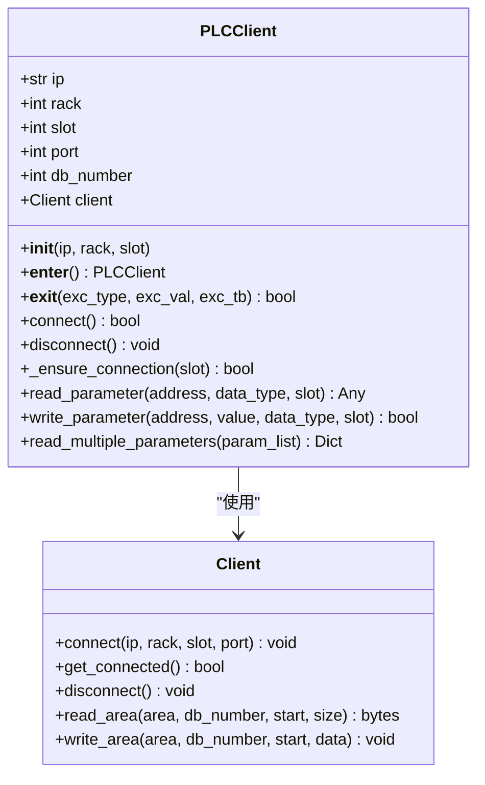
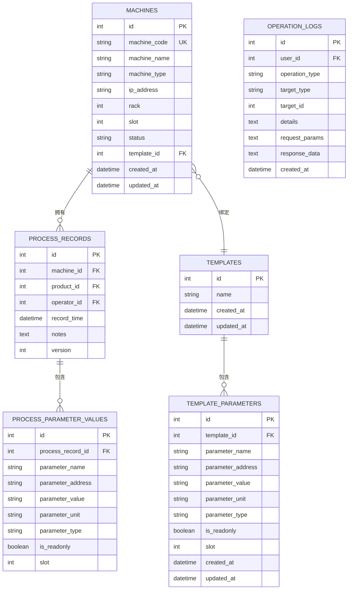
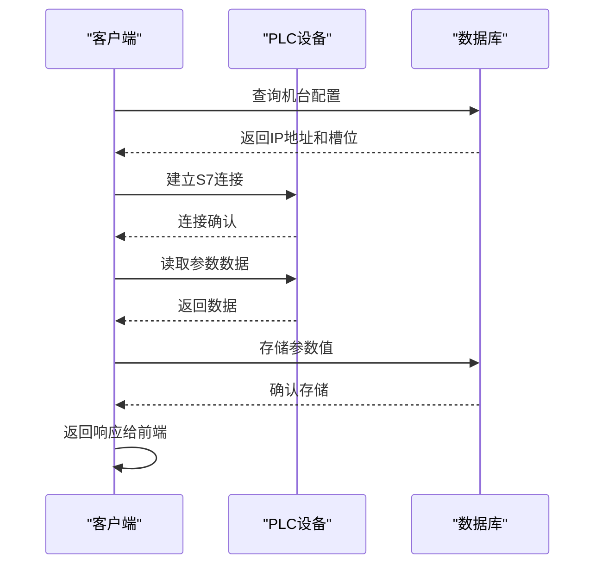
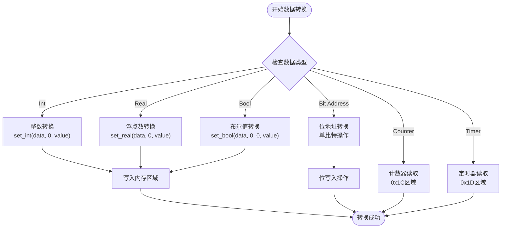
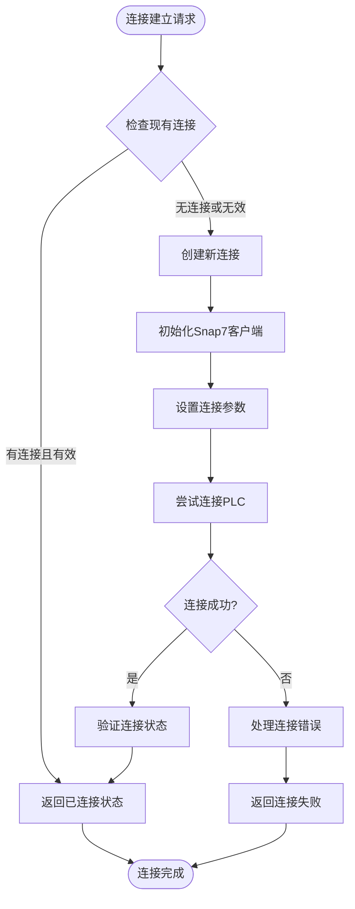
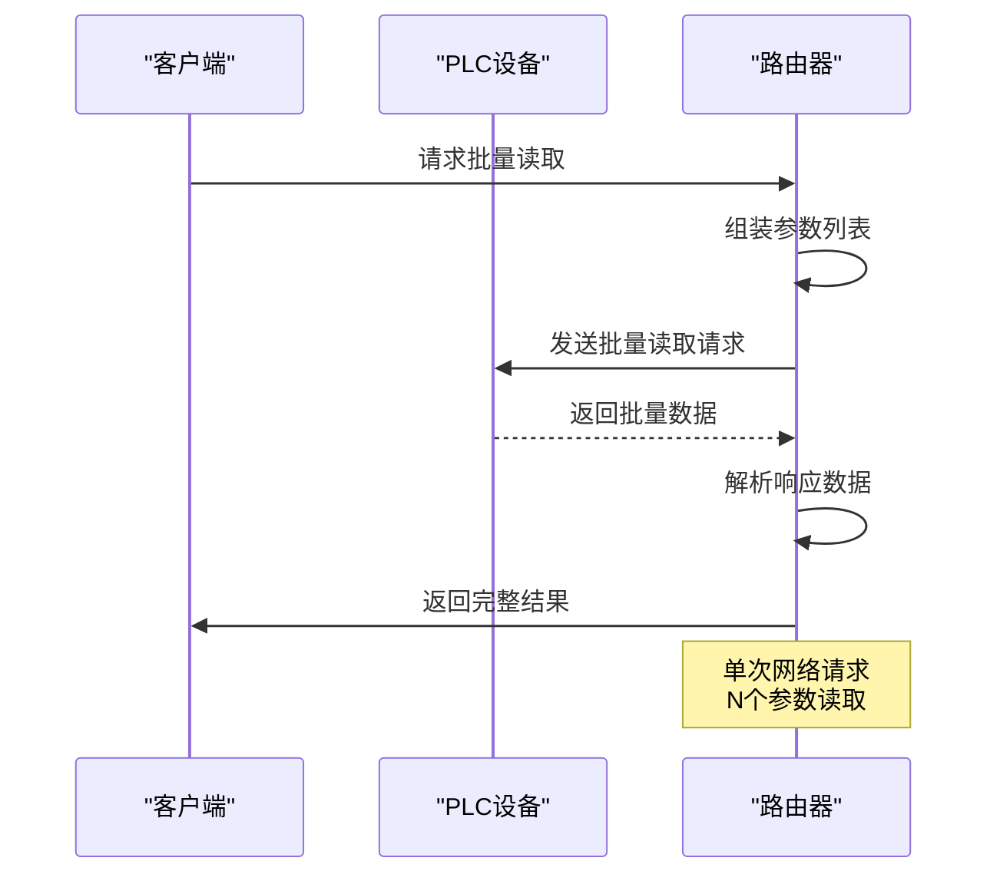
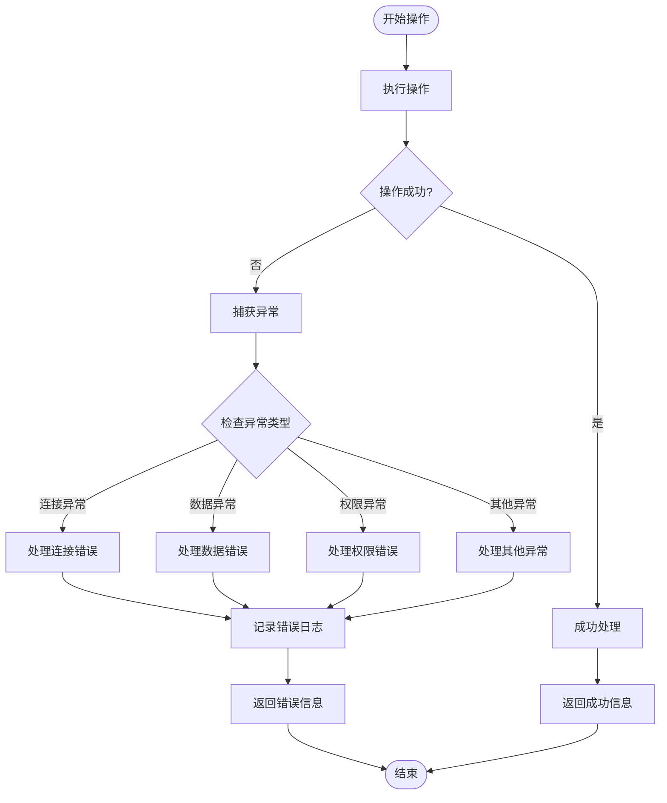

# PLC通信集成

<cite>
**本文档引用的文件**
- [plc_client.py](file://backend/plc_client.py)
- [config.py](file://backend/config.py)
- [main.py](file://backend/main.py)
- [models.py](file://backend/models.py)
- [schemas.py](file://backend/schemas.py)
- [machines.py](file://backend/routers/machines.py)
- [logger.py](file://backend/utils/logger.py)
- [requirements.txt](file://requirements.txt)
- [run.sh](file://run.sh)
- [start_backend.sh](file://start_backend.sh)
</cite>

## 目录
1. [简介](#简介)
2. [项目结构](#项目结构)
3. [核心组件](#核心组件)
4. [架构概览](#架构概览)
5. [详细组件分析](#详细组件分析)
6. [PLC客户端设计](#plc客户端设计)
7. [S7协议实现](#s7协议实现)
8. [数据类型处理](#数据类型处理)
9. [连接管理](#连接管理)
10. [批量操作优化](#批量操作优化)
11. [错误处理机制](#错误处理机制)
12. [性能考虑](#性能考虑)
13. [配置示例](#配置示例)
14. [连接测试方法](#连接测试方法)
15. [故障排除指南](#故障排除指南)
16. [结论](#结论)

## 简介

PLC通信集成系统是一个基于Python的工业自动化数据采集和控制系统，集成了S7协议通信功能，用于从西门子PLC设备读取和写入工艺参数。该系统采用FastAPI框架构建RESTful API接口，结合Snap7库实现与PLC的稳定通信，支持实时数据监控、参数配置管理和历史数据存储。

系统主要功能包括：
- PLC连接状态检测和管理
- 工艺参数的批量读取和写入
- 设备模板化配置管理
- 操作日志记录和审计
- 实时数据监控和报警处理

## 项目结构

该项目采用标准的分层架构设计，主要分为以下层次：



**图表来源**
- [main.py:12-36](file://backend/main.py#L12-L36)
- [plc_client.py:6-22](file://backend/plc_client.py#L6-L22)
- [models.py:1-133](file://backend/models.py#L1-L133)

**章节来源**
- [main.py:1-77](file://backend/main.py#L1-L77)
- [requirements.txt:1-11](file://requirements.txt#L1-L11)

## 核心组件

系统的核心组件包括PLC客户端、配置管理、数据模型和API路由等模块。每个组件都有明确的职责分工和清晰的接口定义。

### 主要技术栈
- **后端框架**: FastAPI 0.115.0 - 高性能异步Web框架
- **数据库**: SQLAlchemy 2.0.36 - ORM对象关系映射
- **PLC通信**: python-snap7 3.0.0 - 西门子S7协议库
- **数据库驱动**: PyMySQL 1.1.1 - MySQL数据库连接
- **认证授权**: Python-Jose 3.3.0 - JWT令牌处理
- **加密**: Passlib bcrypt - 密码哈希处理

### 架构特点
- **模块化设计**: 各组件职责分离，便于维护和扩展
- **配置驱动**: 通过环境变量和配置文件管理运行参数
- **异常安全**: 完善的错误处理和资源管理机制
- **日志审计**: 全面的操作日志记录和追踪能力

**章节来源**
- [requirements.txt:1-11](file://requirements.txt#L1-L11)
- [config.py:4-20](file://backend/config.py#L4-L20)

## 架构概览

系统采用分层架构设计，确保各层之间的松耦合和高内聚：



**图表来源**
- [main.py:26-31](file://backend/main.py#L26-L31)
- [machines.py:12-12](file://backend/routers/machines.py#L12-L12)

## 详细组件分析

### PLC客户端类分析

PLC客户端是系统的核心组件，负责与PLC设备建立和维护通信连接，执行数据读写操作。



**图表来源**
- [plc_client.py:6-188](file://backend/plc_client.py#L6-L188)

**章节来源**
- [plc_client.py:6-188](file://backend/plc_client.py#L6-L188)

### 数据模型关系图

系统采用SQLAlchemy ORM模型，定义了完整的数据结构和关系：



**图表来源**
- [models.py:19-133](file://backend/models.py#L19-L133)

**章节来源**
- [models.py:1-133](file://backend/models.py#L1-L133)

## PLC客户端设计

### 设计原则

PLC客户端遵循以下设计原则：
- **连接池管理**: 通过上下文管理器确保连接的正确创建和销毁
- **类型安全**: 使用类型注解确保参数传递的正确性
- **异常隔离**: 将PLC通信异常与业务逻辑分离
- **资源管理**: 自动化的连接生命周期管理

### 关键特性

1. **智能连接管理**: 自动检测连接状态并在需要时重新连接
2. **多槽位支持**: 支持不同槽位的PLC设备切换
3. **批量操作**: 提供批量参数读取功能
4. **类型转换**: 自动处理不同数据类型的转换

**章节来源**
- [plc_client.py:6-49](file://backend/plc_client.py#L6-L49)

## S7协议实现

### 协议支持范围

系统实现了S7协议的部分功能，主要支持以下地址类型：

| 地址类型 | 描述 | 大小 | 用途 |
|---------|------|------|------|
| V字节(VB) | 字节地址 | 1字节 | 位操作和字节数据 |
| V整数(VW) | 整数地址 | 2字节 | 整数值读写 |
| V实数(VD) | 实数地址 | 4字节 | 浮点数值读写 |
| V计数器(VC) | 计数器地址 | 2字节 | 计数器值读写 |
| 位地址(V.x) | 位地址 | 1字节 | 特定位读写 |
| 计数器(C) | 计数器 | 2字节 | 计数器寄存器 |
| 定时器(T) | 定时器 | 2字节 | 定时器寄存器 |

### 通信流程



**图表来源**
- [machines.py:107-183](file://backend/routers/machines.py#L107-L183)
- [plc_client.py:24-49](file://backend/plc_client.py#L24-L49)

**章节来源**
- [plc_client.py:51-113](file://backend/plc_client.py#L51-L113)
- [plc_client.py:115-180](file://backend/plc_client.py#L115-L180)

## 数据类型处理

### 类型转换规则

系统支持多种数据类型的自动转换，确保与PLC设备的数据格式兼容：



**图表来源**
- [plc_client.py:102-176](file://backend/plc_client.py#L102-L176)

### 数据类型映射表

| Python类型 | S7地址类型 | 读取函数 | 写入函数 |
|-----------|-----------|---------|---------|
| int | VW, VC | get_int | set_int |
| float | VD | get_real | set_real |
| bool | VB, 位地址 | get_bool | set_bool |
| int | C计数器 | 读取0x1C区域 | 写入0x1C区域 |
| int | T定时器 | 读取0x1D区域 | 写入0x1D区域 |

**章节来源**
- [plc_client.py:102-176](file://backend/plc_client.py#L102-L176)

## 连接管理

### 连接建立流程

PLC连接管理采用智能策略，确保连接的稳定性和可靠性：



**图表来源**
- [plc_client.py:24-49](file://backend/plc_client.py#L24-L49)

### 连接状态检测

系统提供了完善的连接状态检测机制：

1. **主动检测**: 定期检查PLC连接状态
2. **被动检测**: 在操作前自动验证连接有效性
3. **异常恢复**: 自动重连机制
4. **状态缓存**: 避免频繁的状态查询

**章节来源**
- [plc_client.py:24-49](file://backend/plc_client.py#L24-L49)
- [machines.py:83-105](file://backend/routers/machines.py#L83-L105)

## 批量操作优化

### 批量读取实现

系统提供了高效的批量参数读取功能，减少网络往返次数：



**图表来源**
- [plc_client.py:182-187](file://backend/plc_client.py#L182-L187)

### 性能优化策略

1. **连接复用**: 同一会话内复用PLC连接
2. **批量处理**: 减少网络往返次数
3. **缓存机制**: 频繁访问的数据缓存
4. **并发控制**: 合理的并发访问限制

**章节来源**
- [plc_client.py:182-187](file://backend/plc_client.py#L182-L187)

## 错误处理机制

### 异常分类处理

系统实现了多层次的错误处理机制：



**图表来源**
- [plc_client.py:29-38](file://backend/plc_client.py#L29-L38)
- [plc_client.py:111-113](file://backend/plc_client.py#L111-L113)

### 错误恢复策略

1. **自动重试**: 对临时性错误进行有限次重试
2. **降级处理**: 在部分功能不可用时提供降级方案
3. **状态回滚**: 确保操作的原子性
4. **资源清理**: 及时释放占用的系统资源

**章节来源**
- [plc_client.py:29-38](file://backend/plc_client.py#L29-L38)
- [logger.py:65-87](file://backend/utils/logger.py#L65-L87)

## 性能考虑

### 网络优化

1. **连接池**: 复用PLC连接，减少握手开销
2. **批量操作**: 合并多个小操作为批量操作
3. **压缩传输**: 对大数据包进行压缩传输
4. **超时控制**: 合理设置网络超时时间

### 内存管理

1. **及时释放**: 操作完成后立即释放资源
2. **垃圾回收**: 利用Python的垃圾回收机制
3. **内存监控**: 监控内存使用情况
4. **大对象处理**: 对大数据进行流式处理

### 并发处理

1. **线程安全**: 确保PLC客户端的线程安全性
2. **锁机制**: 对共享资源使用适当的同步机制
3. **队列管理**: 使用队列管理并发请求
4. **超时控制**: 防止死锁和长时间阻塞

## 配置示例

### 环境配置

系统通过环境变量和配置文件管理运行参数：

```ini
# 数据库配置
DB_HOST=127.0.0.1
DB_PORT=3306
DB_USER=plc_user
DB_PASSWORD=plc_password
DB_NAME=plc_process_db

# PLC配置
PLC_PORT=102
PLC_DB_NUMBER=3

# 应用配置
SECRET_KEY=your-secret-key-change-in-production
ALGORITHM=HS256
ACCESS_TOKEN_EXPIRE_MINUTES=1440
```

### PLC参数配置

| 参数名称 | 默认值 | 说明 |
|---------|--------|------|
| PLC_PORT | 102 | S7协议端口号 |
| PLC_DB_NUMBER | 3 | DB块编号 |
| DB_HOST | localhost | 数据库主机地址 |
| DB_PORT | 3306 | 数据库端口 |
| DB_NAME | plc_process_db | 数据库名称 |

### 前端配置

```javascript
// 前端API配置示例
const API_CONFIG = {
    baseURL: 'http://localhost:8000/api',
    timeout: 5000,
    headers: {
        'Content-Type': 'application/json',
        'Authorization': 'Bearer ' + localStorage.getItem('token')
    }
};
```

**章节来源**
- [config.py:4-34](file://backend/config.py#L4-L34)
- [run.sh:8-9](file://run.sh#L8-L9)

## 连接测试方法

### 基础连接测试

1. **网络连通性测试**
   ```bash
   # 测试PLC网络连通性
   ping 192.168.15.10
   
   # 测试S7端口连通性
   telnet 192.168.15.10 102
   ```

2. **PLC状态检查**
   ```python
   # 使用PLC客户端进行连接测试
   from backend.plc_client import PLCClient
   
   plc = PLCClient("192.168.15.10", 0, 1)
   if plc.connect():
       print("PLC连接成功")
       plc.disconnect()
   else:
       print("PLC连接失败")
   ```

3. **参数读取测试**
   ```python
   # 测试参数读取功能
   parameters = [
       ("温度", "VW100", "Int"),
       ("压力", "VD200", "Real"),
       ("开关", "VB300", "Bool")
   ]
   
   results = plc.read_multiple_parameters(parameters)
   print(results)
   ```

### 系统集成测试

1. **API接口测试**
   ```bash
   # 获取机台状态
   curl -X GET "http://localhost:8000/api/machines/status"
   
   # 读取机台参数
   curl -X GET "http://localhost:8000/api/machines/1/read"
   
   # 写入参数值
   curl -X POST "http://localhost:8000/api/machines/1/write" \
     -H "Content-Type: application/json" \
     -d '{"parameters":{"温度":{"address":"VW100","value":25,"type":"Int"}}}'
   ```

2. **数据库连接测试**
   ```python
   # 测试数据库连接
   import pymysql
   
   connection = pymysql.connect(
       host='localhost',
       user='plc_user',
       password='plc_password',
       database='plc_process_db',
       charset='utf8mb4'
   )
   ```

**章节来源**
- [machines.py:83-105](file://backend/routers/machines.py#L83-L105)
- [machines.py:107-183](file://backend/routers/machines.py#L107-L183)

## 故障排除指南

### 常见问题及解决方案

#### 1. 连接失败问题

**症状**: PLC连接超时或连接被拒绝

**可能原因**:
- IP地址配置错误
- 端口被防火墙阻止
- PLC设备离线
- 网络配置问题

**解决步骤**:
1. 验证PLC IP地址和端口配置
2. 检查网络连通性
3. 确认PLC设备电源和状态指示灯
4. 检查防火墙设置

#### 2. 参数读取失败

**症状**: 读取到None值或抛出异常

**可能原因**:
- 地址格式不正确
- 数据类型不匹配
- PLC内存区域访问权限不足
- 参数地址超出范围

**解决步骤**:
1. 验证参数地址格式（如VW100, VD200等）
2. 确认数据类型与地址类型匹配
3. 检查PLC程序中的变量定义
4. 验证DB块编号和偏移量

#### 3. 写入操作失败

**症状**: 写入操作返回False

**可能原因**:
- PLC处于只读模式
- 参数地址被保护
- 数据值超出范围
- 权限不足

**解决步骤**:
1. 检查PLC程序的写入权限
2. 验证数据值的有效范围
3. 确认参数地址的可写属性
4. 检查PLC的运行模式

#### 4. 性能问题

**症状**: 接口响应缓慢或超时

**可能原因**:
- 网络延迟过高
- 批量操作过大
- 数据库连接池耗尽
- 内存泄漏

**解决步骤**:
1. 优化批量操作的大小
2. 增加连接超时时间
3. 监控系统资源使用情况
4. 实施连接池管理

### 日志分析

系统提供了全面的日志记录功能，有助于问题诊断：

```python
# 查看操作日志
import os
from datetime import datetime

log_dir = "logs"
today = datetime.now().strftime("%Y-%m-%d")
log_file = os.path.join(log_dir, f"operation_{today}.log")

if os.path.exists(log_file):
    with open(log_file, 'r', encoding='utf-8') as f:
        print(f.read())
```

### 调试工具

1. **连接状态监控**
   ```python
   # 实时监控PLC连接状态
   def monitor_plc_status():
       while True:
           status = check_machines_status()
           for machine_status in status:
               print(f"机台 {machine_status['id']}: {machine_status['status']}")
           time.sleep(60)  # 每分钟检查一次
   ```

2. **参数监控**
   ```python
   # 实时监控关键参数变化
   def monitor_parameters(machine_id, param_addresses):
       plc = PLCClient("192.168.15.10", 0, 1)
       if plc.connect():
           while True:
               for addr in param_addresses:
                   value = plc.read_parameter(addr, "Int")
                   if value is not None:
                       print(f"{addr}: {value}")
               time.sleep(5)  # 每5秒检查一次
           plc.disconnect()
   ```

**章节来源**
- [logger.py:89-120](file://backend/utils/logger.py#L89-L120)
- [logger.py:169-184](file://backend/utils/logger.py#L169-L184)

## 结论

PLC通信集成系统通过精心设计的架构和完善的实现，成功地将工业自动化与现代Web技术相结合。系统的主要优势包括：

### 技术优势
- **稳定性**: 采用成熟的Snap7库和FastAPI框架
- **可扩展性**: 模块化设计支持功能扩展
- **可靠性**: 完善的错误处理和异常恢复机制
- **易维护性**: 清晰的代码结构和详细的文档

### 功能特色
- **实时监控**: 支持实时数据采集和显示
- **批量操作**: 高效的批量参数读写功能
- **模板管理**: 灵活的参数模板配置系统
- **日志审计**: 全面的操作日志记录

### 应用价值
该系统为工业自动化领域提供了可靠的数字化解决方案，能够有效提升生产效率和管理水平。通过标准化的API接口和灵活的配置选项，系统可以适应不同的工业应用场景，为企业数字化转型提供有力支撑。

未来可以在以下方面进一步改进：
- 增强安全防护机制
- 优化性能监控功能
- 扩展更多PLC品牌支持
- 完善报警和通知机制