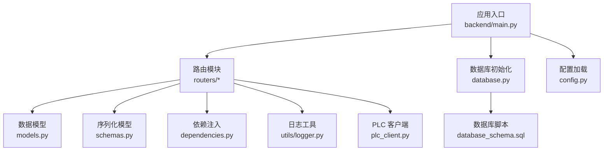
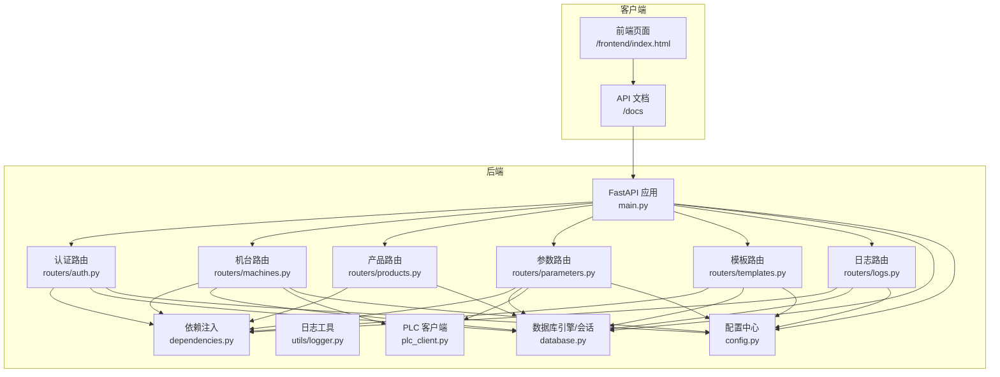
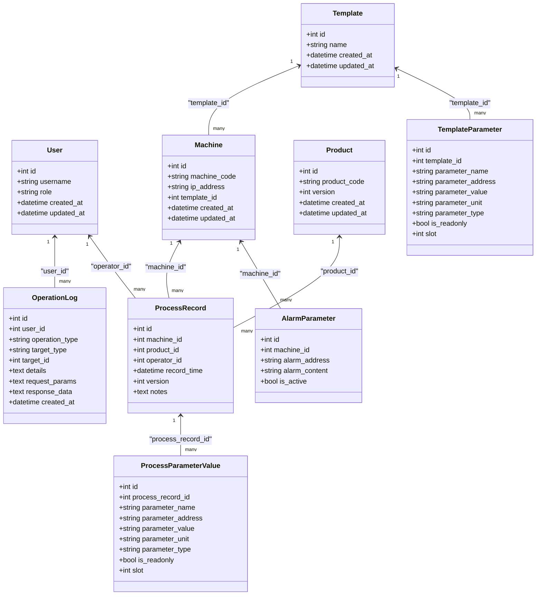
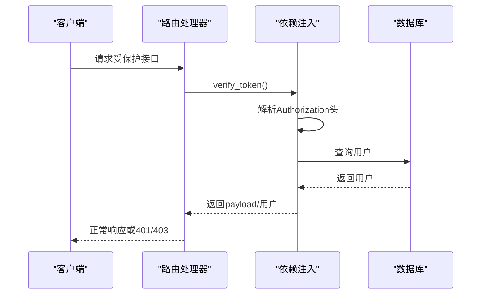
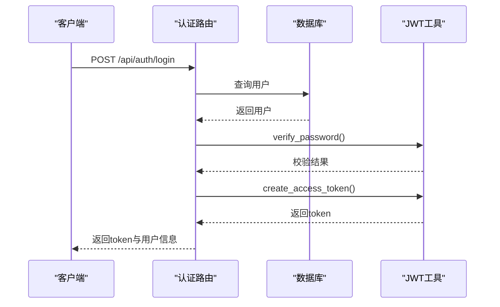
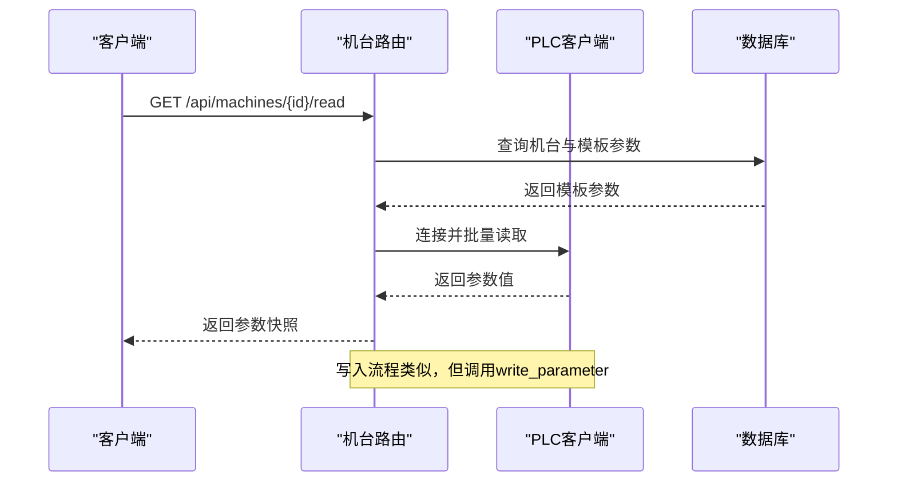
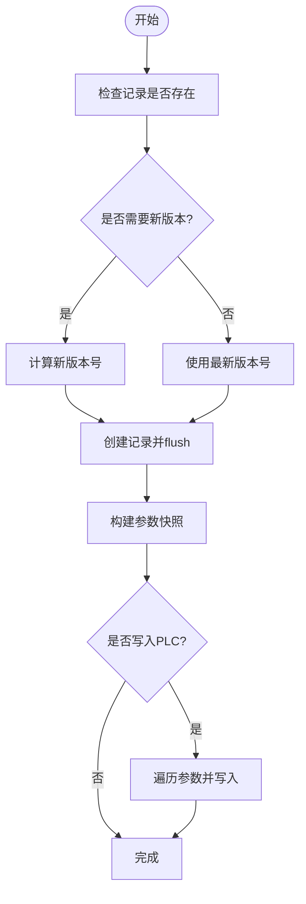
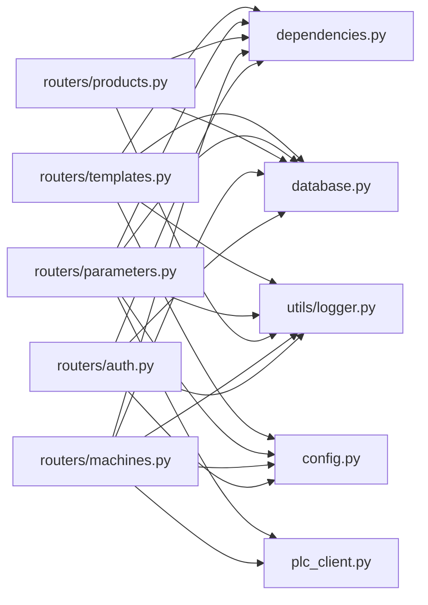

# 后端开发

<cite>
**本文引用的文件**
- [backend/main.py](file://backend/main.py)
- [backend/database.py](file://backend/database.py)
- [backend/config.py](file://backend/config.py)
- [backend/models.py](file://backend/models.py)
- [backend/schemas.py](file://backend/schemas.py)
- [backend/dependencies.py](file://backend/dependencies.py)
- [backend/utils/logger.py](file://backend/utils/logger.py)
- [backend/plc_client.py](file://backend/plc_client.py)
- [backend/routers/auth.py](file://backend/routers/auth.py)
- [backend/routers/machines.py](file://backend/routers/machines.py)
- [backend/routers/products.py](file://backend/routers/products.py)
- [backend/routers/parameters.py](file://backend/routers/parameters.py)
- [backend/routers/templates.py](file://backend/routers/templates.py)
- [backend/database_schema.sql](file://backend/database_schema.sql)
- [run.sh](file://run.sh)
</cite>

## 目录
1. [简介](#简介)
2. [项目结构](#项目结构)
3. [核心组件](#核心组件)
4. [架构总览](#架构总览)
5. [详细组件分析](#详细组件分析)
6. [依赖关系分析](#依赖关系分析)
7. [性能考虑](#性能考虑)
8. [故障排查指南](#故障排查指南)
9. [结论](#结论)
10. [附录](#附录)

## 简介
本指南面向后端开发者，系统讲解基于 FastAPI 的“挤出机工艺参数管理系统”的工程化实践，涵盖应用结构、路由模块设计、数据模型与 ORM、依赖注入、PLC 通信、日志与审计、以及调试、性能与错误处理策略。读者可据此快速理解并扩展各模块（用户管理、机台管理、参数管理、模板管理、生产记录与日志）。

## 项目结构
后端采用分层与按功能模块组织的结构：
- 应用入口与中间件：在应用入口集中注册 CORS、静态资源挂载、路由注册与启动事件。
- 配置与数据库：统一配置加载、数据库引擎与会话工厂、基础 ORM 元类。
- 路由模块：按业务域拆分，如认证、机台、产品、参数、模板、日志。
- 数据模型与序列化：SQLAlchemy 模型与 Pydantic Schema。
- 依赖注入：JWT 校验、用户解析、管理员校验。
- 日志与审计：统一操作日志落盘与数据库双写。
- PLC 通信：封装 Snap7 客户端，支持读写多种地址类型与多槽位切换。

图表来源
- [backend/main.py:12-31](file://backend/main.py#L12-L31)
- [backend/database.py:1-18](file://backend/database.py#L1-L18)
- [backend/config.py:1-35](file://backend/config.py#L1-L35)
- [backend/models.py:1-133](file://backend/models.py#L1-L133)
- [backend/schemas.py:1-190](file://backend/schemas.py#L1-L190)
- [backend/dependencies.py:1-50](file://backend/dependencies.py#L1-L50)
- [backend/utils/logger.py:1-199](file://backend/utils/logger.py#L1-L199)
- [backend/plc_client.py:1-188](file://backend/plc_client.py#L1-L188)
- [backend/database_schema.sql:1-162](file://backend/database_schema.sql#L1-L162)

章节来源
- [backend/main.py:12-31](file://backend/main.py#L12-L31)
- [backend/database.py:1-18](file://backend/database.py#L1-L18)
- [backend/config.py:1-35](file://backend/config.py#L1-L35)

## 核心组件
- 应用入口与生命周期
  - 注册 CORS、静态资源挂载前端目录、注册全部路由。
  - 启动事件中自动创建数据库与表结构，初始化默认管理员。
- 数据库与 ORM
  - 使用 SQLAlchemy 声明式基类与会话工厂；通过依赖注入提供 Session。
  - 关系映射覆盖用户、机台、产品、模板、参数、记录、日志、报警等。
- 配置中心
  - 通过 Pydantic Settings 加载 .env，集中管理数据库与 JWT、PLC 相关配置。
- 依赖注入
  - JWT 解析与校验、当前用户解析、管理员权限校验。
- 路由模块
  - 认证：登录、用户 CRUD、改密。
  - 机台：列表、增删改、状态检测、PLC 读写、模板绑定/解绑。
  - 产品：列表、增删改。
  - 参数：保存参数快照、查询记录、写入 PLC。
  - 模板：模板 CRUD、模板参数 CRUD、按机台获取模板。
  - 日志：操作日志查询。
- 日志与审计
  - 统一日志落盘与数据库双写，支持清理过期日志。
- PLC 通信
  - 支持 Int/Real/Bool/VW/VD/VB/VC/V.x/Cn/Tn 等地址类型，多槽位切换与连接复用。

章节来源
- [backend/main.py:37-72](file://backend/main.py#L37-L72)
- [backend/database.py:1-18](file://backend/database.py#L1-L18)
- [backend/config.py:1-35](file://backend/config.py#L1-L35)
- [backend/dependencies.py:1-50](file://backend/dependencies.py#L1-L50)
- [backend/utils/logger.py:1-199](file://backend/utils/logger.py#L1-L199)
- [backend/plc_client.py:1-188](file://backend/plc_client.py#L1-L188)

## 架构总览
下图展示从客户端到数据库与 PLC 的整体调用链路，以及模块间的依赖关系。

图表来源
- [backend/main.py:12-31](file://backend/main.py#L12-L31)
- [backend/routers/auth.py:1-114](file://backend/routers/auth.py#L1-L114)
- [backend/routers/machines.py:1-260](file://backend/routers/machines.py#L1-L260)
- [backend/routers/products.py:1-75](file://backend/routers/products.py#L1-L75)
- [backend/routers/parameters.py:1-278](file://backend/routers/parameters.py#L1-L278)
- [backend/routers/templates.py:1-300](file://backend/routers/templates.py#L1-L300)
- [backend/dependencies.py:1-50](file://backend/dependencies.py#L1-L50)
- [backend/utils/logger.py:1-199](file://backend/utils/logger.py#L1-L199)
- [backend/plc_client.py:1-188](file://backend/plc_client.py#L1-L188)
- [backend/database.py:1-18](file://backend/database.py#L1-L18)
- [backend/config.py:1-35](file://backend/config.py#L1-L35)

## 详细组件分析

### 应用入口与生命周期
- 功能要点
  - 注册 CORS、静态资源挂载前端目录。
  - include_router 注册全部业务路由。
  - startup 事件中：
    - 自动创建数据库与表结构。
    - 初始化默认管理员用户（若不存在）。
- 最佳实践
  - 将数据库创建与表结构初始化放在 startup 中，确保部署一致性。
  - 使用环境变量控制数据库与 JWT 配置，避免硬编码。

章节来源
- [backend/main.py:12-31](file://backend/main.py#L12-L31)
- [backend/main.py:37-72](file://backend/main.py#L37-L72)

### 数据库与 ORM
- 数据模型
  - 用户、机台、产品、模板、模板参数、工艺记录、记录参数快照、操作日志、报警参数。
  - 关系映射：用户与操作日志、机台与模板/记录、产品与记录、记录与参数快照、模板与参数。
- 复杂度与索引
  - 多处使用外键约束与级联删除，保证数据一致性。
  - 为高频查询字段建立索引（如 code、record_time、target_type 等）。
- 性能建议
  - 对复杂查询使用延迟加载与连接合并（例如使用 joinedload）。
  - 批量写入时使用 flush/commit 分离，减少锁竞争。

图表来源
- [backend/models.py:6-133](file://backend/models.py#L6-L133)

章节来源
- [backend/models.py:6-133](file://backend/models.py#L6-L133)
- [backend/database_schema.sql:1-162](file://backend/database_schema.sql#L1-L162)

### 配置中心
- 管理项
  - 数据库连接信息、JWT 密钥与算法、Token 过期时间、PLC 端口与 DB 号。
- 最佳实践
  - 使用 .env 文件隔离敏感配置；生产环境务必替换默认密钥。
  - 将配置以字典形式导出供数据库与 PLC 模块使用。

章节来源
- [backend/config.py:1-35](file://backend/config.py#L1-L35)

### 依赖注入与安全
- 当前用户解析
  - 从 Authorization 头提取 Bearer Token，解码校验后查询用户。
- 管理员权限
  - 在需要的路由上依赖管理员用户，拒绝非管理员访问。
- 最佳实践
  - 所有受保护路由均需携带有效 Token。
  - 对关键操作（用户管理、模板删除、参数写入）增加管理员校验。

图表来源
- [backend/dependencies.py:38-50](file://backend/dependencies.py#L38-L50)
- [backend/routers/auth.py:50-92](file://backend/routers/auth.py#L50-L92)

章节来源
- [backend/dependencies.py:1-50](file://backend/dependencies.py#L1-L50)

### 认证与用户管理
- 登录
  - 校验用户名与密码（兼容旧哈希），签发 JWT。
- 用户 CRUD
  - 创建用户需唯一用户名，管理员权限。
  - 删除用户禁止删除 admin。
  - 修改密码长度限制与格式校验。
- 最佳实践
  - 强制密码最小长度与复杂度策略。
  - 记录用户相关操作日志。

图表来源
- [backend/routers/auth.py:38-48](file://backend/routers/auth.py#L38-L48)
- [backend/routers/auth.py:19-27](file://backend/routers/auth.py#L19-L27)
- [backend/routers/auth.py:29-36](file://backend/routers/auth.py#L29-L36)

章节来源
- [backend/routers/auth.py:1-114](file://backend/routers/auth.py#L1-L114)

### 机台管理
- 列表、创建、更新、删除
  - 分页查询与总数统计。
- 状态检测
  - 通过 PLC 客户端尝试连接判断在线/离线/错误。
- PLC 读写
  - 读取模板参数并批量从 PLC 读取；写入时根据模板/槽位选择 slot。
- 模板绑定/解绑
  - 绑定后机台参数读写基于模板。
- 最佳实践
  - 读写前必须校验模板与 IP 地址配置。
  - 记录 PLC 读写日志便于审计。

图表来源
- [backend/routers/machines.py:107-183](file://backend/routers/machines.py#L107-L183)
- [backend/routers/machines.py:185-222](file://backend/routers/machines.py#L185-L222)
- [backend/routers/machines.py:224-260](file://backend/routers/machines.py#L224-L260)
- [backend/plc_client.py:51-114](file://backend/plc_client.py#L51-L114)
- [backend/plc_client.py:115-180](file://backend/plc_client.py#L115-L180)

章节来源
- [backend/routers/machines.py:1-260](file://backend/routers/machines.py#L1-L260)
- [backend/plc_client.py:1-188](file://backend/plc_client.py#L1-L188)

### 产品管理
- 列表、创建、更新、删除
  - 更新时版本号递增。
  - 删除前检查是否存在关联生产记录。
- 最佳实践
  - 产品删除需谨慎，避免破坏历史记录完整性。

章节来源
- [backend/routers/products.py:1-75](file://backend/routers/products.py#L1-L75)

### 参数与记录管理
- 保存参数快照
  - 生成新版本记录，写入参数快照。
- 查询记录
  - 支持按机台/产品过滤，分页返回。
- 写入 PLC
  - 逐个参数转换类型并写入，跳过只读参数。
- 最佳实践
  - 写入前校验记录与参数有效性。
  - 类型转换严格按参数类型执行。

图表来源
- [backend/routers/parameters.py:50-102](file://backend/routers/parameters.py#L50-L102)
- [backend/routers/parameters.py:151-199](file://backend/routers/parameters.py#L151-L199)
- [backend/routers/parameters.py:201-246](file://backend/routers/parameters.py#L201-L246)

章节来源
- [backend/routers/parameters.py:1-278](file://backend/routers/parameters.py#L1-L278)

### 模板管理
- 模板 CRUD 与参数 CRUD
  - 支持批量参数导入与更新。
- 按机台获取模板
  - 返回模板参数清单，便于前端渲染。
- 最佳实践
  - 模板参数变更应同步影响绑定机台的参数读取。

章节来源
- [backend/routers/templates.py:1-300](file://backend/routers/templates.py#L1-L300)

### 日志与审计
- 操作日志
  - 统一落盘与数据库双写，支持清理过期日志。
  - 提供多种日志记录函数（PLC 读写、机台/产品/模板/参数/用户操作等）。
- 最佳实践
  - 敏感字段不落盘，必要时仅记录摘要。
  - 定期清理日志，避免磁盘膨胀。

章节来源
- [backend/utils/logger.py:1-199](file://backend/utils/logger.py#L1-L199)

## 依赖关系分析
- 组件耦合
  - 路由模块依赖依赖注入与数据库会话；部分路由依赖 PLC 客户端。
  - 日志工具被各路由调用，形成横切关注点。
- 外部依赖
  - FastAPI、SQLAlchemy、Pydantic、snap7、passlib、jose（JWT）。
- 循环依赖
  - 未发现直接循环依赖；路由与工具模块通过函数调用解耦。

图表来源
- [backend/routers/auth.py:1-114](file://backend/routers/auth.py#L1-L114)
- [backend/routers/machines.py:1-260](file://backend/routers/machines.py#L1-L260)
- [backend/routers/products.py:1-75](file://backend/routers/products.py#L1-L75)
- [backend/routers/parameters.py:1-278](file://backend/routers/parameters.py#L1-L278)
- [backend/routers/templates.py:1-300](file://backend/routers/templates.py#L1-L300)
- [backend/dependencies.py:1-50](file://backend/dependencies.py#L1-L50)
- [backend/database.py:1-18](file://backend/database.py#L1-L18)
- [backend/plc_client.py:1-188](file://backend/plc_client.py#L1-L188)
- [backend/config.py:1-35](file://backend/config.py#L1-L35)
- [backend/utils/logger.py:1-199](file://backend/utils/logger.py#L1-L199)

章节来源
- [backend/routers/auth.py:1-114](file://backend/routers/auth.py#L1-L114)
- [backend/routers/machines.py:1-260](file://backend/routers/machines.py#L1-L260)
- [backend/routers/products.py:1-75](file://backend/routers/products.py#L1-L75)
- [backend/routers/parameters.py:1-278](file://backend/routers/parameters.py#L1-L278)
- [backend/routers/templates.py:1-300](file://backend/routers/templates.py#L1-L300)
- [backend/dependencies.py:1-50](file://backend/dependencies.py#L1-L50)
- [backend/database.py:1-18](file://backend/database.py#L1-L18)
- [backend/plc_client.py:1-188](file://backend/plc_client.py#L1-L188)
- [backend/config.py:1-35](file://backend/config.py#L1-L35)
- [backend/utils/logger.py:1-199](file://backend/utils/logger.py#L1-L199)

## 性能考虑
- 数据库层
  - 使用索引覆盖高频查询字段（如 code、record_time、target_type）。
  - 批量插入使用 flush/commit 分离，减少锁竞争。
  - 对复杂查询使用 joinedload 减少 N+1 查询。
- 应用层
  - PLC 读写采用连接复用与按需切换槽位，避免频繁重连。
  - 对大量参数读取采用批量读取方法（如 read_multiple_parameters）。
- 缓存与限流
  - 对只读列表接口可引入 Redis 缓存与分页缓存。
  - 对登录与写入操作增加速率限制与 IP 黑名单。
- 监控与日志
  - 记录慢查询与异常堆栈，结合 APM 工具定位瓶颈。

## 故障排查指南
- 启动阶段
  - 数据库创建失败：检查主机、端口、账号与字符集设置。
  - 表结构创建失败：确认数据库连接与权限。
  - 默认管理员创建失败：检查密码哈希与唯一性约束。
- 认证问题
  - 401 未授权：检查 Authorization 头是否携带 Bearer Token。
  - 403 权限不足：确认用户角色为 admin。
- 机台与 PLC
  - 读取失败：检查机台 IP、Rack、Slot、模板绑定与参数地址。
  - 写入失败：确认参数类型与只读属性，必要时调整 slot。
- 日志与审计
  - 日志文件未生成：检查日志目录权限与路径。
  - 日志清理失败：检查日期格式与文件权限。

章节来源
- [backend/main.py:37-72](file://backend/main.py#L37-L72)
- [backend/routers/auth.py:38-48](file://backend/routers/auth.py#L38-L48)
- [backend/routers/machines.py:107-183](file://backend/routers/machines.py#L107-L183)
- [backend/routers/machines.py:185-222](file://backend/routers/machines.py#L185-L222)
- [backend/utils/logger.py:17-30](file://backend/utils/logger.py#L17-L30)

## 结论
本项目以 FastAPI 为核心，结合 SQLAlchemy、Pydantic、snap7 等技术栈，实现了从用户管理、机台与产品管理、模板与参数管理到生产记录与日志审计的完整闭环。通过清晰的模块划分、完善的依赖注入与安全机制、以及对 PLC 通信的抽象封装，项目具备良好的可维护性与扩展性。建议在生产环境中进一步完善缓存、限流、监控与安全加固措施。

## 附录
- 快速启动
  - 使用 run.sh 脚本一键安装依赖、创建数据库并启动后端服务。
- 数据库脚本
  - database_schema.sql 提供完整的建表与示例数据，便于本地测试与迁移。

章节来源
- [run.sh:1-24](file://run.sh#L1-L24)
- [backend/database_schema.sql:1-162](file://backend/database_schema.sql#L1-L162)