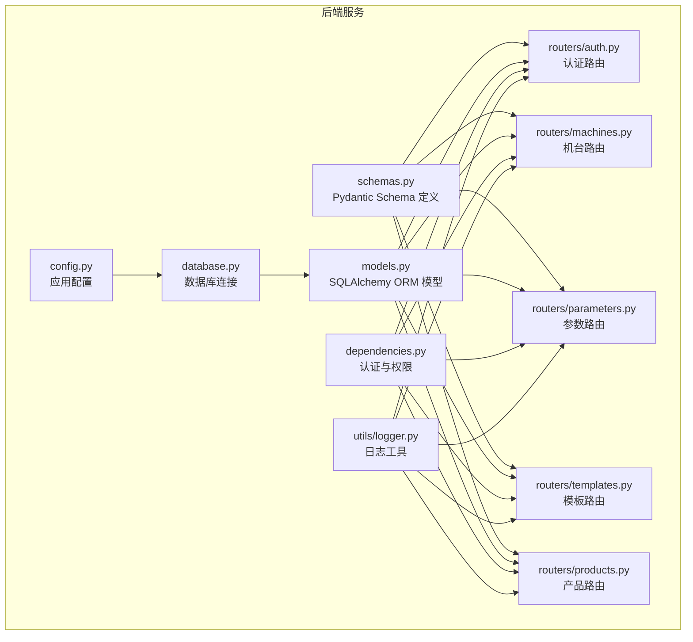
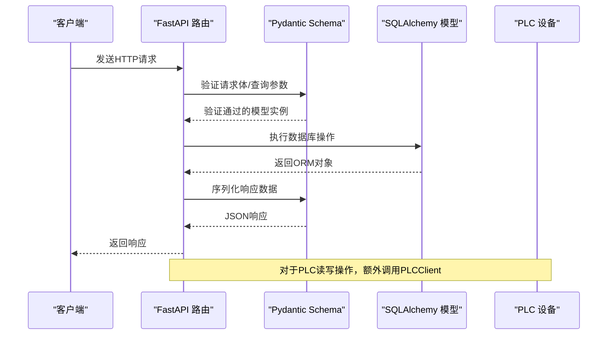
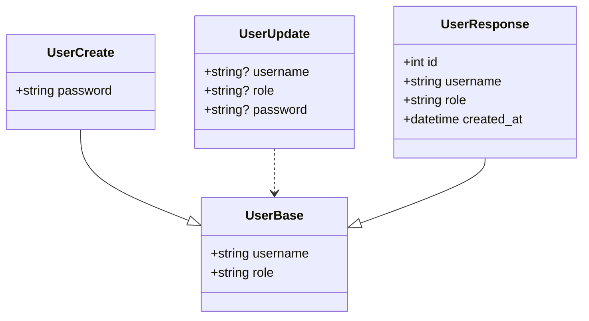
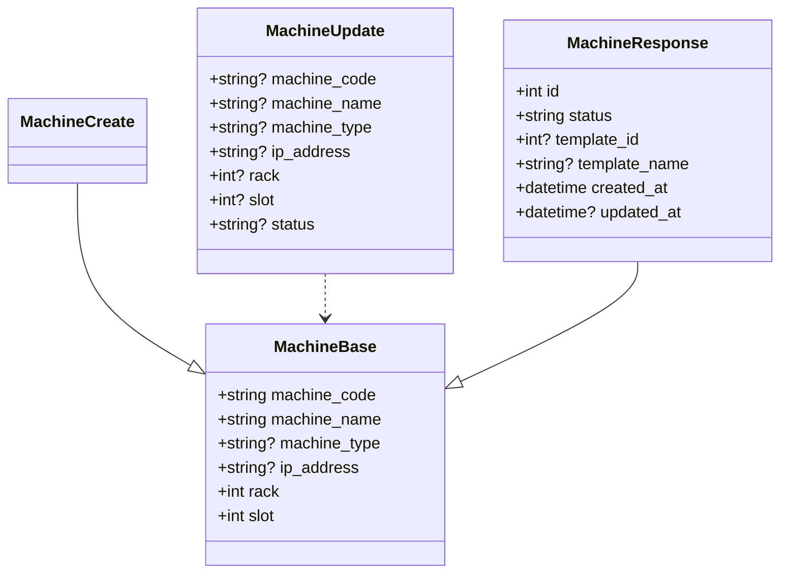
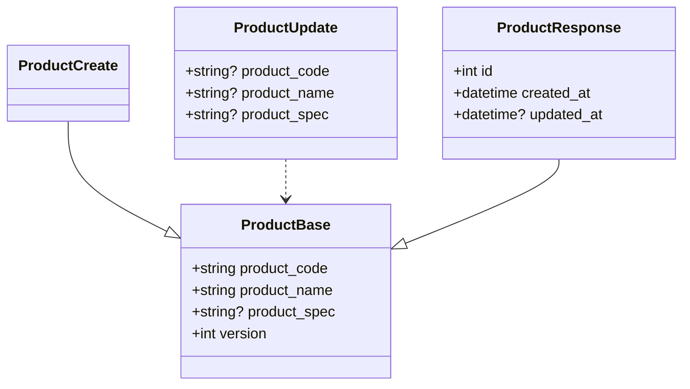
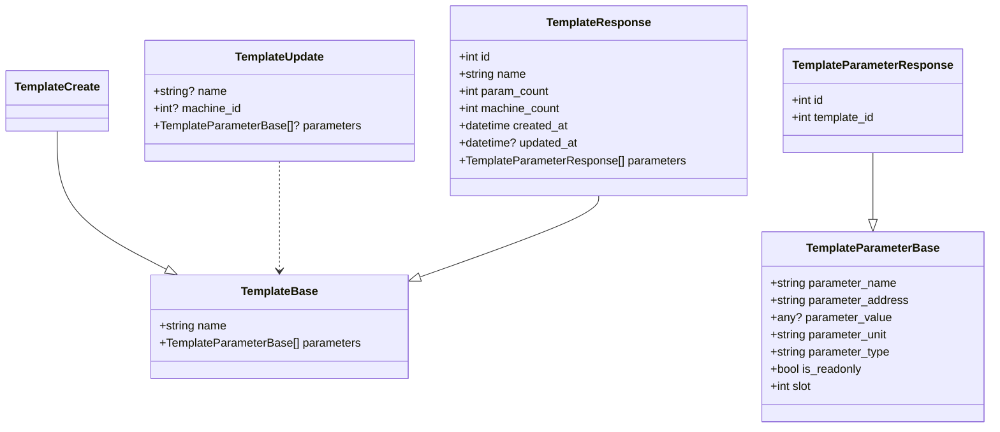
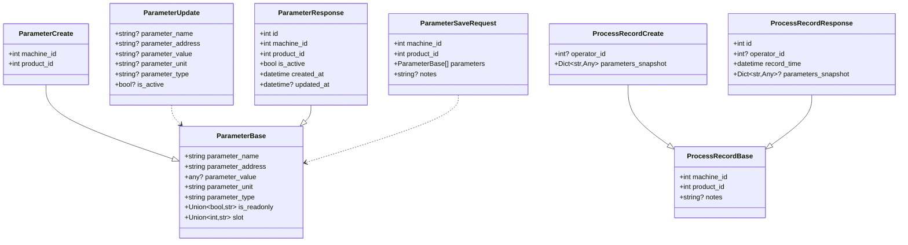
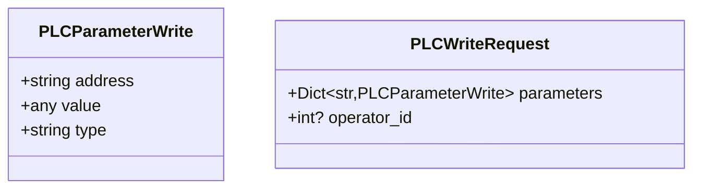
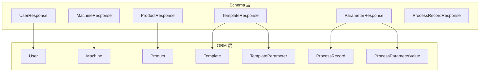

# Pydantic数据模型

<cite>
**本文档引用的文件**
- [schemas.py](file://backend/schemas.py)
- [models.py](file://backend/models.py)
- [main.py](file://backend/main.py)
- [auth.py](file://backend/routers/auth.py)
- [machines.py](file://backend/routers/machines.py)
- [parameters.py](file://backend/routers/parameters.py)
- [templates.py](file://backend/routers/templates.py)
- [products.py](file://backend/routers/products.py)
- [dependencies.py](file://backend/dependencies.py)
- [logger.py](file://backend/utils/logger.py)
- [database.py](file://backend/database.py)
- [config.py](file://backend/config.py)
- [requirements.txt](file://requirements.txt)
</cite>

## 目录
1. [简介](#简介)
2. [项目结构](#项目结构)
3. [核心组件](#核心组件)
4. [架构总览](#架构总览)
5. [详细组件分析](#详细组件分析)
6. [依赖关系分析](#依赖关系分析)
7. [性能考虑](#性能考虑)
8. [故障排除指南](#故障排除指南)
9. [结论](#结论)
10. [附录](#附录)

## 简介
本项目基于FastAPI与Pydantic构建，实现了完整的挤出机工艺参数管理系统。Pydantic数据模型在系统中承担着三大职责：
- 请求数据验证：确保API接收的数据符合预期的数据类型、范围和约束
- 响应数据格式化：统一输出结构，保证前后端交互的一致性
- 数据转换规则：在数据库模型与API模型之间进行类型转换和字段映射

本文档将深入解析各Schema类的字段定义、数据类型验证、默认值设置、嵌套模型处理，并提供API请求参数验证、响应数据结构定义和数据序列化的实际代码示例，同时涵盖数据验证错误处理和自定义验证器的使用方法。

## 项目结构
项目采用分层架构，核心文件组织如下：
- backend/schemas.py：定义所有Pydantic数据模型（Schema）
- backend/models.py：定义SQLAlchemy ORM模型
- backend/routers/*：按功能模块划分的API路由
- backend/utils/logger.py：操作日志记录工具
- backend/dependencies.py：认证与权限依赖
- backend/database.py：数据库连接与会话管理
- backend/config.py：应用配置（含Pydantic Settings）

**图表来源**
- [schemas.py:1-190](file://backend/schemas.py#L1-L190)
- [models.py:1-133](file://backend/models.py#L1-L133)
- [auth.py:1-114](file://backend/routers/auth.py#L1-L114)
- [machines.py:1-260](file://backend/routers/machines.py#L1-L260)
- [parameters.py:1-278](file://backend/routers/parameters.py#L1-L278)
- [templates.py:1-300](file://backend/routers/templates.py#L1-L300)
- [products.py:1-75](file://backend/routers/products.py#L1-L75)
- [dependencies.py:1-50](file://backend/dependencies.py#L1-L50)
- [logger.py:1-199](file://backend/utils/logger.py#L1-L199)
- [database.py:1-18](file://backend/database.py#L1-L18)
- [config.py:1-35](file://backend/config.py#L1-L35)

**章节来源**
- [main.py:1-77](file://backend/main.py#L1-L77)
- [requirements.txt:1-11](file://requirements.txt#L1-L11)

## 核心组件
本项目的核心数据模型围绕以下实体展开：用户、机台、产品、模板、参数、工艺记录等。每个实体都配有对应的Base/Create/Update/Response四类Schema，用于区分不同场景下的数据验证和序列化需求。

- 用户模型：UserBase、UserCreate、UserUpdate、UserResponse
- 机台模型：MachineBase、MachineCreate、MachineUpdate、MachineResponse
- 产品模型：ProductBase、ProductCreate、ProductUpdate、ProductResponse
- 模板模型：TemplateBase、TemplateCreate、TemplateUpdate、TemplateResponse
- 参数模型：ParameterBase、ParameterCreate、ParameterUpdate、ParameterResponse
- 工艺记录模型：ProcessRecordBase、ProcessRecordCreate、ProcessRecordResponse
- 认证模型：LoginRequest、LoginResponse
- PLC通信模型：PLCParameterWrite、PLCWriteRequest

这些Schema通过Pydantic的类型注解、默认值、可选字段和嵌套模型，实现了严格的输入验证和输出格式化。

**章节来源**
- [schemas.py:5-190](file://backend/schemas.py#L5-L190)

## 架构总览
下图展示了API请求从客户端到数据库的完整流程，以及Pydantic Schema在其中的作用：

**图表来源**
- [auth.py:38-48](file://backend/routers/auth.py#L38-L48)
- [machines.py:32-47](file://backend/routers/machines.py#L32-L47)
- [parameters.py:50-102](file://backend/routers/parameters.py#L50-L102)
- [templates.py:34-72](file://backend/routers/templates.py#L34-L72)

## 详细组件分析

### 用户模型（User）
用户模型用于认证、用户管理和权限控制。其Schema设计体现了最小必要字段原则和安全考虑。

**图表来源**
- [schemas.py:5-22](file://backend/schemas.py#L5-L22)

字段定义与验证要点：
- UserBase：用户名必填，角色默认为"operator"
- UserCreate：密码必填，用于创建新用户
- UserUpdate：所有字段均为可选，支持部分字段更新
- UserResponse：包含主键id和创建时间，配置from_attributes以支持ORM对象直接序列化

认证与登录流程：
- 登录接口使用LoginRequest进行请求验证，返回LoginResponse包含访问令牌和用户信息
- 密码哈希使用bcrypt，兼容旧版SHA256方案

**章节来源**
- [schemas.py:5-31](file://backend/schemas.py#L5-L31)
- [auth.py:38-48](file://backend/routers/auth.py#L38-L48)

### 机台模型（Machine）
机台模型负责设备管理，包含网络配置、状态管理和模板绑定。

**图表来源**
- [schemas.py:33-62](file://backend/schemas.py#L33-L62)

字段定义与验证要点：
- MachineBase：机台编号唯一且必填，IP地址和槽位配置用于PLC通信
- MachineUpdate：支持选择性字段更新，状态字段用于显示设备在线状态
- MachineResponse：包含模板关联信息和时间戳，配置from_attributes

PLC通信集成：
- 读取参数时根据模板参数批量读取
- 写入参数时支持按模板槽位或机台默认槽位写入
- 提供模板绑定/解绑功能

**章节来源**
- [schemas.py:33-62](file://backend/schemas.py#L33-L62)
- [machines.py:107-183](file://backend/routers/machines.py#L107-L183)
- [machines.py:185-222](file://backend/routers/machines.py#L185-L222)
- [machines.py:224-260](file://backend/routers/machines.py#L224-L260)

### 产品模型（Product）
产品模型用于产品管理，支持版本控制和关联校验。

**图表来源**
- [schemas.py:64-84](file://backend/schemas.py#L64-L84)

字段定义与验证要点：
- ProductBase：产品编号唯一且必填，版本号用于历史记录追踪
- ProductUpdate：支持选择性字段更新，更新时自动递增版本号

业务约束：
- 删除产品前需检查是否存在相关生产记录，防止数据完整性破坏

**章节来源**
- [schemas.py:64-84](file://backend/schemas.py#L64-L84)
- [products.py:56-75](file://backend/routers/products.py#L56-L75)

### 模板模型（Template）
模板模型定义了标准工艺参数集合，支持参数的增删改查和批量绑定。

**图表来源**
- [schemas.py:107-145](file://backend/schemas.py#L107-L145)

字段定义与验证要点：
- TemplateParameterBase：参数名称、地址、类型、单位、只读标记和槽位
- TemplateResponse：包含参数计数、机台绑定数量和参数列表
- TemplateUpdate：支持名称、机台ID和参数列表的选择性更新

模板参数管理：
- 支持添加、更新、删除模板参数
- 获取模板参数列表和单个参数详情

**章节来源**
- [schemas.py:107-145](file://backend/schemas.py#L107-L145)
- [templates.py:153-300](file://backend/routers/templates.py#L153-L300)

### 参数模型（Parameter）
参数模型用于工艺参数的保存、快照和PLC写入。

**图表来源**
- [schemas.py:86-190](file://backend/schemas.py#L86-L190)

字段定义与验证要点：
- ParameterBase：参数基础信息，支持布尔和字符串类型的只读标记及槽位
- ParameterSaveRequest：批量保存参数时的请求结构
- ProcessRecordCreate：支持参数快照字典的创建
- ProcessRecordResponse：包含参数快照字典，便于序列化

参数保存流程：
- 保存时自动计算版本号，支持从模板参数推导槽位
- 写入PLC时根据参数类型进行类型转换（Real/Int/Bool）

**章节来源**
- [schemas.py:86-190](file://backend/schemas.py#L86-L190)
- [parameters.py:50-102](file://backend/routers/parameters.py#L50-L102)
- [parameters.py:151-199](file://backend/routers/parameters.py#L151-L199)
- [parameters.py:201-246](file://backend/routers/parameters.py#L201-L246)

### PLC通信模型（PLC）
PLC通信模型封装了与西门子PLC的交互细节。

**图表来源**
- [schemas.py:182-190](file://backend/schemas.py#L182-L190)

字段定义与验证要点：
- PLCParameterWrite：参数地址、值和类型
- PLCWriteRequest：批量参数写入请求，支持操作员标识

**章节来源**
- [schemas.py:182-190](file://backend/schemas.py#L182-L190)
- [machines.py:185-222](file://backend/routers/machines.py#L185-L222)
- [parameters.py:201-246](file://backend/routers/parameters.py#L201-L246)

## 依赖关系分析
Pydantic Schema与SQLAlchemy ORM模型之间的映射关系是系统的关键。通过from_attributes配置，Schema可以直接从ORM对象序列化，避免重复的字段映射代码。

**图表来源**
- [schemas.py:17-22](file://backend/schemas.py#L17-L22)
- [schemas.py:53-62](file://backend/schemas.py#L53-L62)
- [schemas.py:78-84](file://backend/schemas.py#L78-L84)
- [schemas.py:135-145](file://backend/schemas.py#L135-L145)
- [schemas.py:147-156](file://backend/schemas.py#L147-L156)
- [models.py:6-17](file://backend/models.py#L6-L17)
- [models.py:19-35](file://backend/models.py#L19-L35)
- [models.py:37-48](file://backend/models.py#L37-L48)
- [models.py:81-104](file://backend/models.py#L81-L104)

**章节来源**
- [schemas.py:17-22](file://backend/schemas.py#L17-L22)
- [schemas.py:53-62](file://backend/schemas.py#L53-L62)
- [schemas.py:78-84](file://backend/schemas.py#L78-L84)
- [schemas.py:135-145](file://backend/schemas.py#L135-L145)
- [schemas.py:147-156](file://backend/schemas.py#L147-L156)
- [models.py:6-17](file://backend/models.py#L6-L17)
- [models.py:19-35](file://backend/models.py#L19-L35)
- [models.py:37-48](file://backend/models.py#L37-L48)
- [models.py:81-104](file://backend/models.py#L81-L104)

## 性能考虑
- Schema验证开销：Pydantic在每次请求进入路由时都会进行验证，建议合理设计Schema层级，避免过度嵌套
- 序列化优化：使用from_attributes可减少手动映射，但要注意避免不必要的字段加载
- 批量操作：PLC读写采用批量处理，减少网络往返次数
- 缓存策略：对于频繁访问的模板参数，可在应用层增加缓存机制

## 故障排除指南
常见验证错误与处理：
- 用户名或密码错误：登录接口返回401状态码，提示认证失败
- 重复的机台编号/产品编号：创建时抛出400状态码，提示资源已存在
- 机台未配置IP地址：PLC读写操作前进行校验，避免无效连接
- 模板不存在或未绑定：模板相关操作前进行存在性检查

自定义验证器使用：
- 密码强度验证：在用户密码变更时检查长度和复杂度
- 权限验证：通过verify_token中间件确保请求携带有效JWT令牌
- 类型转换：在参数写入PLC前根据参数类型进行正确的数据转换

**章节来源**
- [auth.py:38-48](file://backend/routers/auth.py#L38-L48)
- [auth.py:58-74](file://backend/routers/auth.py#L58-L74)
- [machines.py:107-183](file://backend/routers/machines.py#L107-L183)
- [machines.py:185-222](file://backend/routers/machines.py#L185-L222)
- [dependencies.py:38-50](file://backend/dependencies.py#L38-L50)
- [parameters.py:201-246](file://backend/routers/parameters.py#L201-L246)

## 结论
本项目通过精心设计的Pydantic Schema，实现了从请求验证到响应序列化的全链路数据治理。Schema与ORM模型的清晰分离，使得代码具有良好的可维护性和扩展性。通过合理的默认值设置、可选字段设计和嵌套模型处理，系统在保证数据一致性的同时，提供了灵活的API接口。

## 附录

### API请求参数验证示例路径
- 登录请求验证：[auth.py:38-48](file://backend/routers/auth.py#L38-L48)
- 创建用户请求验证：[auth.py:58-74](file://backend/routers/auth.py#L58-L74)
- 创建机台请求验证：[machines.py:32-47](file://backend/routers/machines.py#L32-L47)
- 保存工艺参数请求验证：[parameters.py:50-102](file://backend/routers/parameters.py#L50-L102)
- 创建模板请求验证：[templates.py:34-72](file://backend/routers/templates.py#L34-L72)
- 创建产品请求验证：[products.py:20-35](file://backend/routers/products.py#L20-L35)

### 响应数据结构定义示例路径
- 登录响应结构：[schemas.py:28-31](file://backend/schemas.py#L28-L31)
- 机台响应结构：[schemas.py:53-62](file://backend/schemas.py#L53-L62)
- 模板响应结构：[schemas.py:135-145](file://backend/schemas.py#L135-L145)
- 参数响应结构：[schemas.py:147-156](file://backend/schemas.py#L147-L156)
- 工艺记录响应结构：[schemas.py:173-180](file://backend/schemas.py#L173-L180)

### 数据序列化示例路径
- ORM对象序列化：[schemas.py:17-22](file://backend/schemas.py#L17-L22)
- 模板参数序列化：[templates.py:12-32](file://backend/routers/templates.py#L12-L32)
- 工艺记录序列化：[parameters.py:104-149](file://backend/routers/parameters.py#L104-L149)

### 数据验证错误处理示例路径
- 认证错误处理：[dependencies.py:38-50](file://backend/dependencies.py#L38-L50)
- 资源存在性检查：[auth.py:63-65](file://backend/routers/auth.py#L63-L65)
- PLC连接错误处理：[machines.py:120-121](file://backend/routers/machines.py#L120-L121)