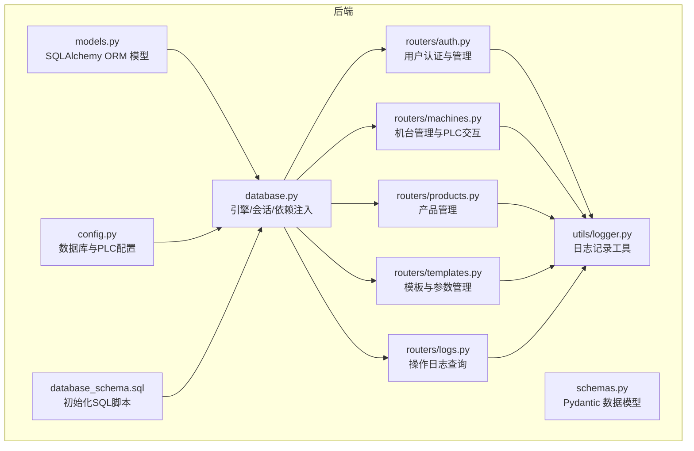
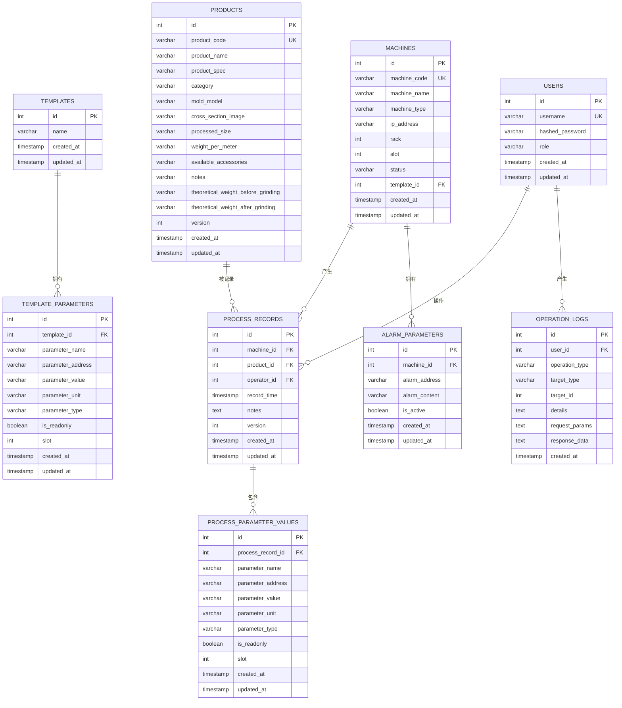
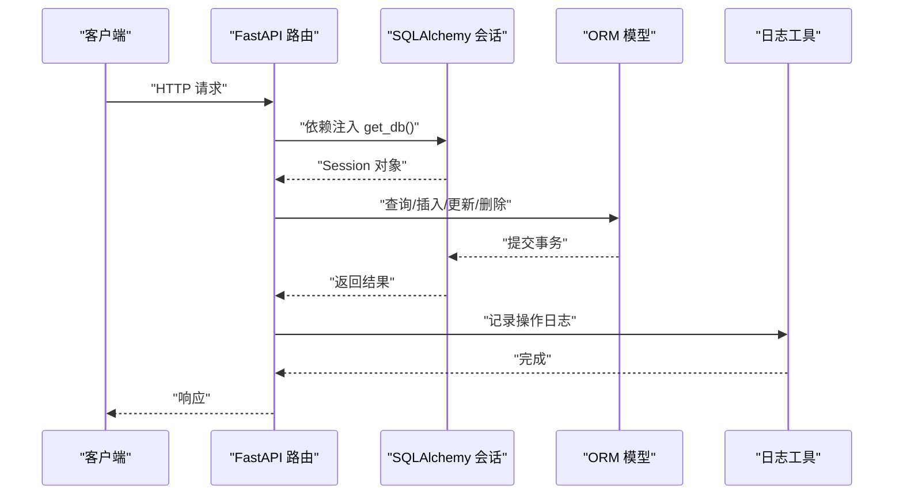
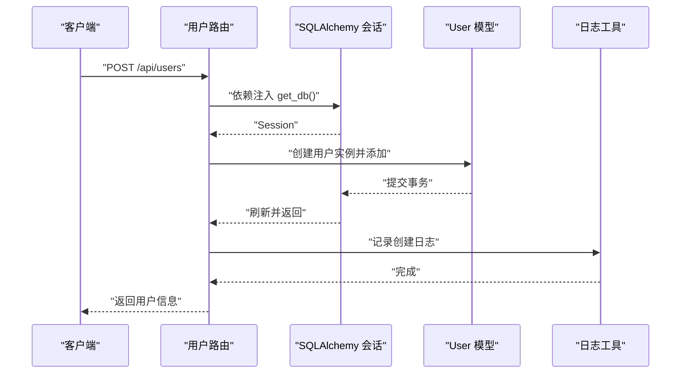

# 数据库模型

<cite>
**本文引用的文件**
- [models.py](file://backend/models.py)
- [database.py](file://backend/database.py)
- [database_schema.sql](file://backend/database_schema.sql)
- [schemas.py](file://backend/schemas.py)
- [auth.py](file://backend/routers/auth.py)
- [machines.py](file://backend/routers/machines.py)
- [products.py](file://backend/routers/products.py)
- [templates.py](file://backend/routers/templates.py)
- [logs.py](file://backend/routers/logs.py)
- [logger.py](file://backend/utils/logger.py)
- [config.py](file://backend/config.py)
</cite>

## 更新摘要
**变更内容**
- 更新 Product 模型部分，新增多个产品属性字段
- 更新数据库表结构描述，反映新增字段
- 更新数据传输对象（Pydantic）定义
- 更新数据库迁移脚本说明

## 目录
1. [简介](#简介)
2. [项目结构](#项目结构)
3. [核心组件](#核心组件)
4. [架构总览](#架构总览)
5. [详细组件分析](#详细组件分析)
6. [依赖分析](#依赖分析)
7. [性能考虑](#性能考虑)
8. [故障排查指南](#故障排查指南)
9. [结论](#结论)
10. [附录](#附录)

## 简介
本文件系统性梳理了基于 SQLAlchemy 的数据库模型与表结构，覆盖以下实体类：User、Machine、Product、ProcessRecord、ProcessParameterValue、Template、TemplateParameter、OperationLog、AlarmParameter。内容包括：
- 字段定义、数据类型、约束条件与索引设计
- 实体间关系映射（一对一、一对多、多对多）、外键与级联策略
- 常见 CRUD 场景的调用流程与最佳实践
- 与 FastAPI 路由层的交互模式与日志记录机制

## 项目结构
后端采用分层组织：模型定义在 models.py，数据库引擎与会话在 database.py，SQL 初始化脚本在 database_schema.sql，API 路由在 routers 下，数据传输对象在 schemas.py，日志工具在 utils/logger.py，数据库配置在 config.py。

**图表来源**
- [models.py:1-142](file://backend/models.py#L1-L142)
- [database.py:1-18](file://backend/database.py#L1-L18)
- [database_schema.sql:1-182](file://backend/database_schema.sql#L1-L182)
- [schemas.py:1-208](file://backend/schemas.py#L1-L208)
- [auth.py:1-114](file://backend/routers/auth.py#L1-L114)
- [machines.py:1-260](file://backend/routers/machines.py#L1-L260)
- [products.py:1-75](file://backend/routers/products.py#L1-L75)
- [templates.py:1-300](file://backend/routers/templates.py#L1-L300)
- [logs.py:1-137](file://backend/routers/logs.py#L1-L137)
- [logger.py:1-199](file://backend/utils/logger.py#L1-L199)
- [config.py:1-35](file://backend/config.py#L1-L35)

**章节来源**
- [models.py:1-142](file://backend/models.py#L1-L142)
- [database.py:1-18](file://backend/database.py#L1-L18)
- [database_schema.sql:1-182](file://backend/database_schema.sql#L1-L182)
- [schemas.py:1-208](file://backend/schemas.py#L1-L208)

## 核心组件
本节概述各实体类的职责与关键字段，便于快速建立整体认知。

- User：系统用户，支持登录、角色管理与操作审计
- Machine：挤出机台，关联模板与报警参数，支持状态检测
- Product：产品信息，版本控制与关联生产记录，**新增多个产品属性字段**
- ProcessRecord：工艺记录，关联机台、产品、操作员与参数快照
- ProcessParameterValue：参数值快照，随记录生成并可级联删除
- Template：模板，承载一组模板参数
- TemplateParameter：模板参数，随模板级联删除
- OperationLog：操作日志，记录用户行为与请求/响应摘要
- AlarmParameter：报警参数，与机台关联，支持启用/停用

**章节来源**
- [models.py:6-142](file://backend/models.py#L6-L142)

## 架构总览
下图展示模型间的依赖与关系映射，包括外键、级联策略与索引设计要点。

**图表来源**
- [models.py:6-142](file://backend/models.py#L6-L142)
- [database_schema.sql:7-182](file://backend/database_schema.sql#L7-L182)

## 详细组件分析

### User（用户）
- 表名：users
- 主键：id（自增）
- 关键字段与约束：
  - username：唯一、非空、带索引
  - hashed_password：非空
  - role：默认"operator"
  - created_at/updated_at：自动时间戳
- 关系：
  - 与 OperationLog（一对多）：back_populates
  - 与 ProcessRecord（一对多）：back_populates
- 索引：username

**章节来源**
- [models.py:6-17](file://backend/models.py#L6-L17)
- [database_schema.sql:8-16](file://backend/database_schema.sql#L8-L16)

### Machine（机台）
- 表名：machines
- 主键：id（自增）
- 关键字段与约束：
  - machine_code：唯一、非空、带索引
  - machine_name：非空
  - template_id：外键到 templates.id，ON DELETE SET NULL
  - rack/slot：默认值
  - status：默认空字符串
  - created_at/updated_at：自动时间戳
- 关系：
  - 与 Template（多对一）：backref=machines
  - 与 ProcessRecord（一对多）：back_populates
  - 与 AlarmParameter（一对多）：backref=alarm_parameters
- 索引：machine_code、外键索引（由外键约束隐含）

**章节来源**
- [models.py:19-35](file://backend/models.py#L19-L35)
- [database_schema.sql:44-59](file://backend/database_schema.sql#L44-L59)

### Product（产品）
- 表名：products
- 主键：id（自增）
- 关键字段与约束：
  - product_code：唯一、非空、带索引
  - product_name：非空
  - product_spec：可选
  - **新增字段**：
    - category：产品类别，长度50
    - mold_model：模具型号，长度100
    - cross_section_image：截面图片URL，长度255
    - processed_size：处理后尺寸，长度200
    - weight_per_meter：每米重量，长度50
    - available_accessories：可用配件，长度200
    - notes：备注，长度500
    - theoretical_weight_before_grinding：打磨前理论重量，长度50
    - theoretical_weight_after_grinding：打磨后理论重量，长度50
  - version：默认1
  - created_at/updated_at：自动时间戳
- 关系：
  - 与 ProcessRecord（一对多）：back_populates
- 索引：product_code

**更新** 新增9个产品属性字段，用于更详细的产品信息管理

**章节来源**
- [models.py:37-57](file://backend/models.py#L37-L57)
- [database_schema.sql:61-71](file://backend/database_schema.sql#L61-L71)
- [database_schema.sql:173-182](file://backend/database_schema.sql#L173-L182)
- [schemas.py:64-102](file://backend/schemas.py#L64-L102)

### ProcessRecord（工艺记录）
- 表名：process_records
- 主键：id（自增）
- 关键字段与约束：
  - machine_id/product_id/operator_id：均为外键，均非空
  - record_time：默认当前时间、带索引
  - notes：文本
  - version：默认1
  - created_at/updated_at：自动时间戳
- 外键与级联：
  - machine_id：ON DELETE CASCADE
  - product_id：ON DELETE CASCADE
  - operator_id：ON DELETE SET NULL
- 关系：
  - 与 Machine/Product/User（多对一）：back_populates
  - 与 ProcessParameterValue（一对多，级联删除）：back_populates，cascade="all, delete-orphan"
- 索引：machine_id、product_id、operator_id、record_time

**章节来源**
- [models.py:59-73](file://backend/models.py#L59-L73)
- [database_schema.sql:73-91](file://backend/database_schema.sql#L73-L91)

### ProcessParameterValue（参数值快照）
- 表名：process_parameter_values
- 主键：id（自增）
- 关键字段与约束：
  - process_record_id：外键、非空、带索引
  - parameter_name/address/value/unit/type：按需非空
  - is_readonly：布尔，默认False
  - slot：默认1
  - created_at/updated_at：自动时间戳
- 外键与级联：
  - process_record_id：ON DELETE CASCADE
- 关系：
  - 与 ProcessRecord（多对一）：back_populates
- 索引：process_record_id、parameter_name

**章节来源**
- [models.py:75-88](file://backend/models.py#L75-L88)
- [database_schema.sql:93-107](file://backend/database_schema.sql#L93-L107)

### Template（模板）
- 表名：templates
- 主键：id（自增）
- 关键字段与约束：
  - name：非空
  - created_at/updated_at：自动时间戳
- 关系：
  - 与 TemplateParameter（一对多，级联删除）：back_populates，cascade="all, delete-orphan"
- 索引：无显式索引

**章节来源**
- [models.py:90-98](file://backend/models.py#L90-L98)
- [database_schema.sql:18-24](file://backend/database_schema.sql#L18-L24)

### TemplateParameter（模板参数）
- 表名：template_parameters
- 主键：id（自增）
- 关键字段与约束：
  - template_id：外键、非空、带索引
  - parameter_name/address/value/unit/type：按需非空
  - is_readonly：布尔，默认False
  - slot：默认1
  - created_at/updated_at：自动时间戳
- 外键与级联：
  - template_id：ON DELETE CASCADE
- 关系：
  - 与 Template（多对一）：back_populates
- 索引：template_id、parameter_name

**章节来源**
- [models.py:100-113](file://backend/models.py#L100-L113)
- [database_schema.sql:26-42](file://backend/database_schema.sql#L26-L42)

### OperationLog（操作日志）
- 表名：operation_logs
- 主键：id（自增）
- 关键字段与约束：
  - user_id：外键、可空、带索引
  - operation_type/target_type：非空、带索引
  - target_id：整数
  - details/request_params/response_data：文本
  - created_at：默认当前时间、带索引
- 外键与级联：
  - user_id：ON DELETE SET NULL
- 关系：
  - 与 User（多对一）：back_populates
- 索引：user_id、operation_type、target_type、created_at

**章节来源**
- [models.py:115-128](file://backend/models.py#L115-L128)
- [database_schema.sql:109-125](file://backend/database_schema.sql#L109-L125)

### AlarmParameter（报警参数）
- 表名：alarm_parameters
- 主键：id（自增）
- 关键字段与约束：
  - machine_id：外键、非空、带索引
  - alarm_address/alarm_content：非空、带索引
  - is_active：布尔，默认True、带索引
  - created_at/updated_at：自动时间戳
- 外键与级联：
  - machine_id：ON DELETE CASCADE
- 关系：
  - 与 Machine（多对一）：backref=alarm_parameters
- 索引：machine_id、alarm_address、is_active

**章节来源**
- [models.py:130-141](file://backend/models.py#L130-L141)
- [database_schema.sql:127-140](file://backend/database_schema.sql#L127-L140)

## 依赖分析
- 数据库引擎与会话
  - database.py 定义了 engine、SessionLocal 与 get_db 依赖注入函数，供路由层注入使用
- 配置
  - config.py 从环境变量读取数据库连接参数，并构造 DB_CONFIG
- 路由层
  - 各路由通过 get_db 获取会话，执行查询、插入、更新、删除
- 日志
  - utils/logger.py 提供统一的日志记录方法，路由层在关键操作后调用相应日志函数

**图表来源**
- [database.py:12-17](file://backend/database.py#L12-L17)
- [auth.py:58-74](file://backend/routers/auth.py#L58-L74)
- [logger.py:65-87](file://backend/utils/logger.py#L65-L87)

**章节来源**
- [database.py:1-18](file://backend/database.py#L1-L18)
- [config.py:22-29](file://backend/config.py#L22-L29)
- [auth.py:1-114](file://backend/routers/auth.py#L1-L114)
- [logger.py:1-199](file://backend/utils/logger.py#L1-L199)

## 性能考虑
- 索引策略
  - 高频过滤字段（如 username、machine_code、product_code、record_time、alarm_address、is_active、operation_type、target_type）均建立索引，有助于提升查询性能
- 外键与级联
  - 使用 ON DELETE CASCADE 自动清理子记录，避免悬挂数据；对可选关联使用 SET NULL，保持数据完整性
- 时间戳字段
  - 使用 server_default/onupdate 统一维护 created_at/updated_at，减少应用层逻辑复杂度
- 查询优化建议
  - 在路由层尽量使用精确过滤条件与分页（如分页参数 page/limit）
  - 对复杂查询结合索引字段进行排序与过滤
- 连接池与会话
  - 使用 pool_pre_ping 提升连接稳定性；确保每个请求正确关闭会话，避免连接泄漏

## 故障排查指南
- 登录失败
  - 可能原因：用户名不存在或密码校验失败
  - 排查路径：[auth.py:38-48](file://backend/routers/auth.py#L38-L48)
- 用户名重复
  - 可能原因：注册时用户名已存在
  - 排查路径：[auth.py:63-66](file://backend/routers/auth.py#L63-L66)
- 删除受限
  - 产品删除前需检查是否存在关联记录
  - 排查路径：[products.py:65-69](file://backend/routers/products.py#L65-L69)
- PLC 连接失败
  - 可能原因：机台未配置 IP 或连接异常
  - 排查路径：[machines.py:120-122](file://backend/routers/machines.py#L120-L122)
- 模板参数不存在
  - 可能原因：模板或参数ID错误
  - 排查路径：[templates.py:197-202](file://backend/routers/templates.py#L197-L202)
- 操作日志查询
  - 支持按操作类型、目标类型、用户、时间范围过滤
  - 排查路径：[logs.py:34-98](file://backend/routers/logs.py#L34-L98)

**章节来源**
- [auth.py:38-48](file://backend/routers/auth.py#L38-L48)
- [auth.py:63-66](file://backend/routers/auth.py#L63-L66)
- [products.py:65-69](file://backend/routers/products.py#L65-L69)
- [machines.py:120-122](file://backend/routers/machines.py#L120-L122)
- [templates.py:197-202](file://backend/routers/templates.py#L197-L202)
- [logs.py:34-98](file://backend/routers/logs.py#L34-L98)

## 结论
该数据库模型围绕"机台-产品-模板-记录-参数"的业务主线构建，通过清晰的外键关系与索引设计，实现了高内聚、低耦合的数据结构。配合 FastAPI 路由层与统一日志工具，形成完整的 CRUD 与审计能力。**最新更新增加了产品属性字段，增强了产品信息管理的详细程度**。建议在后续扩展中继续遵循现有索引与级联策略，确保数据一致性与查询性能。

## 附录

### A. 模型创建、查询、更新、删除的调用流程（序列图）
以下以用户管理为例，展示典型 CRUD 流程。

**图表来源**
- [auth.py:58-74](file://backend/routers/auth.py#L58-L74)
- [logger.py:186-187](file://backend/utils/logger.py#L186-L187)

### B. 数据库表结构设计原则与最佳实践
- 唯一性约束
  - 使用 unique=True 保证关键编码唯一（如 username、machine_code、product_code）
- 索引设计
  - 对高频过滤与排序字段建立索引，减少全表扫描
- 外键与级联
  - 明确删除策略：主记录删除时，子记录按需级联删除或置空
- 时间戳
  - 使用 server_default/onupdate 统一维护创建与更新时间
- 分页与过滤
  - 路由层提供分页参数，结合索引字段进行高效查询
- 日志审计
  - 所有关键操作均记录 OperationLog，便于追踪与审计

**章节来源**
- [models.py:6-142](file://backend/models.py#L6-L142)
- [database_schema.sql:7-182](file://backend/database_schema.sql#L7-L182)
- [logs.py:34-98](file://backend/routers/logs.py#L34-L98)

### C. 产品字段详细说明
**新增字段列表**：
- category（类别）：用于产品分类管理
- mold_model（模具型号）：记录使用的模具规格
- cross_section_image（截面图片）：产品截面图像URL
- processed_size（处理后尺寸）：最终产品的尺寸规格
- weight_per_meter（每米重量）：材料的线密度
- available_accessories（可用配件）：配套使用的辅助设备
- notes（备注）：额外的技术说明或注意事项
- theoretical_weight_before_grinding（打磨前理论重量）：加工前的理论重量值
- theoretical_weight_after_grinding（打磨后理论重量）：加工后的理论重量值

**字段特点**：
- 全部为可选字段，支持NULL值
- 字符串类型，长度根据用途设定
- 便于前端显示和管理产品详细信息
- 支持模糊查询和精确匹配

**章节来源**
- [models.py:44-52](file://backend/models.py#L44-L52)
- [database_schema.sql:173-182](file://backend/database_schema.sql#L173-L182)
- [schemas.py:68-76](file://backend/schemas.py#L68-L76)