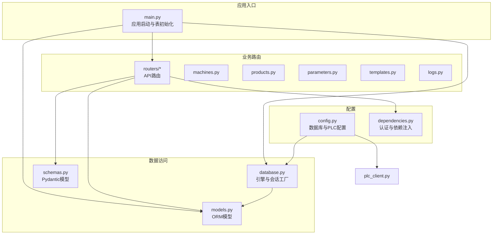
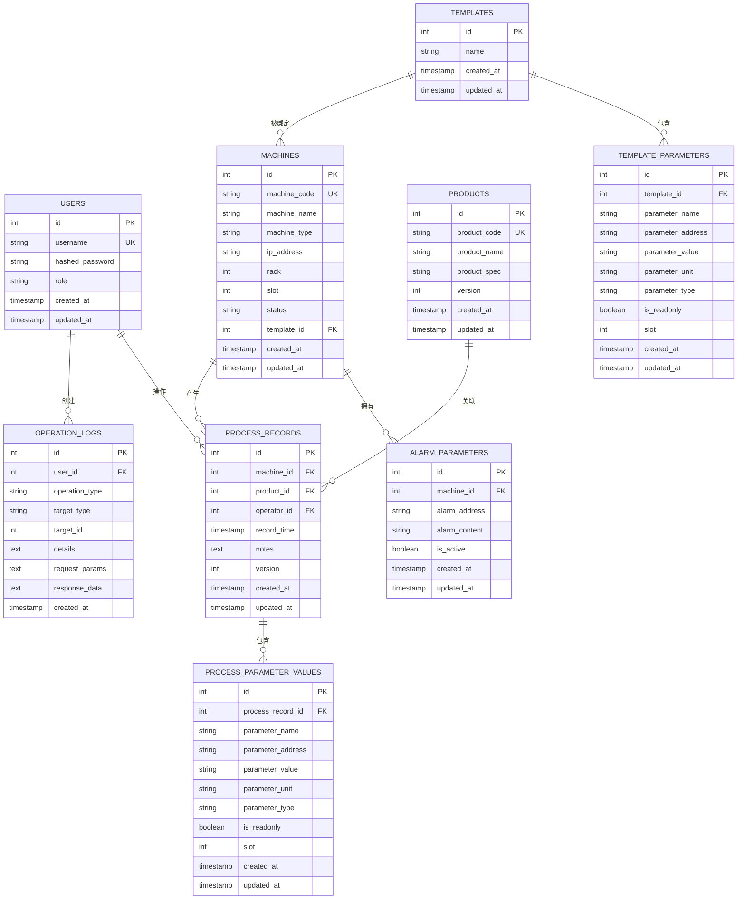
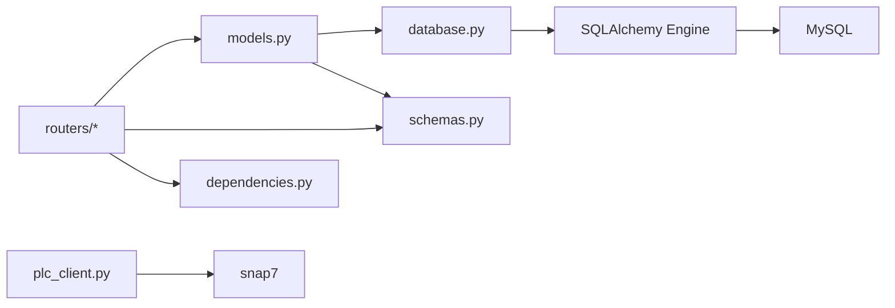

# 数据模型设计

<cite>
**本文档引用的文件**
- [models.py](file://backend/models.py)
- [schemas.py](file://backend/schemas.py)
- [database.py](file://backend/database.py)
- [database_schema.sql](file://backend/database_schema.sql)
- [main.py](file://backend/main.py)
- [machines.py](file://backend/routers/machines.py)
- [products.py](file://backend/routers/products.py)
- [parameters.py](file://backend/routers/parameters.py)
- [templates.py](file://backend/routers/templates.py)
- [logs.py](file://backend/routers/logs.py)
- [config.py](file://backend/config.py)
- [dependencies.py](file://backend/dependencies.py)
- [plc_client.py](file://backend/plc_client.py)
</cite>

## 目录
1. [简介](#简介)
2. [项目结构](#项目结构)
3. [核心组件](#核心组件)
4. [架构总览](#架构总览)
5. [详细组件分析](#详细组件分析)
6. [依赖关系分析](#依赖关系分析)
7. [性能考虑](#性能考虑)
8. [故障排除指南](#故障排除指南)
9. [结论](#结论)
10. [附录](#附录)

## 简介
本文件系统性梳理了挤出机工艺参数管理系统的数据模型设计，涵盖：
- SQLAlchemy ORM 模型定义与字段类型、约束配置
- 实体关系设计与外键约束、索引策略
- Pydantic 数据模型定义、验证规则与序列化配置
- 模型创建、查询与更新的典型流程与示例路径

目标是帮助开发者快速理解模型间关系、约束与使用方式，并为后续扩展与维护提供清晰参考。

## 项目结构
后端采用分层架构：
- 数据访问层：SQLAlchemy ORM 模型与数据库会话管理
- 业务逻辑层：FastAPI 路由与依赖注入
- 数据传输层：Pydantic 模型用于请求/响应校验与序列化
- 配置与工具：数据库连接配置、PLC 通信客户端、日志工具等

图表来源
- [main.py:37-56](file://backend/main.py#L37-L56)
- [database.py:1-18](file://backend/database.py#L1-L18)
- [models.py:1-133](file://backend/models.py#L1-L133)
- [schemas.py:1-190](file://backend/schemas.py#L1-L190)
- [dependencies.py:1-50](file://backend/dependencies.py#L1-L50)
- [machines.py:1-260](file://backend/routers/machines.py#L1-L260)
- [products.py:1-75](file://backend/routers/products.py#L1-L75)
- [parameters.py:1-278](file://backend/routers/parameters.py#L1-L278)
- [templates.py:1-300](file://backend/routers/templates.py#L1-L300)
- [logs.py:1-137](file://backend/routers/logs.py#L1-L137)
- [config.py:22-35](file://backend/config.py#L22-L35)

章节来源
- [main.py:1-77](file://backend/main.py#L1-L77)
- [database.py:1-18](file://backend/database.py#L1-L18)
- [models.py:1-133](file://backend/models.py#L1-L133)
- [schemas.py:1-190](file://backend/schemas.py#L1-L190)

## 核心组件
本系统围绕以下核心实体构建：
- 用户（User）：系统使用者，支持角色区分
- 机台（Machine）：设备实体，可绑定模板
- 产品（Product）：产品配方或规格
- 工艺记录（ProcessRecord）：一次工艺执行的快照与版本控制
- 工艺参数值（ProcessParameterValue）：记录参数的快照
- 模板（Template）：参数模板集合
- 模板参数（TemplateParameter）：模板中的具体参数项
- 操作日志（OperationLog）：审计与追踪
- 报警参数（AlarmParameter）：设备报警参数

章节来源
- [models.py:6-133](file://backend/models.py#L6-L133)

## 架构总览
下图展示模型间的实体关系与外键约束，体现一对多、一对一与级联行为。

图表来源
- [models.py:6-133](file://backend/models.py#L6-L133)
- [database_schema.sql:7-140](file://backend/database_schema.sql#L7-L140)

## 详细组件分析

### SQLAlchemy ORM 模型定义与约束
- 字段类型与约束
  - 主键：所有实体均定义主键，使用整型自增
  - 唯一性：用户名、机台编号、产品编号在数据库层面设置唯一约束
  - 默认值：角色、机台 rack/slot、模板参数类型、报警状态等设置默认值
  - 时间戳：统一使用带时区的时间列，配合服务器默认值与更新触发
  - 索引：关键查询字段建立索引以优化查询性能
- 外键与级联
  - 机台模板：模板删除时，机台模板字段设为空（SET NULL）
  - 工艺记录：删除机台或产品时，级联删除相关记录（CASCADE）
  - 操作日志：用户删除时，日志中的用户字段设为空（SET NULL）
  - 参数值：随记录删除而级联清理（delete-orphan）

章节来源
- [models.py:6-133](file://backend/models.py#L6-L133)
- [database_schema.sql:7-140](file://backend/database_schema.sql#L7-L140)

### 关系映射与级联行为
- 一对一
  - 机台与模板：机台可选地绑定一个模板
  - 机台与报警参数：机台拥有多条报警参数
- 一对多
  - 用户与操作日志：用户创建多个操作日志
  - 用户与工艺记录：用户作为操作者创建多个记录
  - 机台与工艺记录：机台产生多个记录
  - 产品与工艺记录：产品关联多个记录
  - 模板与模板参数：模板包含多个参数
  - 工艺记录与参数值：记录包含多个参数快照
- 级联与删除策略
  - CASCADE：删除机台或产品时，相关记录与参数值同步删除
  - SET NULL：删除用户或模板时，引用字段清空，保持数据完整性

章节来源
- [models.py:16-17](file://backend/models.py#L16-L17)
- [models.py:34-35](file://backend/models.py#L34-L35)
- [models.py:64](file://backend/models.py#L64)
- [models.py:89](file://backend/models.py#L89)
- [models.py:119](file://backend/models.py#L119)

### Pydantic 数据模型与验证规则
- 用户模型
  - 基础字段：用户名、角色
  - 创建/更新：密码仅在创建时必填；更新允许部分字段
  - 序列化：from_attributes 支持从 ORM 对象直接序列化
- 设备与产品模型
  - 设备：机台编号、名称、类型、IP、rack/slot 等
  - 产品：产品编号、名称、规格、版本号
- 模板与参数模型
  - 模板：名称与参数列表
  - 参数：名称、地址、值、单位、类型、只读标记、槽位等
- 工艺记录与参数保存
  - 记录：机台、产品、备注、版本号
  - 参数保存：参数快照字典，支持批量保存
- PLC 写入请求
  - 参数字典：地址、值、类型
  - 可选操作员标识

章节来源
- [schemas.py:5-32](file://backend/schemas.py#L5-L32)
- [schemas.py:33-84](file://backend/schemas.py#L33-L84)
- [schemas.py:86-157](file://backend/schemas.py#L86-L157)
- [schemas.py:158-190](file://backend/schemas.py#L158-L190)

### 数据库初始化与表结构
- 启动时自动创建数据库与表结构
- 默认管理员用户创建
- SQL 脚本定义了完整的表结构、索引与示例数据

章节来源
- [main.py:37-72](file://backend/main.py#L37-L72)
- [database_schema.sql:1-162](file://backend/database_schema.sql#L1-L162)

### 典型使用流程与示例路径

#### 创建机台
- 请求路径：POST /api/machines
- 示例路径：[machines.py:32-47](file://backend/routers/machines.py#L32-L47)
- 关键点：
  - 校验机台编号唯一性
  - 写入数据库并返回响应模型
  - 记录操作日志

#### 更新产品
- 请求路径：PUT /api/products/{product_id}
- 示例路径：[products.py:37-54](file://backend/routers/products.py#L37-L54)
- 关键点：
  - 使用 Pydantic 更新模型，支持部分字段更新
  - 自动递增版本号

#### 保存工艺参数
- 请求路径：POST /api/process-parameters
- 示例路径：[parameters.py:50-102](file://backend/routers/parameters.py#L50-L102)
- 关键点：
  - 生成新版本的工艺记录
  - 批量保存参数快照
  - 与模板槽位信息联动

#### 绑定模板到机台
- 请求路径：POST /api/machines/{machine_id}/bind-template
- 示例路径：[machines.py:224-245](file://backend/routers/machines.py#L224-L245)
- 关键点：
  - 校验模板存在性
  - 设置机台模板字段

#### 读取PLC参数
- 请求路径：GET /api/machines/{machine_id}/read
- 示例路径：[machines.py:107-183](file://backend/routers/machines.py#L107-L183)
- 关键点：
  - 通过模板参数批量读取
  - PLC 客户端按地址与类型解析值

#### 写入PLC参数
- 请求路径：POST /api/machines/{machine_id}/write
- 示例路径：[machines.py:185-222](file://backend/routers/machines.py#L185-L222)
- 关键点：
  - 逐个参数写入，支持只读跳过
  - 类型转换与槽位选择

#### 查询操作日志
- 请求路径：GET /api/operation-logs
- 示例路径：[logs.py:34-98](file://backend/routers/logs.py#L34-L98)
- 关键点：
  - 支持按操作类型、目标类型、用户、时间范围过滤
  - 返回 JSON 化的请求与响应数据

章节来源
- [machines.py:32-47](file://backend/routers/machines.py#L32-L47)
- [products.py:37-54](file://backend/routers/products.py#L37-L54)
- [parameters.py:50-102](file://backend/routers/parameters.py#L50-L102)
- [machines.py:107-183](file://backend/routers/machines.py#L107-L183)
- [machines.py:185-222](file://backend/routers/machines.py#L185-L222)
- [logs.py:34-98](file://backend/routers/logs.py#L34-L98)

## 依赖关系分析
- 模型依赖
  - 所有模型继承自同一 Base，共享元数据与引擎
  - 关系属性定义跨表关联，实现 ORM 导航
- 路由依赖
  - 路由函数依赖数据库会话与 Pydantic 模型进行数据校验与序列化
  - 依赖认证中间件与依赖注入获取当前用户
- 外部依赖
  - 数据库：MySQL（pymysql）
  - ORM：SQLAlchemy
  - 序列化：Pydantic
  - PLC 通信：snap7

图表来源
- [models.py:1-133](file://backend/models.py#L1-L133)
- [database.py:1-18](file://backend/database.py#L1-L18)
- [schemas.py:1-190](file://backend/schemas.py#L1-L190)
- [dependencies.py:1-50](file://backend/dependencies.py#L1-L50)
- [plc_client.py:1-188](file://backend/plc_client.py#L1-L188)

章节来源
- [models.py:1-133](file://backend/models.py#L1-L133)
- [database.py:1-18](file://backend/database.py#L1-L18)
- [schemas.py:1-190](file://backend/schemas.py#L1-L190)
- [dependencies.py:1-50](file://backend/dependencies.py#L1-L50)
- [plc_client.py:1-188](file://backend/plc_client.py#L1-L188)

## 性能考虑
- 索引策略
  - 在高频查询字段上建立索引（如用户名、机台编号、记录时间、参数名等），提升查询效率
- 关系加载
  - 使用延迟加载与联结加载结合，避免 N+1 查询问题
- 级联删除
  - 合理使用 CASCADE 与 SET NULL，减少孤立数据，同时避免过度级联导致的性能问题
- 批量操作
  - 参数保存与PLC读写采用批量处理，减少往返次数
- 连接池
  - 使用预检查连接池参数，确保连接稳定性

章节来源
- [database_schema.sql:15-162](file://backend/database_schema.sql#L15-L162)
- [machines.py:15-30](file://backend/routers/machines.py#L15-L30)
- [parameters.py:104-149](file://backend/routers/parameters.py#L104-L149)

## 故障排除指南
- 数据库连接失败
  - 检查数据库配置与网络连通性
  - 确认数据库已创建且字符集匹配
- 权限与认证
  - 确保请求头携带有效的 Bearer Token
  - 管理员权限路由需满足角色要求
- PLC 通信异常
  - 校验 IP、Rack、Slot 配置
  - 确认地址格式与类型匹配
- 数据重复与唯一性冲突
  - 机台编号、用户名、产品编号唯一，避免重复提交
- 级联删除与外键约束
  - 删除前确认是否存在关联记录，避免违反外键约束

章节来源
- [config.py:22-35](file://backend/config.py#L22-L35)
- [dependencies.py:38-50](file://backend/dependencies.py#L38-L50)
- [machines.py:107-183](file://backend/routers/machines.py#L107-L183)
- [products.py:65-69](file://backend/routers/products.py#L65-L69)

## 结论
本系统通过清晰的实体关系设计、严格的字段约束与索引策略，以及完善的 Pydantic 数据模型，实现了从用户管理、设备与产品管理、模板与参数管理到工艺记录与PLC交互的完整闭环。ORM 层与路由层分离明确，便于扩展与维护。建议在后续迭代中持续关注索引与查询性能、PLC 地址规范与类型一致性，以及日志与审计的完善。

## 附录

### 字段类型与约束对照表
- 用户（User）
  - 字段：id、username（唯一）、hashed_password、role、created_at、updated_at
  - 约束：唯一索引（username）
- 机台（Machine）
  - 字段：id、machine_code（唯一）、machine_name、machine_type、ip_address、rack、slot、status、template_id、created_at、updated_at
  - 约束：唯一索引（machine_code），外键（template_id）
- 产品（Product）
  - 字段：id、product_code（唯一）、product_name、product_spec、version、created_at、updated_at
  - 约束：唯一索引（product_code）
- 工艺记录（ProcessRecord）
  - 字段：id、machine_id、product_id、operator_id、record_time、notes、version、created_at、updated_at
  - 约束：外键（machine_id、product_id、operator_id），索引（record_time）
- 工艺参数值（ProcessParameterValue）
  - 字段：id、process_record_id、parameter_name、parameter_address、parameter_value、parameter_unit、parameter_type、is_readonly、slot
  - 约束：外键（process_record_id），索引（parameter_name）
- 模板（Template）
  - 字段：id、name、created_at、updated_at
- 模板参数（TemplateParameter）
  - 字段：id、template_id、parameter_name、parameter_address、parameter_value、parameter_unit、parameter_type、is_readonly、slot
  - 约束：外键（template_id），索引（parameter_name）
- 操作日志（OperationLog）
  - 字段：id、user_id、operation_type、target_type、target_id、details、request_params、response_data、created_at
  - 约束：外键（user_id），索引（operation_type、target_type、created_at）
- 报警参数（AlarmParameter）
  - 字段：id、machine_id、alarm_address、alarm_content、is_active、created_at、updated_at
  - 约束：外键（machine_id），索引（alarm_address、is_active）

章节来源
- [models.py:6-133](file://backend/models.py#L6-L133)
- [database_schema.sql:7-140](file://backend/database_schema.sql#L7-L140)