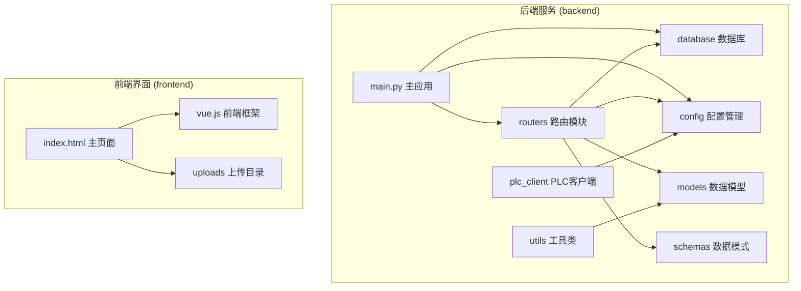
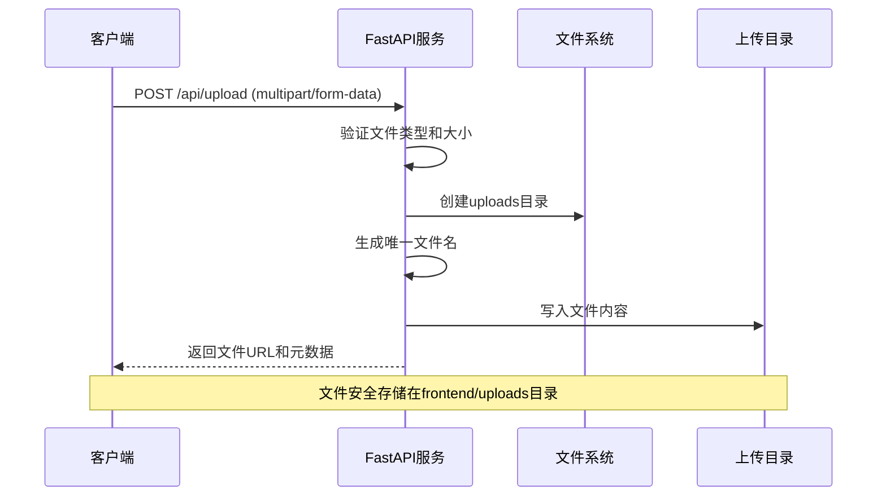
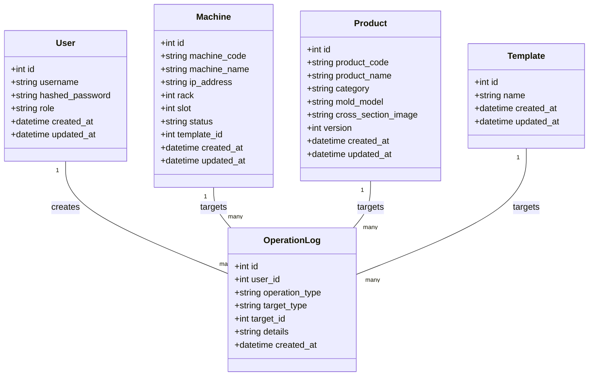
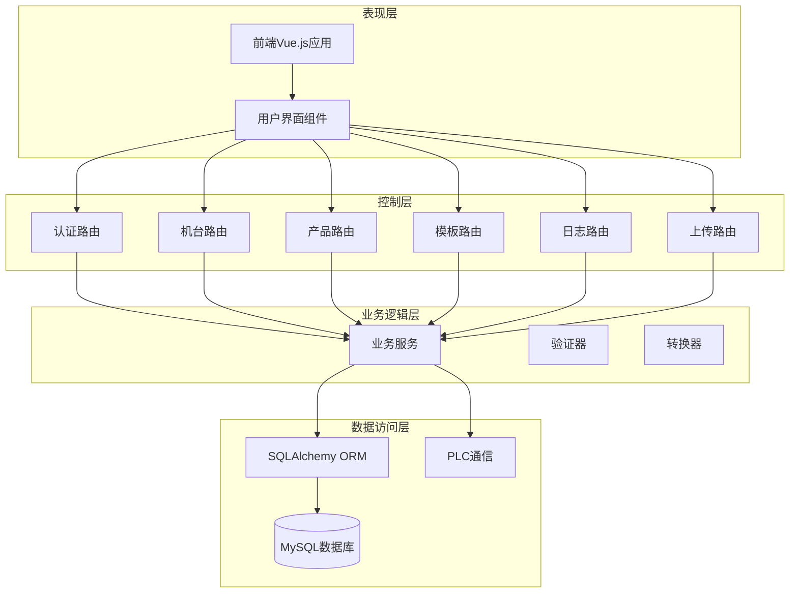
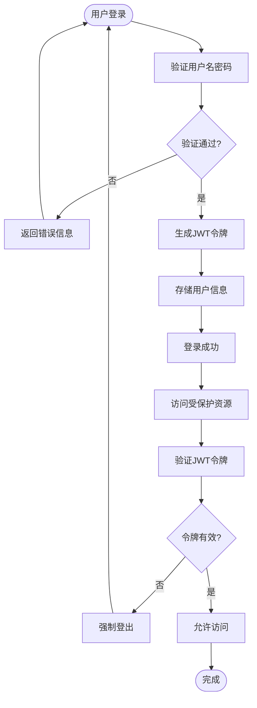
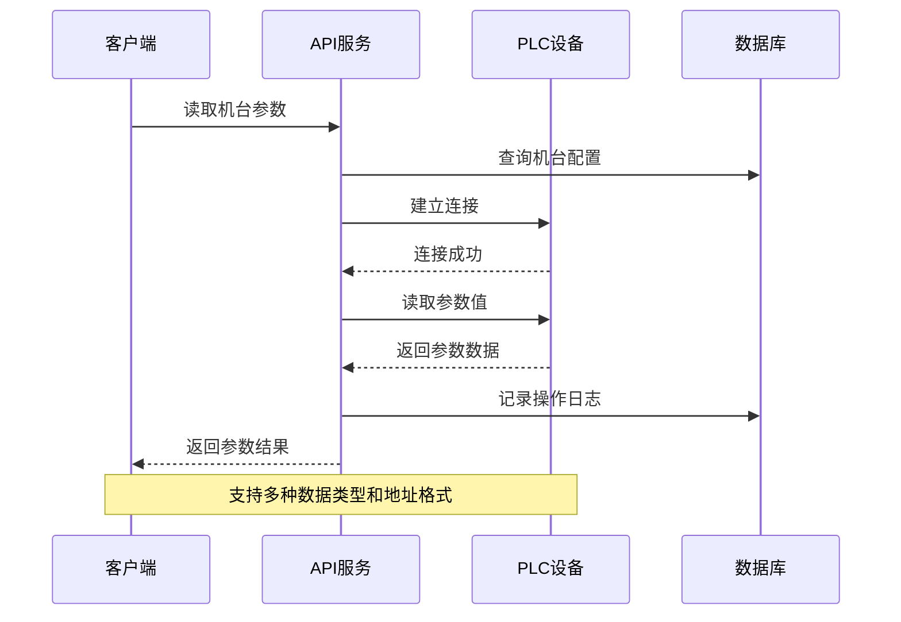
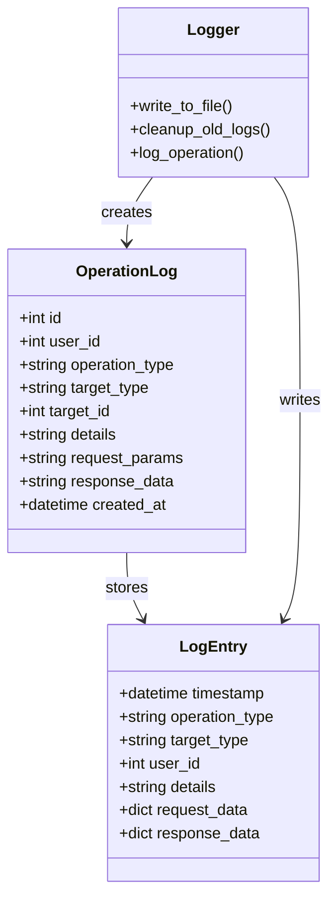
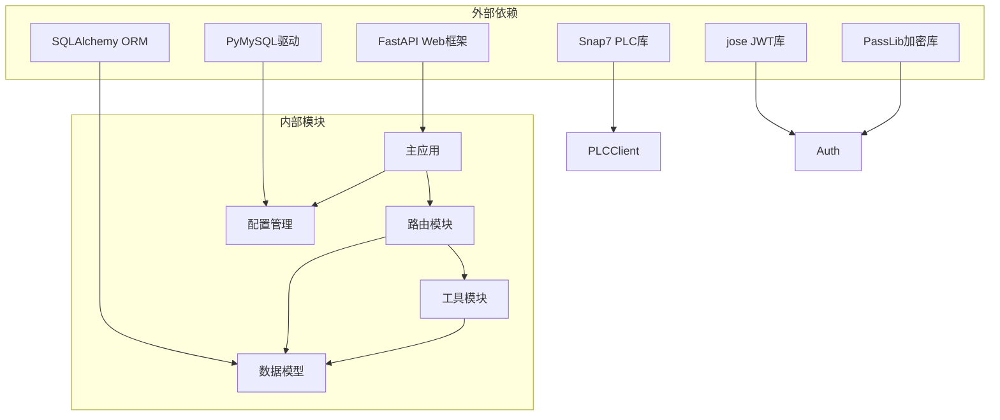

# 文件上传服务

<cite>
**本文档引用的文件**
- [backend/main.py](file://backend/main.py)
- [backend/routers/templates.py](file://backend/routers/templates.py)
- [backend/routers/products.py](file://backend/routers/products.py)
- [backend/routers/machines.py](file://backend/routers/machines.py)
- [backend/routers/logs.py](file://backend/routers/logs.py)
- [backend/models.py](file://backend/models.py)
- [backend/schemas.py](file://backend/schemas.py)
- [backend/database.py](file://backend/database.py)
- [backend/config.py](file://backend/config.py)
- [backend/plc_client.py](file://backend/plc_client.py)
- [backend/routers/auth.py](file://backend/routers/auth.py)
- [backend/dependencies.py](file://backend/dependencies.py)
- [backend/utils/logger.py](file://backend/utils/logger.py)
- [frontend/index.html](file://frontend/index.html)
</cite>

## 目录
1. [简介](#简介)
2. [项目结构](#项目结构)
3. [核心组件](#核心组件)
4. [架构概览](#架构概览)
5. [详细组件分析](#详细组件分析)
6. [依赖关系分析](#依赖关系分析)
7. [性能考虑](#性能考虑)
8. [故障排除指南](#故障排除指南)
9. [结论](#结论)

## 简介

这是一个基于FastAPI的挤出机工艺参数管理系统，包含完整的文件上传功能。系统采用前后端分离架构，后端使用Python FastAPI框架，前端使用Vue.js技术栈，支持与西门子PLC设备通信。

主要功能包括：
- 文件上传服务（支持任意格式文件）
- 机台设备管理
- 产品参数管理
- 工艺模板管理
- 操作日志记录
- 用户权限管理
- PLC设备实时通信

## 项目结构

**图表来源**
- [backend/main.py:1-97](file://backend/main.py#L1-L97)
- [frontend/index.html:1-800](file://frontend/index.html#L1-L800)

**章节来源**
- [backend/main.py:1-97](file://backend/main.py#L1-L97)
- [frontend/index.html:1-800](file://frontend/index.html#L1-L800)

## 核心组件

### 文件上传服务

系统提供了专门的文件上传接口，支持任意格式文件的安全存储：

**图表来源**
- [backend/main.py:39-51](file://backend/main.py#L39-L51)

### 数据库管理系统

系统使用SQLAlchemy ORM进行数据持久化，支持MySQL数据库：

**图表来源**
- [backend/models.py:6-142](file://backend/models.py#L6-L142)

**章节来源**
- [backend/main.py:39-51](file://backend/main.py#L39-L51)
- [backend/models.py:6-142](file://backend/models.py#L6-L142)

## 架构概览

系统采用分层架构设计，实现了清晰的关注点分离：

**图表来源**
- [backend/main.py:14-37](file://backend/main.py#L14-L37)
- [backend/routers/auth.py:15](file://backend/routers/auth.py#L15)
- [backend/routers/machines.py:12](file://backend/routers/machines.py#L12)

## 详细组件分析

### 认证与授权系统

系统实现了基于JWT的认证机制和角色权限控制：

**图表来源**
- [backend/routers/auth.py:38-48](file://backend/routers/auth.py#L38-L48)
- [backend/dependencies.py:38-50](file://backend/dependencies.py#L38-L50)

### PLC设备通信模块

系统集成了与西门子PLC的实时通信能力：

**图表来源**
- [backend/routers/machines.py:107-183](file://backend/routers/machines.py#L107-L183)
- [backend/plc_client.py:51-114](file://backend/plc_client.py#L51-L114)

### 操作日志系统

系统提供了完整的企业级日志记录功能：

**图表来源**
- [backend/models.py:115-129](file://backend/models.py#L115-L129)
- [backend/utils/logger.py:65-88](file://backend/utils/logger.py#L65-L88)

**章节来源**
- [backend/routers/auth.py:15-114](file://backend/routers/auth.py#L15-L114)
- [backend/routers/machines.py:83-183](file://backend/routers/machines.py#L83-L183)
- [backend/utils/logger.py:1-199](file://backend/utils/logger.py#L1-199)

## 依赖关系分析

系统的核心依赖关系如下：

**图表来源**
- [backend/main.py:1-12](file://backend/main.py#L1-L12)
- [backend/database.py:1-10](file://backend/database.py#L1-L10)
- [backend/config.py:4-20](file://backend/config.py#L4-L20)

**章节来源**
- [backend/main.py:1-12](file://backend/main.py#L1-L12)
- [backend/database.py:1-18](file://backend/database.py#L1-L18)
- [backend/config.py:1-35](file://backend/config.py#L1-L35)

## 性能考虑

### 文件上传优化

系统在文件上传方面采用了多项优化措施：

- **异步处理**: 使用FastAPI的异步特性处理文件上传请求
- **流式传输**: 通过shutil.copyfileobj实现大文件的流式写入
- **唯一命名**: 使用UUID确保文件名唯一性，避免冲突
- **目录结构**: 自动创建uploads目录，确保文件存储的组织性

### 数据库性能

- **连接池**: 使用SQLAlchemy连接池管理数据库连接
- **预连接**: 启用pool_pre_ping确保连接有效性
- **索引优化**: 关键字段建立数据库索引
- **事务管理**: 合理的事务边界控制

### 前端性能

- **静态资源**: 通过StaticFiles提供静态文件服务
- **缓存策略**: 利用浏览器缓存机制提升页面加载速度
- **响应式设计**: 支持不同屏幕尺寸的设备访问

## 故障排除指南

### 常见问题及解决方案

#### 文件上传失败

**问题症状**: 上传文件时返回错误

**可能原因**:
1. 上传目录权限不足
2. 文件大小超出限制
3. 网络连接中断

**解决步骤**:
1. 检查uploads目录权限
2. 验证文件大小限制
3. 确认网络连接稳定

#### PLC通信异常

**问题症状**: 无法连接PLC设备

**可能原因**:
1. IP地址配置错误
2. 网络连接问题
3. PLC设备离线

**解决步骤**:
1. 验证PLC IP地址配置
2. 检查网络连通性
3. 确认PLC设备电源状态

#### 认证失败

**问题症状**: 登录时提示用户名或密码错误

**可能原因**:
1. 密码错误
2. 用户名不存在
3. 令牌过期

**解决步骤**:
1. 确认用户名和密码
2. 检查用户账户状态
3. 重新生成访问令牌

**章节来源**
- [backend/main.py:57-92](file://backend/main.py#L57-L92)
- [backend/plc_client.py:24-49](file://backend/plc_client.py#L24-L49)
- [backend/routers/auth.py:39-48](file://backend/routers/auth.py#L39-L48)

## 结论

该文件上传服务系统具有以下特点：

**技术优势**:
- 基于FastAPI的高性能Web框架
- 完整的前后端分离架构
- 企业级的日志记录系统
- 安全的用户认证机制

**功能完整性**:
- 支持任意格式文件上传
- 提供完整的CRUD操作
- 集成PLC设备通信能力
- 实现细粒度的权限控制

**扩展性**:
- 模块化的代码结构
- 清晰的依赖关系
- 易于维护和扩展

系统为挤出机工艺参数管理提供了坚实的技术基础，能够满足工业环境下的各种需求。