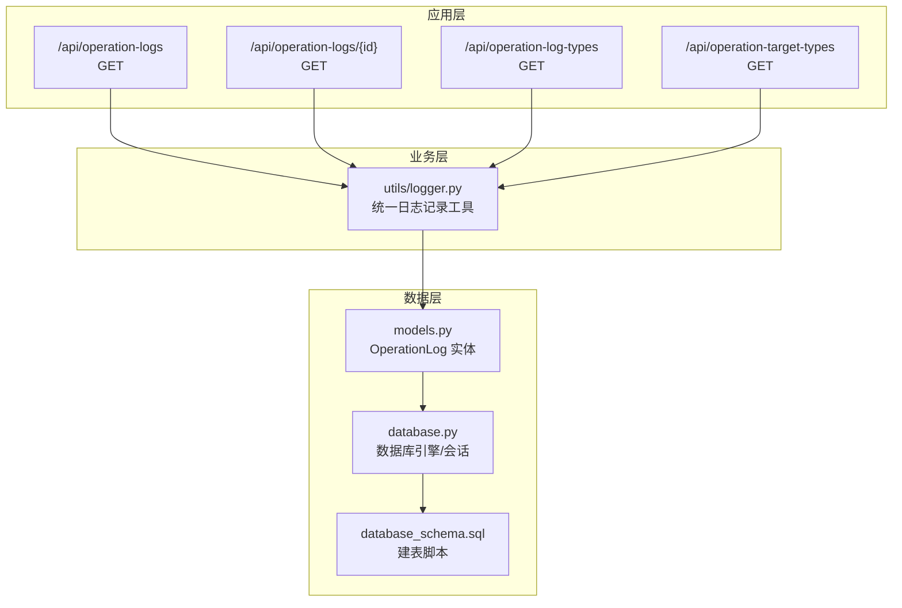
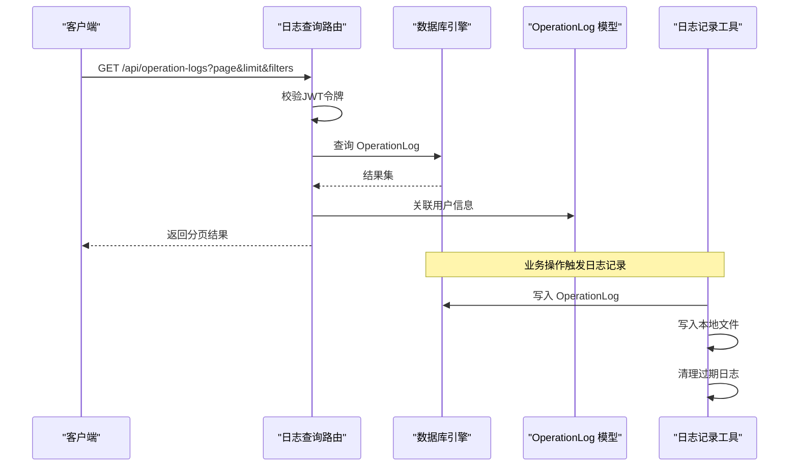
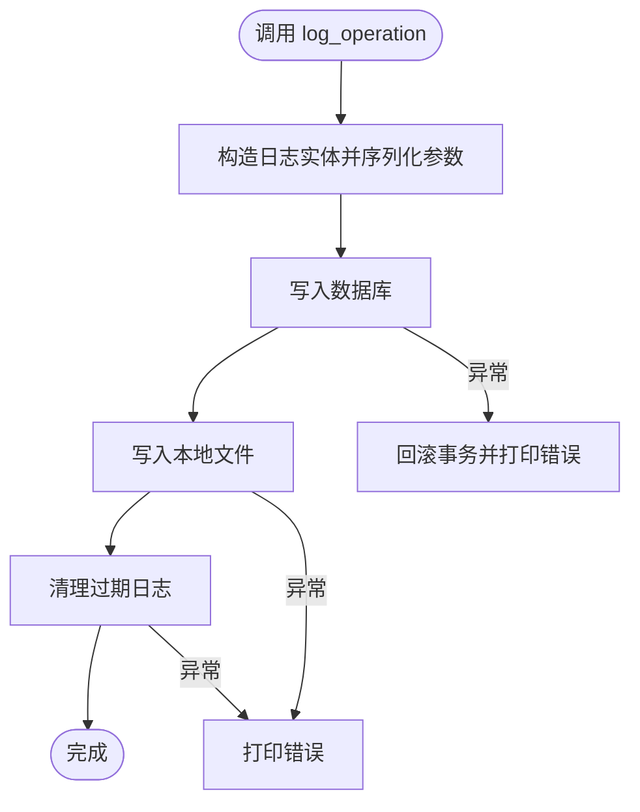
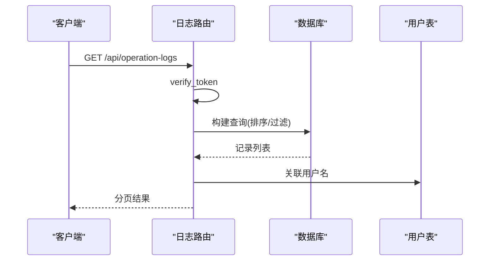
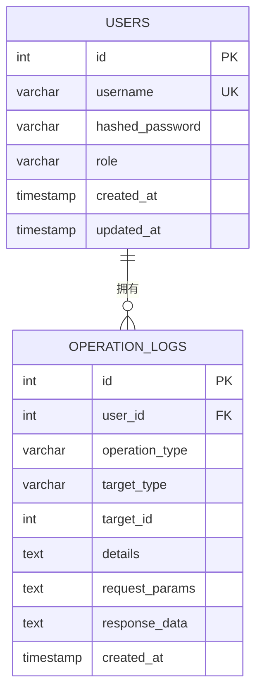
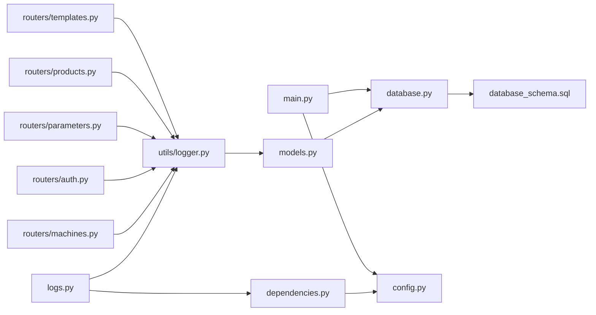

# 日志系统

<cite>
**本文引用的文件**
- [logger.py](file://backend/utils/logger.py)
- [logs.py](file://backend/routers/logs.py)
- [models.py](file://backend/models.py)
- [database.py](file://backend/database.py)
- [dependencies.py](file://backend/dependencies.py)
- [config.py](file://backend/config.py)
- [main.py](file://backend/main.py)
- [database_schema.sql](file://backend/database_schema.sql)
- [requirements.txt](file://requirements.txt)
</cite>

## 目录
1. [简介](#简介)
2. [项目结构](#项目结构)
3. [核心组件](#核心组件)
4. [架构总览](#架构总览)
5. [详细组件分析](#详细组件分析)
6. [依赖关系分析](#依赖关系分析)
7. [性能考量](#性能考量)
8. [故障排查指南](#故障排查指南)
9. [结论](#结论)
10. [附录](#附录)

## 简介
本文件系统性梳理了该PLC数据采集系统的日志体系，覆盖操作日志记录机制、系统监控实现与错误处理策略；详细说明日志级别配置、日志格式规范与日志存储方式；包含审计日志设计、操作追踪实现与日志查询接口；并提供日志配置示例、性能优化建议与日志分析工具使用指南。目标是帮助开发者与运维人员快速理解与维护日志系统，确保系统可审计、可观测且可诊断。

## 项目结构
日志系统由“应用层路由”、“业务层日志工具”、“数据层模型与持久化”三部分组成：
- 应用层路由：提供日志查询接口，支持分页、过滤与类型枚举。
- 业务层日志工具：封装统一的日志记录方法，支持文件落盘与数据库持久化，并自动清理过期日志。
- 数据层模型：定义操作日志实体及其索引，支撑高效检索与审计。

图表来源
- [logs.py:34-98](file://backend/routers/logs.py#L34-L98)
- [logger.py:65-87](file://backend/utils/logger.py#L65-L87)
- [models.py:106-119](file://backend/models.py#L106-L119)
- [database.py:1-18](file://backend/database.py#L1-18)
- [database_schema.sql:109-125](file://backend/database_schema.sql#L109-L125)

章节来源
- [logs.py:1-137](file://backend/routers/logs.py#L1-L137)
- [logger.py:1-199](file://backend/utils/logger.py#L1-L199)
- [models.py:106-119](file://backend/models.py#L106-L119)
- [database.py:1-18](file://backend/database.py#L1-L18)
- [database_schema.sql:109-125](file://backend/database_schema.sql#L109-L125)

## 核心组件
- 统一日志记录器：负责将操作日志写入数据库与本地文件，同时清理过期日志。
- 日志查询路由：提供分页查询、按类型/用户/时间范围过滤、以及日志类型枚举接口。
- 操作日志模型：定义字段与索引，支撑审计与检索。
- 配置与依赖：JWT校验、数据库连接、PLC配置等基础能力。

章节来源
- [logger.py:65-199](file://backend/utils/logger.py#L65-L199)
- [logs.py:34-137](file://backend/routers/logs.py#L34-L137)
- [models.py:106-119](file://backend/models.py#L106-L119)
- [dependencies.py:38-50](file://backend/dependencies.py#L38-L50)
- [config.py:1-35](file://backend/config.py#L1-L35)

## 架构总览
日志系统采用“双写+索引”的设计：每次操作既写入数据库（便于查询与审计），也写入本地文本文件（便于离线分析与归档）。系统通过定时清理策略控制文件大小与生命周期。

图表来源
- [logs.py:34-98](file://backend/routers/logs.py#L34-L98)
- [logger.py:65-87](file://backend/utils/logger.py#L65-L87)
- [models.py:106-119](file://backend/models.py#L106-L119)

## 详细组件分析

### 组件A：日志记录工具（utils/logger.py）
- 功能职责
  - 将操作日志写入数据库（ORM）与本地文本文件。
  - 自动清理超过保留期限的日志文件。
  - 提供多种业务场景的便捷记录函数（如PLC读写、机台/产品/模板/参数/记录/用户等操作）。
- 关键流程
  - 数据库存储：构造日志实体，序列化请求与响应参数，提交事务。
  - 文件存储：按日期生成日志文件，追加格式化的文本日志。
  - 过期清理：遍历日志目录，删除超出保留天数的文件。
- 错误处理
  - 数据库存储异常时回滚事务并打印错误。
  - 文件写入与清理异常时捕获并打印错误，避免影响主流程。
- 性能特性
  - 文件写入采用追加模式，单次写入开销小。
  - 清理策略在记录时触发，避免后台任务依赖。

图表来源
- [logger.py:65-87](file://backend/utils/logger.py#L65-L87)
- [logger.py:32-63](file://backend/utils/logger.py#L32-L63)
- [logger.py:17-30](file://backend/utils/logger.py#L17-L30)

章节来源
- [logger.py:1-199](file://backend/utils/logger.py#L1-L199)

### 组件B：日志查询路由（routers/logs.py）
- 功能职责
  - 提供分页查询、按操作类型/目标类型/用户ID/用户名/时间范围过滤。
  - 提供日志类型与目标类型枚举接口，辅助前端筛选。
- 关键流程
  - 校验JWT令牌后执行查询。
  - 支持多类型映射（中文/英文别名），提升兼容性。
  - 对请求参数与响应数据进行JSON反序列化，返回结构化结果。
- 错误处理
  - 未授权/无效令牌抛出HTTP异常。
  - 无法解析时间字符串时忽略对应过滤条件。
- 性能特性
  - 使用SQLAlchemy查询对象链式构建，便于扩展。
  - 对常用字段建立索引，提升查询效率。

图表来源
- [logs.py:34-98](file://backend/routers/logs.py#L34-L98)
- [dependencies.py:38-50](file://backend/dependencies.py#L38-L50)

章节来源
- [logs.py:1-137](file://backend/routers/logs.py#L1-L137)

### 组件C：操作日志模型与数据库（models.py, database.py, database_schema.sql）
- 模型定义
  - OperationLog：包含用户ID、操作类型、目标类型、目标ID、详情、请求参数、响应数据与创建时间。
  - 建立索引：user_id、operation_type、target_type、created_at，提升审计与检索效率。
- 数据库连接
  - 使用SQLAlchemy创建引擎与会话工厂，支持连接池预检测。
- 初始化与迁移
  - 启动时创建数据库与表结构，若不存在则自动创建。
  - 建表脚本与ORM模型保持一致，确保结构同步。

图表来源
- [models.py:6-17](file://backend/models.py#L6-L17)
- [models.py:106-119](file://backend/models.py#L106-L119)
- [database.py:1-18](file://backend/database.py#L1-L18)
- [database_schema.sql:7-16](file://backend/database_schema.sql#L7-L16)
- [database_schema.sql:109-125](file://backend/database_schema.sql#L109-L125)

章节来源
- [models.py:106-119](file://backend/models.py#L106-L119)
- [database.py:1-18](file://backend/database.py#L1-L18)
- [database_schema.sql:109-125](file://backend/database_schema.sql#L109-L125)

### 组件D：认证与依赖（dependencies.py, config.py）
- 认证依赖
  - verify_token：从请求头提取并验证JWT，失败抛出HTTP异常。
  - get_current_user：解析令牌载荷，查询用户并返回。
- 配置管理
  - 通过Settings类加载环境变量，提供数据库与JWT配置。
  - PLC相关配置集中管理，便于部署与运维。

章节来源
- [dependencies.py:38-50](file://backend/dependencies.py#L38-L50)
- [config.py:1-35](file://backend/config.py#L1-L35)

## 依赖关系分析
- 路由依赖日志工具：各业务路由在成功操作后调用日志工具记录审计信息。
- 日志工具依赖数据库与文件系统：ORM持久化与本地文件写入。
- 查询路由依赖认证与数据库：JWT校验与OperationLog查询。
- 主程序依赖配置与数据库：启动时创建数据库与表结构。

图表来源
- [logs.py:1-137](file://backend/routers/logs.py#L1-L137)
- [logger.py:1-199](file://backend/utils/logger.py#L1-L199)
- [models.py:106-119](file://backend/models.py#L106-L119)
- [database.py:1-18](file://backend/database.py#L1-L18)
- [database_schema.sql:109-125](file://backend/database_schema.sql#L109-L125)
- [dependencies.py:38-50](file://backend/dependencies.py#L38-L50)
- [config.py:1-35](file://backend/config.py#L1-L35)
- [main.py:1-77](file://backend/main.py#L1-L77)

章节来源
- [logs.py:1-137](file://backend/routers/logs.py#L1-L137)
- [logger.py:1-199](file://backend/utils/logger.py#L1-L199)
- [models.py:106-119](file://backend/models.py#L106-L119)
- [database.py:1-18](file://backend/database.py#L1-L18)
- [database_schema.sql:109-125](file://backend/database_schema.sql#L109-L125)
- [dependencies.py:38-50](file://backend/dependencies.py#L38-L50)
- [config.py:1-35](file://backend/config.py#L1-L35)
- [main.py:1-77](file://backend/main.py#L1-L77)

## 性能考量
- 数据库存储
  - 建议对高频查询字段（如user_id、operation_type、target_type、created_at）保持现有索引。
  - 批量写入时注意事务提交频率，避免频繁IO。
- 文件存储
  - 本地文件按日切分，建议结合系统日志轮转策略（如logrotate）进行压缩与归档。
  - 控制单文件大小与保留周期，避免磁盘空间占用过大。
- 查询性能
  - 使用分页与过滤条件，避免一次性拉取大量数据。
  - 对时间范围查询使用索引列，减少全表扫描。
- 并发与可靠性
  - 文件写入采用追加模式，建议在高并发场景下考虑异步写入或缓冲队列。
  - 数据库存储使用连接池与预检测，降低连接抖动带来的延迟。

## 故障排查指南
- 日志查询接口报错
  - 检查JWT是否正确传递与有效，确认verify_token是否抛出异常。
  - 校验时间字符串格式是否符合“YYYY-MM-DD HH:MM:SS”，否则过滤条件会被忽略。
- 数据库连接问题
  - 确认DB_HOST、DB_PORT、DB_USER、DB_PASSWORD、DB_NAME等配置项正确。
  - 启动时数据库与表结构初始化是否成功，必要时手动执行建表脚本。
- 文件写入失败
  - 检查日志目录是否存在且具备写权限。
  - 查看清理逻辑是否因权限不足导致删除失败。
- 权限与角色
  - 管理员权限仅用于特定管理接口，普通查询接口仍需标准JWT校验。

章节来源
- [dependencies.py:38-50](file://backend/dependencies.py#L38-L50)
- [logs.py:63-74](file://backend/routers/logs.py#L63-L74)
- [config.py:22-34](file://backend/config.py#L22-L34)
- [main.py:37-72](file://backend/main.py#L37-L72)
- [logger.py:17-30](file://backend/utils/logger.py#L17-L30)

## 结论
该日志系统以“数据库+文件”的双写策略实现了强审计能力，配合完善的查询接口与索引设计，满足日常运营与合规审计需求。通过明确的错误处理与清理机制，系统在可用性与可维护性方面表现稳定。建议在生产环境中结合系统日志轮转与容量规划，持续优化查询性能与存储成本。

## 附录

### 日志级别配置
- 当前实现未显式区分日志级别，建议在后续版本引入INFO/WARNING/ERROR等级别，以便更精细地控制输出与告警。

### 日志格式规范
- 数据库存储：统一序列化请求参数与响应数据，便于结构化检索。
- 文件存储：按日期生成文件，每条日志包含时间戳、操作类型、目标类型、用户ID、请求参数、详情、返回结果与分隔符，便于人工审阅与离线分析。

### 日志存储方式
- 数据库存储：ORM实体持久化，支持复杂查询与关联。
- 文件存储：按日切分，定期清理过期文件，默认保留180天。

### 审计日志设计
- 字段覆盖：用户ID、操作类型、目标类型、目标ID、详情、请求参数、响应数据、创建时间。
- 索引设计：user_id、operation_type、target_type、created_at，保障审计效率。

### 操作追踪实现
- 在各业务路由的关键操作点调用日志工具，确保关键动作可追溯。
- 对PLC读写、模板绑定/解绑、参数保存等关键路径进行专门封装，提升一致性与可维护性。

### 日志查询接口
- 支持分页、按操作类型/目标类型/用户ID/用户名/时间范围过滤。
- 提供日志类型与目标类型枚举接口，辅助前端筛选。

### 日志配置示例
- 数据库配置：通过环境变量设置主机、端口、用户、密码、数据库名。
- JWT配置：密钥与算法、访问令牌有效期。
- PLC配置：端口与DB号，便于PLC通信。

### 性能优化建议
- 引入异步写入或缓冲队列，降低写入阻塞。
- 使用系统日志轮转工具，定期压缩与归档历史文件。
- 对热点查询增加复合索引，减少排序与过滤成本。

### 日志分析工具使用指南
- 文本日志：适用于快速定位问题与离线分析，建议结合grep/awk/sed等工具进行统计与过滤。
- 数据库日志：适用于复杂查询与报表生成，建议使用可视化BI工具或自研仪表盘。

章节来源
- [logger.py:7-11](file://backend/utils/logger.py#L7-L11)
- [logger.py:17-30](file://backend/utils/logger.py#L17-L30)
- [logger.py:32-63](file://backend/utils/logger.py#L32-L63)
- [logs.py:13-32](file://backend/routers/logs.py#L13-L32)
- [logs.py:34-98](file://backend/routers/logs.py#L34-L98)
- [models.py:106-119](file://backend/models.py#L106-L119)
- [database.py:1-18](file://backend/database.py#L1-L18)
- [config.py:22-34](file://backend/config.py#L22-L34)
- [requirements.txt:1-11](file://requirements.txt#L1-L11)