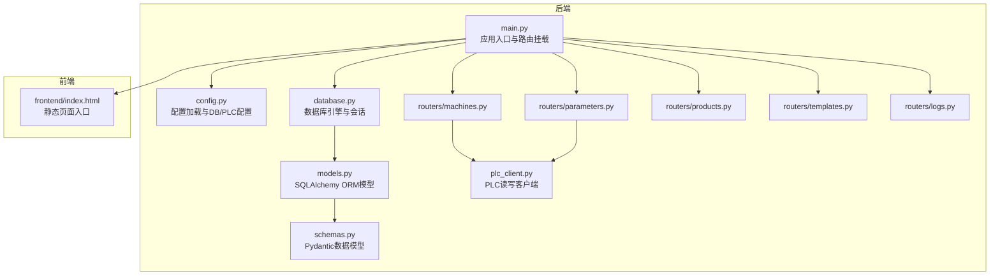
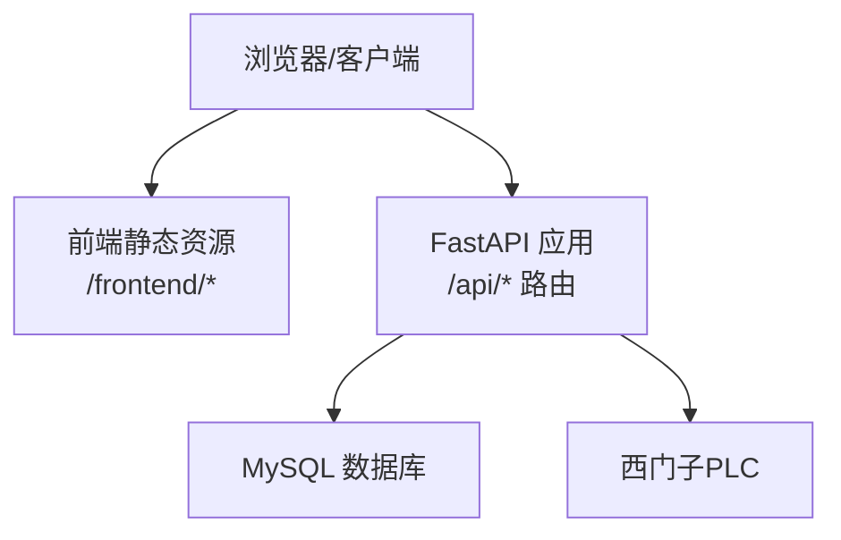
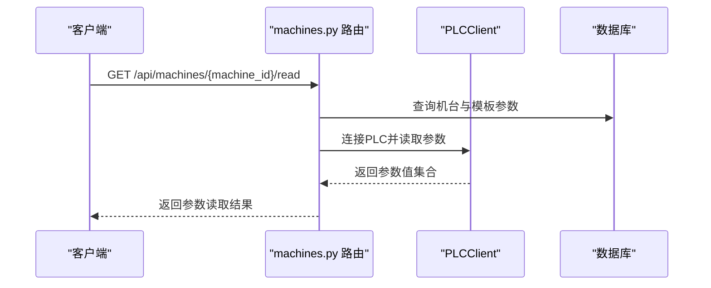
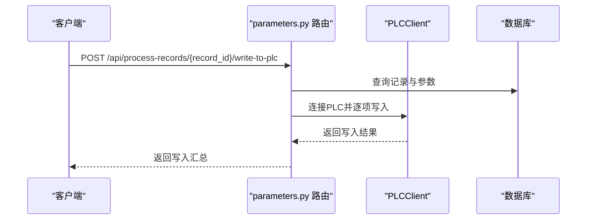
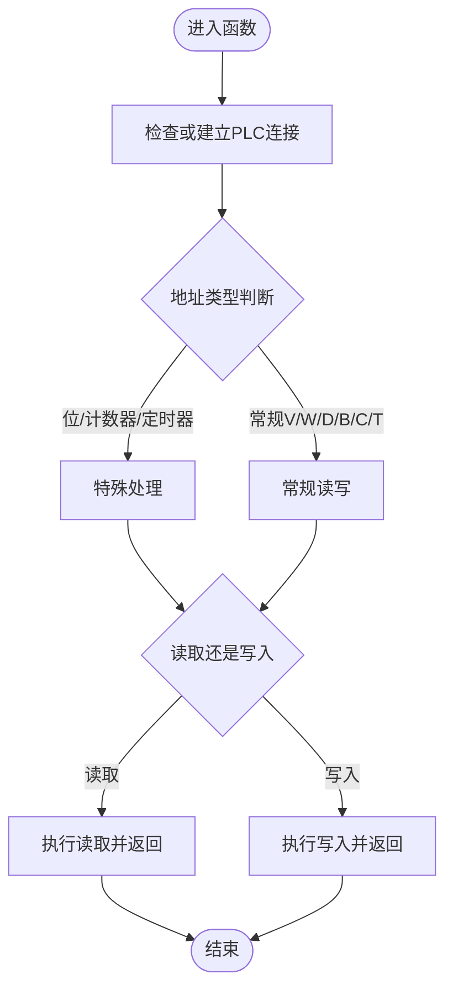
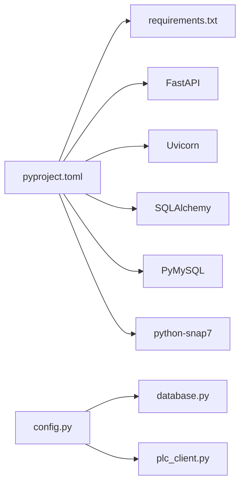

# 快速开始

<cite>
**本文引用的文件**
- [run.sh](file://run.sh)
- [start_backend.sh](file://start_backend.sh)
- [pyproject.toml](file://pyproject.toml)
- [requirements.txt](file://requirements.txt)
- [backend/config.py](file://backend/config.py)
- [backend/database.py](file://backend/database.py)
- [backend/main.py](file://backend/main.py)
- [backend/database_schema.sql](file://backend/database_schema.sql)
- [backend/models.py](file://backend/models.py)
- [backend/schemas.py](file://backend/schemas.py)
- [backend/plc_client.py](file://backend/plc_client.py)
- [backend/routers/machines.py](file://backend/routers/machines.py)
- [backend/routers/parameters.py](file://backend/routers/parameters.py)
- [backend/routers/products.py](file://backend/routers/products.py)
- [backend/routers/templates.py](file://backend/routers/templates.py)
- [backend/routers/logs.py](file://backend/routers/logs.py)
</cite>

## 目录
1. [简介](#简介)
2. [项目结构](#项目结构)
3. [核心组件](#核心组件)
4. [架构总览](#架构总览)
5. [详细组件分析](#详细组件分析)
6. [依赖关系分析](#依赖关系分析)
7. [性能考虑](#性能考虑)
8. [故障排除指南](#故障排除指南)
9. [结论](#结论)
10. [附录](#附录)

## 简介
本指南面向首次部署“PLC到数据库管理系统”的用户，提供从环境准备、依赖安装、数据库与PLC配置，到系统启动与功能验证的完整流程。系统采用FastAPI作为后端框架，SQLAlchemy进行数据库访问，python-snap7与西门子PLC通信，支持模板化参数管理、机台与产品管理、工艺记录与日志审计等功能。

## 项目结构
系统由后端（FastAPI）与前端静态资源组成，后端负责业务逻辑、数据库交互与PLC通信；前端提供基础页面入口与文档访问。

图表来源
- [backend/main.py:1-77](file://backend/main.py#L1-L77)
- [backend/config.py:1-35](file://backend/config.py#L1-L35)
- [backend/database.py:1-18](file://backend/database.py#L1-L18)
- [backend/schemas.py:1-190](file://backend/schemas.py#L1-L190)
- [backend/models.py:1-133](file://backend/models.py#L1-L133)
- [backend/plc_client.py:1-188](file://backend/plc_client.py#L1-L188)
- [backend/routers/machines.py:1-260](file://backend/routers/machines.py#L1-L260)
- [backend/routers/parameters.py:1-278](file://backend/routers/parameters.py#L1-L278)
- [backend/routers/products.py:1-75](file://backend/routers/products.py#L1-L75)
- [backend/routers/templates.py:1-300](file://backend/routers/templates.py#L1-L300)
- [backend/routers/logs.py:1-137](file://backend/routers/logs.py#L1-L137)

章节来源
- [backend/main.py:1-77](file://backend/main.py#L1-L77)
- [backend/config.py:1-35](file://backend/config.py#L1-L35)
- [backend/database.py:1-18](file://backend/database.py#L1-L18)

## 核心组件
- 配置系统：通过环境变量加载数据库与PLC相关配置，统一管理连接参数。
- 数据库层：基于SQLAlchemy，自动创建数据库与表结构，提供会话管理。
- 路由与业务：围绕机台、产品、模板、参数、记录与日志构建REST接口。
- PLC客户端：封装snap7，支持读写多种地址类型（VW、VD、VB、VC、位、计数器、定时器），并具备连接复用与切换能力。
- 启动脚本：一键安装依赖、创建数据库、启动后端服务并提示访问路径。

章节来源
- [backend/config.py:1-35](file://backend/config.py#L1-L35)
- [backend/database.py:1-18](file://backend/database.py#L1-L18)
- [backend/plc_client.py:1-188](file://backend/plc_client.py#L1-L188)
- [backend/main.py:1-77](file://backend/main.py#L1-L77)
- [run.sh:1-24](file://run.sh#L1-L24)

## 架构总览
系统采用前后端分离模式，后端提供REST API与静态资源挂载，前端通过浏览器访问页面与API文档。

图表来源
- [backend/main.py:22-35](file://backend/main.py#L22-L35)
- [backend/database.py:6-10](file://backend/database.py#L6-L10)
- [backend/plc_client.py:24-49](file://backend/plc_client.py#L24-L49)

## 详细组件分析

### 安装与环境准备
- Python版本要求：项目声明使用Python 3.10及以上。
- 推荐使用uv进行包管理与虚拟环境隔离，以提升安装效率与一致性。
- 依赖安装方式：
  - 使用uv安装requirements.txt中的依赖。
  - 或使用pip安装（不推荐跨平台一致性）。
- 启动脚本run.sh会自动执行依赖安装与后端启动，适合快速体验。

章节来源
- [pyproject.toml:5-17](file://pyproject.toml#L5-L17)
- [requirements.txt:1-11](file://requirements.txt#L1-L11)
- [run.sh:5-6](file://run.sh#L5-L6)

### 数据库设置
- 自动创建数据库与表结构：后端在启动事件中尝试创建数据库并执行建表，同时初始化默认管理员账户。
- 手动建库建表：可直接执行提供的SQL脚本完成初始化。
- 数据库连接配置：通过配置类读取主机、端口、用户名、密码与数据库名。

章节来源
- [backend/main.py:37-56](file://backend/main.py#L37-L56)
- [backend/database_schema.sql:1-162](file://backend/database_schema.sql#L1-L162)
- [backend/database.py:6-10](file://backend/database.py#L6-L10)
- [backend/config.py:22-29](file://backend/config.py#L22-L29)

### PLC连接配置
- PLC连接参数：端口号与DB号可在配置中调整，默认端口为102，DB号为3。
- 地址读写支持：支持整型、实数、布尔、位寻址以及计数器/定时器读取。
- 连接管理：具备连接状态检测、断线重连与槽位切换能力。

章节来源
- [backend/config.py:17-19](file://backend/config.py#L17-L19)
- [backend/config.py:31-34](file://backend/config.py#L31-L34)
- [backend/plc_client.py:24-49](file://backend/plc_client.py#L24-L49)
- [backend/plc_client.py:51-113](file://backend/plc_client.py#L51-L113)
- [backend/plc_client.py:115-180](file://backend/plc_client.py#L115-L180)

### 启动流程（从零到运行）
- 步骤1：安装依赖
  - 使用uv安装requirements.txt中的依赖。
- 步骤2：创建数据库
  - 后端启动时自动创建数据库；或使用脚本一次性创建数据库。
- 步骤3：启动后端服务
  - 可使用run.sh一键启动，或手动启动Uvicorn。
- 步骤4：访问系统
  - 前端页面入口：http://localhost:8000/frontend/index.html
  - API文档：http://localhost:8000/docs

章节来源
- [run.sh:5-19](file://run.sh#L5-L19)
- [backend/main.py:37-56](file://backend/main.py#L37-L56)

### 关键API工作流

#### 机台参数读取（PLC读取）

图表来源
- [backend/routers/machines.py:107-183](file://backend/routers/machines.py#L107-L183)
- [backend/plc_client.py:24-49](file://backend/plc_client.py#L24-L49)
- [backend/plc_client.py:51-113](file://backend/plc_client.py#L51-L113)

#### 将工艺记录写入PLC

图表来源
- [backend/routers/parameters.py:201-246](file://backend/routers/parameters.py#L201-L246)
- [backend/plc_client.py:115-180](file://backend/plc_client.py#L115-L180)

#### 参数读写流程（通用）

图表来源
- [backend/plc_client.py:51-113](file://backend/plc_client.py#L51-L113)
- [backend/plc_client.py:115-180](file://backend/plc_client.py#L115-L180)

## 依赖关系分析
- 后端核心依赖：FastAPI、Uvicorn、SQLAlchemy、PyMySQL、Pydantic、Pydantic Settings、python-snap7。
- 依赖来源：pyproject.toml与requirements.txt保持一致，建议优先使用pyproject.toml进行统一管理。
- 数据库与PLC：数据库连接字符串由配置模块生成；PLC连接参数来自配置模块。

图表来源
- [pyproject.toml:6-17](file://pyproject.toml#L6-L17)
- [requirements.txt:1-11](file://requirements.txt#L1-L11)
- [backend/config.py:1-35](file://backend/config.py#L1-L35)
- [backend/database.py:6-10](file://backend/database.py#L6-L10)
- [backend/plc_client.py:3-3](file://backend/plc_client.py#L3-L3)

章节来源
- [pyproject.toml:1-18](file://pyproject.toml#L1-L18)
- [requirements.txt:1-11](file://requirements.txt#L1-L11)
- [backend/config.py:1-35](file://backend/config.py#L1-L35)
- [backend/database.py:1-18](file://backend/database.py#L1-L18)

## 性能考虑
- 连接池与预检：数据库引擎启用pool_pre_ping，降低连接失效导致的异常。
- 批量读取：PLC读取支持批量参数读取，减少连接建立次数。
- 写入策略：按记录逐项写入，便于回滚与审计；如需高吞吐可评估分批写入策略。
- 日志与监控：操作日志记录请求与响应，便于定位性能瓶颈与异常。

章节来源
- [backend/database.py:8-10](file://backend/database.py#L8-L10)
- [backend/routers/machines.py:182-183](file://backend/routers/machines.py#L182-L183)
- [backend/routers/parameters.py:222-246](file://backend/routers/parameters.py#L222-L246)

## 故障排除指南
- 无法连接数据库
  - 检查DB_HOST、DB_PORT、DB_USER、DB_PASSWORD、DB_NAME是否正确。
  - 确认MySQL服务可达且账号具有创建数据库权限。
- 无法连接PLC
  - 检查机台IP、Rack、Slot与DB号配置。
  - 确认PLC网络连通性与S7协议端口开放。
- 启动后端报错
  - 查看控制台输出的数据库创建与表创建日志。
  - 确认默认管理员创建是否成功。
- 参数读取失败
  - 确认模板参数地址格式与类型匹配。
  - 检查PLC地址是否存在与可读。
- 写入PLC失败
  - 确认参数类型与值范围。
  - 检查只读参数与槽位设置。

章节来源
- [backend/main.py:37-72](file://backend/main.py#L37-L72)
- [backend/routers/machines.py:107-183](file://backend/routers/machines.py#L107-L183)
- [backend/routers/parameters.py:201-246](file://backend/routers/parameters.py#L201-L246)
- [backend/plc_client.py:51-113](file://backend/plc_client.py#L51-L113)

## 结论
本快速开始指南覆盖了从环境准备、依赖安装、数据库与PLC配置，到系统启动与关键功能验证的全流程。建议在生产环境中进一步完善安全策略（如HTTPS、鉴权）、日志与监控体系，并根据实际PLC型号与地址规范调整配置参数。

## 附录

### 系统配置清单
- 数据库配置
  - 主机：DB_HOST
  - 端口：DB_PORT
  - 用户：DB_USER
  - 密码：DB_PASSWORD
  - 数据库名：DB_NAME
- PLC配置
  - 端口：PLC_PORT（默认102）
  - DB号：PLC_DB_NUMBER（默认3）

章节来源
- [backend/config.py:7-19](file://backend/config.py#L7-L19)

### 启动与访问
- 一键启动：./run.sh
- 访问页面：http://localhost:8000/frontend/index.html
- API文档：http://localhost:8000/docs

章节来源
- [run.sh:17-18](file://run.sh#L17-L18)

### 测试验证步骤
- 数据库与表
  - 启动后确认数据库与表创建成功，检查默认管理员是否创建。
- 机台与模板
  - 创建模板与模板参数，为机台绑定模板。
- 参数读取
  - 对已绑定模板的机台执行参数读取，确认返回有效数值。
- 参数写入
  - 选择非只读参数，执行写入操作，确认返回成功。
- 工艺记录
  - 保存参数快照为工艺记录，再将记录写入PLC，核对写入结果。
- 日志审计
  - 查询操作日志，确认关键操作均有记录。

章节来源
- [backend/main.py:37-72](file://backend/main.py#L37-L72)
- [backend/routers/templates.py:34-72](file://backend/routers/templates.py#L34-L72)
- [backend/routers/machines.py:107-183](file://backend/routers/machines.py#L107-L183)
- [backend/routers/parameters.py:201-246](file://backend/routers/parameters.py#L201-L246)
- [backend/routers/logs.py:34-98](file://backend/routers/logs.py#L34-L98)