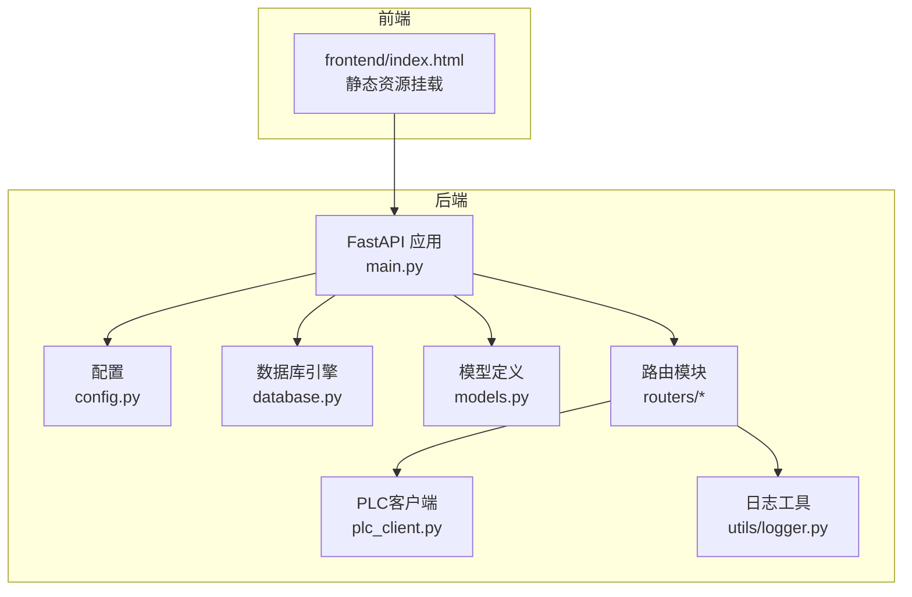
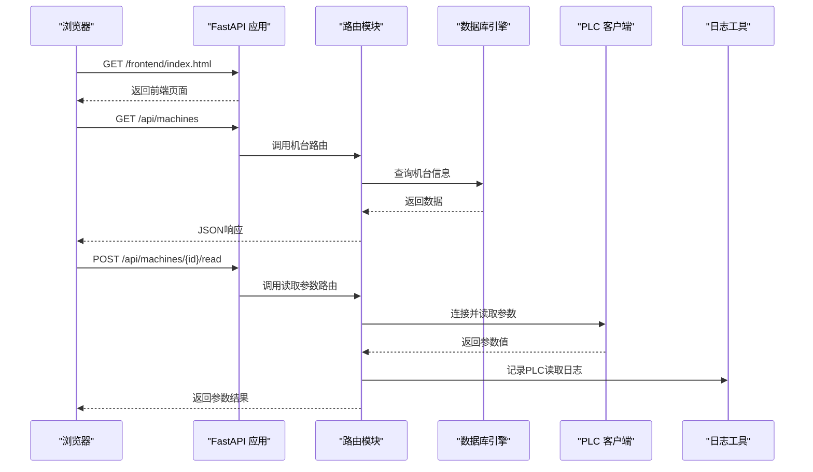
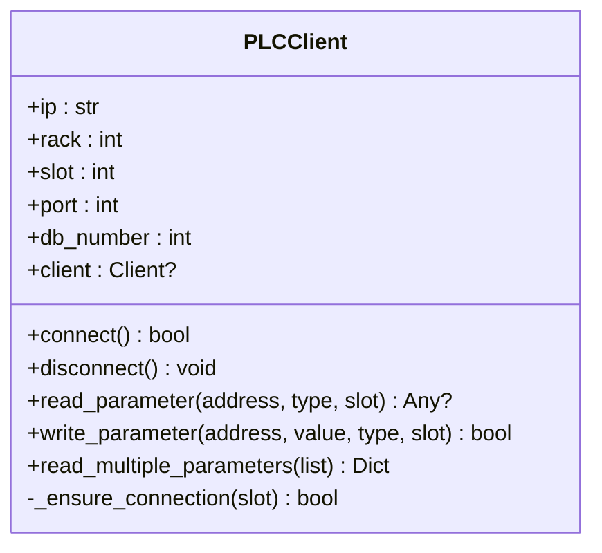
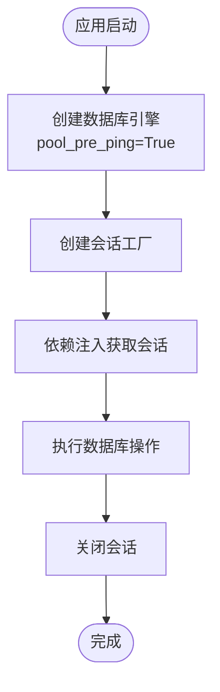
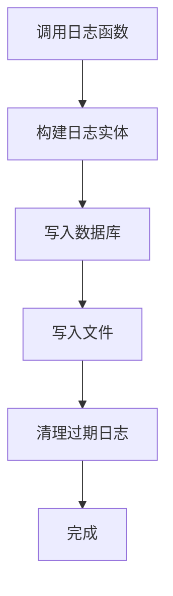
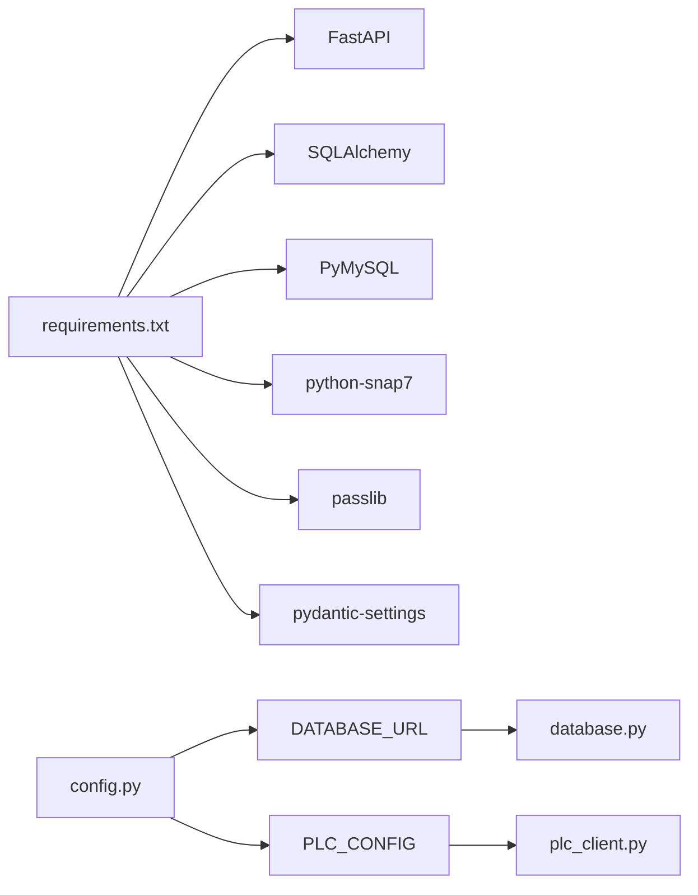

# 故障排除

<cite>
**本文引用的文件**
- [backend/main.py](file://backend/main.py)
- [backend/plc_client.py](file://backend/plc_client.py)
- [backend/database.py](file://backend/database.py)
- [backend/config.py](file://backend/config.py)
- [backend/models.py](file://backend/models.py)
- [backend/routers/machines.py](file://backend/routers/machines.py)
- [backend/routers/parameters.py](file://backend/routers/parameters.py)
- [backend/routers/logs.py](file://backend/routers/logs.py)
- [backend/utils/logger.py](file://backend/utils/logger.py)
- [frontend/index.html](file://frontend/index.html)
- [run.sh](file://run.sh)
- [start_backend.sh](file://start_backend.sh)
- [requirements.txt](file://requirements.txt)
</cite>

## 目录
1. [简介](#简介)
2. [项目结构](#项目结构)
3. [核心组件](#核心组件)
4. [架构总览](#架构总览)
5. [详细组件分析](#详细组件分析)
6. [依赖关系分析](#依赖关系分析)
7. [性能考虑](#性能考虑)
8. [故障排除指南](#故障排除指南)
9. [结论](#结论)
10. [附录](#附录)

## 简介
本指南面向“挤出机工艺参数管理系统”的运维与开发人员，聚焦于系统化故障排除流程，覆盖以下方面：
- PLC通信失败：连接异常、参数读写错误、地址格式问题
- 数据库连接异常：连接超时、权限不足、字符集不匹配
- API调用错误：认证失败、参数校验错误、路由路径错误
- 前端加载问题：静态资源访问、跨域、路由重定向
- 日志分析方法：操作日志、PLC读写日志、文件日志
- 性能问题排查：数据库连接池、PLC批量读取优化
- 并发问题处理：会话管理、事务一致性
- 应急处理与恢复：默认管理员账户、数据库初始化、服务重启

## 项目结构
系统采用前后端分离架构：
- 后端：FastAPI + SQLAlchemy + PyMySQL + python-snap7（PLC）
- 前端：纯HTML+Vue（静态资源挂载）
- 配置：pydantic-settings从环境变量读取

图表来源
- [backend/main.py:12-36](file://backend/main.py#L12-L36)
- [backend/database.py:6-18](file://backend/database.py#L6-L18)
- [backend/config.py:4-35](file://backend/config.py#L4-L35)
- [backend/plc_client.py:6-188](file://backend/plc_client.py#L6-L188)
- [backend/routers/machines.py:14-260](file://backend/routers/machines.py#L14-L260)
- [backend/routers/parameters.py:14-278](file://backend/routers/parameters.py#L14-L278)
- [backend/utils/logger.py:32-199](file://backend/utils/logger.py#L32-L199)

章节来源
- [backend/main.py:12-36](file://backend/main.py#L12-L36)
- [backend/database.py:6-18](file://backend/database.py#L6-L18)
- [backend/config.py:4-35](file://backend/config.py#L4-L35)

## 核心组件
- FastAPI应用与中间件：CORS、静态文件挂载、根路径重定向
- 数据库层：SQLAlchemy引擎、会话工厂、自动建表、默认管理员初始化
- PLC客户端：连接管理、参数读写、地址解析、计数器/定时器支持
- 路由模块：机台管理、参数管理、记录管理、操作日志查询
- 日志工具：数据库+文件双写、日志清理、统一操作日志封装

章节来源
- [backend/main.py:37-72](file://backend/main.py#L37-L72)
- [backend/plc_client.py:24-188](file://backend/plc_client.py#L24-L188)
- [backend/database.py:6-18](file://backend/database.py#L6-L18)
- [backend/routers/machines.py:14-260](file://backend/routers/machines.py#L14-L260)
- [backend/routers/parameters.py:14-278](file://backend/routers/parameters.py#L14-L278)
- [backend/utils/logger.py:32-199](file://backend/utils/logger.py#L32-L199)

## 架构总览
系统通过FastAPI提供REST接口，前端通过静态资源访问。数据库负责持久化业务数据，PLC客户端负责与西门子PLC交互。

图表来源
- [backend/main.py:22-36](file://backend/main.py#L22-L36)
- [backend/routers/machines.py:107-183](file://backend/routers/machines.py#L107-L183)
- [backend/plc_client.py:51-113](file://backend/plc_client.py#L51-L113)
- [backend/utils/logger.py:89-121](file://backend/utils/logger.py#L89-L121)

## 详细组件分析

### PLC客户端组件分析
PLC客户端负责与PLC建立连接、参数读取与写入、地址解析与类型转换、计数器/定时器读取等。

图表来源
- [backend/plc_client.py:6-188](file://backend/plc_client.py#L6-L188)

章节来源
- [backend/plc_client.py:24-188](file://backend/plc_client.py#L24-L188)

### 数据库组件分析
数据库层使用SQLAlchemy创建引擎、会话工厂，启用pre_ping以自动探测连接失效；提供依赖注入式会话获取。

图表来源
- [backend/database.py:6-18](file://backend/database.py#L6-L18)

章节来源
- [backend/database.py:6-18](file://backend/database.py#L6-L18)

### 日志组件分析
日志工具同时写入数据库和文件，支持清理过期日志，提供多种操作类型的日志封装函数。

图表来源
- [backend/utils/logger.py:65-88](file://backend/utils/logger.py#L65-L88)
- [backend/utils/logger.py:17-31](file://backend/utils/logger.py#L17-L31)

章节来源
- [backend/utils/logger.py:32-199](file://backend/utils/logger.py#L32-L199)

## 依赖关系分析
- 后端依赖：FastAPI、SQLAlchemy、PyMySQL、python-snap7、passlib、pydantic-settings
- 配置来源：pydantic-settings从.env读取数据库与PLC配置
- 路由依赖：各路由模块依赖数据库会话、PLC客户端、日志工具

图表来源
- [requirements.txt:1-11](file://requirements.txt#L1-L11)
- [backend/config.py:22-35](file://backend/config.py#L22-L35)
- [backend/database.py:6-9](file://backend/database.py#L6-L9)
- [backend/plc_client.py:3-4](file://backend/plc_client.py#L3-L4)

章节来源
- [requirements.txt:1-11](file://requirements.txt#L1-L11)
- [backend/config.py:22-35](file://backend/config.py#L22-L35)

## 性能考虑
- 数据库连接池：启用pre_ping可自动探测失效连接，减少连接异常导致的请求失败
- PLC批量读取：建议在一次连接内批量读取参数，减少握手次数
- 前端静态资源：静态文件挂载在/前端，避免不必要的后端处理
- 日志轮转：文件日志按天生成，定期清理过期日志，避免磁盘占用过大

章节来源
- [backend/database.py:8](file://backend/database.py#L8)
- [backend/plc_client.py:182-188](file://backend/plc_client.py#L182-L188)
- [backend/main.py:22-25](file://backend/main.py#L22-L25)
- [backend/utils/logger.py:17-31](file://backend/utils/logger.py#L17-L31)

## 故障排除指南

### 一、PLC通信失败
常见症状
- 读取参数返回空或None
- 写入参数返回False
- 连接异常或断开异常

诊断步骤
1. 检查PLC配置
   - IP地址、Rack、Slot是否正确
   - DB号与地址前缀是否匹配
   - 参考配置读取逻辑与地址解析
2. 检查网络连通性
   - 使用ping/traceroute验证IP可达
   - 确认防火墙未阻断102端口
3. 检查PLC状态
   - 通过机台状态检测接口确认在线/离线
4. 查看日志
   - 操作日志中查看PLC读写记录
   - 文件日志中查看具体错误信息

定位与修复
- 地址格式问题：确保地址符合VW/VD/VB/VC/V.x/Cn/Tn等格式
- 类型转换问题：根据参数类型选择Int/Real/Bool
- 连接复用：在一次会话内批量读写，避免频繁断连
- 异常捕获：打印异常信息便于定位

章节来源
- [backend/plc_client.py:24-49](file://backend/plc_client.py#L24-L49)
- [backend/plc_client.py:51-113](file://backend/plc_client.py#L51-L113)
- [backend/plc_client.py:115-180](file://backend/plc_client.py#L115-L180)
- [backend/routers/machines.py:83-105](file://backend/routers/machines.py#L83-L105)
- [backend/utils/logger.py:89-121](file://backend/utils/logger.py#L89-L121)

### 二、数据库连接异常
常见症状
- 启动时报数据库创建失败
- 运行时报连接超时或拒绝
- 字符集不匹配导致乱码

诊断步骤
1. 检查数据库配置
   - 主机、端口、用户名、密码、数据库名
   - 字符集utf8mb4设置
2. 检查网络与权限
   - MySQL服务是否运行
   - 用户权限是否允许创建数据库
3. 检查连接池
   - pre_ping是否生效
   - 是否存在连接泄漏

定位与修复
- 使用独立的MySQL客户端验证连接
- 在启动事件中创建数据库与表结构
- 为每个请求正确获取与关闭会话

章节来源
- [backend/main.py:37-56](file://backend/main.py#L37-L56)
- [backend/database.py:6-18](file://backend/database.py#L6-L18)
- [backend/config.py:22-29](file://backend/config.py#L22-L29)

### 三、API调用错误
常见症状
- 401未授权：Token无效或过期
- 400参数错误：字段缺失或类型不符
- 404资源不存在：机台/模板/记录不存在
- 500服务器内部错误：PLC连接失败或读写异常

诊断步骤
1. 认证与授权
   - 校验Token有效性与过期时间
   - 确认用户角色与操作范围
2. 参数校验
   - 检查必填字段与类型
   - 检查模板绑定状态
3. 路由路径
   - 对照路由定义确认URL
   - 检查HTTP方法与头信息

定位与修复
- 统一使用依赖注入获取会话
- 在路由中进行前置校验
- 记录详细的操作日志便于回溯

章节来源
- [backend/routers/machines.py:32-81](file://backend/routers/machines.py#L32-L81)
- [backend/routers/parameters.py:50-102](file://backend/routers/parameters.py#L50-L102)
- [backend/routers/logs.py:34-98](file://backend/routers/logs.py#L34-L98)

### 四、前端加载问题
常见症状
- 页面空白或白屏
- 静态资源404
- 跨域问题导致API请求失败

诊断步骤
1. 检查静态资源挂载
   - 确认/前端路径已挂载
   - 确认index.html存在
2. 检查CORS配置
   - 允许的Origin、方法、头
3. 检查路由重定向
   - 根路径重定向到前端页面

定位与修复
- 将frontend目录挂载到/前端
- 设置允许所有Origin用于开发
- 确保前端与后端在同一域名或正确配置CORS

章节来源
- [backend/main.py:22-36](file://backend/main.py#L22-L36)
- [backend/main.py:14-20](file://backend/main.py#L14-L20)

### 五、日志分析方法
日志类型
- 操作日志：数据库表operation_logs
- 文件日志：按日期生成operation_YYYY-MM-DD.log
- PLC读写日志：封装在专用函数中

分析要点
- 通过操作日志筛选时间段、操作类型、目标类型
- 解析请求参数与响应数据
- 结合文件日志定位异常堆栈

章节来源
- [backend/routers/logs.py:34-98](file://backend/routers/logs.py#L34-L98)
- [backend/utils/logger.py:32-88](file://backend/utils/logger.py#L32-L88)

### 六、性能问题排查
- 数据库性能
  - 观察慢查询与连接数
  - 调整连接池大小与pre_ping
- PLC性能
  - 批量读取参数减少握手
  - 控制并发读写频率
- 前端性能
  - 静态资源缓存与CDN
  - 减少不必要的重渲染

章节来源
- [backend/database.py:8](file://backend/database.py#L8)
- [backend/plc_client.py:182-188](file://backend/plc_client.py#L182-L188)

### 七、并发问题处理
- 会话管理
  - 每个请求使用独立会话，结束后关闭
- 事务一致性
  - 失败时回滚，避免脏数据
- 路由并发
  - 避免在路由中长时间持有PLC连接
  - 使用连接池或短连接模式

章节来源
- [backend/database.py:12-18](file://backend/database.py#L12-L18)
- [backend/utils/logger.py:85-87](file://backend/utils/logger.py#L85-L87)

### 八、应急处理与恢复
- 默认管理员
  - 启动时若无用户则创建默认管理员
- 数据库初始化
  - 启动时自动创建数据库与表结构
- 服务重启
  - 使用run.sh一键启动后端并输出访问地址
  - 使用start_backend.sh激活虚拟环境后运行

章节来源
- [backend/main.py:61-72](file://backend/main.py#L61-L72)
- [backend/main.py:37-56](file://backend/main.py#L37-L56)
- [run.sh:5-24](file://run.sh#L5-L24)
- [start_backend.sh:1-7](file://start_backend.sh#L1-L7)

## 结论
本指南提供了从PLC通信、数据库连接、API调用到前端加载的全链路故障排除方法，并结合系统内置的日志与初始化机制给出应急处理策略。建议在生产环境中：
- 明确配置来源与环境变量
- 启用完善的日志与监控
- 限制CORS范围，加强安全
- 对PLC读写进行批量优化与限流

## 附录
- 快速检查清单
  - PLC：IP/Rack/Slot/DB号/地址格式/类型转换
  - 数据库：主机/端口/账号/密码/字符集/权限
  - API：Token/参数/路由/头信息
  - 前端：静态资源挂载/CORS/重定向
  - 日志：数据库日志/文件日志/清理策略
  - 性能：连接池/批量读取/并发控制
  - 应急：默认管理员/数据库初始化/服务重启脚本