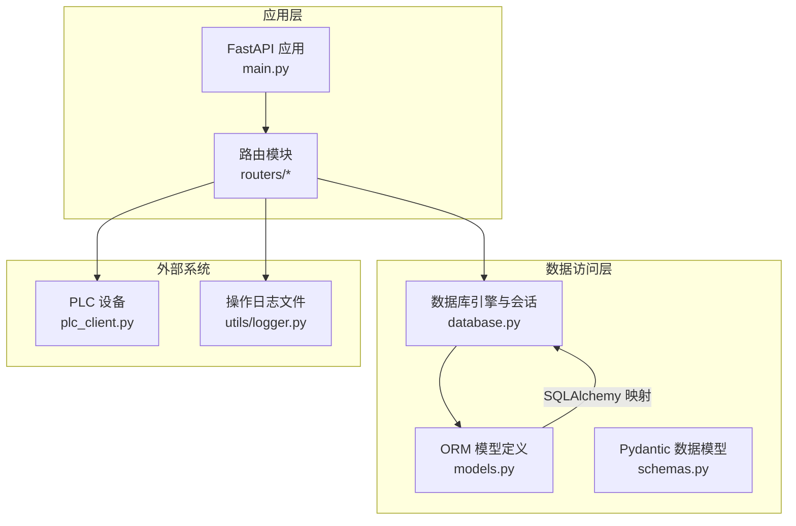
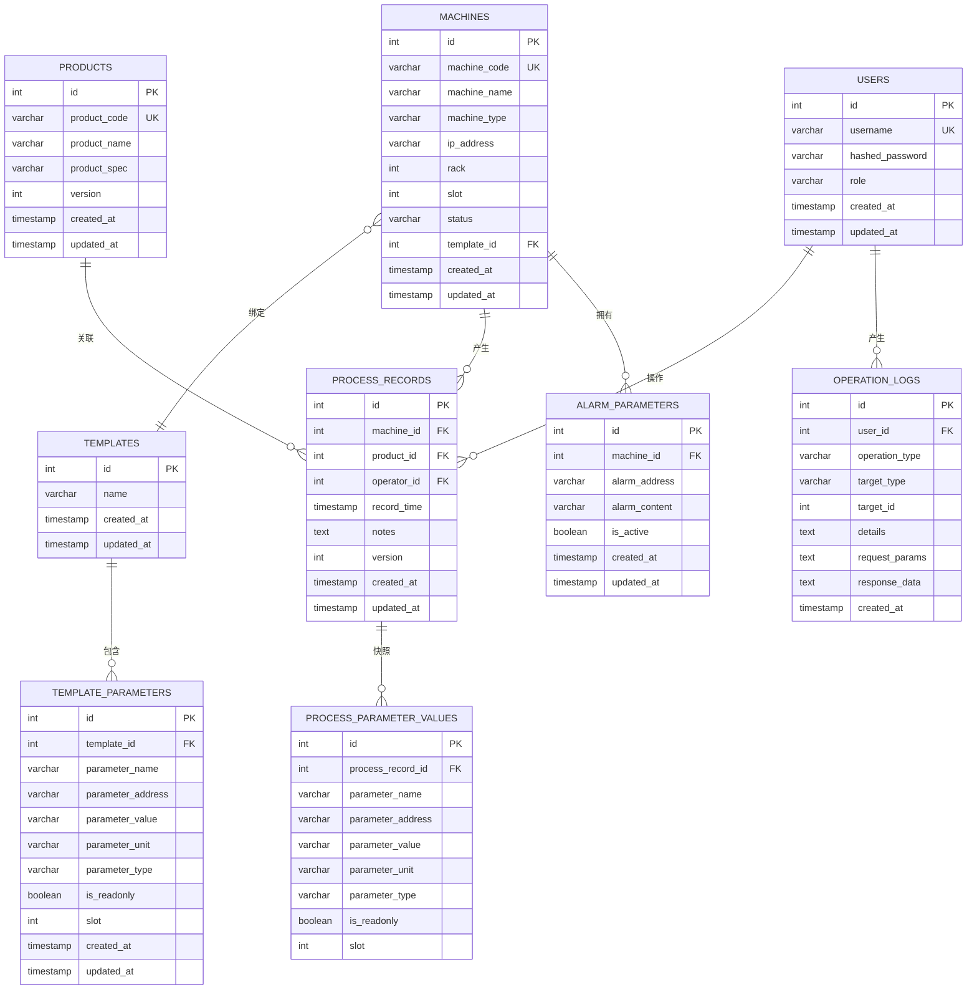
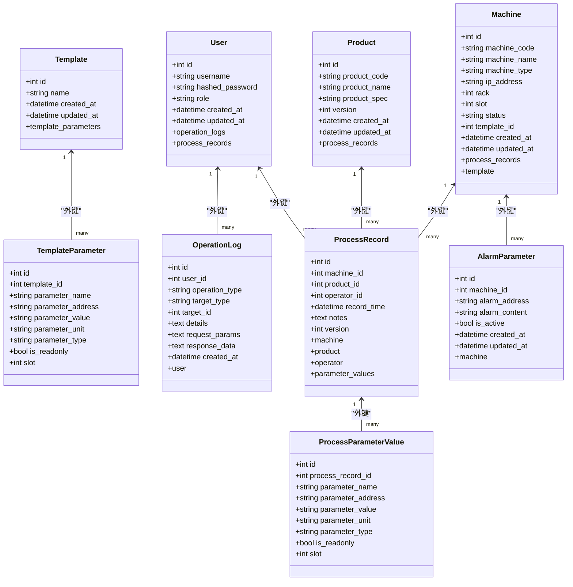
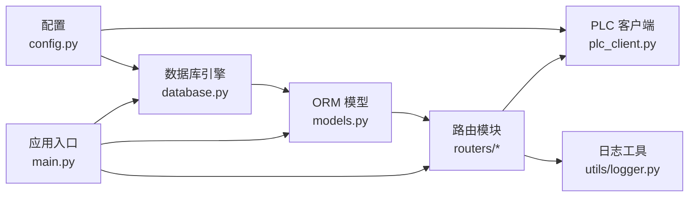
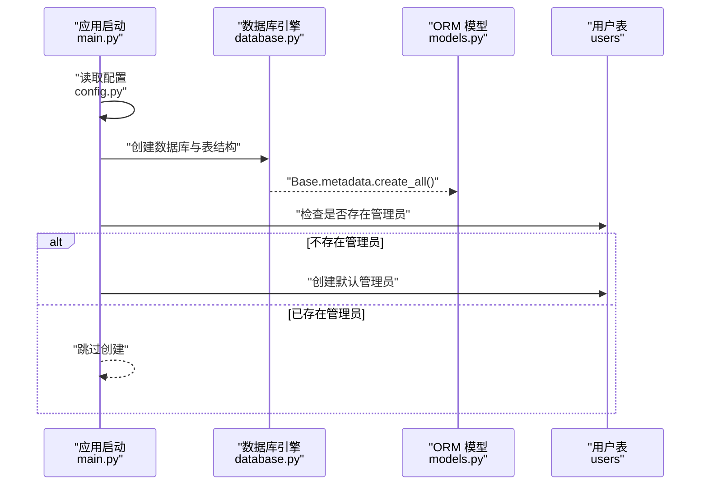
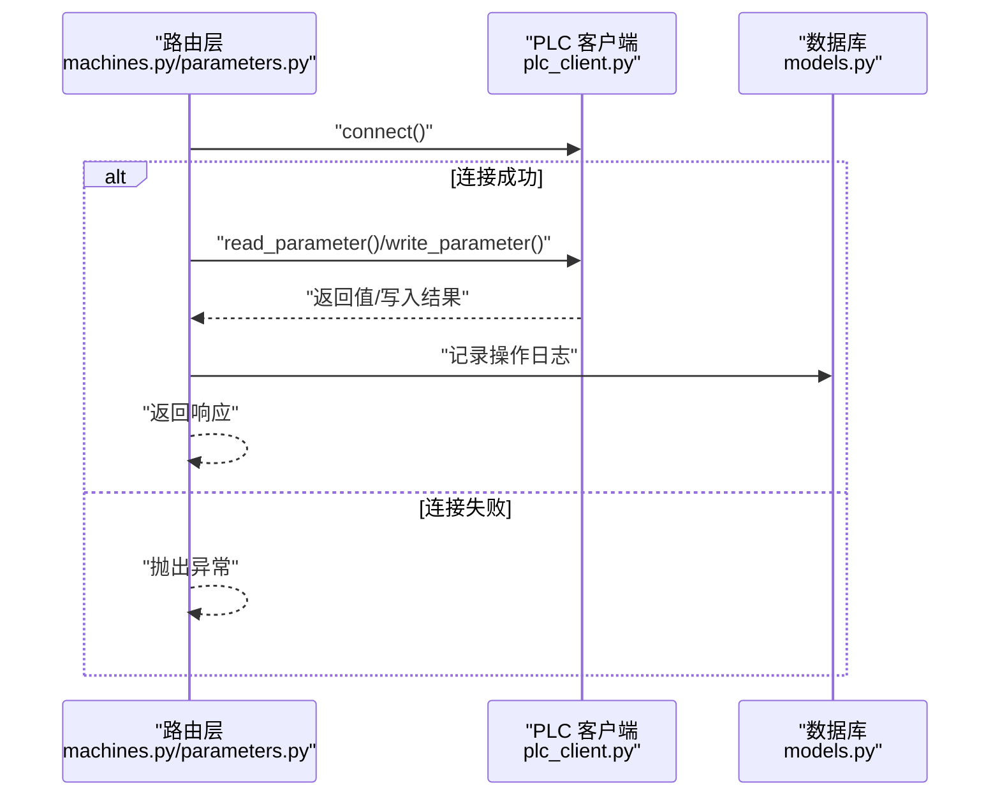

# 数据库设计

<cite>
**本文引用的文件列表**
- [database.py](file://backend/database.py)
- [models.py](file://backend/models.py)
- [schemas.py](file://backend/schemas.py)
- [database_schema.sql](file://backend/database_schema.sql)
- [config.py](file://backend/config.py)
- [main.py](file://backend/main.py)
- [plc_client.py](file://backend/plc_client.py)
- [utils/logger.py](file://backend/utils/logger.py)
- [routers/machines.py](file://backend/routers/machines.py)
- [routers/products.py](file://backend/routers/products.py)
- [routers/templates.py](file://backend/routers/templates.py)
- [routers/parameters.py](file://backend/routers/parameters.py)
- [routers/logs.py](file://backend/routers/logs.py)
</cite>

## 目录
1. [简介](#简介)
2. [项目结构](#项目结构)
3. [核心组件](#核心组件)
4. [架构总览](#架构总览)
5. [详细组件分析](#详细组件分析)
6. [依赖关系分析](#依赖关系分析)
7. [性能考量](#性能考量)
8. [故障排查指南](#故障排查指南)
9. [结论](#结论)
10. [附录](#附录)

## 简介
本文件面向数据库设计与实现，围绕“挤出机工艺参数管理系统”的后端数据库层，系统性梳理实体关系模型、字段定义、主外键关系与约束、数据访问模式、索引策略与性能优化，并给出数据迁移、备份恢复与版本管理策略。文档同时结合实际代码文件，提供可追溯的来源标注，便于读者定位实现细节。

## 项目结构
后端采用 SQLAlchemy ORM 映射 MySQL 数据库，配合 FastAPI 提供 REST 接口；PLC 通信通过 snap7 客户端实现。数据库初始化在应用启动时自动完成，包含默认管理员账户创建与表结构创建。

图表来源
- [main.py:37-72](file://backend/main.py#L37-L72)
- [database.py:1-18](file://backend/database.py#L1-L18)
- [models.py:1-133](file://backend/models.py#L1-L133)
- [schemas.py:1-190](file://backend/schemas.py#L1-L190)
- [plc_client.py:1-188](file://backend/plc_client.py#L1-L188)
- [utils/logger.py:1-199](file://backend/utils/logger.py#L1-L199)

章节来源
- [main.py:1-77](file://backend/main.py#L1-L77)
- [database.py:1-18](file://backend/database.py#L1-L18)
- [config.py:1-35](file://backend/config.py#L1-L35)

## 核心组件
- 数据库引擎与会话：统一的连接池与会话工厂，支持预连接校验。
- ORM 模型：用户、机台、产品、模板、模板参数、工艺记录、参数快照、操作日志、报警参数。
- Pydantic 模式：API 输入输出的数据结构与验证。
- 路由层：提供 CRUD、查询、PLC 读写、模板绑定、记录查询与导出等接口。
- PLC 客户端：封装 S7 协议读写，支持不同地址格式与数据类型。
- 日志工具：持久化操作日志到文件与数据库。

章节来源
- [database.py:1-18](file://backend/database.py#L1-L18)
- [models.py:6-133](file://backend/models.py#L6-L133)
- [schemas.py:1-190](file://backend/schemas.py#L1-L190)
- [plc_client.py:1-188](file://backend/plc_client.py#L1-L188)
- [utils/logger.py:1-199](file://backend/utils/logger.py#L1-L199)

## 架构总览
数据库层以 SQLAlchemy Declarative Base 为核心，通过 ForeignKey 建立表间关系；路由层通过 Session 访问数据库并调用 PLC 客户端进行实时数据交互；日志工具同时写入数据库与本地文件，便于审计与问题追踪。

图表来源
- [models.py:6-133](file://backend/models.py#L6-L133)
- [database_schema.sql:7-140](file://backend/database_schema.sql#L7-L140)

## 详细组件分析

### 实体关系与字段定义
- 用户（users）：唯一用户名、角色、时间戳；与工艺记录、操作日志建立一对多关系。
- 机台（machines）：唯一机台编号、名称、类型、IP、机架槽位、状态、模板绑定；与模板、工艺记录建立关系。
- 产品（products）：唯一产品编号、规格、版本号；与工艺记录建立关系。
- 模板（templates）：模板名；与模板参数建立关系。
- 模板参数（template_parameters）：参数名、地址、值、单位、类型、只读标志、槽位；与模板建立外键。
- 工艺记录（process_records）：机台、产品、操作员、记录时间、备注、版本号；与参数快照、机台、产品、用户建立关系。
- 参数快照（process_parameter_values）：参数名、地址、值、单位、类型、只读、槽位；与工艺记录建立外键。
- 操作日志（operation_logs）：操作类型、目标类型、目标ID、详情、请求/响应内容、时间戳；与用户建立关系。
- 报警参数（alarm_parameters）：报警地址、内容、激活状态；与机台建立外键。

章节来源
- [models.py:6-133](file://backend/models.py#L6-L133)
- [database_schema.sql:7-140](file://backend/database_schema.sql#L7-L140)

### 主外键关系与约束
- 外键约束：
  - machines.template_id 引用 templates.id（级联置空）
  - process_records.machine_id 引用 machines.id（级联删除）
  - process_records.product_id 引用 products.id（级联删除）
  - process_records.operator_id 引用 users.id（级联置空）
  - process_parameter_values.process_record_id 引用 process_records.id（级联删除）
  - template_parameters.template_id 引用 templates.id（级联删除）
  - alarm_parameters.machine_id 引用 machines.id（级联删除）
- 唯一约束：
  - users.username
  - machines.machine_code
  - products.product_code
- 时间戳默认与更新：
  - 所有表均包含 created_at、updated_at 字段，默认 CURRENT_TIMESTAMP，部分支持 ON UPDATE CURRENT_TIMESTAMP。

章节来源
- [models.py:30](file://backend/models.py#L30)
- [models.py:54-64](file://backend/models.py#L54-L64)
- [models.py:95](file://backend/models.py#L95)
- [database_schema.sql:10-15](file://backend/database_schema.sql#L10-L15)
- [database_schema.sql:47-58](file://backend/database_schema.sql#L47-L58)
- [database_schema.sql:64-71](file://backend/database_schema.sql#L64-L71)
- [database_schema.sql:76-91](file://backend/database_schema.sql#L76-L91)
- [database_schema.sql:96-107](file://backend/database_schema.sql#L96-L107)
- [database_schema.sql:112-125](file://backend/database_schema.sql#L112-L125)
- [database_schema.sql:130-140](file://backend/database_schema.sql#L130-L140)

### 索引策略
- 用户表：idx_users_username（唯一用户名）
- 模板参数表：idx_template_parameters_template_id、idx_template_parameters_parameter_name
- 机台表：idx_machines_machine_code（唯一编号）
- 工艺记录表：idx_process_records_machine_id、idx_process_records_product_id、idx_process_records_operator_id、idx_process_records_record_time
- 参数快照表：idx_process_parameter_values_process_record_id、idx_process_parameter_values_parameter_name
- 操作日志表：idx_operation_logs_user_id、idx_operation_logs_operation_type、idx_operation_logs_target_type、idx_operation_logs_created_at
- 报警参数表：idx_alarm_parameters_machine_id、idx_alarm_parameters_alarm_address、idx_alarm_parameters_is_active

章节来源
- [database_schema.sql:15](file://backend/database_schema.sql#L15)
- [database_schema.sql:40-42](file://backend/database_schema.sql#L40-L42)
- [database_schema.sql:58](file://backend/database_schema.sql#L58)
- [database_schema.sql:87-91](file://backend/database_schema.sql#L87-L91)
- [database_schema.sql:105-107](file://backend/database_schema.sql#L105-L107)
- [database_schema.sql:121-125](file://backend/database_schema.sql#L121-L125)
- [database_schema.sql:137-140](file://backend/database_schema.sql#L137-L140)

### 数据访问模式
- 路由层使用依赖注入获取 Session，执行查询、插入、更新、删除。
- 查询支持分页、过滤、排序（如按记录时间倒序）。
- PLC 读写通过路由调用 PLCClient，按模板参数地址批量读取或写入。
- 操作日志同时写入数据库与本地文件，支持按类型、目标、用户、时间范围检索。

章节来源
- [routers/machines.py:14-31](file://backend/routers/machines.py#L14-L31)
- [routers/products.py:12-18](file://backend/routers/products.py#L12-L18)
- [routers/templates.py:12-32](file://backend/routers/templates.py#L12-L32)
- [routers/parameters.py:104-149](file://backend/routers/parameters.py#L104-L149)
- [routers/logs.py:34-98](file://backend/routers/logs.py#L34-L98)

### 类与关系图（代码级）

图表来源
- [models.py:6-133](file://backend/models.py#L6-L133)

## 依赖关系分析
- 配置层：从环境变量读取数据库与 PLC 配置，统一注入到数据库引擎与 PLC 客户端。
- 初始化流程：应用启动时创建数据库与表结构，若无管理员则创建默认管理员。
- 路由层：各模块路由依赖数据库会话与认证中间件，PLC 读写依赖 PLC 客户端。
- 日志层：同时写入数据库与本地文件，定期清理旧日志。

图表来源
- [config.py:22-35](file://backend/config.py#L22-L35)
- [database.py:1-18](file://backend/database.py#L1-L18)
- [main.py:37-72](file://backend/main.py#L37-L72)
- [plc_client.py:6-22](file://backend/plc_client.py#L6-L22)
- [utils/logger.py:65-87](file://backend/utils/logger.py#L65-L87)

章节来源
- [config.py:1-35](file://backend/config.py#L1-L35)
- [main.py:1-77](file://backend/main.py#L1-L77)
- [database.py:1-18](file://backend/database.py#L1-L18)

## 性能考量
- 索引覆盖常见查询路径：
  - 工艺记录按机台、产品、操作员、记录时间查询，建议保持现有索引。
  - 模板参数按模板与参数名查询，建议保持现有索引。
  - 操作日志按用户、类型、目标、时间查询，建议保持现有索引。
- 分页与限制：路由层普遍支持分页与限制条数，避免一次性加载大量数据。
- 连接池与预连接：数据库引擎启用 pre_ping，提升连接稳定性。
- PLC 读写批处理：路由层对模板参数进行批量读写，减少连接建立次数。
- 写入日志：本地文件写入与数据库写入并行，注意磁盘空间与 IO 压力。

章节来源
- [routers/parameters.py:104-149](file://backend/routers/parameters.py#L104-L149)
- [routers/machines.py:107-183](file://backend/routers/machines.py#L107-L183)
- [database.py:8](file://backend/database.py#L8)
- [utils/logger.py:32-87](file://backend/utils/logger.py#L32-L87)

## 故障排查指南
- 数据库连接失败：
  - 检查配置项 DB_HOST、DB_PORT、DB_USER、DB_PASSWORD、DB_NAME 是否正确。
  - 确认数据库服务运行正常，字符集为 utf8mb4。
- 表结构缺失：
  - 应用启动时会自动创建数据库与表结构，若失败查看启动日志。
- PLC 连接失败：
  - 检查机台 IP、Rack、Slot 配置是否正确。
  - 确认 PLC 服务可用，地址格式与数据类型匹配。
- 操作日志查询：
  - 使用操作日志接口按类型、目标、用户、时间范围过滤，核对日志文件与数据库一致性。
- 权限与安全：
  - 默认管理员密码在启动时创建，首次登录后应立即修改。

章节来源
- [config.py:22-35](file://backend/config.py#L22-L35)
- [main.py:37-72](file://backend/main.py#L37-L72)
- [routers/machines.py:107-183](file://backend/routers/machines.py#L107-L183)
- [routers/logs.py:34-98](file://backend/routers/logs.py#L34-L98)

## 结论
本数据库设计以清晰的实体关系与完善的索引策略为基础，结合 FastAPI 的依赖注入与 SQLAlchemy 的 ORM 映射，实现了从数据模型到业务接口的完整闭环。通过 PLC 客户端与日志工具的集成，系统具备了实时数据采集、参数写入与审计追踪能力。建议在生产环境中进一步完善监控与备份策略，并持续评估索引与查询性能。

## 附录

### 数据库初始化流程

图表来源
- [main.py:37-72](file://backend/main.py#L37-L72)
- [database.py:10](file://backend/database.py#L10)
- [models.py:6-17](file://backend/models.py#L6-L17)

### PLC 读写序列图

图表来源
- [routers/machines.py:107-183](file://backend/routers/machines.py#L107-L183)
- [routers/parameters.py:201-246](file://backend/routers/parameters.py#L201-L246)
- [plc_client.py:24-49](file://backend/plc_client.py#L24-L49)

### 数据迁移与版本管理
- 版本控制：
  - 使用 SQL 脚本维护数据库结构变更，保留历史脚本以便回溯。
  - 在新版本发布前，先在测试环境执行迁移脚本，验证完整性与兼容性。
- 迁移策略：
  - 新增列：添加默认值与非空约束需谨慎，必要时分步迁移。
  - 删除列：先迁移数据至新结构，再删除旧列。
  - 修改索引：评估对查询性能的影响，必要时重建索引。
- 备份与恢复：
  - 定期全量备份与增量备份相结合。
  - 恢复演练：定期进行恢复测试，确保备份可用。
- 安全与合规：
  - 对敏感字段（如密码哈希）进行加密存储。
  - 审计日志保留期限与合规要求一致。

[本节为通用实践建议，不直接分析具体文件，故无章节来源]