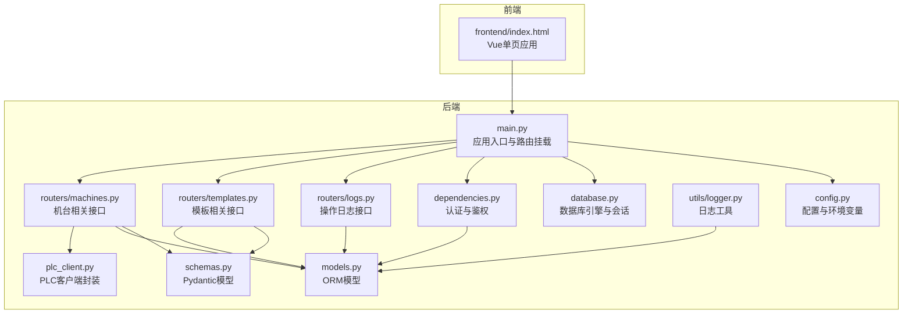
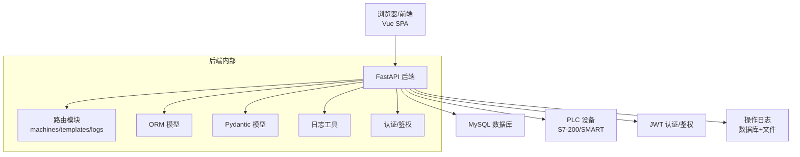
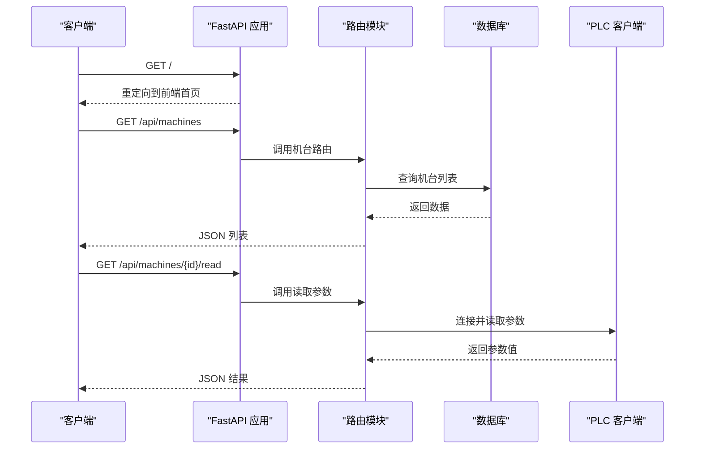
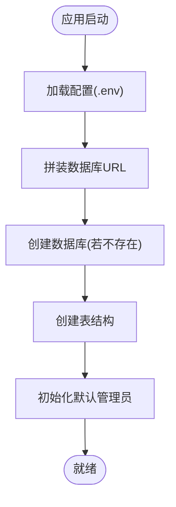
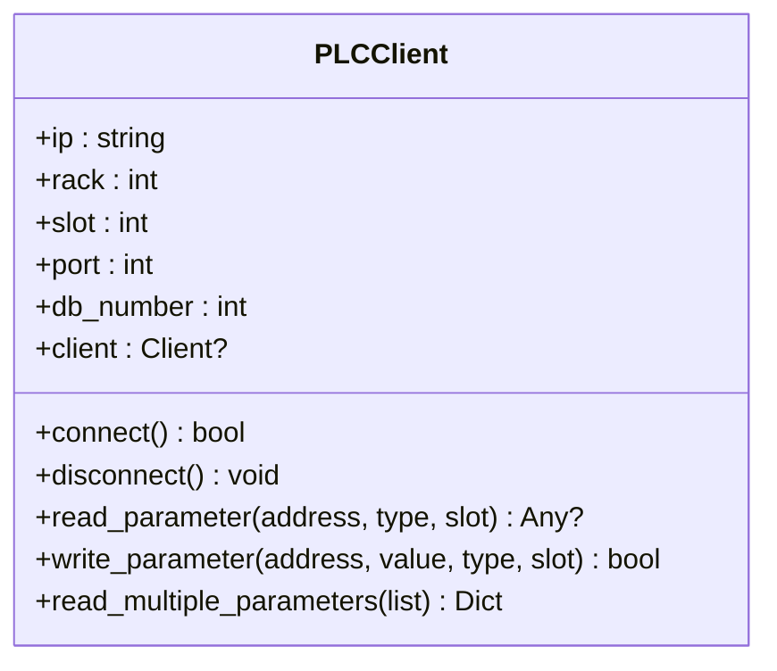
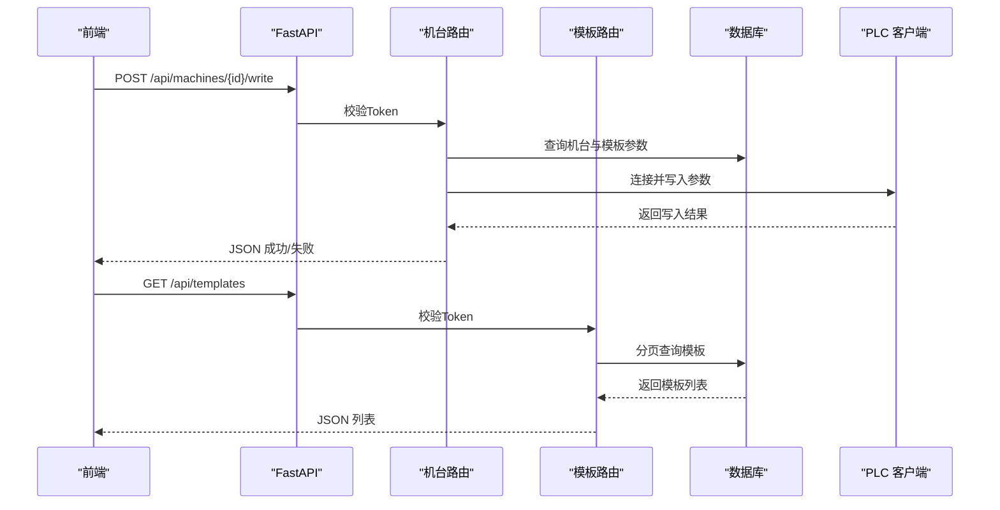
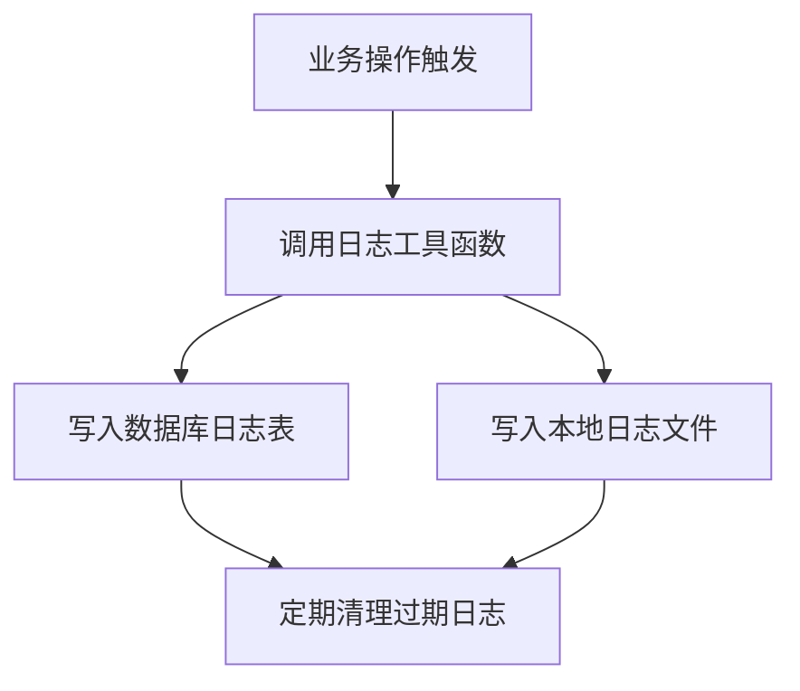
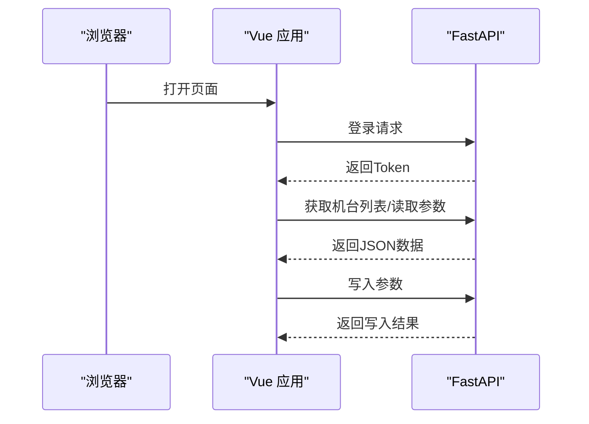
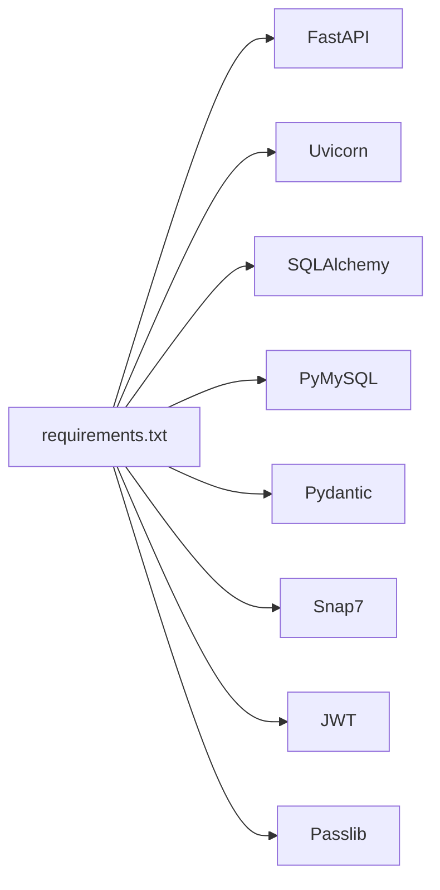
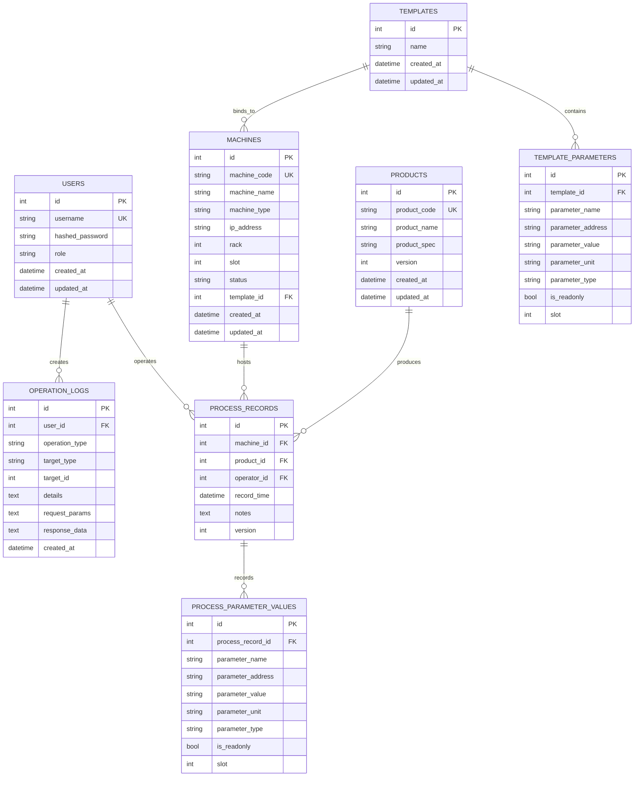

# 系统架构

<cite>
**本文引用的文件**
- [backend/main.py](file://backend/main.py)
- [backend/config.py](file://backend/config.py)
- [backend/database.py](file://backend/database.py)
- [backend/plc_client.py](file://backend/plc_client.py)
- [backend/models.py](file://backend/models.py)
- [backend/schemas.py](file://backend/schemas.py)
- [backend/routers/machines.py](file://backend/routers/machines.py)
- [backend/routers/templates.py](file://backend/routers/templates.py)
- [backend/routers/logs.py](file://backend/routers/logs.py)
- [backend/utils/logger.py](file://backend/utils/logger.py)
- [backend/dependencies.py](file://backend/dependencies.py)
- [frontend/index.html](file://frontend/index.html)
- [requirements.txt](file://requirements.txt)
- [run.sh](file://run.sh)
</cite>

## 目录
1. [简介](#简介)
2. [项目结构](#项目结构)
3. [核心组件](#核心组件)
4. [架构总览](#架构总览)
5. [详细组件分析](#详细组件分析)
6. [依赖关系分析](#依赖关系分析)
7. [性能与可扩展性考虑](#性能与可扩展性考虑)
8. [故障排查指南](#故障排查指南)
9. [结论](#结论)
10. [附录：API与数据模型](#附录api与数据模型)

## 简介
本系统是一个“PLC到数据库”的管理系统，目标是实现挤出机工艺参数的采集、存储、模板化管理与可视化展示。系统采用前后端分离架构：
- 后端：基于 FastAPI 的 REST API 服务，负责业务逻辑、数据库访问、PLC 通信与操作日志。
- 前端：基于 Vue.js（通过全局引入）的单页应用，提供机台、产品、模板、参数、日志等界面。
- 数据库：MySQL，使用 SQLAlchemy ORM 映射实体。
- PLC 通信：通过 python-snap7 与西门子 S7-200/SMART 等 PLC 通信，支持读写参数地址（如 VW/VB/VD/C/T 等）。

系统通过统一的认证与鉴权中间件，确保接口安全；通过模板机制实现参数的标准化与复用；通过操作日志记录关键动作，便于审计与追踪。

## 项目结构
后端采用模块化组织，按功能拆分为 routers、models、schemas、utils、config、database 等目录；前端以静态 HTML 页面为主，配合少量脚本资源。

**图表来源**
- [backend/main.py:1-77](file://backend/main.py#L1-L77)
- [backend/routers/machines.py:1-260](file://backend/routers/machines.py#L1-L260)
- [backend/routers/templates.py:1-300](file://backend/routers/templates.py#L1-L300)
- [backend/routers/logs.py:1-137](file://backend/routers/logs.py#L1-L137)
- [backend/database.py:1-18](file://backend/database.py#L1-L18)
- [backend/config.py:1-35](file://backend/config.py#L1-L35)
- [backend/plc_client.py:1-188](file://backend/plc_client.py#L1-L188)
- [backend/models.py:1-133](file://backend/models.py#L1-L133)
- [backend/schemas.py:1-190](file://backend/schemas.py#L1-L190)
- [backend/utils/logger.py:1-199](file://backend/utils/logger.py#L1-L199)
- [backend/dependencies.py:1-50](file://backend/dependencies.py#L1-L50)
- [frontend/index.html:1-800](file://frontend/index.html#L1-L800)

**章节来源**
- [backend/main.py:1-77](file://backend/main.py#L1-L77)
- [frontend/index.html:1-800](file://frontend/index.html#L1-L800)

## 核心组件
- 应用入口与路由挂载：在应用启动时挂载静态前端资源路径，并注册各模块路由。
- 配置中心：集中管理数据库、PLC、JWT 等配置项。
- 数据库层：SQLAlchemy 引擎、会话工厂与基础模型类。
- PLC 客户端：封装 snap7 客户端，提供读写参数地址的能力，支持多种数据类型与位操作。
- 路由模块：机台、模板、日志等业务接口，负责数据校验、调用数据库与 PLC。
- 日志工具：统一记录操作日志到数据库与本地文件，支持按类型过滤查询。
- 认证与鉴权：基于 JWT 的 Token 校验，区分普通用户与管理员。

**章节来源**
- [backend/main.py:1-77](file://backend/main.py#L1-L77)
- [backend/config.py:1-35](file://backend/config.py#L1-L35)
- [backend/database.py:1-18](file://backend/database.py#L1-L18)
- [backend/plc_client.py:1-188](file://backend/plc_client.py#L1-L188)
- [backend/routers/machines.py:1-260](file://backend/routers/machines.py#L1-L260)
- [backend/routers/templates.py:1-300](file://backend/routers/templates.py#L1-L300)
- [backend/routers/logs.py:1-137](file://backend/routers/logs.py#L1-L137)
- [backend/utils/logger.py:1-199](file://backend/utils/logger.py#L1-L199)
- [backend/dependencies.py:1-50](file://backend/dependencies.py#L1-L50)

## 架构总览
系统采用典型的三层架构：表现层（前端）、服务层（FastAPI）、数据层（MySQL）。PLC 作为外部设备通过网络接入，后端通过 snap7 与其通信，完成参数读写。

**图表来源**
- [backend/main.py:1-77](file://backend/main.py#L1-L77)
- [backend/routers/machines.py:1-260](file://backend/routers/machines.py#L1-L260)
- [backend/routers/templates.py:1-300](file://backend/routers/templates.py#L1-L300)
- [backend/routers/logs.py:1-137](file://backend/routers/logs.py#L1-L137)
- [backend/database.py:1-18](file://backend/database.py#L1-L18)
- [backend/plc_client.py:1-188](file://backend/plc_client.py#L1-L188)
- [backend/utils/logger.py:1-199](file://backend/utils/logger.py#L1-L199)
- [backend/dependencies.py:1-50](file://backend/dependencies.py#L1-L50)

## 详细组件分析

### 后端应用入口与路由
- 启动时自动创建数据库与表结构，初始化默认管理员账户。
- 挂载前端静态资源路径，根路径重定向至前端首页。
- 注册认证、机台、产品、参数、模板、日志等路由模块。

**图表来源**
- [backend/main.py:1-77](file://backend/main.py#L1-L77)
- [backend/routers/machines.py:1-260](file://backend/routers/machines.py#L1-L260)
- [backend/database.py:1-18](file://backend/database.py#L1-L18)
- [backend/plc_client.py:1-188](file://backend/plc_client.py#L1-L188)

**章节来源**
- [backend/main.py:1-77](file://backend/main.py#L1-L77)

### 配置与数据库
- 配置从 .env 文件加载，包含数据库连接信息、JWT 密钥与算法、PLC 端口与 DB 号等。
- 数据库连接字符串拼装，启用连接池预检查；会话工厂用于每次请求生成独立会话。
- 启动时自动创建数据库与表结构，避免手动迁移。

**图表来源**
- [backend/config.py:1-35](file://backend/config.py#L1-L35)
- [backend/database.py:1-18](file://backend/database.py#L1-L18)
- [backend/main.py:37-72](file://backend/main.py#L37-L72)

**章节来源**
- [backend/config.py:1-35](file://backend/config.py#L1-L35)
- [backend/database.py:1-18](file://backend/database.py#L1-L18)
- [backend/main.py:37-72](file://backend/main.py#L37-L72)

### PLC 客户端
- 封装 snap7 客户端，支持连接/断开、参数读取与写入。
- 地址解析支持 VW/VB/VD/VC、位寻址 Vx.y、计数器 Cx、定时器 Tx。
- 支持不同数据类型（Int/Real/Bool），以及按槽位切换连接。

**图表来源**
- [backend/plc_client.py:1-188](file://backend/plc_client.py#L1-L188)

**章节来源**
- [backend/plc_client.py:1-188](file://backend/plc_client.py#L1-L188)

### 机台与模板路由
- 机台路由：分页查询、创建、更新、删除、批量状态检测、读取参数、写入参数、绑定/解绑模板。
- 模板路由：模板 CRUD、模板参数 CRUD、按模板查询参数列表。
- 两者均通过依赖注入进行 JWT 校验，并记录操作日志。

**图表来源**
- [backend/routers/machines.py:1-260](file://backend/routers/machines.py#L1-L260)
- [backend/routers/templates.py:1-300](file://backend/routers/templates.py#L1-L300)
- [backend/dependencies.py:1-50](file://backend/dependencies.py#L1-L50)
- [backend/utils/logger.py:1-199](file://backend/utils/logger.py#L1-L199)

**章节来源**
- [backend/routers/machines.py:1-260](file://backend/routers/machines.py#L1-L260)
- [backend/routers/templates.py:1-300](file://backend/routers/templates.py#L1-L300)
- [backend/dependencies.py:1-50](file://backend/dependencies.py#L1-L50)

### 操作日志与审计
- 统一的日志工具函数，支持记录读取/写入PLC、创建/更新/删除、保存、绑定/解绑等操作。
- 日志同时写入数据库与本地文件，支持按操作类型、目标类型、时间范围、用户名等条件查询。

**图表来源**
- [backend/utils/logger.py:1-199](file://backend/utils/logger.py#L1-L199)
- [backend/routers/logs.py:1-137](file://backend/routers/logs.py#L1-L137)

**章节来源**
- [backend/utils/logger.py:1-199](file://backend/utils/logger.py#L1-L199)
- [backend/routers/logs.py:1-137](file://backend/routers/logs.py#L1-L137)

### 前端界面与交互
- 前端为 Vue 单页应用，包含登录、机台管理、产品管理、模板管理、参数读取/写入、历史记录、操作日志、用户管理等功能。
- 通过 HTTP 请求与后端 API 交互，使用 JWT Token 进行身份验证。

**图表来源**
- [frontend/index.html:1-800](file://frontend/index.html#L1-L800)
- [backend/routers/machines.py:1-260](file://backend/routers/machines.py#L1-L260)

**章节来源**
- [frontend/index.html:1-800](file://frontend/index.html#L1-L800)

## 依赖关系分析
- 后端依赖：FastAPI、Uvicorn、SQLAlchemy、PyMySQL、Pydantic、Pydantic Settings、python-jose、passlib、python-snap7。
- 前端依赖：Vue 全局构建版本（通过 CDN 引入）。
- 外部依赖：MySQL 数据库、PLC 设备（需满足 snap7 网络可达）。

**图表来源**
- [requirements.txt:1-11](file://requirements.txt#L1-L11)

**章节来源**
- [requirements.txt:1-11](file://requirements.txt#L1-L11)

## 性能与可扩展性考虑
- 连接池与预检查：数据库连接启用 pool_pre_ping，提升连接稳定性。
- PLC 并发：当前路由中对每个请求建立一次连接，建议在高并发场景下引入连接池或长连接缓存策略，减少频繁握手。
- 日志写入：本地文件写入与数据库写入并行，建议异步写入或批量落盘，降低阻塞。
- 分页与索引：数据库查询使用分页与索引字段，建议为高频查询列（如 machine_code、template_id）建立合适索引。
- 前端渲染：参数列表较多时，建议虚拟滚动与懒加载，提升渲染性能。

[本节为通用指导，不直接分析具体文件]

## 故障排查指南
- 数据库连接失败：检查 .env 中 DB_HOST/PORT/USER/PASSWORD/NAME 是否正确；确认 MySQL 服务运行与网络可达。
- PLC 连接失败：检查机台 IP、Rack、Slot、DB 号配置；确认 PLC 网络可达且 snap7 服务可用。
- JWT 无效：确认前端携带正确的 Authorization: Bearer Token；检查后端 SECRET_KEY 与算法配置。
- 操作日志为空：确认日志工具是否正常写入数据库与文件；检查日志目录权限与磁盘空间。
- 启动脚本问题：run.sh 中的数据库创建命令需根据实际环境调整；确保 uv 工具链可用。

**章节来源**
- [backend/main.py:37-72](file://backend/main.py#L37-L72)
- [backend/plc_client.py:1-188](file://backend/plc_client.py#L1-L188)
- [backend/dependencies.py:1-50](file://backend/dependencies.py#L1-L50)
- [backend/utils/logger.py:1-199](file://backend/utils/logger.py#L1-L199)
- [run.sh:1-24](file://run.sh#L1-L24)

## 结论
该系统通过清晰的模块划分与前后端分离，实现了从 PLC 参数采集到数据库持久化的完整闭环。FastAPI 提供了高性能与良好的开发体验，Vue 前端提供了直观的操作界面。通过模板与日志机制，系统具备良好的可维护性与可审计性。后续可在 PLC 连接优化、日志异步化、前端性能优化等方面进一步增强。

[本节为总结，不直接分析具体文件]

## 附录：API与数据模型

### 数据模型关系图

**图表来源**
- [backend/models.py:1-133](file://backend/models.py#L1-L133)

### 关键接口概览
- 机台管理
  - GET /api/machines
  - POST /api/machines
  - PUT /api/machines/{id}
  - DELETE /api/machines/{id}
  - GET /api/machines/status
  - GET /api/machines/{id}/read
  - POST /api/machines/{id}/write
  - POST /api/machines/{id}/bind-template
  - POST /api/machines/{id}/unbind-template
- 模板管理
  - GET /api/templates
  - POST /api/templates
  - GET /api/templates/{id}
  - PUT /api/templates/{id}
  - DELETE /api/templates/{id}
  - POST /api/templates/{id}/parameters
  - PUT /api/templates/{id}/parameters/{parameter_id}
  - DELETE /api/templates/{id}/parameters/{parameter_id}
  - GET /api/templates/{id}/parameters
  - GET /api/templates/{id}/parameters/{parameter_id}
- 操作日志
  - GET /api/operation-logs
  - GET /api/operation-logs/{log_id}
  - GET /api/operation-log-types
  - GET /api/operation-target-types

**章节来源**
- [backend/routers/machines.py:1-260](file://backend/routers/machines.py#L1-L260)
- [backend/routers/templates.py:1-300](file://backend/routers/templates.py#L1-L300)
- [backend/routers/logs.py:1-137](file://backend/routers/logs.py#L1-L137)