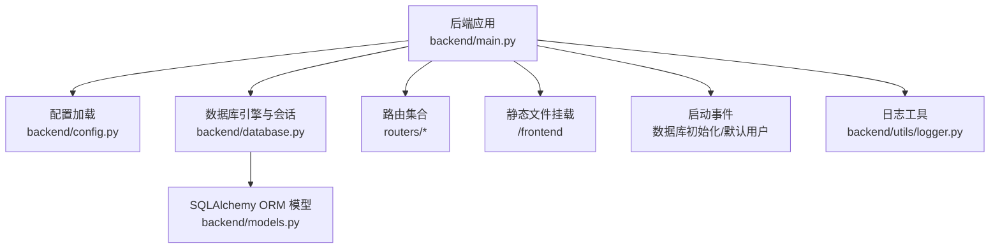
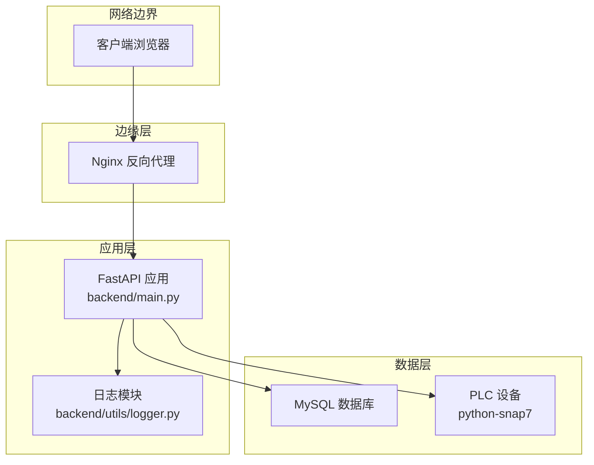
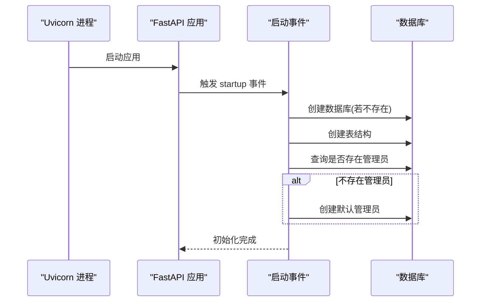
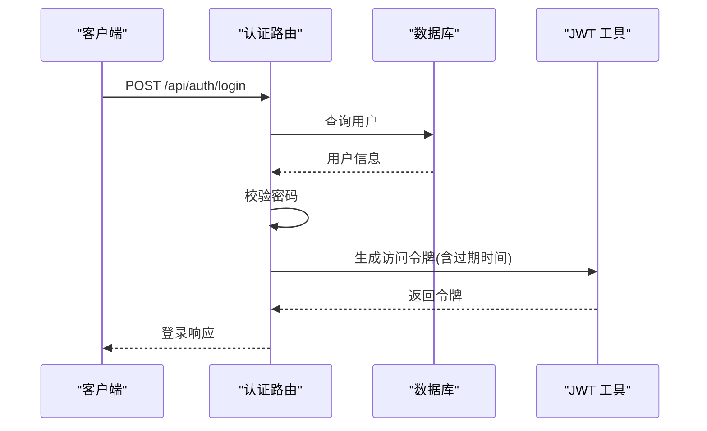
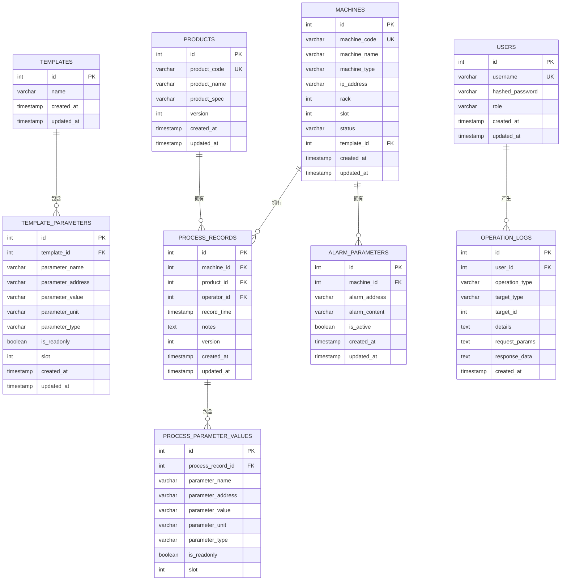
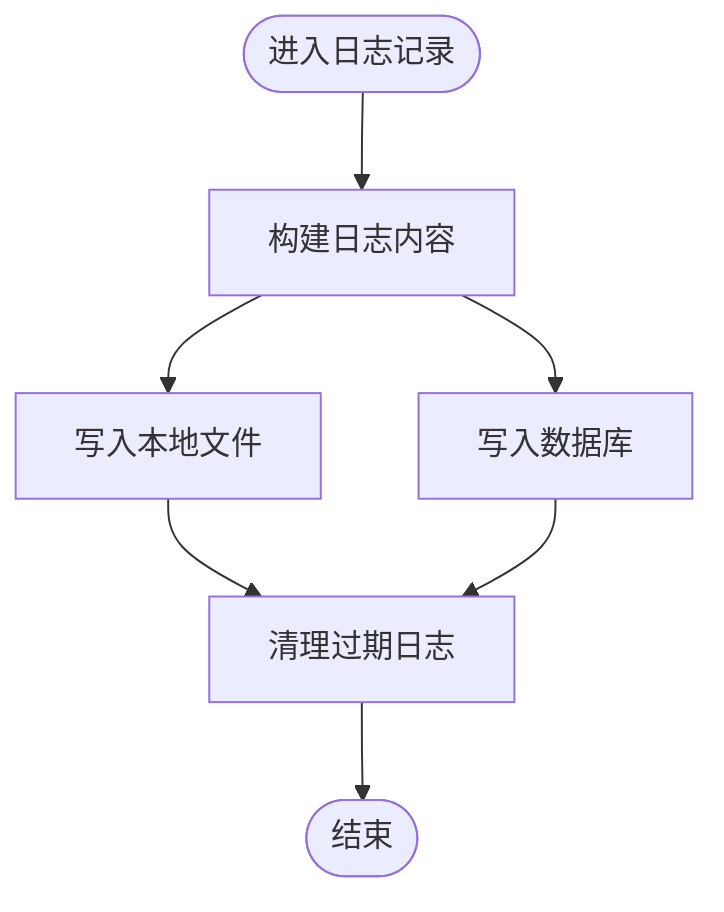
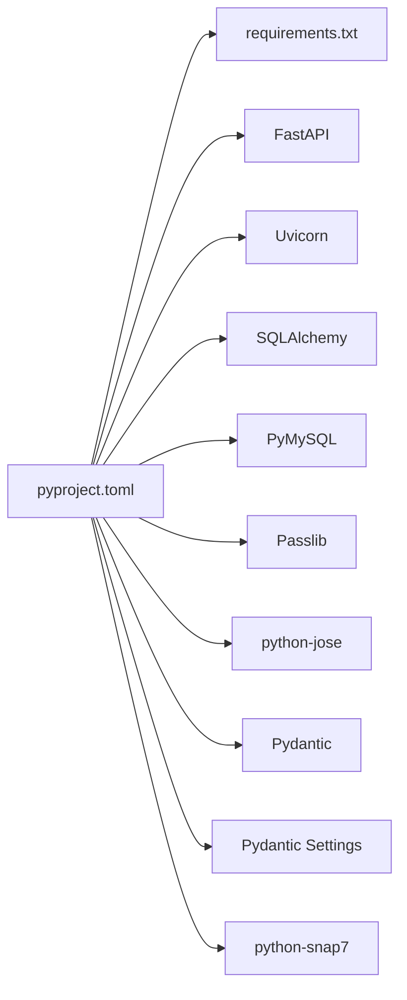

# 部署运维

<cite>
**本文引用的文件**
- [backend/main.py](file://backend/main.py)
- [backend/config.py](file://backend/config.py)
- [backend/database.py](file://backend/database.py)
- [backend/database_schema.sql](file://backend/database_schema.sql)
- [backend/utils/logger.py](file://backend/utils/logger.py)
- [backend/routers/auth.py](file://backend/routers/auth.py)
- [backend/models.py](file://backend/models.py)
- [run.sh](file://run.sh)
- [start_backend.sh](file://start_backend.sh)
- [requirements.txt](file://requirements.txt)
- [pyproject.toml](file://pyproject.toml)
</cite>

## 目录
1. [简介](#简介)
2. [项目结构](#项目结构)
3. [核心组件](#核心组件)
4. [架构总览](#架构总览)
5. [详细组件分析](#详细组件分析)
6. [依赖关系分析](#依赖关系分析)
7. [性能考虑](#性能考虑)
8. [故障排除指南](#故障排除指南)
9. [结论](#结论)
10. [附录](#附录)

## 简介
本指南面向生产环境部署与运维，覆盖从环境准备、依赖安装、配置文件设置到启动流程的完整步骤；同时提供容器化部署思路、反向代理与 SSL 配置要点、监控与日志管理、性能调优建议、故障排除、备份恢复与升级维护策略，以及 CI/CD 自动化部署的最佳实践。该系统基于 Python/FastAPI 后端与 MySQL 数据库存储，前端静态资源由后端统一托管。

## 项目结构
- 后端采用 FastAPI 应用，通过主入口集中注册路由与中间件，并在启动事件中完成数据库初始化与默认管理员账户创建。
- 数据库连接使用 SQLAlchemy，支持连接池预检查以提升稳定性。
- 日志模块提供操作日志落盘与数据库双写能力，并具备过期清理功能。
- 前端静态资源挂载于 /frontend 路径，根路径重定向至前端首页。

图表来源
- [backend/main.py:12-36](file://backend/main.py#L12-L36)
- [backend/config.py:4-20](file://backend/config.py#L4-L20)
- [backend/database.py:1-18](file://backend/database.py#L1-L18)
- [backend/models.py:1-133](file://backend/models.py#L1-L133)
- [backend/utils/logger.py:1-199](file://backend/utils/logger.py#L1-L199)

章节来源
- [backend/main.py:12-36](file://backend/main.py#L12-L36)
- [backend/database.py:1-18](file://backend/database.py#L1-L18)
- [backend/config.py:4-20](file://backend/config.py#L4-L20)

## 核心组件
- 应用入口与启动事件
  - 注册 CORS 中间件、静态文件目录与所有业务路由。
  - 在启动事件中自动创建数据库、初始化表结构，并在无用户时创建默认管理员。
- 配置管理
  - 使用 Pydantic Settings 从 .env 文件加载数据库、令牌与 PLC 相关配置。
- 数据库层
  - 统一的数据库连接字符串与连接池配置，提供会话工厂与依赖注入函数。
- 日志模块
  - 将操作日志写入本地文件与数据库，支持过期清理与异常兜底。

章节来源
- [backend/main.py:37-72](file://backend/main.py#L37-L72)
- [backend/config.py:4-35](file://backend/config.py#L4-L35)
- [backend/database.py:1-18](file://backend/database.py#L1-L18)
- [backend/utils/logger.py:17-87](file://backend/utils/logger.py#L17-L87)

## 架构总览
下图展示生产环境典型拓扑：反向代理（Nginx）接收外部请求，转发至后端服务；后端访问 MySQL 存储数据；PLC 客户端通过 python-snap7 与现场设备通信；日志模块负责操作审计与问题追踪。

图表来源
- [backend/main.py:12-36](file://backend/main.py#L12-L36)
- [backend/database.py:1-18](file://backend/database.py#L1-L18)
- [backend/config.py:31-34](file://backend/config.py#L31-L34)
- [backend/utils/logger.py:65-87](file://backend/utils/logger.py#L65-L87)

## 详细组件分析

### 启动与初始化流程
- 启动事件执行顺序
  - 创建数据库与表结构。
  - 若无用户则创建默认管理员。
- 关键行为
  - 数据库创建与表结构初始化在启动阶段完成，确保首次运行可用。
  - 默认管理员密码在启动事件中生成并持久化。

图表来源
- [backend/main.py:37-72](file://backend/main.py#L37-L72)

章节来源
- [backend/main.py:37-72](file://backend/main.py#L37-L72)

### 认证与令牌机制
- 登录接口
  - 校验用户名与密码，生成带过期时间的 JWT。
- 用户管理
  - 支持分页查询、创建与删除用户，密码变更校验与哈希处理。
- 权限控制
  - 通过依赖验证令牌，限制敏感操作。

图表来源
- [backend/routers/auth.py:38-48](file://backend/routers/auth.py#L38-L48)
- [backend/config.py:13-15](file://backend/config.py#L13-L15)

章节来源
- [backend/routers/auth.py:19-48](file://backend/routers/auth.py#L19-L48)
- [backend/config.py:13-15](file://backend/config.py#L13-L15)

### 数据模型与关系
- 用户、机台、产品、模板、工艺记录、参数快照、报警参数与操作日志等实体定义清晰，外键约束与索引设计满足业务查询需求。
- 日志模块提供统一的操作审计入口，便于回溯与合规。

图表来源
- [backend/models.py:6-133](file://backend/models.py#L6-L133)

章节来源
- [backend/models.py:6-133](file://backend/models.py#L6-L133)

### 日志与审计
- 文件日志
  - 按日期切分，支持过期清理，默认保留 180 天。
- 数据库存储
  - 同步写入 operation_logs 表，便于检索与报表。
- 异常兜底
  - 写入失败不中断业务流程，打印错误信息。

图表来源
- [backend/utils/logger.py:32-87](file://backend/utils/logger.py#L32-L87)
- [backend/utils/logger.py:17-31](file://backend/utils/logger.py#L17-L31)

章节来源
- [backend/utils/logger.py:17-87](file://backend/utils/logger.py#L17-L87)

## 依赖关系分析
- 运行时依赖
  - FastAPI、Uvicorn、SQLAlchemy、PyMySQL、Passlib、Pydantic、Pydantic Settings、python-snap7 等。
- 启动脚本
  - 提供一键安装依赖、创建数据库、启动后端服务的脚本。
- 包管理
  - requirements.txt 与 pyproject.toml 保持一致，推荐使用 pyproject.toml 作为首选。

图表来源
- [pyproject.toml:1-18](file://pyproject.toml#L1-L18)
- [requirements.txt:1-11](file://requirements.txt#L1-L11)

章节来源
- [pyproject.toml:1-18](file://pyproject.toml#L1-L18)
- [requirements.txt:1-11](file://requirements.txt#L1-L11)

## 性能考虑
- 连接池与预检查
  - 启用 pool_pre_ping 提升连接存活检测，降低断连重试成本。
- 数据库字符集与排序规则
  - 统一使用 utf8mb4，避免中文与特殊字符异常。
- 索引与查询
  - 按业务高频字段建立索引，减少慢查询。
- 日志落盘
  - 本地日志按天切分，定期清理，避免磁盘膨胀。
- 并发与超时
  - 合理设置 Uvicorn workers 与 keepalive 超时，结合 Nginx upstream 调优。

章节来源
- [backend/database.py:8](file://backend/database.py#L8)
- [backend/database_schema.sql:3](file://backend/database_schema.sql#L3)
- [backend/utils/logger.py:17-31](file://backend/utils/logger.py#L17-L31)

## 故障排除指南
- 启动失败
  - 检查数据库连接参数与可达性；确认数据库已创建且字符集正确。
  - 查看启动事件输出与后端日志，定位初始化失败原因。
- 认证异常
  - 核对 .env 中密钥与算法配置；确认登录凭据与用户状态。
- 日志无法写入
  - 检查日志目录权限与磁盘空间；确认过期清理未误删当日文件。
- 前端无法访问
  - 确认静态文件挂载路径与根路径重定向；检查端口占用与防火墙。
- 数据库迁移
  - 使用提供的 SQL 脚本初始化表结构；如需增量变更，请遵循外键与索引约束。

章节来源
- [backend/main.py:37-72](file://backend/main.py#L37-L72)
- [backend/config.py:4-20](file://backend/config.py#L4-L20)
- [backend/utils/logger.py:65-87](file://backend/utils/logger.py#L65-L87)
- [backend/database_schema.sql:1-162](file://backend/database_schema.sql#L1-L162)

## 结论
本指南提供了从单机到生产级部署的全链路实践建议。通过规范化的配置管理、完善的日志与审计体系、合理的性能与安全加固，可显著提升系统的稳定性与可维护性。建议在生产环境中结合容器化与反向代理进一步增强弹性与可观测性。

## 附录

### 生产环境部署步骤
- 环境准备
  - 准备 Linux 服务器，安装 Python 3.10+、MySQL 与 Nginx。
  - 准备 .env 配置文件，包含数据库、令牌与 PLC 相关参数。
- 依赖安装
  - 使用包管理器安装运行时依赖，或参考 requirements.txt/pyproject.toml。
- 数据库初始化
  - 执行数据库与表结构初始化脚本，或依赖启动事件自动创建。
- 启动流程
  - 使用 Uvicorn 启动应用，监听 0.0.0.0；或使用 systemd 管理进程。
- 前端访问
  - 通过 /frontend 访问静态页面；根路径重定向至首页。

章节来源
- [backend/main.py:22-36](file://backend/main.py#L22-L36)
- [backend/database_schema.sql:1-162](file://backend/database_schema.sql#L1-L162)
- [run.sh:5-24](file://run.sh#L5-L24)

### Docker 容器化部署（建议）
- 镜像构建
  - 基于官方 Python 运行时镜像，复制依赖与代码，暴露应用端口。
- 容器编排
  - 使用 docker-compose 编排后端、MySQL 与 Nginx；挂载日志目录与 .env。
- 网络与存储
  - 将数据库与日志目录持久化；前后端通过 Nginx 统一入口暴露。
- 健康检查
  - 添加应用与数据库健康检查，确保自动重启与故障转移。

[本节为概念性建议，无需代码映射来源]

### Nginx 反向代理与 SSL 配置（建议）
- 反代配置
  - 将 /api 前缀转发至后端服务；静态资源走 /frontend。
- SSL 证书
  - 使用 Let’s Encrypt 获取免费证书；启用 TLS 1.3 与 HSTS。
- 安全加固
  - 限制请求体大小、开启 gzip、配置缓存与跨域头。

[本节为概念性建议，无需代码映射来源]

### 监控指标与日志管理
- 指标采集
  - CPU、内存、连接数、请求延迟与错误率；结合数据库慢查询日志。
- 日志管理
  - 本地日志按天轮转与清理；集中化收集与可视化（如 ELK/Fluentd）。
- 告警策略
  - 基于阈值与趋势的告警，结合值班流程与工单系统。

[本节为概念性建议，无需代码映射来源]

### 备份恢复与升级维护
- 备份策略
  - 全量/增量数据库备份；版本化配置与日志目录备份。
- 恢复演练
  - 定期进行离线恢复演练，验证备份完整性与恢复时效。
- 升级维护
  - 分批滚动升级；灰度发布与回滚预案；升级前后检查点。

[本节为概念性建议，无需代码映射来源]

### CI/CD 流程与自动化部署最佳实践
- 构建流水线
  - 代码提交触发测试与打包；通过依赖锁定与安全扫描。
- 发布策略
  - GitOps 管理配置；蓝绿/金丝雀发布；自动化回滚。
- 运维自动化
  - 基础设施即代码；配置管理与变更审计；自动化巡检与修复。

[本节为概念性建议，无需代码映射来源]