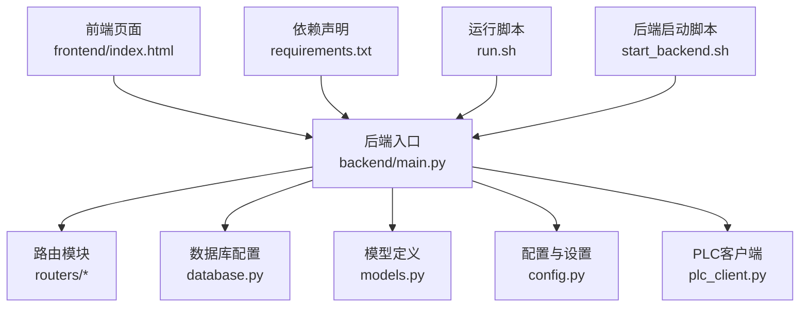
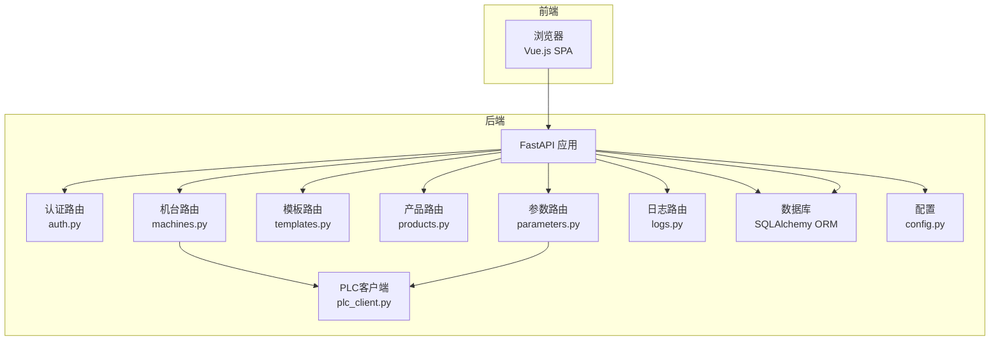
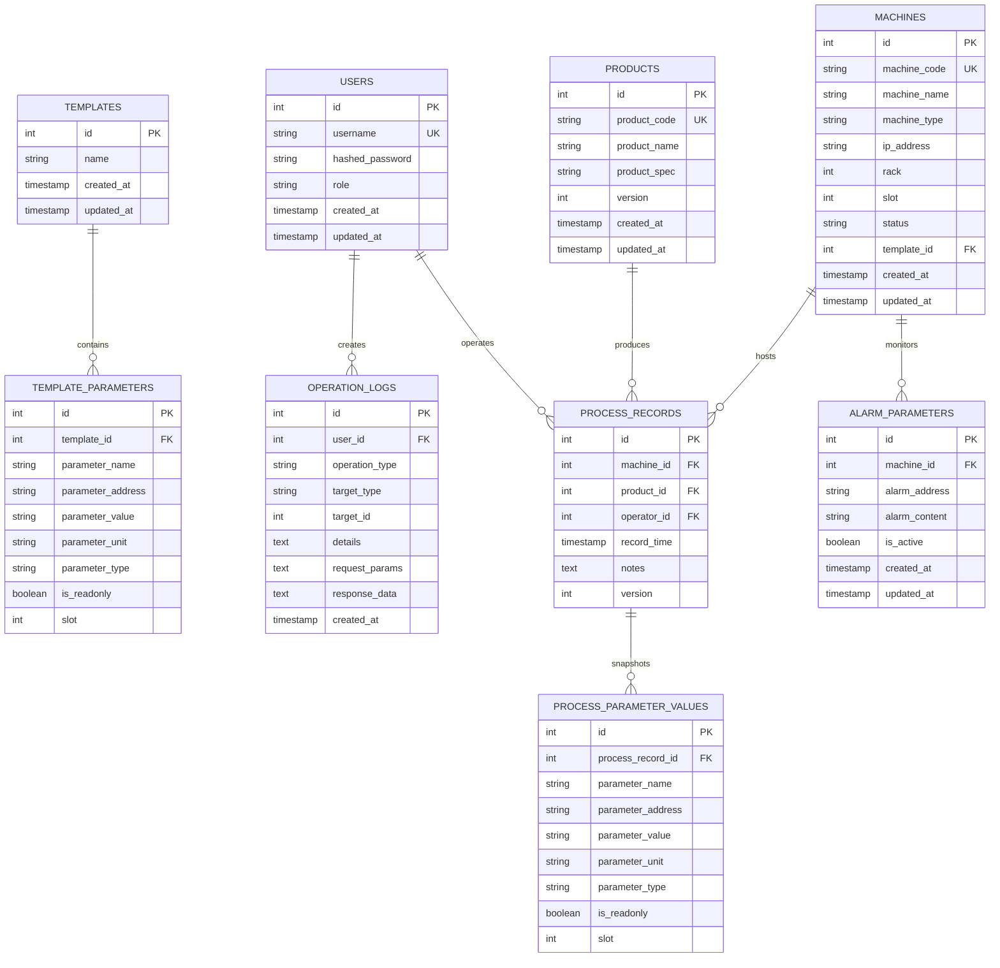
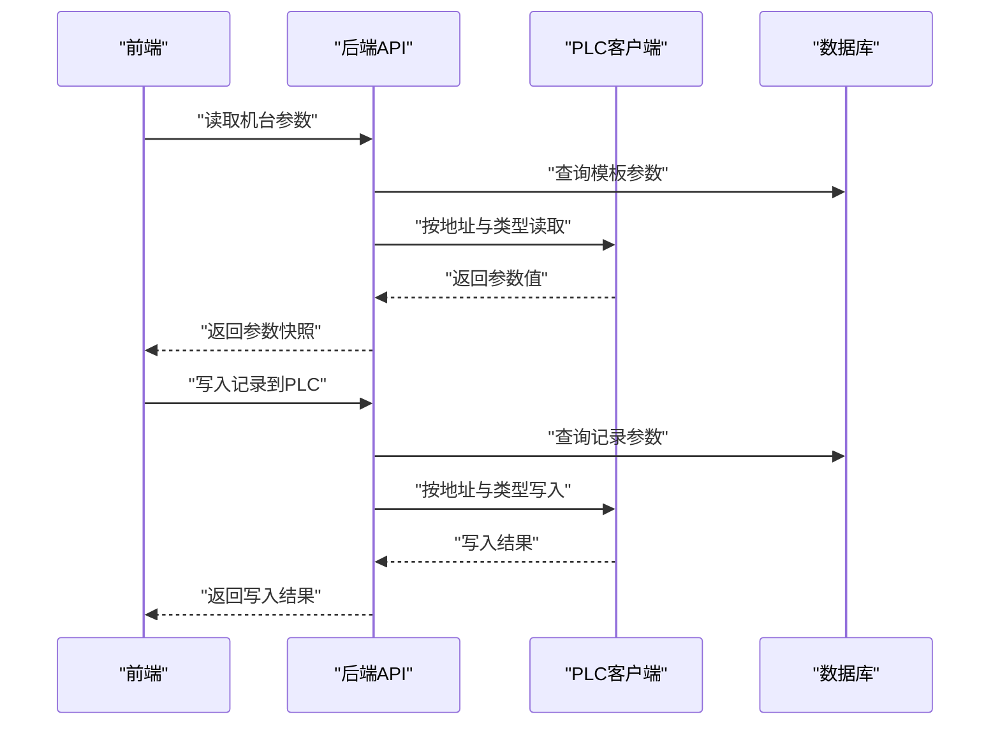
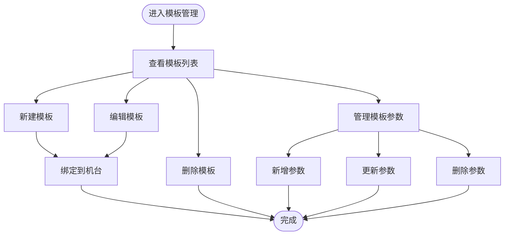
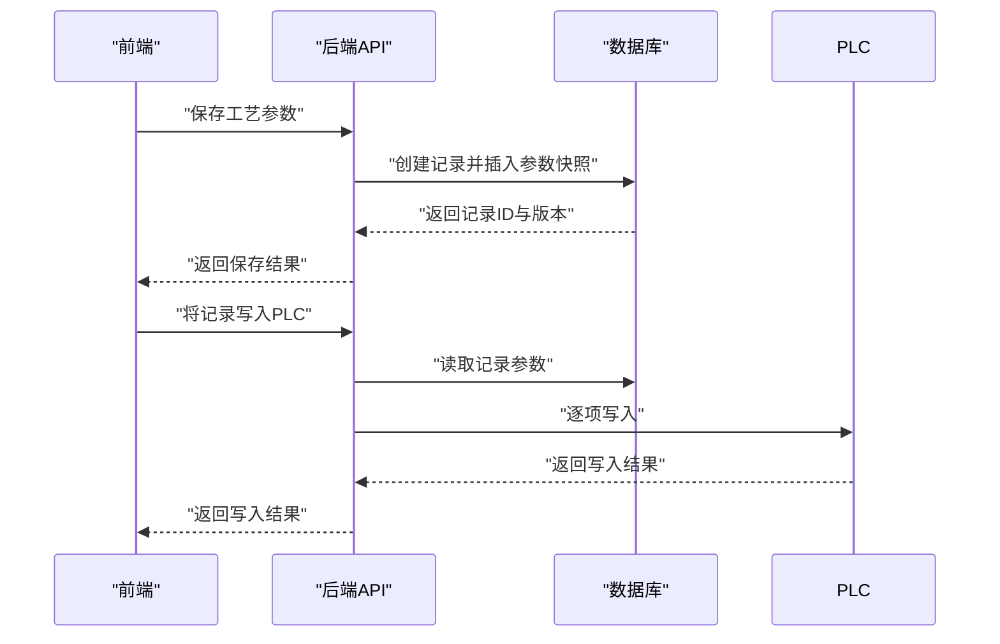
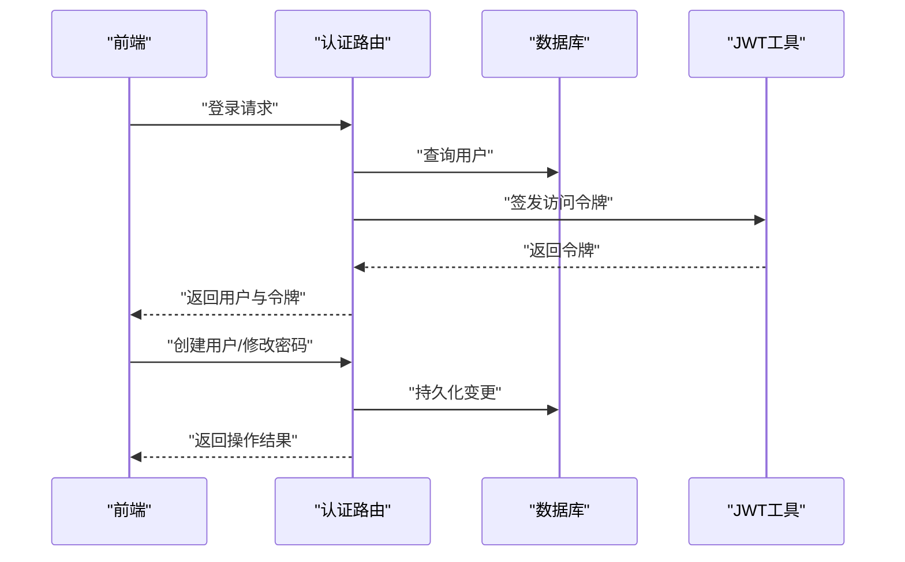
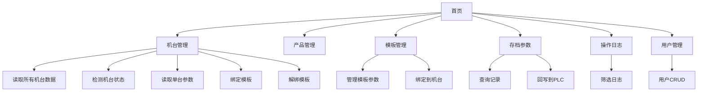
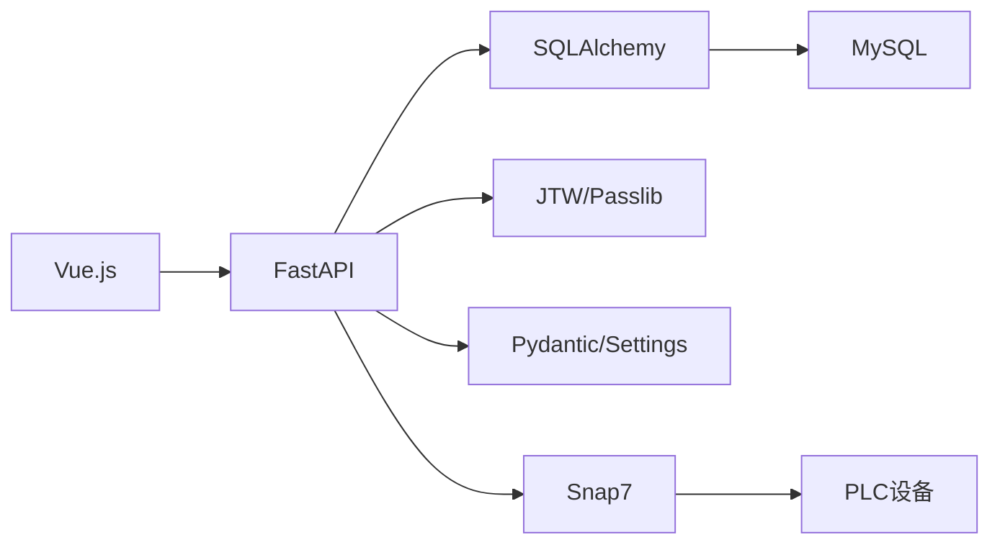

# 项目概述

<cite>
**本文引用的文件**
- [backend/main.py](file://backend/main.py)
- [backend/config.py](file://backend/config.py)
- [backend/database.py](file://backend/database.py)
- [backend/models.py](file://backend/models.py)
- [backend/schemas.py](file://backend/schemas.py)
- [backend/plc_client.py](file://backend/plc_client.py)
- [backend/routers/machines.py](file://backend/routers/machines.py)
- [backend/routers/templates.py](file://backend/routers/templates.py)
- [backend/routers/products.py](file://backend/routers/products.py)
- [backend/routers/parameters.py](file://backend/routers/parameters.py)
- [backend/routers/logs.py](file://backend/routers/logs.py)
- [backend/routers/auth.py](file://backend/routers/auth.py)
- [frontend/index.html](file://frontend/index.html)
- [requirements.txt](file://requirements.txt)
- [run.sh](file://run.sh)
- [start_backend.sh](file://start_backend.sh)
</cite>

## 目录
1. [引言](#引言)
2. [项目结构](#项目结构)
3. [核心组件](#核心组件)
4. [架构总览](#架构总览)
5. [详细组件分析](#详细组件分析)
6. [依赖分析](#依赖分析)
7. [性能考虑](#性能考虑)
8. [故障排查指南](#故障排查指南)
9. [结论](#结论)
10. [附录](#附录)

## 引言
本项目面向挤出机生产线，提供一套从PLC实时数据采集到数据库持久化、再到Web端可视化与管理的完整解决方案。系统通过FastAPI提供REST接口，Vue.js提供前端界面，MySQL作为数据存储，结合Snap7协议与PLC进行通信，实现对工艺参数的采集、模板化管理、生产记录归档与回写控制，以及完善的用户权限与操作审计体系。

## 项目结构
后端采用FastAPI框架，按功能模块组织路由；数据库层使用SQLAlchemy ORM；前端为单页应用（SPA），静态托管于后端。整体目录结构如下：

图表来源
- [backend/main.py:1-77](file://backend/main.py#L1-L77)
- [backend/database.py:1-18](file://backend/database.py#L1-L18)
- [backend/models.py:1-133](file://backend/models.py#L1-L133)
- [backend/config.py:1-35](file://backend/config.py#L1-L35)
- [backend/plc_client.py:1-188](file://backend/plc_client.py#L1-L188)
- [frontend/index.html:1-800](file://frontend/index.html#L1-L800)
- [requirements.txt:1-11](file://requirements.txt#L1-L11)
- [run.sh:1-24](file://run.sh#L1-L24)
- [start_backend.sh:1-7](file://start_backend.sh#L1-L7)

章节来源
- [backend/main.py:1-77](file://backend/main.py#L1-L77)
- [frontend/index.html:1-800](file://frontend/index.html#L1-L800)

## 核心组件
- 后端服务与路由
  - FastAPI应用在入口文件中初始化，挂载认证、机台、产品、参数、模板、日志等路由，并启用CORS与静态资源托管。
  - 路由模块负责业务逻辑编排：PLC读写、模板参数管理、生产记录与版本控制、用户与日志审计等。
- 数据层
  - SQLAlchemy定义了用户、机台、产品、模板、模板参数、工艺记录、记录参数值、报警参数、操作日志等实体及关系。
  - 配置统一的数据库连接池与会话生命周期。
- 配置与安全
  - 使用Pydantic Settings加载环境变量，支持数据库与PLC连接参数；内置JWT令牌生成与校验，密码哈希策略。
- 前端界面
  - Vue.js单页应用，提供机台管理、产品管理、模板管理、参数采集与回写、生产记录查询、操作日志查看、用户管理等界面。
- PLC通信
  - 基于snap7封装的PLC客户端，支持多种地址格式与数据类型读写，具备连接复用与槽位切换能力。

章节来源
- [backend/main.py:1-77](file://backend/main.py#L1-L77)
- [backend/models.py:1-133](file://backend/models.py#L1-L133)
- [backend/config.py:1-35](file://backend/config.py#L1-L35)
- [backend/schemas.py:1-190](file://backend/schemas.py#L1-L190)
- [backend/plc_client.py:1-188](file://backend/plc_client.py#L1-L188)
- [frontend/index.html:1-800](file://frontend/index.html#L1-L800)

## 架构总览
系统采用前后端分离架构，后端提供REST API，前端通过HTTP调用后端接口完成业务操作。PLC通过Snap7协议与后端交互，后端将采集/写入结果持久化至MySQL。

图表来源
- [backend/main.py:1-77](file://backend/main.py#L1-L77)
- [backend/routers/auth.py:1-114](file://backend/routers/auth.py#L1-L114)
- [backend/routers/machines.py:1-260](file://backend/routers/machines.py#L1-L260)
- [backend/routers/templates.py:1-300](file://backend/routers/templates.py#L1-L300)
- [backend/routers/products.py:1-75](file://backend/routers/products.py#L1-L75)
- [backend/routers/parameters.py:1-278](file://backend/routers/parameters.py#L1-L278)
- [backend/routers/logs.py:1-137](file://backend/routers/logs.py#L1-L137)
- [backend/database.py:1-18](file://backend/database.py#L1-L18)
- [backend/config.py:1-35](file://backend/config.py#L1-L35)
- [backend/plc_client.py:1-188](file://backend/plc_client.py#L1-L188)

## 详细组件分析

### 数据模型与关系
系统围绕“用户—机台—产品—模板—模板参数—工艺记录—记录参数值—报警参数—操作日志”构建核心数据模型，支持多对一、一对多与级联删除等关系。

图表来源
- [backend/models.py:1-133](file://backend/models.py#L1-L133)

章节来源
- [backend/models.py:1-133](file://backend/models.py#L1-L133)

### PLC数据采集与写入流程
系统通过PLC客户端对指定地址进行读取或写入，支持多种数据类型与位地址访问，并在写入时根据模板参数的槽位信息动态切换PLC槽位。

图表来源
- [backend/routers/machines.py:107-183](file://backend/routers/machines.py#L107-L183)
- [backend/routers/parameters.py:201-246](file://backend/routers/parameters.py#L201-L246)
- [backend/plc_client.py:51-180](file://backend/plc_client.py#L51-L180)

章节来源
- [backend/routers/machines.py:107-183](file://backend/routers/machines.py#L107-L183)
- [backend/routers/parameters.py:201-246](file://backend/routers/parameters.py#L201-L246)
- [backend/plc_client.py:51-180](file://backend/plc_client.py#L51-L180)

### 参数模板管理流程
模板用于定义机台可读写的参数集合，支持增删改查与参数明细维护，机台绑定模板后即可批量读取与写入。

图表来源
- [backend/routers/templates.py:12-32](file://backend/routers/templates.py#L12-L32)
- [backend/routers/templates.py:34-72](file://backend/routers/templates.py#L34-L72)
- [backend/routers/templates.py:93-135](file://backend/routers/templates.py#L93-L135)
- [backend/routers/templates.py:137-151](file://backend/routers/templates.py#L137-L151)
- [backend/routers/templates.py:153-187](file://backend/routers/templates.py#L153-L187)
- [backend/routers/templates.py:189-227](file://backend/routers/templates.py#L189-L227)
- [backend/routers/templates.py:229-247](file://backend/routers/templates.py#L229-L247)
- [backend/routers/templates.py:249-272](file://backend/routers/templates.py#L249-L272)
- [backend/routers/templates.py:274-300](file://backend/routers/templates.py#L274-L300)

章节来源
- [backend/routers/templates.py:12-32](file://backend/routers/templates.py#L12-L32)
- [backend/routers/templates.py:34-72](file://backend/routers/templates.py#L34-L72)
- [backend/routers/templates.py:93-135](file://backend/routers/templates.py#L93-L135)
- [backend/routers/templates.py:137-151](file://backend/routers/templates.py#L137-L151)
- [backend/routers/templates.py:153-187](file://backend/routers/templates.py#L153-L187)
- [backend/routers/templates.py:189-227](file://backend/routers/templates.py#L189-L227)
- [backend/routers/templates.py:229-247](file://backend/routers/templates.py#L229-L247)
- [backend/routers/templates.py:249-272](file://backend/routers/templates.py#L249-L272)
- [backend/routers/templates.py:274-300](file://backend/routers/templates.py#L274-L300)

### 生产记录与版本控制
系统以机台+产品的维度维护工艺记录，每次新增记录时自动递增版本号，记录包含参数快照与备注，支持将记录回写至PLC。

图表来源
- [backend/routers/parameters.py:50-102](file://backend/routers/parameters.py#L50-L102)
- [backend/routers/parameters.py:151-199](file://backend/routers/parameters.py#L151-L199)
- [backend/routers/parameters.py:201-246](file://backend/routers/parameters.py#L201-L246)

章节来源
- [backend/routers/parameters.py:50-102](file://backend/routers/parameters.py#L50-L102)
- [backend/routers/parameters.py:151-199](file://backend/routers/parameters.py#L151-L199)
- [backend/routers/parameters.py:201-246](file://backend/routers/parameters.py#L201-L246)

### 认证与权限
系统基于JWT令牌进行认证，支持用户创建、删除与密码修改，管理员角色可访问用户管理与操作日志。

图表来源
- [backend/routers/auth.py:38-48](file://backend/routers/auth.py#L38-L48)
- [backend/routers/auth.py:58-74](file://backend/routers/auth.py#L58-L74)
- [backend/routers/auth.py:94-114](file://backend/routers/auth.py#L94-L114)

章节来源
- [backend/routers/auth.py:38-48](file://backend/routers/auth.py#L38-L48)
- [backend/routers/auth.py:58-74](file://backend/routers/auth.py#L58-L74)
- [backend/routers/auth.py:94-114](file://backend/routers/auth.py#L94-L114)

### 前端界面与交互
前端采用Vue.js实现，提供机台状态检测、参数读取与写入、模板绑定、记录查询与回写、日志查看与用户管理等界面。界面风格为赛博朋克风，强调绿色科技感。

图表来源
- [frontend/index.html:740-800](file://frontend/index.html#L740-L800)

章节来源
- [frontend/index.html:740-800](file://frontend/index.html#L740-L800)

## 依赖分析
系统技术栈选择兼顾易用性、稳定性与生态成熟度：
- Python FastAPI：高性能异步Web框架，自动生成OpenAPI文档，便于前后端协作。
- MySQL：关系型数据库，配合SQLAlchemy ORM提供稳定的数据持久化能力。
- Vue.js：渐进式前端框架，适合构建交互丰富的单页应用。
- Snap7：工业PLC通信库，支持多种地址与数据类型，满足挤出机参数读写需求。
- Pydantic/Settings：强类型配置与数据验证，提升安全性与可维护性。
- Uvicorn：ASGI服务器，部署简单，性能可靠。

图表来源
- [requirements.txt:1-11](file://requirements.txt#L1-L11)

章节来源
- [requirements.txt:1-11](file://requirements.txt#L1-L11)

## 性能考虑
- 连接池与会话管理：数据库连接池预热与会话自动回收，降低连接开销。
- PLC连接复用：PLC客户端在同槽位下复用连接，避免频繁握手；不同槽位自动切换，确保正确性。
- 分页与索引：后端路由普遍支持分页查询，数据库层面为常用查询字段建立索引，减少查询延迟。
- 前端渲染优化：Vue组件按需加载，避免一次性渲染大量DOM节点。
- 缓存与批处理：建议在PLC侧或网关层引入缓存与批量读取策略，进一步降低网络抖动影响。

## 故障排查指南
- 数据库连接失败
  - 检查数据库主机、端口、账号与密码配置是否正确。
  - 确认数据库实例可达且字符集设置为utf8mb4。
- PLC连接失败
  - 确认机台IP、Rack、Slot配置正确。
  - 检查PLC地址格式与数据类型是否匹配。
  - 若槽位切换频繁，确认PLC客户端的槽位切换逻辑。
- 权限与认证问题
  - 确认JWT密钥与算法配置一致。
  - 检查用户角色与操作范围，管理员方可访问用户管理与日志。
- 前端页面无法访问
  - 确认后端已挂载静态资源路径，前端页面可通过“/frontend/index.html”访问。
  - 检查CORS配置，确保跨域请求被允许。

章节来源
- [backend/main.py:37-72](file://backend/main.py#L37-L72)
- [backend/routers/machines.py:83-105](file://backend/routers/machines.py#L83-L105)
- [backend/routers/auth.py:38-48](file://backend/routers/auth.py#L38-L48)
- [frontend/index.html:1-800](file://frontend/index.html#L1-L800)

## 结论
本项目通过标准化的后端API、清晰的前端界面与可靠的PLC通信，实现了挤出机生产线的工艺参数全生命周期管理。系统具备良好的扩展性与可维护性，能够支撑后续在模板管理、报警监控、报表统计等方面的深化开发。

## 附录
- 快速启动
  - 安装依赖并启动后端服务，前端页面可通过“/frontend/index.html”访问。
  - 后端默认监听端口可在入口文件中调整。
- 部署建议
  - 将数据库与后端服务置于内网隔离区域，确保PLC通信安全。
  - 对敏感配置使用环境变量注入，避免硬编码。
  - 建议启用HTTPS与更严格的CORS策略。

章节来源
- [run.sh:1-24](file://run.sh#L1-L24)
- [backend/main.py:74-77](file://backend/main.py#L74-L77)